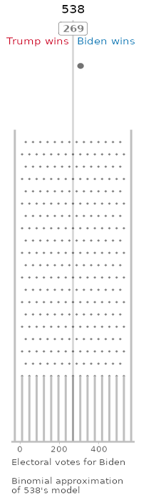
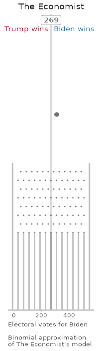

# Election Galton Boards

This repository contains code to produce Election Galton Boards: Galton boards
that roughly approximate the predictive distributions for the 2020 US
President electoral college vote, according to different poll aggregators.

The Galton boards are based on the models of [538](https://projects.fivethirtyeight.com/2020-election-forecast/)
and [the Economist](https://projects.economist.com/us-2020-forecast/president), both of
which are nice enough to open their data.

The Galton boards currently look like this:

The code for determining the binomial approximations to each modeler's predictions 
is in [binomial_approx_538.Rmd](binomial_approx_538.Rmd) and
[binomial_approx_economist.Rmd](binomial_approx_538.Rmd).

The code for building the Galton boards is in [galton_board.Rmd](galton_board.Rmd).

The datasets are copyright their respective owners (see links above) and the
rest of the code in this repo is licensed under the MIT license.
