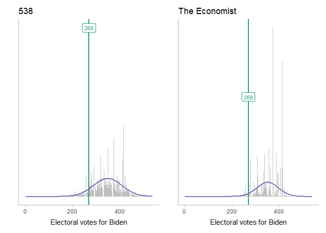
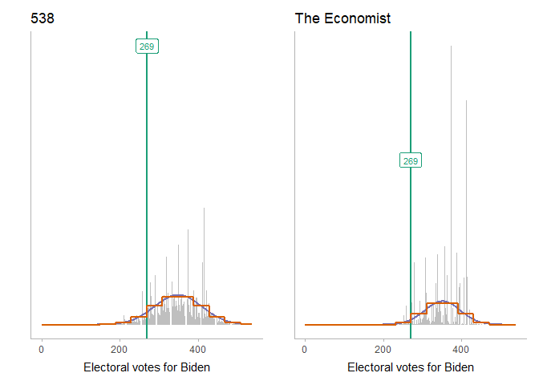

Binomial approximation to the Economist’s prediction
================
Matthew Kay

To build a Galton board for the Economist and 538 predictions, we need
binomial distributions that can approximate the current prediction.s In
this document we’ll find such distributions.

Basically, what we want is a bin width, number of bins, and a mean that
we then throw into the Galton board renderer in
[galton\_board\_quantile\_ragg.Rmd](galton_board_quantile_ragg.Rmd).

## Setup

``` r
library(tidyverse)
library(Hmisc)
library(ggdist)
library(patchwork)

theme_set(theme_ggdist())
```

## Data

### 538

We’ll read in the data from 538, which can be obtained from the bottom
of [this
page](https://projects.fivethirtyeight.com/2020-election-forecast/). It
contains predicted probabilities of Trump and Biden achieving each
number of electoral votes:

``` r
df_538 = read.csv("data/538/presidential_ev_probabilities_2020.csv")
```

From this we can plot a histogram of Biden’s predicted probability of
achieving each number of electoral votes (with 270 being a majority):

``` r
col_269 = "#1b9e77"

base_plot_538 = df_538 %>%
  ggplot(aes(x = total_ev, y = evprob_chal)) +
  geom_col(fill = "gray75") +
  geom_vline(xintercept = 269, color = col_269, size = 1) +
  annotate("label", x = 269, y = max(df_538$evprob_chal), label = "269", color = col_269, size = 3) +
  xlab("Electoral votes for Biden") +
  scale_y_continuous(breaks = NULL) +
  ylab("") +
  xlim(-1, 540) +
  ggtitle("538")

base_plot_538
```

<!-- -->

### The Economist

We’ll also read in the data from the Economist, which can be obtained
from the bottom of [this
page](https://projects.economist.com/us-2020-forecast/president). It
contains predicted probabilities of Trump and Biden achieving each
number of electoral votes:

``` r
df_econ = read.csv("data/economist/electoral_college_simulations.csv")
```

As before, we will plot a histogram of Biden’s predicted probability of
achieving each number of electoral votes (with 270 being a majority).
We’ll also do a side-by-side comparison:

``` r
col_269 = "#1b9e77"

base_plot_econ = df_econ %>%
  ggplot(aes(x = dem_ev)) +
  geom_histogram(aes(y = stat(density)), binwidth = 1, fill = "gray75") +
  geom_vline(xintercept = 269, color = col_269, size = 1) +
  annotate("label", x = 269, y = .05, label = "269", color = col_269, size = 3) +
  xlab("Electoral votes for Biden") +
  scale_y_continuous(breaks = NULL) +
  ylab("") +
  coord_cartesian(xlim = c(0, 540)) +
  ggtitle("The Economist")

base_plot_538 + base_plot_econ
```

<!-- -->

## Normal approximation

Let’s approximate these distributions with a normal distribution by
simply using the mean and variance of the predictive distribution:

``` r
mean_ev_538 = wtd.mean(df_538$total_ev, weights = df_538$evprob_chal)
# Must multiply by number of simulations as (normally 40,000 for 538)
# as total N is used in the weighted variance calc
var_ev_538 = wtd.var(df_538$total_ev, weights = df_538$evprob_chal * df_538$simulations)
sd_ev_538 = sqrt(var_ev_538)

mean_ev_econ = mean(df_econ$dem_ev)
var_ev_econ = var(df_econ$dem_ev)
sd_ev_econ = sd(df_econ$dem_ev)
```

And plot:

``` r
col_normal = "#7570b3"

normal_plot = function(base_plot, mean_ev, sd_ev) {
  normal_density = tibble(x = 1:538, y = dnorm(x, mean_ev, sd_ev))
  
  base_plot + 
    geom_line(aes(x = x, y = y), data = normal_density, color = col_normal, size = 1)
}

normal_plot(base_plot_538, mean_ev_538, sd_ev_538) +
  normal_plot(base_plot_econ, mean_ev_econ, sd_ev_econ)
```

<!-- -->

The Normal approximation looks decent. Let’s continue down this train a
bit and use binomial approximations to the Normal by finding a binomial
distribution with the same variance and then shifting its location to
match the above Normal distribution.

We can use the fact that the variance of a Binomial distribution with
probability 0.5 is equal to 1/4 the number of trials in the distribution
to find the number of trials needed (which is the same as the height of
the Galton board we would need to construct):

``` r
bin_n_538 = round(4 * var_ev_538)
bin_n_econ = round(4 * var_ev_econ)

cat("538 bins:\t", bin_n_538, "\nEconomist bins:\t", bin_n_econ)
```

    ## 538 bins:     22663 
    ## Economist bins:   10697

Those would be very large Galton boards\! Leaving that aside for a
moment, let’s see how well they approximates the distributions:

``` r
col_binom = "#d95f02"

binom_plot = function(base_plot, mean_ev, sd_ev, bin_n) {
  binom_mass = tibble(x = 0:538, y = dbinom(x + round(bin_n/2 - mean_ev), bin_n, 0.5))
  normal_plot(base_plot, mean_ev, sd_ev) +
    geom_step(aes(x = x, y = y), data = binom_mass, color = col_binom, direction = "mid", size = 1)
}

binom_plot(base_plot_538, mean_ev_538, sd_ev_538, bin_n_538) +
  binom_plot(base_plot_econ, mean_ev_econ, sd_ev_econ, bin_n_econ)
```

<!-- -->

The binomial distribution looks nearly identical to the Normal
distribution here. However, like I said, it would require very large
Galton boards to generate these distributions down to the single
electoral vote level. So instead, let’s use wider bins — say, bins
between 35 and 45 electoral votes wide. In fact, we’ll pick a single bin
width that we can use for both distirbutions that puts 269 as close to a
bin boundary in both as we can, given the scaling/shifting of the
distribution we will be doing:

``` r
candidate_bin_width = 35:45
candidate_bin_n_538 = round(4 * var_ev_538 / candidate_bin_width^2)
candidate_bin_n_econ = round(4 * var_ev_econ / candidate_bin_width^2)
# minimize sum of squared distance between 269 and the nearest 
# bin edge in both 538 and the economist's distribution
bin_width = candidate_bin_width[which.min(
  ((269/candidate_bin_width + candidate_bin_n_538/2 - mean_ev_538/candidate_bin_width) %% 1 - 0.5)^2 +
  ((269/candidate_bin_width + candidate_bin_n_econ/2 - mean_ev_econ/candidate_bin_width) %% 1 - 0.5)^2
)]
bin_width
```

    ## [1] 43

That gives us a bin width of 43, leading to…

``` r
bin_n_small_538 = round(4 * var_ev_538 / bin_width^2)
bin_n_small_econ = round(4 * var_ev_econ / bin_width^2)

cat("538 bins:\t", bin_n_small_538, "\nEconomist bins:\t", bin_n_small_econ)
```

    ## 538 bins:     12 
    ## Economist bins:   6

Galton boards with a much more manageable number of bins. Let’s check on
the approximations:

``` r
binom_plot_small = function(base_plot, mean_ev, sd_ev, bin_n) {
  binom_mass_small = tibble(
    x = 0:538, 
    y = dbinom(round(x/bin_width + bin_n/2 - mean_ev/bin_width), bin_n, 0.5) / bin_width
  )
  
  normal_plot(base_plot, mean_ev, sd_ev) +
    geom_step(aes(x = x, y = y), data = binom_mass_small, color = col_binom, direction = "mid", size = 1)
}

binom_plot_small(base_plot_538, mean_ev_538, sd_ev_538, bin_n_small_538) +
  binom_plot_small(base_plot_econ, mean_ev_econ, sd_ev_econ, bin_n_small_econ)
```

<!-- -->

In case a bin boundary doesn’t line up exactly at 269, we’ll adjust the
means a little bit so that it does. Since we’ve already picked a binning
to minimize the distance between 269 and its closest bin boundary, this
shouldn’t require us to fudge the mean too much:

``` r
mean_ev_adj_538 = mean_ev_538 + ((269 + bin_n_small_538*bin_width/2 - mean_ev_538) %% bin_width - bin_width/2)
mean_ev_adj_econ = mean_ev_econ + ((269 + bin_n_small_econ*bin_width/2 - mean_ev_econ) %% bin_width - bin_width/2)

cat(sep = "",
"\t\tMean\tAdjusted mean\n538:\t\t", round(mean_ev_538, 1), "\t", 
  mean_ev_adj_538, "\nEconomist:\t", round(mean_ev_econ, 1), "\t", mean_ev_adj_econ)
```

    ##      Mean    Adjusted mean
    ## 538:     335.6   333.5
    ## Economist:   331.8   333.5

That should make a bin boundary fall on 269 without the approximation
looking too bad:

``` r
binom_plot_small(base_plot_538, mean_ev_adj_538, sd_ev_538, bin_n_small_538) +
  binom_plot_small(base_plot_econ, mean_ev_adj_econ, sd_ev_econ, bin_n_small_econ)
```

<!-- -->

## Build 538 board

The final parameters for our approximation are:

``` r
n_bin = bin_n_small_538
board_mean = mean_ev_adj_538
row_ratio = 2
model_name = "538"

cat(paste0(
  "bins:      ", bin_n_small_538, "\n",
  "bin width: ", bin_width, "\n",
  "mean:      ", mean_ev_adj_538, "\n"
))
```

    ## bins:      12
    ## bin width: 43
    ## mean:      333.5

And we can use these quantiles for the dotplot:

``` r
# this is a dumb way to do this but it's good enough
ev_samples = unlist(map2(df_538$total_ev, round(df_538$evprob_chal * 40000), rep))

bin_values = as.vector(quantile(round((ev_samples - mean_ev_adj_538)/bin_width + bin_n_small_538/2), ppoints(50)))
bin_values
```

    ##  [1]  2  3  3  3  4  4  4  4  4  4  5  5  5  5  5  5  5  5  5  6  6  6  6  6  6
    ## [26]  6  6  6  6  7  7  7  7  7  7  7  7  7  8  8  8  8  8  8  8  8  8  9  9 10

# Quantile Galton Board

The following code constructs a Galton board for a quantile dotplot.
While this code no longer uses the `chipmunkbasic` package, it was
originally based on [`vignette("galton", package =
"chipmunkbasic")`](https://coolbutuseless.github.io/package/chipmunkbasic/articles/galton.html)
by [coolbutuseless](https://coolbutuseless.github.io/).

## Setup

The following packages are required for to construct the Galton board:

``` r
library(dplyr)
library(tidyr)
library(purrr)
library(ggplot2)
library(ggdist)
library(ggforce)
library(tweenr)
library(ragg)
library(snakecase)
library(gifski)
```

## Construct the board

To determine the board dimensions, we need to decide on the number of
draws we will take and the number of pins in one row of the board
(equivalently, the size of the Binomial distribution we are simulating
with the board):

``` r
# these checks allow us to include this file at the end of binomial_approx_*.Rmd
# to re-run this file using the output of the approximation
if (!exists("n_draw")) n_draw = 50
if (!exists("n_bin")) n_bin = 14
if (!exists("bin_width")) bin_width = 42
if (!exists("board_mean")) board_mean = 332
if (!exists("row_ratio")) row_ratio = 2
if (!exists("model_name")) model_name = "538"
if (!exists("bin_values")) bin_values = qbinom(ppoints(n_draw), n_bin, 0.5)

# n_bin = 14
# bin_width = 42
# board_mean = 332
# row_ratio = 2
# model_name = "538"
# bin_values = c(3, 4, 4, 4, 4, 5, 5, 5, 5, 5, 5, 6, 6, 6, 6, 6, 6, 6, 6, 6,  7, 7, 7, 7, 7, 7, 7, 7, 7, 8, 8, 8, 8, 8, 8, 8, 8, 9, 9, 9, 9,  9, 9, 9, 9, 9, 10, 10, 10, 11)

# n_bin = 8
# bin_width = 39
# board_mean = 327.5
# row_ratio = 2
# model_name = "The Economist"
# bin_values = c(1, 1, 1, 2, 2, 2, 2, 3, 3, 3, 3, 3, 3, 3, 3, 3, 4, 4, 4, 4,  4, 4, 4, 4, 4, 4, 4, 4, 4, 4, 5, 5, 5, 5, 5, 5, 5, 5, 5, 5, 5,  5, 5, 6, 6, 6, 6, 6, 6, 7)

# bin_values = qbinom(ppoints(n_draw), n_bin, 0.5)

# the sample() call here is just so that ball order is random
# otherwise our animation would have balls fall in order from
# left to right.
set.seed(12345)
bin_values = sample(bin_values, n_draw)

x_min = 0
x_max = 538

friction = 0
elasticity = 0

show_dist = FALSE
one_frame = FALSE
```

Now we can determine the dimensions of the board required:

``` r
row_height = bin_width * row_ratio
# ball width is just a bit smaller than the bins
ball_width = bin_width * 0.9 # 14/15
# slot height needs to accommodate the tallest bin in the distribution plus some leeway
slot_height = dbinom(round(n_bin/2), n_bin, 0.5) * n_draw * ball_width * 1.3
board_height = slot_height + n_bin * row_height
total_height = 2445 # board_height + 15 * bin_width
```

### Slots

Next, we create slots the balls will fall into:

``` r
slot_edges = seq(-(n_bin + 1)/2, (n_bin + 1)/2) * bin_width + board_mean

# restrict ourselves to the predefined min/max x, if necessary
slot_edges = slot_edges[x_min - bin_width < slot_edges & slot_edges < x_max + bin_width]

# extend out the left and right edges to predefined min/max x, if necessary
slot_edges = c(
  rev(seq(min(slot_edges), x_min - bin_width, by = -bin_width)),
  slot_edges[-c(1, length(slot_edges))],
  seq(max(slot_edges), x_max + bin_width, by = bin_width)
)

# make the slot edges at the ends of the board 
# go all the way up the height of the board
slot_heights = rep(slot_height, length(slot_edges))
slot_heights[[1]] = board_height
slot_heights[[length(slot_heights)]] = board_height

slots_df = data.frame(
  x = slot_edges,
  height = slot_heights
)
```

### Pins

Next, we can create the grid of pins:

``` r
pins_df = data.frame()
for (i in 1:n_bin) {
  y = slot_height + (n_bin - i) * row_height
  
  xs = slot_edges
  if (i %% 2 == 1) {
    xs = xs + bin_width/2
  }
  
  # restrict ourselves to the predefined min/max x
  xs = xs[min(slot_edges) + bin_width/2 < xs & xs < max(slot_edges) - bin_width/2]

  pins_df = rbind(pins_df, data.frame(x = xs, y = y))
}
```

As a sanity check, we’ll verify the pin and slot locations:

``` r
board_plot = ggplot() + 
  geom_segment(data = slots_df, aes(x = x, y = 0, xend = x, yend = height), size = 1) + 
  geom_point(aes(x, y), data = pins_df, shape = 1, color = "red") +
  coord_fixed() + 
  theme_ggdist() 

board_plot
```

<!-- -->
\#\# Final ball positions

Instead of simulating the ball’s path through the pins with a physics
engine (as in [galton\_board.Rmd](galton_board.Rmd)), we will construct
a representative final distribution through quantiles, then determine
random paths that could have led to that distribution.

So first, let’s determine the final positions of each ball:

``` r
final_balls_df = 
  tibble(
    ball_id = 1:n_draw,
    bin = bin_values,
    pin = bin * 2, # pin locations are every half-bin
    x = (bin - n_bin/2) * bin_width + board_mean,
    move_id = n_bin + 2,
  ) %>%
  group_by(x) %>%
  mutate(y = 1:n() * ball_width - ball_width/2)
```

Which looks like this:

``` r
board_plot = board_plot + 
  geom_circle(
    aes(x0 = x, y0 = y, r = ball_width/2), 
    fill = "blue", color = NA, data = final_balls_df
  )

board_plot
```

<!-- -->
\#\# Ball paths

Now we need to come up with paths for each ball that would cause them to
end up in their final locations. Given the starting pin at the mean
(`m`) and the final pin (`k`), we can use the fact that a ball in a bin
centered at pin `k` ended up in that bin if and only if it traveled `k -
m` pins over from the starting pin (I’ll dub these *fixed moves*), plus
an equal number of left and right movements (i.e. movements which cancel
themselves out; I’ll dub these *balanced moves*), *in any order* (modulo
hitting the edge, which we’re just gonna ignore for now). So we’ll just
figure out what set of moves are needed for each ball and then randomize
the order of those moves to make a path.

``` r
mean_pin = n_bin # would be n_bin / 2 * 2

paths_df = final_balls_df %>%
  group_by(ball_id) %>%
  mutate(
    # number of fixed moves (negative if fixed moves are to the left)
    n_fixed_move = pin - mean_pin,
    # number of balanced moves (half of these will be to the right and half to the left)
    n_balanced_move = n_bin - abs(n_fixed_move),
    n_move = abs(n_fixed_move) + n_balanced_move,
    # list of moves where each move is -1 (left) or +1 (right) or 0 (start)
    move = list(c(
      0,
      sample(
        c(rep(sign(n_fixed_move), abs(n_fixed_move)), rep(-1, n_balanced_move/2), rep(1, n_balanced_move/2)),
        size = n_move
      )
    ))
  ) %>%
  unnest(move) %>%
  # determine actual positions at each step based on the accumulation of moves
  mutate(
    move_id = 1:n(),
    x = cumsum(move * bin_width/2) + board_mean,
    y = move_id * -row_height + board_height + ball_width/2
  ) %>%
  # add final positions
  bind_rows(final_balls_df)

#add initial ball positions at the drop location
paths_df = paths_df %>%
  filter(move_id == 1) %>%
  mutate(
    move_id = 0,
    y = y + bin_width * 10
  ) %>%
  bind_rows(paths_df) %>%
  mutate(move_id = move_id + 1)

head(paths_df)
```

    ## # A tibble: 6 x 10
    ## # Groups:   ball_id [6]
    ##   ball_id   bin   pin     x move_id     y n_fixed_move n_balanced_move n_move
    ##     <int> <dbl> <dbl> <dbl>   <dbl> <dbl>        <dbl>           <dbl>  <dbl>
    ## 1       1     5    10  334.       1 1963.           -2              10     12
    ## 2       2     5    10  334.       1 1963.           -2              10     12
    ## 3       3     6    12  334.       1 1963.            0              12     12
    ## 4       4     6    12  334.       1 1963.            0              12     12
    ## 5       5     6    12  334.       1 1963.            0              12     12
    ## 6       6     6    12  334.       1 1963.            0              12     12
    ## # ... with 1 more variable: move <dbl>

The result is a set of paths like this:

``` r
board_plot +
  geom_path(aes(x = x, y = y, group = ball_id), data = paths_df, alpha = sqrt(1/n_draw))
```

<!-- -->
\#\# Construct animation frames

Next, we construct a dataframe of animation frames by determining on
each frame which move for each ball is visible (if any):

``` r
frames_till_draw = 4

# adding 44 gives some extra frames at the end for a pause
n_frame = n_draw * frames_till_draw - (frames_till_draw - 1) + 45

frames_df = map_dfr(1:n_frame, function(i) {
  paths_df %>%
    mutate(
      frame_id = i,
      visible_move_id = i - ball_id * frames_till_draw + 1 - (frames_till_draw - 1)
    ) %>%
    # keep only the moves we are showing in this frame
    filter(
      move_id == visible_move_id  |
      # final ball position persists
      (move_id == max(move_id) & move_id < visible_move_id)
    ) %>%
    ungroup()
})
```

Then we tween each ball’s position and add a “bounce” effect (the easing
function). The following is essentially using `tweenr::tween_states()`
to do what `gganimate::transition_states()` does under the hood, but
we’re doing it manually instead because gganimate is pretty slow on
this animation. If we build up the animation manually it will go much
faster (it’s just a bit more work).

``` r
frame_mult = 4

tweened_frames_df = frames_df %>%
  group_split(ball_id) %>%
  map(function(frames) {
    # frames is a data frame of all rows associated with a single ball
    frames = frames %>%
      group_split(frame_id) %>%
      # some of the frames are empty (0 rows), corresponding to times when
      # this ball is not visible. Need to filter those out for tweenr
      keep(~ nrow(.x) != 0)
    
    frame_ids = map_dbl(frames, "frame_id")
    min_frame_id = min(frame_ids)
    max_frame_id = max(frame_ids)
    n_frame =  max_frame_id - min_frame_id + 1

    frames %>%
      tween_states(
        tweenlength = 2,
        statelength = 0,
        ease = "bounce-out",
        nframes = n_frame * frame_mult
      ) %>%
      # the .frame column generated by tweenr starts at the wrong spot because
      # we had to filter out empty rows above (corresponding to when the ball is not
      # visible yet), so we will adjust the frame_id to start when this ball
      # first becomes visible instead of at 1
      mutate(frame_id = (min_frame_id - 1) * frame_mult + .frame)
  }) %>%
  bind_rows()
```

## Render animation

First, we need to set up the output folder to hold the PNG files that
will contain the frames:

``` r
png_dir = "png_temp"
dir.create(png_dir, showWarnings = FALSE)
unlink(list.files(png_dir, pattern = "*.png", full.names = TRUE))
```

Then, we render all frame of the Galton board one at a time into PNG
files in the above directory.

``` r
x0 = seq(-n_bin/2, n_bin/2) * bin_width + board_mean
x0 = x0[min(slot_edges) < x0 & x0 < max(slot_edges)]

# figure out aspect ratio
height_px = 800
width_px = (x_max - x_min + 90)/total_height * height_px

Biden_color = "#0571b0"
Trump_color = "#ca0020"

tweened_frames = group_split(tweened_frames_df, frame_id)
# repeat the last frame to match up to the desired exact length of the animation
last_frame = tweened_frames[length(tweened_frames)]
tweened_frames = c(tweened_frames, rep(last_frame, n_frame * frame_mult - length(tweened_frames)))

pb = txtProgressBar(max = length(tweened_frames), style = 3, file = stderr())
for (i in seq_along(tweened_frames)) {
  tweened_frame = tweened_frames[[i]]
  outfile <- sprintf("%s/%04i.png", png_dir, i)
  agg_png(outfile, width = width_px, height = height_px, res = 100)
  
  p = ggplot(tweened_frame) + 
    geom_point(aes(x, y), size = 1, shape = 18, color = "gray50", data = pins_df) +
    geom_segment(
      aes(x, 0, xend = x, yend = height),
      size = 1, color = "gray75", data = slots_df
    ) +
    geom_circle(
      aes(
        x0 = x,
        y0 = y,
        r = ball_width/2,
        fill = ifelse(y > slot_height, "none", ifelse(x <= 269, "Trump", "Biden")),
        group = ball_id
      ), color = NA) + 
    (if (show_dist) geom_step(
      data = data.frame(x0),
      aes(
        x = x0,
        y = n_draw * ball_width * dbinom(
          round((x0 - board_mean)/bin_width + n_bin/2),
          size = n_bin,
          prob = 0.5
        )),
      col="black",
      alpha = 0.2,
      size = 1,
      direction = "mid"
    )) +
    geom_vline(xintercept = 269, color = "black", alpha = 0.15, size = 1) +
    annotate("text", 
      x = 290, y = 0.95 * total_height, 
      label = "Biden wins", hjust = 0, color = Biden_color
      # fontface = "bold",
    ) +
    annotate("text", 
      x = 250, y = 0.95 * total_height,
      label = "Trump wins", hjust = 1, color = Trump_color
      # fontface = "bold",
    ) +
    annotate("label", 
      x = 269, y = 0.98 * total_height,
      label = "269", hjust = 0.5, color = "gray50",
      fontface = "bold"
    ) +
    scale_fill_manual(
      limits = c("none", "Biden", "Trump"),
      values = c("gray45", Biden_color, Trump_color), 
      guide = FALSE
    ) +
    coord_fixed(ylim = c(0, total_height), xlim = c(x_min - 45, x_max + 45), 
      expand = FALSE, clip = "off") + 
    theme_ggdist() + 
    theme(
      axis.line.y = element_blank(),
      axis.line.x = element_line(color = "gray75", size = 1),
      axis.title.x = element_text(hjust = 0, size = 10, color = "gray25"),
      plot.title = element_text(hjust = 0.5),
      plot.title.position = "plot"
    ) +
    scale_y_continuous(breaks = NULL) +
    scale_x_continuous(limits = range(slot_edges, x_min, x_max)) +
    labs(
      x = paste0("Electoral votes for Biden\n\nPresidential Plinko, ", format(Sys.Date(), "%b %d"), "\n", 
        model_name, "'s model\n"),
      y = NULL
    ) +
    ggtitle(model_name)
  print(p)
  invisible(dev.off())

  setTxtProgressBar(pb, i)
}
```

Finally, we use `gifski()` to roll all the frames into an animated GIF:

``` r
gif_name = paste0("galton_board-", to_snake_case(model_name), ".gif")

gifski(
  list.files(png_dir, pattern = "*.png", full.names = TRUE), 
  gif_name, 
  width = width_px,
  height = height_px,
  delay = 1/30,
  loop = TRUE,
  progress = TRUE
)
```


## Build Economist board

The final parameters for our approximation are:

``` r
n_bin = bin_n_small_econ
board_mean = mean_ev_adj_econ
row_ratio = 2
model_name = "The Economist"

cat(paste0(
  "bins:      ", bin_n_small_econ, "\n",
  "bin width: ", bin_width, "\n",
  "mean:      ", mean_ev_adj_econ, "\n"
))
```

    ## bins:      6
    ## bin width: 43
    ## mean:      333.5

``` r
n_draw = 50
bin_values = as.vector(quantile(round((df_econ$dem_ev - mean_ev_adj_econ)/bin_width + bin_n_small_econ/2), ppoints(n_draw)))
bin_values
```

    ##  [1] 0 0 1 1 1 1 2 2 2 2 2 2 2 2 2 2 3 3 3 3 3 3 3 3 3 3 3 3 3 3 3 4 4 4 4 4 4 4
    ## [39] 4 4 4 4 4 4 4 4 5 5 5 5

# Quantile Galton Board

The following code constructs a Galton board for a quantile dotplot.
While this code no longer uses the `chipmunkbasic` package, it was
originally based on [`vignette("galton", package =
"chipmunkbasic")`](https://coolbutuseless.github.io/package/chipmunkbasic/articles/galton.html)
by [coolbutuseless](https://coolbutuseless.github.io/).

## Setup

The following packages are required for to construct the Galton board:

``` r
library(dplyr)
library(tidyr)
library(purrr)
library(ggplot2)
library(ggdist)
library(ggforce)
library(tweenr)
library(ragg)
library(snakecase)
library(gifski)
```

## Construct the board

To determine the board dimensions, we need to decide on the number of
draws we will take and the number of pins in one row of the board
(equivalently, the size of the Binomial distribution we are simulating
with the board):

``` r
# these checks allow us to include this file at the end of binomial_approx_*.Rmd
# to re-run this file using the output of the approximation
if (!exists("n_draw")) n_draw = 50
if (!exists("n_bin")) n_bin = 14
if (!exists("bin_width")) bin_width = 42
if (!exists("board_mean")) board_mean = 332
if (!exists("row_ratio")) row_ratio = 2
if (!exists("model_name")) model_name = "538"
if (!exists("bin_values")) bin_values = qbinom(ppoints(n_draw), n_bin, 0.5)

# n_bin = 14
# bin_width = 42
# board_mean = 332
# row_ratio = 2
# model_name = "538"
# bin_values = c(3, 4, 4, 4, 4, 5, 5, 5, 5, 5, 5, 6, 6, 6, 6, 6, 6, 6, 6, 6,  7, 7, 7, 7, 7, 7, 7, 7, 7, 8, 8, 8, 8, 8, 8, 8, 8, 9, 9, 9, 9,  9, 9, 9, 9, 9, 10, 10, 10, 11)

# n_bin = 8
# bin_width = 39
# board_mean = 327.5
# row_ratio = 2
# model_name = "The Economist"
# bin_values = c(1, 1, 1, 2, 2, 2, 2, 3, 3, 3, 3, 3, 3, 3, 3, 3, 4, 4, 4, 4,  4, 4, 4, 4, 4, 4, 4, 4, 4, 4, 5, 5, 5, 5, 5, 5, 5, 5, 5, 5, 5,  5, 5, 6, 6, 6, 6, 6, 6, 7)

# bin_values = qbinom(ppoints(n_draw), n_bin, 0.5)

# the sample() call here is just so that ball order is random
# otherwise our animation would have balls fall in order from
# left to right.
set.seed(12345)
bin_values = sample(bin_values, n_draw)

x_min = 0
x_max = 538

friction = 0
elasticity = 0

show_dist = FALSE
one_frame = FALSE
```

Now we can determine the dimensions of the board required:

``` r
row_height = bin_width * row_ratio
# ball width is just a bit smaller than the bins
ball_width = bin_width * 0.9 # 14/15
# slot height needs to accommodate the tallest bin in the distribution plus some leeway
slot_height = dbinom(round(n_bin/2), n_bin, 0.5) * n_draw * ball_width * 1.3
board_height = slot_height + n_bin * row_height
total_height = 2445 # board_height + 15 * bin_width
```

### Slots

Next, we create slots the balls will fall into:

``` r
slot_edges = seq(-(n_bin + 1)/2, (n_bin + 1)/2) * bin_width + board_mean

# restrict ourselves to the predefined min/max x, if necessary
slot_edges = slot_edges[x_min - bin_width < slot_edges & slot_edges < x_max + bin_width]

# extend out the left and right edges to predefined min/max x, if necessary
slot_edges = c(
  rev(seq(min(slot_edges), x_min - bin_width, by = -bin_width)),
  slot_edges[-c(1, length(slot_edges))],
  seq(max(slot_edges), x_max + bin_width, by = bin_width)
)

# make the slot edges at the ends of the board 
# go all the way up the height of the board
slot_heights = rep(slot_height, length(slot_edges))
slot_heights[[1]] = board_height
slot_heights[[length(slot_heights)]] = board_height

slots_df = data.frame(
  x = slot_edges,
  height = slot_heights
)
```

### Pins

Next, we can create the grid of pins:

``` r
pins_df = data.frame()
for (i in 1:n_bin) {
  y = slot_height + (n_bin - i) * row_height
  
  xs = slot_edges
  if (i %% 2 == 1) {
    xs = xs + bin_width/2
  }
  
  # restrict ourselves to the predefined min/max x
  xs = xs[min(slot_edges) + bin_width/2 < xs & xs < max(slot_edges) - bin_width/2]

  pins_df = rbind(pins_df, data.frame(x = xs, y = y))
}
```

As a sanity check, we’ll verify the pin and slot locations:

``` r
board_plot = ggplot() + 
  geom_segment(data = slots_df, aes(x = x, y = 0, xend = x, yend = height), size = 1) + 
  geom_point(aes(x, y), data = pins_df, shape = 1, color = "red") +
  coord_fixed() + 
  theme_ggdist() 

board_plot
```

<!-- -->
\#\# Final ball positions

Instead of simulating the ball’s path through the pins with a physics
engine (as in [galton\_board.Rmd](galton_board.Rmd)), we will construct
a representative final distribution through quantiles, then determine
random paths that could have led to that distribution.

So first, let’s determine the final positions of each ball:

``` r
final_balls_df = 
  tibble(
    ball_id = 1:n_draw,
    bin = bin_values,
    pin = bin * 2, # pin locations are every half-bin
    x = (bin - n_bin/2) * bin_width + board_mean,
    move_id = n_bin + 2,
  ) %>%
  group_by(x) %>%
  mutate(y = 1:n() * ball_width - ball_width/2)
```

Which looks like this:

``` r
board_plot = board_plot + 
  geom_circle(
    aes(x0 = x, y0 = y, r = ball_width/2), 
    fill = "blue", color = NA, data = final_balls_df
  )

board_plot
```

<!-- -->
\#\# Ball paths

Now we need to come up with paths for each ball that would cause them to
end up in their final locations. Given the starting pin at the mean
(`m`) and the final pin (`k`), we can use the fact that a ball in a bin
centered at pin `k` ended up in that bin if and only if it traveled `k -
m` pins over from the starting pin (I’ll dub these *fixed moves*), plus
an equal number of left and right movements (i.e. movements which cancel
themselves out; I’ll dub these *balanced moves*), *in any order* (modulo
hitting the edge, which we’re just gonna ignore for now). So we’ll just
figure out what set of moves are needed for each ball and then randomize
the order of those moves to make a path.

``` r
mean_pin = n_bin # would be n_bin / 2 * 2

paths_df = final_balls_df %>%
  group_by(ball_id) %>%
  mutate(
    # number of fixed moves (negative if fixed moves are to the left)
    n_fixed_move = pin - mean_pin,
    # number of balanced moves (half of these will be to the right and half to the left)
    n_balanced_move = n_bin - abs(n_fixed_move),
    n_move = abs(n_fixed_move) + n_balanced_move,
    # list of moves where each move is -1 (left) or +1 (right) or 0 (start)
    move = list(c(
      0,
      sample(
        c(rep(sign(n_fixed_move), abs(n_fixed_move)), rep(-1, n_balanced_move/2), rep(1, n_balanced_move/2)),
        size = n_move
      )
    ))
  ) %>%
  unnest(move) %>%
  # determine actual positions at each step based on the accumulation of moves
  mutate(
    move_id = 1:n(),
    x = cumsum(move * bin_width/2) + board_mean,
    y = move_id * -row_height + board_height + ball_width/2
  ) %>%
  # add final positions
  bind_rows(final_balls_df)

#add initial ball positions at the drop location
paths_df = paths_df %>%
  filter(move_id == 1) %>%
  mutate(
    move_id = 0,
    y = y + bin_width * 10
  ) %>%
  bind_rows(paths_df) %>%
  mutate(move_id = move_id + 1)

head(paths_df)
```

    ## # A tibble: 6 x 10
    ## # Groups:   ball_id [6]
    ##   ball_id   bin   pin     x move_id     y n_fixed_move n_balanced_move n_move
    ##     <int> <dbl> <dbl> <dbl>   <dbl> <dbl>        <dbl>           <dbl>  <dbl>
    ## 1       1     2     4  334.       1 1665.           -2               4      6
    ## 2       2     2     4  334.       1 1665.           -2               4      6
    ## 3       3     3     6  334.       1 1665.            0               6      6
    ## 4       4     3     6  334.       1 1665.            0               6      6
    ## 5       5     3     6  334.       1 1665.            0               6      6
    ## 6       6     3     6  334.       1 1665.            0               6      6
    ## # ... with 1 more variable: move <dbl>

The result is a set of paths like this:

``` r
board_plot +
  geom_path(aes(x = x, y = y, group = ball_id), data = paths_df, alpha = sqrt(1/n_draw))
```

<!-- -->
\#\# Construct animation frames

Next, we construct a dataframe of animation frames by determining on
each frame which move for each ball is visible (if any):

``` r
frames_till_draw = 4

# adding 44 gives some extra frames at the end for a pause
n_frame = n_draw * frames_till_draw - (frames_till_draw - 1) + 45

frames_df = map_dfr(1:n_frame, function(i) {
  paths_df %>%
    mutate(
      frame_id = i,
      visible_move_id = i - ball_id * frames_till_draw + 1 - (frames_till_draw - 1)
    ) %>%
    # keep only the moves we are showing in this frame
    filter(
      move_id == visible_move_id  |
      # final ball position persists
      (move_id == max(move_id) & move_id < visible_move_id)
    ) %>%
    ungroup()
})
```

Then we tween each ball’s position and add a “bounce” effect (the easing
function). The following is essentially using `tweenr::tween_states()`
to do what `gganimate::transition_states()` does under the hood, but
we’re doing it manually instead because gganimate is pretty slow on
this animation. If we build up the animation manually it will go much
faster (it’s just a bit more work).

``` r
frame_mult = 4

tweened_frames_df = frames_df %>%
  group_split(ball_id) %>%
  map(function(frames) {
    # frames is a data frame of all rows associated with a single ball
    frames = frames %>%
      group_split(frame_id) %>%
      # some of the frames are empty (0 rows), corresponding to times when
      # this ball is not visible. Need to filter those out for tweenr
      keep(~ nrow(.x) != 0)
    
    frame_ids = map_dbl(frames, "frame_id")
    min_frame_id = min(frame_ids)
    max_frame_id = max(frame_ids)
    n_frame =  max_frame_id - min_frame_id + 1

    frames %>%
      tween_states(
        tweenlength = 2,
        statelength = 0,
        ease = "bounce-out",
        nframes = n_frame * frame_mult
      ) %>%
      # the .frame column generated by tweenr starts at the wrong spot because
      # we had to filter out empty rows above (corresponding to when the ball is not
      # visible yet), so we will adjust the frame_id to start when this ball
      # first becomes visible instead of at 1
      mutate(frame_id = (min_frame_id - 1) * frame_mult + .frame)
  }) %>%
  bind_rows()
```

## Render animation

First, we need to set up the output folder to hold the PNG files that
will contain the frames:

``` r
png_dir = "png_temp"
dir.create(png_dir, showWarnings = FALSE)
unlink(list.files(png_dir, pattern = "*.png", full.names = TRUE))
```

Then, we render all frame of the Galton board one at a time into PNG
files in the above directory.

``` r
x0 = seq(-n_bin/2, n_bin/2) * bin_width + board_mean
x0 = x0[min(slot_edges) < x0 & x0 < max(slot_edges)]

# figure out aspect ratio
height_px = 800
width_px = (x_max - x_min + 90)/total_height * height_px

Biden_color = "#0571b0"
Trump_color = "#ca0020"

tweened_frames = group_split(tweened_frames_df, frame_id)
# repeat the last frame to match up to the desired exact length of the animation
last_frame = tweened_frames[length(tweened_frames)]
tweened_frames = c(tweened_frames, rep(last_frame, n_frame * frame_mult - length(tweened_frames)))

pb = txtProgressBar(max = length(tweened_frames), style = 3, file = stderr())
for (i in seq_along(tweened_frames)) {
  tweened_frame = tweened_frames[[i]]
  outfile <- sprintf("%s/%04i.png", png_dir, i)
  agg_png(outfile, width = width_px, height = height_px, res = 100)
  
  p = ggplot(tweened_frame) + 
    geom_point(aes(x, y), size = 1, shape = 18, color = "gray50", data = pins_df) +
    geom_segment(
      aes(x, 0, xend = x, yend = height),
      size = 1, color = "gray75", data = slots_df
    ) +
    geom_circle(
      aes(
        x0 = x,
        y0 = y,
        r = ball_width/2,
        fill = ifelse(y > slot_height, "none", ifelse(x <= 269, "Trump", "Biden")),
        group = ball_id
      ), color = NA) + 
    (if (show_dist) geom_step(
      data = data.frame(x0),
      aes(
        x = x0,
        y = n_draw * ball_width * dbinom(
          round((x0 - board_mean)/bin_width + n_bin/2),
          size = n_bin,
          prob = 0.5
        )),
      col="black",
      alpha = 0.2,
      size = 1,
      direction = "mid"
    )) +
    geom_vline(xintercept = 269, color = "black", alpha = 0.15, size = 1) +
    annotate("text", 
      x = 290, y = 0.95 * total_height, 
      label = "Biden wins", hjust = 0, color = Biden_color
      # fontface = "bold",
    ) +
    annotate("text", 
      x = 250, y = 0.95 * total_height,
      label = "Trump wins", hjust = 1, color = Trump_color
      # fontface = "bold",
    ) +
    annotate("label", 
      x = 269, y = 0.98 * total_height,
      label = "269", hjust = 0.5, color = "gray50",
      fontface = "bold"
    ) +
    scale_fill_manual(
      limits = c("none", "Biden", "Trump"),
      values = c("gray45", Biden_color, Trump_color), 
      guide = FALSE
    ) +
    coord_fixed(ylim = c(0, total_height), xlim = c(x_min - 45, x_max + 45), 
      expand = FALSE, clip = "off") + 
    theme_ggdist() + 
    theme(
      axis.line.y = element_blank(),
      axis.line.x = element_line(color = "gray75", size = 1),
      axis.title.x = element_text(hjust = 0, size = 10, color = "gray25"),
      plot.title = element_text(hjust = 0.5),
      plot.title.position = "plot"
    ) +
    scale_y_continuous(breaks = NULL) +
    scale_x_continuous(limits = range(slot_edges, x_min, x_max)) +
    labs(
      x = paste0("Electoral votes for Biden\n\nPresidential Plinko, ", format(Sys.Date(), "%b %d"), "\n", 
        model_name, "'s model\n"),
      y = NULL
    ) +
    ggtitle(model_name)
  print(p)
  invisible(dev.off())

  setTxtProgressBar(pb, i)
}
```

Finally, we use `gifski()` to roll all the frames into an animated GIF:

``` r
gif_name = paste0("galton_board-", to_snake_case(model_name), ".gif")

gifski(
  list.files(png_dir, pattern = "*.png", full.names = TRUE), 
  gif_name, 
  width = width_px,
  height = height_px,
  delay = 1/30,
  loop = TRUE,
  progress = TRUE
)
```


