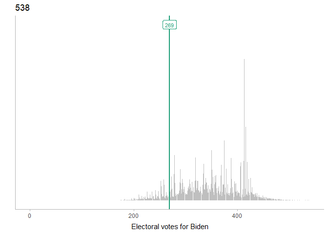
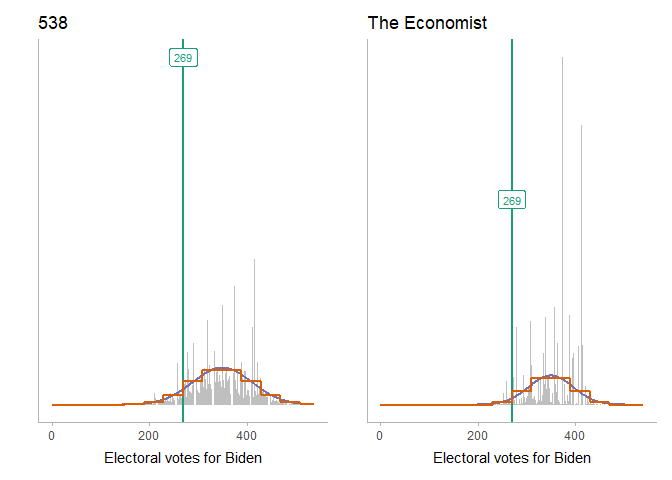
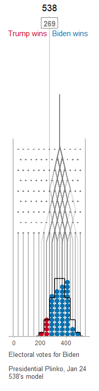
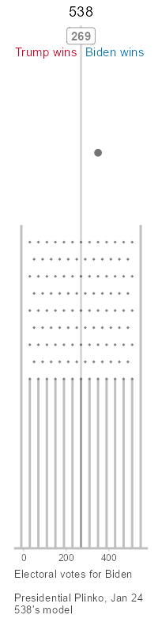
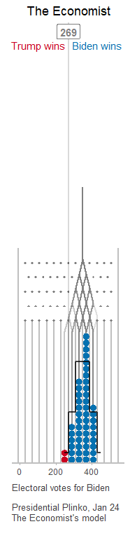

Binomial approximation to 538 and the Economist’s predictions
================
Matthew Kay

To build a Plinko board / Galton board for the Economist and 538
predictions, we need binomial distributions that can approximate the
current predictions. In this document we’ll find such distributions.

Basically, what we want is a bin width, number of bins, and a mean that
we then throw into the Plinko board simulator from
[plinko](https://mjskay.github.io/plinko/).

## Setup

``` r
library(tidyverse)
library(Hmisc)
library(ggdist)
library(ragg)
library(patchwork)
library(gganimate)
library(snakecase)
library(ggtext)
library(plinko)     # devtools::install_github("mjskay/plinko")

theme_set(theme_ggdist())
```

## Data

### 538

We’ll read in the data from 538, which can be obtained from the bottom
of [this
page](https://projects.fivethirtyeight.com/2020-election-forecast/). It
contains predicted probabilities of Trump and Biden achieving each
number of electoral votes:

``` r
df_538 = read.csv("data/538/presidential_ev_probabilities_2020.csv")
```

From this we can plot a histogram of Biden’s predicted probability of
achieving each number of electoral votes (with 270 being a majority):

``` r
col_269 = "#1b9e77"

base_plot_538 = df_538 %>%
  ggplot(aes(x = total_ev, y = evprob_chal)) +
  geom_col(fill = "gray75") +
  geom_vline(xintercept = 269, color = col_269, size = 1) +
  annotate("label", x = 269, y = .061, label = "269", color = col_269, size = 3) +
  xlab("Electoral votes for Biden") +
  scale_y_continuous(breaks = NULL) +
  ylab("") +
  xlim(-1, 540) +
  ggtitle("538")

base_plot_538
```

<!-- -->

### The Economist

We’ll also read in the data from the Economist, which can be obtained
from the bottom of [this
page](https://projects.economist.com/us-2020-forecast/president). It
contains predicted probabilities of Trump and Biden achieving each
number of electoral votes:

``` r
df_econ = read.csv("data/economist/electoral_college_simulations.csv")
```

As before, we will plot a histogram of Biden’s predicted probability of
achieving each number of electoral votes (with 270 being a majority).
We’ll also do a side-by-side comparison:

``` r
col_269 = "#1b9e77"

base_plot_econ = df_econ %>%
  ggplot(aes(x = dem_ev)) +
  geom_histogram(aes(y = stat(density)), binwidth = 1, fill = "gray75") +
  geom_vline(xintercept = 269, color = col_269, size = 1) +
  annotate("label", x = 269, y = .061, label = "269", color = col_269, size = 3) +
  xlab("Electoral votes for Biden") +
  scale_y_continuous(breaks = NULL) +
  ylab("") +
  coord_cartesian(xlim = c(0, 540)) +
  ggtitle("The Economist")

base_plot_538 + base_plot_econ
```

<!-- -->

## Normal approximation

Let’s approximate these distributions with a normal distribution by
simply using the mean and variance of the predictive distribution:

``` r
mean_ev_538 = wtd.mean(df_538$total_ev, weights = df_538$evprob_chal)
# Must multiply by number of simulations as (normally 40,000 for 538)
# as total N is used in the weighted variance calc
var_ev_538 = wtd.var(df_538$total_ev, weights = df_538$evprob_chal * df_538$simulations)
sd_ev_538 = sqrt(var_ev_538)

mean_ev_econ = mean(df_econ$dem_ev)
var_ev_econ = var(df_econ$dem_ev)
sd_ev_econ = sd(df_econ$dem_ev)
```

And plot:

``` r
col_normal = "#7570b3"

normal_plot = function(base_plot, mean_ev, sd_ev) {
  normal_density = tibble(x = 1:538, y = dnorm(x, mean_ev, sd_ev))
  
  base_plot + 
    geom_line(aes(x = x, y = y), data = normal_density, color = col_normal, size = 1)
}

normal_plot(base_plot_538, mean_ev_538, sd_ev_538) +
  normal_plot(base_plot_econ, mean_ev_econ, sd_ev_econ)
```

<!-- -->

The Normal approximation looks decent. Let’s continue down this train a
bit and use binomial approximations to the Normal by finding a binomial
distribution with the same variance and then shifting its location to
match the above Normal distribution.

## Binomial approximation

We can use the fact that the variance of a Binomial distribution with
probability 0.5 is equal to 1/4 the number of trials in the distribution
to find the number of trials needed (which is the same as the height of
the Galton board we would need to construct):

``` r
bin_n_538 = round(4 * var_ev_538)
bin_n_econ = round(4 * var_ev_econ)

cat("538 bins:\t", bin_n_538, "\nEconomist bins:\t", bin_n_econ)
```

    ## 538 bins:     17885 
    ## Economist bins:   9715

Those would be very large Galton boards\! Leaving that aside for a
moment, let’s see how well they approximates the distributions:

``` r
col_binom = "#d95f02"

binom_plot = function(base_plot, mean_ev, sd_ev, bin_n) {
  binom_mass = tibble(x = 0:538, y = dbinom(x + round(bin_n/2 - mean_ev), bin_n, 0.5))
  normal_plot(base_plot, mean_ev, sd_ev) +
    geom_step(aes(x = x, y = y), data = binom_mass, color = col_binom, direction = "mid", size = 1)
}

binom_plot(base_plot_538, mean_ev_538, sd_ev_538, bin_n_538) +
  binom_plot(base_plot_econ, mean_ev_econ, sd_ev_econ, bin_n_econ)
```

<!-- -->

The binomial distribution looks nearly identical to the Normal
distribution here. However, like I said, it would require very large
Galton boards to generate these distributions down to the single
electoral vote level. So instead, let’s use wider bins — say, bins
between 35 and 45 electoral votes wide. In fact, we’ll pick a single bin
width that we can use for both distirbutions that puts 269 as close to a
bin boundary in both as we can, given the scaling/shifting of the
distribution we will be doing:

``` r
candidate_bin_width = 35:45
candidate_bin_n_538 = round(4 * var_ev_538 / candidate_bin_width^2)
candidate_bin_n_econ = round(4 * var_ev_econ / candidate_bin_width^2)
# minimize sum of squared distance between 269 and the nearest 
# bin edge in both 538 and the economist's distribution
bin_width = candidate_bin_width[which.min(
  ((269/candidate_bin_width + candidate_bin_n_538/2 - mean_ev_538/candidate_bin_width) %% 1 - 0.5)^2 +
  ((269/candidate_bin_width + candidate_bin_n_econ/2 - mean_ev_econ/candidate_bin_width) %% 1 - 0.5)^2
)]
bin_width
```

    ## [1] 37

That gives us a bin width of 37, leading to…

``` r
bin_n_small_538 = round(4 * var_ev_538 / bin_width^2)
bin_n_small_econ = round(4 * var_ev_econ / bin_width^2)

cat("538 bins:\t", bin_n_small_538, "\nEconomist bins:\t", bin_n_small_econ)
```

    ## 538 bins:     13 
    ## Economist bins:   7

Galton boards with a much more manageable number of bins. Let’s check on
the approximations:

``` r
binom_plot_small = function(base_plot, mean_ev, sd_ev, bin_n) {
  binom_mass_small = tibble(
    x = 0:538, 
    y = dbinom(round(x/bin_width + bin_n/2 - mean_ev/bin_width), bin_n, 0.5) / bin_width
  )
  
  normal_plot(base_plot, mean_ev, sd_ev) +
    geom_step(aes(x = x, y = y), data = binom_mass_small, color = col_binom, direction = "mid", size = 1)
}

binom_plot_small(base_plot_538, mean_ev_538, sd_ev_538, bin_n_small_538) +
  binom_plot_small(base_plot_econ, mean_ev_econ, sd_ev_econ, bin_n_small_econ)
```

<!-- -->

### Fudging the mean

In case a bin boundary doesn’t line up exactly at 269, we’ll adjust the
means a little bit so that it does. Since we’ve already picked a binning
to minimize the distance between 269 and its closest bin boundary, this
shouldn’t require us to fudge the mean too much:

``` r
mean_ev_adj_538 = mean_ev_538 + ((269 + bin_n_small_538*bin_width/2 - mean_ev_538) %% bin_width - bin_width/2)
mean_ev_adj_econ = mean_ev_econ + ((269 + bin_n_small_econ*bin_width/2 - mean_ev_econ) %% bin_width - bin_width/2)

cat(sep = "",
"\t\tMean\tAdjusted mean\n538:\t\t", round(mean_ev_538, 1), "\t", 
  mean_ev_adj_538, "\nEconomist:\t", round(mean_ev_econ, 1), "\t", mean_ev_adj_econ)
```

    ##      Mean    Adjusted mean
    ## 538:     345.8   343
    ## Economist:   338.5   343

That should make a bin boundary fall on 269 without the approximation
looking too bad:

``` r
binom_plot_small(base_plot_538, mean_ev_adj_538, sd_ev_538, bin_n_small_538) +
  binom_plot_small(base_plot_econ, mean_ev_adj_econ, sd_ev_econ, bin_n_small_econ)
```

<!-- -->

## Quantiles for the dotplot

We want the distributions at the bottom of the board to be a [quantile
dotplot](https://github.com/mjskay/when-ish-is-my-bus/blob/master/quantile-dotplots.md)
so that it is representative of the predictors’ distributions. We’ll use
50 quantiles; i.e. a 50-dot dotplot:

``` r
n_ball = 50

# this is a dumb way to do this for 538 but it's good enough
ev_samples_538 = unlist(map2(df_538$total_ev, round(df_538$evprob_chal * 40000), rep))
ev_quantiles_538 = quantile(ev_samples_538, ppoints(n_ball))

ev_quantiles_econ = quantile(df_econ$dem_ev, ppoints(n_ball))
```

Since both board will be side-by-side, we will also want to override the
automatic slot height calculation in `plinko::plinko_board()` so that
both boards have slots of the same height. To do that, we need to take
the height of the highest bin across both boards and add a bit of
leeway:

``` r
ev_bins_538 = round((ev_quantiles_538 - mean_ev_adj_538)/bin_width + bin_n_small_538/2)
ev_bins_econ = round((ev_quantiles_econ - mean_ev_adj_econ)/bin_width + bin_n_small_econ/2)
max_bin_height = max(table(ev_bins_538), table(ev_bins_econ))
slot_height = (max_bin_height + 2) * bin_width * 0.9 # ball width is 0.9 * bin_width
```

## Create Plinko boards

Finally, we can construct animated Plinko boards using my experimental
[plinko](https://mjskay.github.io/plinko/) package. This package handles
finding paths through the board and generating the animation for us.

### 538

The final parameters for our approximation are:

``` r
cat(paste0(
  "bins:      ", bin_n_small_538, "\n",
  "bin width: ", bin_width, "\n",
  "mean:      ", mean_ev_adj_538, "\n"
))
```

    ## bins:      13
    ## bin width: 37
    ## mean:      343

We can test the layout before building the animation:

``` r
Biden_color = "#0571b0"
Trump_color = "#ca0020"

# dimensions we will use to override dims automatically calculated by 
# plinko_board() so that both boards have the same dimensions
total_height = 2445
width_px = 205
height_px = 800

make_plinko_board = function(model_name, ...) {
  plinko_board(..., 
    bin_width = bin_width,
    limits = c(0, 538), 
    slot_height = slot_height
  ) %>%
    tween_balls(frame_mult = 4) %>%
    modify_layer("pins", color = "gray50") %>%
    modify_layer("balls", aes(fill = ifelse(region == "slot", ifelse(x <= 269, "Trump", "Biden"), "none"))) %>%
    modify_coord(ylim = c(0, total_height), xlim = c(-45, 538 + 45)) %>%
    add_layers(
      geom_vline(xintercept = 269, color = "black", alpha = 0.15, size = 1),
      annotate("text", 
        x = 290, y = 0.95 * total_height, 
        label = "Biden wins", hjust = 0, color = Biden_color
      ),
      annotate("text", 
        x = 250, y = 0.95 * total_height,
        label = "Trump wins", hjust = 1, color = Trump_color
      ),
      annotate("label", 
        x = 269, y = 0.98 * total_height,
        label = "269", hjust = 0.5, color = "gray50",
        fontface = "bold"
      ),
      scale_fill_manual(
        limits = c("none", "Biden", "Trump"),
        values = c("gray45", Biden_color, Trump_color), 
        guide = FALSE
      ),
      theme(
        axis.title.x = element_text(hjust = 0, size = 10, color = "gray25"),
        plot.title = element_text(hjust = 0.5),
        plot.title.position = "plot"
      ),
      labs(
        x = paste0("Electoral votes for Biden\n\nPresidential Plinko, ", format(Sys.Date(), "%b %d"), "\n", 
          model_name, "'s model\n"),
        y = NULL
      ),
      ggtitle(model_name)
    )
}

set.seed(12345)
board_538 = make_plinko_board(
  model_name = "538",
  ev_quantiles_538, 
  n_bin = bin_n_small_538, 
  center = mean_ev_adj_538
)

autoplot(board_538)
```

<!-- -->

Looks good\! And the final distribution looks plausible given the
theoretical Binomial distribution. Let’s build the animation:

``` r
board_538 %>%
  animate(width = width_px, height = height_px, fps = 30, end_pause = 6 * 30)
```

<!-- -->

And save it to a file:

``` r
anim_save("boards/galton_board-538.gif")
```

We also want animations for each ball, so the website can have a “drop a
random ball” button:

``` r
make_single_ball_boards = function(model_name, ev_quantiles, ...) {
  for (i in 1:n_ball) {
    if (interactive()) cat("Building board", i, "\n")
    animation = make_plinko_board(model_name, ev_quantiles[[i]], ...) %>%
      animate(width = width_px, height = height_px, fps = 30, renderer = gganimate::gifski_renderer(loop = FALSE))
    anim_save(paste0("boards/galton_board-", to_snake_case(model_name), "-", i, ".gif"), animation)
  }
}

make_single_ball_boards(
  model_name = "538",
  ev_quantiles_538,
  n_bin = bin_n_small_538, 
  center = mean_ev_adj_538
)
```

Finally, we’ll need a blank board to show before balls are dropped:

``` r
agg_png("boards/galton_board-538-blank.png", width = width_px, height = height_px, res = 100)
board_538 %>% 
  modify_layer("balls", fill = NA) %>% 
  autoplot(show_paths = FALSE, show_dist = FALSE)
dev.off()
```

    ## quartz_off_screen 
    ##                 2

### The Economist

The final parameters for our approximation are:

``` r
cat(paste0(
  "bins:      ", bin_n_small_econ, "\n",
  "bin width: ", bin_width, "\n",
  "mean:      ", mean_ev_adj_econ, "\n"
))
```

    ## bins:      7
    ## bin width: 37
    ## mean:      343

As before, we’ll preview the layout first:

``` r
set.seed(12345)
board_econ = make_plinko_board(
  model_name = "The Economist",
  ev_quantiles_econ, 
  n_bin = bin_n_small_econ, 
  center = mean_ev_adj_econ
)

autoplot(board_econ)
```

<!-- -->

And then let’s build the animation:

``` r
# because the 538 board is taller we need to add a few extra frames to the pause
# of the Economist's board so they loop at the same time
extra_frames = n_frames(board_538) - n_frames(board_econ)

board_econ %>%
  animate(width = width_px, height = height_px, fps = 30, end_pause = 6 * 30 + extra_frames)
```

<!-- -->

And save it to a file:

``` r
anim_save("boards/galton_board-the_economist.gif")
```

We also want animations for each ball, so the website can have a “drop a
random ball” button:

``` r
make_single_ball_boards(
  model_name = "The Economist",
  ev_quantiles_econ,
  n_bin = bin_n_small_econ, 
  center = mean_ev_adj_econ
)
```

Finally, we’ll need a blank board to show before balls are dropped:

``` r
agg_png("boards/galton_board-the_economist-blank.png", width = width_px, height = height_px, res = 100)
board_econ %>% 
  modify_layer("balls", fill = NA) %>% 
  autoplot(show_paths = FALSE, show_dist = FALSE)
dev.off()
```

    ## quartz_off_screen 
    ##                 2

## Explainer

Finally, we’ll create a static explainer plot.

``` r
mean_color = "#7570b3"
var_color = "#d95f02"
height_color = "#1b9e77"
arrow_ = arrow(length = unit(6, "points"), type = "closed")
annotate_segment_ = function(...) annotate("segment", size = 1, linejoin = "mitre", ...)
annotate_richtext_ = function(...) annotate("richtext", 
  hjust = 0, label.color = NA, label.padding = unit(c(0, 0, 0, 0), "lines"), ...
)

pin_bottom = min(pins(board_econ)$y)
pin_top = max(pins(board_econ)$y)
spread_min = mean_ev_adj_econ - bin_width * bin_n_small_econ/2
spread_max = mean_ev_adj_econ + bin_width * bin_n_small_econ/2
spread_y = pin_bottom + 25
last_ball = balls(board_econ) %>% filter(x == max(x), y == min(y))

board_econ %>%
  modify_coord(xlim = c(-45, 650*2)) %>%
  autoplot(show_dist = FALSE) +
  annotate_richtext_(
    x = mean_ev_adj_econ, y = board_econ$total_height + 100, 
    label = paste0(
      "Balls are dropped at the<br>point corresponding to the<br>",
      "<strong style='color:", mean_color, ";'>average number of electoral<br>",
      "votes</strong> (EVs) predicted for Biden."
    ),
    vjust = 0
  ) +
  annotate_segment_(
    x = mean_ev_adj_econ, y = board_econ$total_height + 100 - 15, 
    xend = mean_ev_adj_econ, yend = board_econ$total_height - 75,
    arrow = arrow_, color = mean_color
  ) +
  annotate_segment_(
    x = 600, y = pin_bottom,
    xend = 600, yend = pin_top,
    color = height_color
  ) +
  annotate_segment_(
    x = 600 - 25, y = c(pin_top, pin_bottom),
    xend = 600 + 25, yend = c(pin_top, pin_bottom),
    color = height_color
  ) +
  annotate_richtext_(
    x = 650, y = pin_top,
    label = paste0(
      "The <strong style='color:", height_color, ";'>height of the board</strong><br>",
      "is chosen so that the<br>",
      "<strong style='color:", var_color, ";'>spread</strong> of the balls after<br>",
      "falling through the board<br>",
      "matches the forecaster's<br>",
      "uncertainty in how many<br>",
      "EVs Biden will get.<br><br>"
    ),
    vjust = 1
  ) +
  annotate_segment_(
    x = spread_min, y = spread_y,
    xend = spread_max, yend = spread_y,
    color = var_color,
  ) +
  annotate_segment_(
    x = c(spread_min, spread_max), y = spread_y - 25,
    xend = c(spread_min, spread_max), yend = spread_y + 25,
    color = var_color
  ) +
  annotate_richtext_(
    x = 650, y = 0,
    label = paste0(
      "Each ball is <strong>one possible<br>",
      "outcome</strong> of the election.<br><br>",
      "When a ball lands above 269,<br>",
      "<strong style='color:", Biden_color, "';>Biden wins.</strong> Below 269,<br>",
      "<strong style='color:", Trump_color, "';>Trump wins.</strong> The proportion<br>",
      "of balls above 269 shows<br>",
      "Biden's chance of winning."
    ),
    vjust = 0
  ) +
  ggtitle("How does Presidential Plinko work?") +
  scale_x_continuous(breaks = c(0, 200, 400)) +
  annotate("segment", x = -50, y = 0, xend = 538 + 50, yend = 0, size = 1, color = "gray75") +
  theme(
    axis.line.x = element_blank(),
    plot.title = element_text(hjust = 0)
  )
```

<!-- -->
