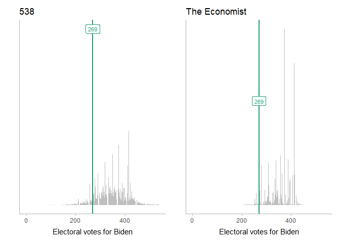
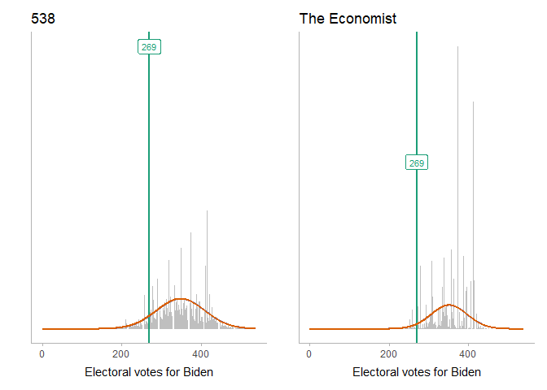

Binomial approximation to the Economist’s prediction
================
Matthew Kay

To build a Galton board for the Economist and 538 predictions, we need
binomial distributions that can approximate the current prediction.s In
this document we’ll find such distributions.

Basically, what we want is a bin width, number of bins, and a mean that
we then throw into the Galton board renderer in
[galton\_board\_quantile\_ragg.Rmd](galton_board_quantile_ragg.Rmd).

## Setup

``` r
library(tidyverse)
library(Hmisc)
library(ggdist)
library(ragg)
library(patchwork)
library(gganimate)
library(snakecase)
library(plinko)     # devtools::install_github("mjskay/plinko")

theme_set(theme_ggdist())
```

## Data

### 538

We’ll read in the data from 538, which can be obtained from the bottom
of [this
page](https://projects.fivethirtyeight.com/2020-election-forecast/). It
contains predicted probabilities of Trump and Biden achieving each
number of electoral votes:

``` r
df_538 = read.csv("data/538/presidential_ev_probabilities_2020.csv")
```

From this we can plot a histogram of Biden’s predicted probability of
achieving each number of electoral votes (with 270 being a majority):

``` r
col_269 = "#1b9e77"

base_plot_538 = df_538 %>%
  ggplot(aes(x = total_ev, y = evprob_chal)) +
  geom_col(fill = "gray75") +
  geom_vline(xintercept = 269, color = col_269, size = 1) +
  annotate("label", x = 269, y = .061, label = "269", color = col_269, size = 3) +
  xlab("Electoral votes for Biden") +
  scale_y_continuous(breaks = NULL) +
  ylab("") +
  xlim(-1, 540) +
  ggtitle("538")

base_plot_538
```

<!-- -->

### The Economist

We’ll also read in the data from the Economist, which can be obtained
from the bottom of [this
page](https://projects.economist.com/us-2020-forecast/president). It
contains predicted probabilities of Trump and Biden achieving each
number of electoral votes:

``` r
df_econ = read.csv("data/economist/electoral_college_simulations.csv")
```

As before, we will plot a histogram of Biden’s predicted probability of
achieving each number of electoral votes (with 270 being a majority).
We’ll also do a side-by-side comparison:

``` r
col_269 = "#1b9e77"

base_plot_econ = df_econ %>%
  ggplot(aes(x = dem_ev)) +
  geom_histogram(aes(y = stat(density)), binwidth = 1, fill = "gray75") +
  geom_vline(xintercept = 269, color = col_269, size = 1) +
  annotate("label", x = 269, y = .061, label = "269", color = col_269, size = 3) +
  xlab("Electoral votes for Biden") +
  scale_y_continuous(breaks = NULL) +
  ylab("") +
  coord_cartesian(xlim = c(0, 540)) +
  ggtitle("The Economist")

base_plot_538 + base_plot_econ
```

<!-- -->

## Normal approximation

Let’s approximate these distributions with a normal distribution by
simply using the mean and variance of the predictive distribution:

``` r
mean_ev_538 = wtd.mean(df_538$total_ev, weights = df_538$evprob_chal)
# Must multiply by number of simulations as (normally 40,000 for 538)
# as total N is used in the weighted variance calc
var_ev_538 = wtd.var(df_538$total_ev, weights = df_538$evprob_chal * df_538$simulations)
sd_ev_538 = sqrt(var_ev_538)

mean_ev_econ = mean(df_econ$dem_ev)
var_ev_econ = var(df_econ$dem_ev)
sd_ev_econ = sd(df_econ$dem_ev)
```

And plot:

``` r
col_normal = "#7570b3"

normal_plot = function(base_plot, mean_ev, sd_ev) {
  normal_density = tibble(x = 1:538, y = dnorm(x, mean_ev, sd_ev))
  
  base_plot + 
    geom_line(aes(x = x, y = y), data = normal_density, color = col_normal, size = 1)
}

normal_plot(base_plot_538, mean_ev_538, sd_ev_538) +
  normal_plot(base_plot_econ, mean_ev_econ, sd_ev_econ)
```

<!-- -->

The Normal approximation looks decent. Let’s continue down this train a
bit and use binomial approximations to the Normal by finding a binomial
distribution with the same variance and then shifting its location to
match the above Normal distribution.

## Binomial approximation

We can use the fact that the variance of a Binomial distribution with
probability 0.5 is equal to 1/4 the number of trials in the distribution
to find the number of trials needed (which is the same as the height of
the Galton board we would need to construct):

``` r
bin_n_538 = round(4 * var_ev_538)
bin_n_econ = round(4 * var_ev_econ)

cat("538 bins:\t", bin_n_538, "\nEconomist bins:\t", bin_n_econ)
```

    ## 538 bins:     20473 
    ## Economist bins:   9965

Those would be very large Galton boards\! Leaving that aside for a
moment, let’s see how well they approximates the distributions:

``` r
col_binom = "#d95f02"

binom_plot = function(base_plot, mean_ev, sd_ev, bin_n) {
  binom_mass = tibble(x = 0:538, y = dbinom(x + round(bin_n/2 - mean_ev), bin_n, 0.5))
  normal_plot(base_plot, mean_ev, sd_ev) +
    geom_step(aes(x = x, y = y), data = binom_mass, color = col_binom, direction = "mid", size = 1)
}

binom_plot(base_plot_538, mean_ev_538, sd_ev_538, bin_n_538) +
  binom_plot(base_plot_econ, mean_ev_econ, sd_ev_econ, bin_n_econ)
```

<!-- -->

The binomial distribution looks nearly identical to the Normal
distribution here. However, like I said, it would require very large
Galton boards to generate these distributions down to the single
electoral vote level. So instead, let’s use wider bins — say, bins
between 35 and 45 electoral votes wide. In fact, we’ll pick a single bin
width that we can use for both distirbutions that puts 269 as close to a
bin boundary in both as we can, given the scaling/shifting of the
distribution we will be doing:

``` r
candidate_bin_width = 35:45
candidate_bin_n_538 = round(4 * var_ev_538 / candidate_bin_width^2)
candidate_bin_n_econ = round(4 * var_ev_econ / candidate_bin_width^2)
# minimize sum of squared distance between 269 and the nearest 
# bin edge in both 538 and the economist's distribution
bin_width = candidate_bin_width[which.min(
  ((269/candidate_bin_width + candidate_bin_n_538/2 - mean_ev_538/candidate_bin_width) %% 1 - 0.5)^2 +
  ((269/candidate_bin_width + candidate_bin_n_econ/2 - mean_ev_econ/candidate_bin_width) %% 1 - 0.5)^2
)]
bin_width
```

    ## [1] 42

That gives us a bin width of 42, leading to…

``` r
bin_n_small_538 = round(4 * var_ev_538 / bin_width^2)
bin_n_small_econ = round(4 * var_ev_econ / bin_width^2)

cat("538 bins:\t", bin_n_small_538, "\nEconomist bins:\t", bin_n_small_econ)
```

    ## 538 bins:     12 
    ## Economist bins:   6

Galton boards with a much more manageable number of bins. Let’s check on
the approximations:

``` r
binom_plot_small = function(base_plot, mean_ev, sd_ev, bin_n) {
  binom_mass_small = tibble(
    x = 0:538, 
    y = dbinom(round(x/bin_width + bin_n/2 - mean_ev/bin_width), bin_n, 0.5) / bin_width
  )
  
  normal_plot(base_plot, mean_ev, sd_ev) +
    geom_step(aes(x = x, y = y), data = binom_mass_small, color = col_binom, direction = "mid", size = 1)
}

binom_plot_small(base_plot_538, mean_ev_538, sd_ev_538, bin_n_small_538) +
  binom_plot_small(base_plot_econ, mean_ev_econ, sd_ev_econ, bin_n_small_econ)
```

<!-- -->

### Fudging the mean

In case a bin boundary doesn’t line up exactly at 269, we’ll adjust the
means a little bit so that it does. Since we’ve already picked a binning
to minimize the distance between 269 and its closest bin boundary, this
shouldn’t require us to fudge the mean too much:

``` r
mean_ev_adj_538 = mean_ev_538 + ((269 + bin_n_small_538*bin_width/2 - mean_ev_538) %% bin_width - bin_width/2)
mean_ev_adj_econ = mean_ev_econ + ((269 + bin_n_small_econ*bin_width/2 - mean_ev_econ) %% bin_width - bin_width/2)

cat(sep = "",
"\t\tMean\tAdjusted mean\n538:\t\t", round(mean_ev_538, 1), "\t", 
  mean_ev_adj_538, "\nEconomist:\t", round(mean_ev_econ, 1), "\t", mean_ev_adj_econ)
```

    ##      Mean    Adjusted mean
    ## 538:     335.8   332
    ## Economist:   335.8   332

That should make a bin boundary fall on 269 without the approximation
looking too bad:

``` r
binom_plot_small(base_plot_538, mean_ev_adj_538, sd_ev_538, bin_n_small_538) +
  binom_plot_small(base_plot_econ, mean_ev_adj_econ, sd_ev_econ, bin_n_small_econ)
```

<!-- -->

## Quantiles for the dotplot

We want the distributions at the bottom of the board to be a [quantile
dotplot](https://github.com/mjskay/when-ish-is-my-bus/blob/master/quantile-dotplots.md)
so that it is representative of the predictors’ distributions. We’ll use
50 quantiles; i.e. a 50-dot dotplot:

``` r
n_ball = 50

# this is a dumb way to do this for 538 but it's good enough
ev_samples_538 = unlist(map2(df_538$total_ev, round(df_538$evprob_chal * 40000), rep))
ev_quantiles_538 = quantile(ev_samples_538, ppoints(n_ball))

ev_quantiles_econ = quantile(df_econ$dem_ev, ppoints(n_ball))
```

Since both board will be side-by-side, we will also want to override the
automatic slot height calculation in `plinko_board()` so that both
boards have slots of the same height. To do that, we need to take the
height of the highest bin across both boards and add a bit of leeway:

``` r
ev_bins_538 = round((ev_quantiles_538 - mean_ev_adj_538)/bin_width + bin_n_small_538/2)
ev_bins_econ = round((ev_quantiles_econ - mean_ev_adj_econ)/bin_width + bin_n_small_econ/2)
max_bin_height = max(table(ev_bins_538), table(ev_bins_econ))
slot_height = (max_bin_height + 2) * bin_width * 0.9 # ball width is 0.9 * bin_width
```

## Create Plinko boards

Finally, we can construct animated Plinko boards using my experimental
[plinko](https://mjskay.github.io/plinko/) package. This package handles
finding paths through the board and generating the animation for us.

### 538

The final parameters for our approximation are:

``` r
cat(paste0(
  "bins:      ", bin_n_small_538, "\n",
  "bin width: ", bin_width, "\n",
  "mean:      ", mean_ev_adj_538, "\n"
))
```

    ## bins:      12
    ## bin width: 42
    ## mean:      332

We can test the layout before building the animation:

``` r
Biden_color = "#0571b0"
Trump_color = "#ca0020"

# dimensions we will use to override dims automatically calculated by 
# plinko_board() so that both boards have the same dimensions
total_height = 2445
width_px = 205
height_px = 800

make_plinko_board = function(model_name, ...) {
  plinko_board(..., 
    bin_width = bin_width,
    limits = c(0, 538), 
    slot_height = slot_height
  ) %>%
    tween_balls(frame_mult = 4) %>%
    modify_layer("pins", color = "gray50") %>%
    modify_layer("balls", aes(fill = ifelse(region == "slot", ifelse(x <= 269, "Trump", "Biden"), "none"))) %>%
    modify_coord(ylim = c(0, total_height), xlim = c(-45, 538 + 45)) %>%
    add_layers(
      geom_vline(xintercept = 269, color = "black", alpha = 0.15, size = 1),
      annotate("text", 
        x = 290, y = 0.95 * total_height, 
        label = "Biden wins", hjust = 0, color = Biden_color
      ),
      annotate("text", 
        x = 250, y = 0.95 * total_height,
        label = "Trump wins", hjust = 1, color = Trump_color
      ),
      annotate("label", 
        x = 269, y = 0.98 * total_height,
        label = "269", hjust = 0.5, color = "gray50",
        fontface = "bold"
      ),
      scale_fill_manual(
        limits = c("none", "Biden", "Trump"),
        values = c("gray45", Biden_color, Trump_color), 
        guide = FALSE
      ),
      theme(
        axis.title.x = element_text(hjust = 0, size = 10, color = "gray25"),
        plot.title = element_text(hjust = 0.5),
        plot.title.position = "plot"
      ),
      labs(
        x = paste0("Electoral votes for Biden\n\nPresidential Plinko, ", format(Sys.Date(), "%b %d"), "\n", 
          model_name, "'s model\n"),
        y = NULL
      ),
      ggtitle(model_name)
    )
}

set.seed(12345)
board_538 = make_plinko_board(
  model_name = "538",
  ev_quantiles_538, 
  n_bin = bin_n_small_538, 
  center = mean_ev_adj_538
)

autoplot(board_538)
```

<!-- -->

Looks good\! And the final distribution looks plausible given the
theoretical Binomial distribution. Let’s build the animation:

``` r
board_538 %>%
  animate(width = width_px, height = height_px, fps = 30, end_pause = 6 * 30)
```

    ## Rendering frames...
    ##   |                                                                                             |                                                                                     |   0%

    ##   |                                                                                             |                                                                                     |   1%

    ##   |                                                                                             |=                                                                                    |   1%

    ##   |                                                                                             |=                                                                                    |   2%

    ##   |                                                                                             |==                                                                                   |   2%

    ##   |                                                                                             |==                                                                                   |   3%

    ##   |                                                                                             |===                                                                                  |   3%

    ##   |                                                                                             |===                                                                                  |   4%

    ##   |                                                                                             |====                                                                                 |   4%

    ##   |                                                                                             |====                                                                                 |   5%

    ##   |                                                                                             |=====                                                                                |   5%

    ##   |                                                                                             |=====                                                                                |   6%

    ##   |                                                                                             |======                                                                               |   7%

    ##   |                                                                                             |======                                                                               |   8%

    ##   |                                                                                             |=======                                                                              |   8%

    ##   |                                                                                             |=======                                                                              |   9%

    ##   |                                                                                             |========                                                                             |   9%

    ##   |                                                                                             |========                                                                             |  10%

    ##   |                                                                                             |=========                                                                            |  10%

    ##   |                                                                                             |=========                                                                            |  11%

    ##   |                                                                                             |==========                                                                           |  11%

    ##   |                                                                                             |==========                                                                           |  12%

    ##   |                                                                                             |===========                                                                          |  12%

    ##   |                                                                                             |===========                                                                          |  13%

    ##   |                                                                                             |============                                                                         |  14%

    ##   |                                                                                             |============                                                                         |  15%

    ##   |                                                                                             |=============                                                                        |  15%

    ##   |                                                                                             |=============                                                                        |  16%

    ##   |                                                                                             |==============                                                                       |  16%

    ##   |                                                                                             |==============                                                                       |  17%

    ##   |                                                                                             |===============                                                                      |  17%

    ##   |                                                                                             |===============                                                                      |  18%

    ##   |                                                                                             |================                                                                     |  18%

    ##   |                                                                                             |================                                                                     |  19%

    ##   |                                                                                             |=================                                                                    |  19%

    ##   |                                                                                             |=================                                                                    |  20%

    ##   |                                                                                             |=================                                                                    |  21%

    ##   |                                                                                             |==================                                                                   |  21%

    ##   |                                                                                             |==================                                                                   |  22%

    ##   |                                                                                             |===================                                                                  |  22%

    ##   |                                                                                             |===================                                                                  |  23%

    ##   |                                                                                             |====================                                                                 |  23%

    ##   |                                                                                             |====================                                                                 |  24%

    ##   |                                                                                             |=====================                                                                |  24%

    ##   |                                                                                             |=====================                                                                |  25%

    ##   |                                                                                             |======================                                                               |  25%

    ##   |                                                                                             |======================                                                               |  26%

    ##   |                                                                                             |=======================                                                              |  27%

    ##   |                                                                                             |=======================                                                              |  28%

    ##   |                                                                                             |========================                                                             |  28%

    ##   |                                                                                             |========================                                                             |  29%

    ##   |                                                                                             |=========================                                                            |  29%

    ##   |                                                                                             |=========================                                                            |  30%

    ##   |                                                                                             |==========================                                                           |  30%

    ##   |                                                                                             |==========================                                                           |  31%

    ##   |                                                                                             |===========================                                                          |  31%

    ##   |                                                                                             |===========================                                                          |  32%

    ##   |                                                                                             |============================                                                         |  32%

    ##   |                                                                                             |============================                                                         |  33%

    ##   |                                                                                             |=============================                                                        |  34%

    ##   |                                                                                             |=============================                                                        |  35%

    ##   |                                                                                             |==============================                                                       |  35%

    ##   |                                                                                             |==============================                                                       |  36%

    ##   |                                                                                             |===============================                                                      |  36%

    ##   |                                                                                             |===============================                                                      |  37%

    ##   |                                                                                             |================================                                                     |  37%

    ##   |                                                                                             |================================                                                     |  38%

    ##   |                                                                                             |=================================                                                    |  38%

    ##   |                                                                                             |=================================                                                    |  39%

    ##   |                                                                                             |==================================                                                   |  39%

    ##   |                                                                                             |==================================                                                   |  40%

    ##   |                                                                                             |==================================                                                   |  41%

    ##   |                                                                                             |===================================                                                  |  41%

    ##   |                                                                                             |===================================                                                  |  42%

    ##   |                                                                                             |====================================                                                 |  42%

    ##   |                                                                                             |====================================                                                 |  43%

    ##   |                                                                                             |=====================================                                                |  43%

    ##   |                                                                                             |=====================================                                                |  44%

    ##   |                                                                                             |======================================                                               |  44%

    ##   |                                                                                             |======================================                                               |  45%

    ##   |                                                                                             |=======================================                                              |  45%

    ##   |                                                                                             |=======================================                                              |  46%

    ##   |                                                                                             |========================================                                             |  46%

    ##   |                                                                                             |========================================                                             |  47%

    ##   |                                                                                             |========================================                                             |  48%

    ##   |                                                                                             |=========================================                                            |  48%

    ##   |                                                                                             |=========================================                                            |  49%

    ##   |                                                                                             |==========================================                                           |  49%

    ##   |                                                                                             |==========================================                                           |  50%

    ##   |                                                                                             |===========================================                                          |  50%

    ##   |                                                                                             |===========================================                                          |  51%

    ##   |                                                                                             |============================================                                         |  51%

    ##   |                                                                                             |============================================                                         |  52%

    ##   |                                                                                             |=============================================                                        |  52%

    ##   |                                                                                             |=============================================                                        |  53%

    ##   |                                                                                             |=============================================                                        |  54%

    ##   |                                                                                             |==============================================                                       |  54%

    ##   |                                                                                             |==============================================                                       |  55%

    ##   |                                                                                             |===============================================                                      |  55%

    ##   |                                                                                             |===============================================                                      |  56%

    ##   |                                                                                             |================================================                                     |  56%

    ##   |                                                                                             |================================================                                     |  57%

    ##   |                                                                                             |=================================================                                    |  57%

    ##   |                                                                                             |=================================================                                    |  58%

    ##   |                                                                                             |==================================================                                   |  58%

    ##   |                                                                                             |==================================================                                   |  59%

    ##   |                                                                                             |===================================================                                  |  59%

    ##   |                                                                                             |===================================================                                  |  60%

    ##   |                                                                                             |===================================================                                  |  61%

    ##   |                                                                                             |====================================================                                 |  61%

    ##   |                                                                                             |====================================================                                 |  62%

    ##   |                                                                                             |=====================================================                                |  62%

    ##   |                                                                                             |=====================================================                                |  63%

    ##   |                                                                                             |======================================================                               |  63%

    ##   |                                                                                             |======================================================                               |  64%

    ##   |                                                                                             |=======================================================                              |  64%

    ##   |                                                                                             |=======================================================                              |  65%

    ##   |                                                                                             |========================================================                             |  65%

    ##   |                                                                                             |========================================================                             |  66%

    ##   |                                                                                             |=========================================================                            |  67%

    ##   |                                                                                             |=========================================================                            |  68%

    ##   |                                                                                             |==========================================================                           |  68%

    ##   |                                                                                             |==========================================================                           |  69%

    ##   |                                                                                             |===========================================================                          |  69%

    ##   |                                                                                             |===========================================================                          |  70%

    ##   |                                                                                             |============================================================                         |  70%

    ##   |                                                                                             |============================================================                         |  71%

    ##   |                                                                                             |=============================================================                        |  71%

    ##   |                                                                                             |=============================================================                        |  72%

    ##   |                                                                                             |==============================================================                       |  72%

    ##   |                                                                                             |==============================================================                       |  73%

    ##   |                                                                                             |===============================================================                      |  74%

    ##   |                                                                                             |===============================================================                      |  75%

    ##   |                                                                                             |================================================================                     |  75%

    ##   |                                                                                             |================================================================                     |  76%

    ##   |                                                                                             |=================================================================                    |  76%

    ##   |                                                                                             |=================================================================                    |  77%

    ##   |                                                                                             |==================================================================                   |  77%

    ##   |                                                                                             |==================================================================                   |  78%

    ##   |                                                                                             |===================================================================                  |  78%

    ##   |                                                                                             |===================================================================                  |  79%

    ##   |                                                                                             |====================================================================                 |  79%

    ##   |                                                                                             |====================================================================                 |  80%

    ##   |                                                                                             |====================================================================                 |  81%

    ##   |                                                                                             |=====================================================================                |  81%

    ##   |                                                                                             |=====================================================================                |  82%

    ##   |                                                                                             |======================================================================               |  82%

    ##   |                                                                                             |======================================================================               |  83%

    ##   |                                                                                             |=======================================================================              |  83%

    ##   |                                                                                             |=======================================================================              |  84%

    ##   |                                                                                             |========================================================================             |  84%

    ##   |                                                                                             |========================================================================             |  85%

    ##   |                                                                                             |=========================================================================            |  85%

    ##   |                                                                                             |=========================================================================            |  86%

    ##   |                                                                                             |==========================================================================           |  87%

    ##   |                                                                                             |==========================================================================           |  88%

    ##   |                                                                                             |===========================================================================          |  88%

    ##   |                                                                                             |===========================================================================          |  89%

    ##   |                                                                                             |============================================================================         |  89%

    ##   |                                                                                             |============================================================================         |  90%

    ##   |                                                                                             |=============================================================================        |  90%

    ##   |                                                                                             |=============================================================================        |  91%

    ##   |                                                                                             |==============================================================================       |  91%

    ##   |                                                                                             |==============================================================================       |  92%

    ##   |                                                                                             |===============================================================================      |  92%

    ##   |                                                                                             |===============================================================================      |  93%

    ##   |                                                                                             |================================================================================     |  94%

    ##   |                                                                                             |================================================================================     |  95%

    ##   |                                                                                             |=================================================================================    |  95%

    ##   |                                                                                             |=================================================================================    |  96%

    ##   |                                                                                             |==================================================================================   |  96%

    ##   |                                                                                             |==================================================================================   |  97%

    ##   |                                                                                             |===================================================================================  |  97%

    ##   |                                                                                             |===================================================================================  |  98%

    ##   |                                                                                             |==================================================================================== |  98%

    ##   |                                                                                             |==================================================================================== |  99%

    ##   |                                                                                             |=====================================================================================|  99%

    ##   |                                                                                             |=====================================================================================| 100%

    ## 

    ## Frame 1 (0%)Frame 2 (0%)Frame 3 (0%)Frame 4 (0%)Frame 5 (0%)Frame 6 (0%)Frame 7 (0%)Frame 8 (0%)Frame 9 (0%)Frame 10 (0%)Frame 11 (1%)Frame 12 (1%)Frame 13 (1%)Frame 14 (1%)Frame 15 (1%)Frame 16 (1%)Frame 17 (1%)Frame 18 (1%)Frame 19 (1%)Frame 20 (1%)Frame 21 (2%)Frame 22 (2%)Frame 23 (2%)Frame 24 (2%)Frame 25 (2%)Frame 26 (2%)Frame 27 (2%)Frame 28 (2%)Frame 29 (2%)Frame 30 (2%)Frame 31 (3%)Frame 32 (3%)Frame 33 (3%)Frame 34 (3%)Frame 35 (3%)Frame 36 (3%)Frame 37 (3%)Frame 38 (3%)Frame 39 (3%)Frame 40 (3%)Frame 41 (4%)Frame 42 (4%)Frame 43 (4%)Frame 44 (4%)Frame 45 (4%)Frame 46 (4%)Frame 47 (4%)Frame 48 (4%)Frame 49 (4%)Frame 50 (4%)Frame 51 (4%)Frame 52 (5%)Frame 53 (5%)Frame 54 (5%)Frame 55 (5%)Frame 56 (5%)Frame 57 (5%)Frame 58 (5%)Frame 59 (5%)Frame 60 (5%)Frame 61 (5%)Frame 62 (6%)Frame 63 (6%)Frame 64 (6%)Frame 65 (6%)Frame 66 (6%)Frame 67 (6%)Frame 68 (6%)Frame 69 (6%)Frame 70 (6%)Frame 71 (6%)Frame 72 (7%)Frame 73 (7%)Frame 74 (7%)Frame 75 (7%)Frame 76 (7%)Frame 77 (7%)Frame 78 (7%)Frame 79 (7%)Frame 80 (7%)Frame 81 (7%)Frame 82 (8%)Frame 83 (8%)Frame 84 (8%)Frame 85 (8%)Frame 86 (8%)Frame 87 (8%)Frame 88 (8%)Frame 89 (8%)Frame 90 (8%)Frame 91 (8%)Frame 92 (8%)Frame 93 (9%)Frame 94 (9%)Frame 95 (9%)Frame 96 (9%)Frame 97 (9%)Frame 98 (9%)Frame 99 (9%)Frame 100 (9%)Frame 101 (9%)Frame 102 (9%)Frame 103 (10%)Frame 104 (10%)Frame 105 (10%)Frame 106 (10%)Frame 107 (10%)Frame 108 (10%)Frame 109 (10%)Frame 110 (10%)Frame 111 (10%)Frame 112 (10%)Frame 113 (11%)Frame 114 (11%)Frame 115 (11%)Frame 116 (11%)Frame 117 (11%)Frame 118 (11%)Frame 119 (11%)Frame 120 (11%)Frame 121 (11%)Frame 122 (11%)Frame 123 (12%)Frame 124 (12%)Frame 125 (12%)Frame 126 (12%)Frame 127 (12%)Frame 128 (12%)Frame 129 (12%)Frame 130 (12%)Frame 131 (12%)Frame 132 (12%)Frame 133 (12%)Frame 134 (13%)Frame 135 (13%)Frame 136 (13%)Frame 137 (13%)Frame 138 (13%)Frame 139 (13%)Frame 140 (13%)Frame 141 (13%)Frame 142 (13%)Frame 143 (13%)Frame 144 (14%)Frame 145 (14%)Frame 146 (14%)Frame 147 (14%)Frame 148 (14%)Frame 149 (14%)Frame 150 (14%)Frame 151 (14%)Frame 152 (14%)Frame 153 (14%)Frame 154 (15%)Frame 155 (15%)Frame 156 (15%)Frame 157 (15%)Frame 158 (15%)Frame 159 (15%)Frame 160 (15%)Frame 161 (15%)Frame 162 (15%)Frame 163 (15%)Frame 164 (16%)Frame 165 (16%)Frame 166 (16%)Frame 167 (16%)Frame 168 (16%)Frame 169 (16%)Frame 170 (16%)Frame 171 (16%)Frame 172 (16%)Frame 173 (16%)Frame 174 (16%)Frame 175 (17%)Frame 176 (17%)Frame 177 (17%)Frame 178 (17%)Frame 179 (17%)Frame 180 (17%)Frame 181 (17%)Frame 182 (17%)Frame 183 (17%)Frame 184 (17%)Frame 185 (18%)Frame 186 (18%)Frame 187 (18%)Frame 188 (18%)Frame 189 (18%)Frame 190 (18%)Frame 191 (18%)Frame 192 (18%)Frame 193 (18%)Frame 194 (18%)Frame 195 (19%)Frame 196 (19%)Frame 197 (19%)Frame 198 (19%)Frame 199 (19%)Frame 200 (19%)Frame 201 (19%)Frame 202 (19%)Frame 203 (19%)Frame 204 (19%)Frame 205 (20%)Frame 206 (20%)Frame 207 (20%)Frame 208 (20%)Frame 209 (20%)Frame 210 (20%)Frame 211 (20%)Frame 212 (20%)Frame 213 (20%)Frame 214 (20%)Frame 215 (20%)Frame 216 (21%)Frame 217 (21%)Frame 218 (21%)Frame 219 (21%)Frame 220 (21%)Frame 221 (21%)Frame 222 (21%)Frame 223 (21%)Frame 224 (21%)Frame 225 (21%)Frame 226 (22%)Frame 227 (22%)Frame 228 (22%)Frame 229 (22%)Frame 230 (22%)Frame 231 (22%)Frame 232 (22%)Frame 233 (22%)Frame 234 (22%)Frame 235 (22%)Frame 236 (23%)Frame 237 (23%)Frame 238 (23%)Frame 239 (23%)Frame 240 (23%)Frame 241 (23%)Frame 242 (23%)Frame 243 (23%)Frame 244 (23%)Frame 245 (23%)Frame 246 (24%)Frame 247 (24%)Frame 248 (24%)Frame 249 (24%)Frame 250 (24%)Frame 251 (24%)Frame 252 (24%)Frame 253 (24%)Frame 254 (24%)Frame 255 (24%)Frame 256 (25%)Frame 257 (25%)Frame 258 (25%)Frame 259 (25%)Frame 260 (25%)Frame 261 (25%)Frame 262 (25%)Frame 263 (25%)Frame 264 (25%)Frame 265 (25%)Frame 266 (25%)Frame 267 (26%)Frame 268 (26%)Frame 269 (26%)Frame 270 (26%)Frame 271 (26%)Frame 272 (26%)Frame 273 (26%)Frame 274 (26%)Frame 275 (26%)Frame 276 (26%)Frame 277 (27%)Frame 278 (27%)Frame 279 (27%)Frame 280 (27%)Frame 281 (27%)Frame 282 (27%)Frame 283 (27%)Frame 284 (27%)Frame 285 (27%)Frame 286 (27%)Frame 287 (28%)Frame 288 (28%)Frame 289 (28%)Frame 290 (28%)Frame 291 (28%)Frame 292 (28%)Frame 293 (28%)Frame 294 (28%)Frame 295 (28%)Frame 296 (28%)Frame 297 (29%)Frame 298 (29%)Frame 299 (29%)Frame 300 (29%)Frame 301 (29%)Frame 302 (29%)Frame 303 (29%)Frame 304 (29%)Frame 305 (29%)Frame 306 (29%)Frame 307 (29%)Frame 308 (30%)Frame 309 (30%)Frame 310 (30%)Frame 311 (30%)Frame 312 (30%)Frame 313 (30%)Frame 314 (30%)Frame 315 (30%)Frame 316 (30%)Frame 317 (30%)Frame 318 (31%)Frame 319 (31%)Frame 320 (31%)Frame 321 (31%)Frame 322 (31%)Frame 323 (31%)Frame 324 (31%)Frame 325 (31%)Frame 326 (31%)Frame 327 (31%)Frame 328 (32%)Frame 329 (32%)Frame 330 (32%)Frame 331 (32%)Frame 332 (32%)Frame 333 (32%)Frame 334 (32%)Frame 335 (32%)Frame 336 (32%)Frame 337 (32%)Frame 338 (33%)Frame 339 (33%)Frame 340 (33%)Frame 341 (33%)Frame 342 (33%)Frame 343 (33%)Frame 344 (33%)Frame 345 (33%)Frame 346 (33%)Frame 347 (33%)Frame 348 (33%)Frame 349 (34%)Frame 350 (34%)Frame 351 (34%)Frame 352 (34%)Frame 353 (34%)Frame 354 (34%)Frame 355 (34%)Frame 356 (34%)Frame 357 (34%)Frame 358 (34%)Frame 359 (35%)Frame 360 (35%)Frame 361 (35%)Frame 362 (35%)Frame 363 (35%)Frame 364 (35%)Frame 365 (35%)Frame 366 (35%)Frame 367 (35%)Frame 368 (35%)Frame 369 (36%)Frame 370 (36%)Frame 371 (36%)Frame 372 (36%)Frame 373 (36%)Frame 374 (36%)Frame 375 (36%)Frame 376 (36%)Frame 377 (36%)Frame 378 (36%)Frame 379 (37%)Frame 380 (37%)Frame 381 (37%)Frame 382 (37%)Frame 383 (37%)Frame 384 (37%)Frame 385 (37%)Frame 386 (37%)Frame 387 (37%)Frame 388 (37%)Frame 389 (37%)Frame 390 (38%)Frame 391 (38%)Frame 392 (38%)Frame 393 (38%)Frame 394 (38%)Frame 395 (38%)Frame 396 (38%)Frame 397 (38%)Frame 398 (38%)Frame 399 (38%)Frame 400 (39%)Frame 401 (39%)Frame 402 (39%)Frame 403 (39%)Frame 404 (39%)Frame 405 (39%)Frame 406 (39%)Frame 407 (39%)Frame 408 (39%)Frame 409 (39%)Frame 410 (40%)Frame 411 (40%)Frame 412 (40%)Frame 413 (40%)Frame 414 (40%)Frame 415 (40%)Frame 416 (40%)Frame 417 (40%)Frame 418 (40%)Frame 419 (40%)Frame 420 (41%)Frame 421 (41%)Frame 422 (41%)Frame 423 (41%)Frame 424 (41%)Frame 425 (41%)Frame 426 (41%)Frame 427 (41%)Frame 428 (41%)Frame 429 (41%)Frame 430 (41%)Frame 431 (42%)Frame 432 (42%)Frame 433 (42%)Frame 434 (42%)Frame 435 (42%)Frame 436 (42%)Frame 437 (42%)Frame 438 (42%)Frame 439 (42%)Frame 440 (42%)Frame 441 (43%)Frame 442 (43%)Frame 443 (43%)Frame 444 (43%)Frame 445 (43%)Frame 446 (43%)Frame 447 (43%)Frame 448 (43%)Frame 449 (43%)Frame 450 (43%)Frame 451 (44%)Frame 452 (44%)Frame 453 (44%)Frame 454 (44%)Frame 455 (44%)Frame 456 (44%)Frame 457 (44%)Frame 458 (44%)Frame 459 (44%)Frame 460 (44%)Frame 461 (45%)Frame 462 (45%)Frame 463 (45%)Frame 464 (45%)Frame 465 (45%)Frame 466 (45%)Frame 467 (45%)Frame 468 (45%)Frame 469 (45%)Frame 470 (45%)Frame 471 (45%)Frame 472 (46%)Frame 473 (46%)Frame 474 (46%)Frame 475 (46%)Frame 476 (46%)Frame 477 (46%)Frame 478 (46%)Frame 479 (46%)Frame 480 (46%)Frame 481 (46%)Frame 482 (47%)Frame 483 (47%)Frame 484 (47%)Frame 485 (47%)Frame 486 (47%)Frame 487 (47%)Frame 488 (47%)Frame 489 (47%)Frame 490 (47%)Frame 491 (47%)Frame 492 (48%)Frame 493 (48%)Frame 494 (48%)Frame 495 (48%)Frame 496 (48%)Frame 497 (48%)Frame 498 (48%)Frame 499 (48%)Frame 500 (48%)Frame 501 (48%)Frame 502 (49%)Frame 503 (49%)Frame 504 (49%)Frame 505 (49%)Frame 506 (49%)Frame 507 (49%)Frame 508 (49%)Frame 509 (49%)Frame 510 (49%)Frame 511 (49%)Frame 512 (50%)Frame 513 (50%)Frame 514 (50%)Frame 515 (50%)Frame 516 (50%)Frame 517 (50%)Frame 518 (50%)Frame 519 (50%)Frame 520 (50%)Frame 521 (50%)Frame 522 (50%)Frame 523 (51%)Frame 524 (51%)Frame 525 (51%)Frame 526 (51%)Frame 527 (51%)Frame 528 (51%)Frame 529 (51%)Frame 530 (51%)Frame 531 (51%)Frame 532 (51%)Frame 533 (52%)Frame 534 (52%)Frame 535 (52%)Frame 536 (52%)Frame 537 (52%)Frame 538 (52%)Frame 539 (52%)Frame 540 (52%)Frame 541 (52%)Frame 542 (52%)Frame 543 (53%)Frame 544 (53%)Frame 545 (53%)Frame 546 (53%)Frame 547 (53%)Frame 548 (53%)Frame 549 (53%)Frame 550 (53%)Frame 551 (53%)Frame 552 (53%)Frame 553 (54%)Frame 554 (54%)Frame 555 (54%)Frame 556 (54%)Frame 557 (54%)Frame 558 (54%)Frame 559 (54%)Frame 560 (54%)Frame 561 (54%)Frame 562 (54%)Frame 563 (54%)Frame 564 (55%)Frame 565 (55%)Frame 566 (55%)Frame 567 (55%)Frame 568 (55%)Frame 569 (55%)Frame 570 (55%)Frame 571 (55%)Frame 572 (55%)Frame 573 (55%)Frame 574 (56%)Frame 575 (56%)Frame 576 (56%)Frame 577 (56%)Frame 578 (56%)Frame 579 (56%)Frame 580 (56%)Frame 581 (56%)Frame 582 (56%)Frame 583 (56%)Frame 584 (57%)Frame 585 (57%)Frame 586 (57%)Frame 587 (57%)Frame 588 (57%)Frame 589 (57%)Frame 590 (57%)Frame 591 (57%)Frame 592 (57%)Frame 593 (57%)Frame 594 (58%)Frame 595 (58%)Frame 596 (58%)Frame 597 (58%)Frame 598 (58%)Frame 599 (58%)Frame 600 (58%)Frame 601 (58%)Frame 602 (58%)Frame 603 (58%)Frame 604 (58%)Frame 605 (59%)Frame 606 (59%)Frame 607 (59%)Frame 608 (59%)Frame 609 (59%)Frame 610 (59%)Frame 611 (59%)Frame 612 (59%)Frame 613 (59%)Frame 614 (59%)Frame 615 (60%)Frame 616 (60%)Frame 617 (60%)Frame 618 (60%)Frame 619 (60%)Frame 620 (60%)Frame 621 (60%)Frame 622 (60%)Frame 623 (60%)Frame 624 (60%)Frame 625 (61%)Frame 626 (61%)Frame 627 (61%)Frame 628 (61%)Frame 629 (61%)Frame 630 (61%)Frame 631 (61%)Frame 632 (61%)Frame 633 (61%)Frame 634 (61%)Frame 635 (62%)Frame 636 (62%)Frame 637 (62%)Frame 638 (62%)Frame 639 (62%)Frame 640 (62%)Frame 641 (62%)Frame 642 (62%)Frame 643 (62%)Frame 644 (62%)Frame 645 (62%)Frame 646 (63%)Frame 647 (63%)Frame 648 (63%)Frame 649 (63%)Frame 650 (63%)Frame 651 (63%)Frame 652 (63%)Frame 653 (63%)Frame 654 (63%)Frame 655 (63%)Frame 656 (64%)Frame 657 (64%)Frame 658 (64%)Frame 659 (64%)Frame 660 (64%)Frame 661 (64%)Frame 662 (64%)Frame 663 (64%)Frame 664 (64%)Frame 665 (64%)Frame 666 (65%)Frame 667 (65%)Frame 668 (65%)Frame 669 (65%)Frame 670 (65%)Frame 671 (65%)Frame 672 (65%)Frame 673 (65%)Frame 674 (65%)Frame 675 (65%)Frame 676 (66%)Frame 677 (66%)Frame 678 (66%)Frame 679 (66%)Frame 680 (66%)Frame 681 (66%)Frame 682 (66%)Frame 683 (66%)Frame 684 (66%)Frame 685 (66%)Frame 686 (66%)Frame 687 (67%)Frame 688 (67%)Frame 689 (67%)Frame 690 (67%)Frame 691 (67%)Frame 692 (67%)Frame 693 (67%)Frame 694 (67%)Frame 695 (67%)Frame 696 (67%)Frame 697 (68%)Frame 698 (68%)Frame 699 (68%)Frame 700 (68%)Frame 701 (68%)Frame 702 (68%)Frame 703 (68%)Frame 704 (68%)Frame 705 (68%)Frame 706 (68%)Frame 707 (69%)Frame 708 (69%)Frame 709 (69%)Frame 710 (69%)Frame 711 (69%)Frame 712 (69%)Frame 713 (69%)Frame 714 (69%)Frame 715 (69%)Frame 716 (69%)Frame 717 (70%)Frame 718 (70%)Frame 719 (70%)Frame 720 (70%)Frame 721 (70%)Frame 722 (70%)Frame 723 (70%)Frame 724 (70%)Frame 725 (70%)Frame 726 (70%)Frame 727 (70%)Frame 728 (71%)Frame 729 (71%)Frame 730 (71%)Frame 731 (71%)Frame 732 (71%)Frame 733 (71%)Frame 734 (71%)Frame 735 (71%)Frame 736 (71%)Frame 737 (71%)Frame 738 (72%)Frame 739 (72%)Frame 740 (72%)Frame 741 (72%)Frame 742 (72%)Frame 743 (72%)Frame 744 (72%)Frame 745 (72%)Frame 746 (72%)Frame 747 (72%)Frame 748 (73%)Frame 749 (73%)Frame 750 (73%)Frame 751 (73%)Frame 752 (73%)Frame 753 (73%)Frame 754 (73%)Frame 755 (73%)Frame 756 (73%)Frame 757 (73%)Frame 758 (74%)Frame 759 (74%)Frame 760 (74%)Frame 761 (74%)Frame 762 (74%)Frame 763 (74%)Frame 764 (74%)Frame 765 (74%)Frame 766 (74%)Frame 767 (74%)Frame 768 (75%)Frame 769 (75%)Frame 770 (75%)Frame 771 (75%)Frame 772 (75%)Frame 773 (75%)Frame 774 (75%)Frame 775 (75%)Frame 776 (75%)Frame 777 (75%)Frame 778 (75%)Frame 779 (76%)Frame 780 (76%)Frame 781 (76%)Frame 782 (76%)Frame 783 (76%)Frame 784 (76%)Frame 785 (76%)Frame 786 (76%)Frame 787 (76%)Frame 788 (76%)Frame 789 (77%)Frame 790 (77%)Frame 791 (77%)Frame 792 (77%)Frame 793 (77%)Frame 794 (77%)Frame 795 (77%)Frame 796 (77%)Frame 797 (77%)Frame 798 (77%)Frame 799 (78%)Frame 800 (78%)Frame 801 (78%)Frame 802 (78%)Frame 803 (78%)Frame 804 (78%)Frame 805 (78%)Frame 806 (78%)Frame 807 (78%)Frame 808 (78%)Frame 809 (79%)Frame 810 (79%)Frame 811 (79%)Frame 812 (79%)Frame 813 (79%)Frame 814 (79%)Frame 815 (79%)Frame 816 (79%)Frame 817 (79%)Frame 818 (79%)Frame 819 (79%)Frame 820 (80%)Frame 821 (80%)Frame 822 (80%)Frame 823 (80%)Frame 824 (80%)Frame 825 (80%)Frame 826 (80%)Frame 827 (80%)Frame 828 (80%)Frame 829 (80%)Frame 830 (81%)Frame 831 (81%)Frame 832 (81%)Frame 833 (81%)Frame 834 (81%)Frame 835 (81%)Frame 836 (81%)Frame 837 (81%)Frame 838 (81%)Frame 839 (81%)Frame 840 (82%)Frame 841 (82%)Frame 842 (82%)Frame 843 (82%)Frame 844 (82%)Frame 845 (82%)Frame 846 (82%)Frame 847 (82%)Frame 848 (82%)Frame 849 (82%)Frame 850 (83%)Frame 851 (83%)Frame 852 (83%)Frame 853 (83%)Frame 854 (83%)Frame 855 (83%)Frame 856 (83%)Frame 857 (83%)Frame 858 (83%)Frame 859 (83%)Frame 860 (83%)Frame 861 (84%)Frame 862 (84%)Frame 863 (84%)Frame 864 (84%)Frame 865 (84%)Frame 866 (84%)Frame 867 (84%)Frame 868 (84%)Frame 869 (84%)Frame 870 (84%)Frame 871 (85%)Frame 872 (85%)Frame 873 (85%)Frame 874 (85%)Frame 875 (85%)Frame 876 (85%)Frame 877 (85%)Frame 878 (85%)Frame 879 (85%)Frame 880 (85%)Frame 881 (86%)Frame 882 (86%)Frame 883 (86%)Frame 884 (86%)Frame 885 (86%)Frame 886 (86%)Frame 887 (86%)Frame 888 (86%)Frame 889 (86%)Frame 890 (86%)Frame 891 (87%)Frame 892 (87%)Frame 893 (87%)Frame 894 (87%)Frame 895 (87%)Frame 896 (87%)Frame 897 (87%)Frame 898 (87%)Frame 899 (87%)Frame 900 (87%)Frame 901 (87%)Frame 902 (88%)Frame 903 (88%)Frame 904 (88%)Frame 905 (88%)Frame 906 (88%)Frame 907 (88%)Frame 908 (88%)Frame 909 (88%)Frame 910 (88%)Frame 911 (88%)Frame 912 (89%)Frame 913 (89%)Frame 914 (89%)Frame 915 (89%)Frame 916 (89%)Frame 917 (89%)Frame 918 (89%)Frame 919 (89%)Frame 920 (89%)Frame 921 (89%)Frame 922 (90%)Frame 923 (90%)Frame 924 (90%)Frame 925 (90%)Frame 926 (90%)Frame 927 (90%)Frame 928 (90%)Frame 929 (90%)Frame 930 (90%)Frame 931 (90%)Frame 932 (91%)Frame 933 (91%)Frame 934 (91%)Frame 935 (91%)Frame 936 (91%)Frame 937 (91%)Frame 938 (91%)Frame 939 (91%)Frame 940 (91%)Frame 941 (91%)Frame 942 (91%)Frame 943 (92%)Frame 944 (92%)Frame 945 (92%)Frame 946 (92%)Frame 947 (92%)Frame 948 (92%)Frame 949 (92%)Frame 950 (92%)Frame 951 (92%)Frame 952 (92%)Frame 953 (93%)Frame 954 (93%)Frame 955 (93%)Frame 956 (93%)Frame 957 (93%)Frame 958 (93%)Frame 959 (93%)Frame 960 (93%)Frame 961 (93%)Frame 962 (93%)Frame 963 (94%)Frame 964 (94%)Frame 965 (94%)Frame 966 (94%)Frame 967 (94%)Frame 968 (94%)Frame 969 (94%)Frame 970 (94%)Frame 971 (94%)Frame 972 (94%)Frame 973 (95%)Frame 974 (95%)Frame 975 (95%)Frame 976 (95%)Frame 977 (95%)Frame 978 (95%)Frame 979 (95%)Frame 980 (95%)Frame 981 (95%)Frame 982 (95%)Frame 983 (95%)Frame 984 (96%)Frame 985 (96%)Frame 986 (96%)Frame 987 (96%)Frame 988 (96%)Frame 989 (96%)Frame 990 (96%)Frame 991 (96%)Frame 992 (96%)Frame 993 (96%)Frame 994 (97%)Frame 995 (97%)Frame 996 (97%)Frame 997 (97%)Frame 998 (97%)Frame 999 (97%)Frame 1000 (97%)Frame 1001 (97%)Frame 1002 (97%)Frame 1003 (97%)Frame 1004 (98%)Frame 1005 (98%)Frame 1006 (98%)Frame 1007 (98%)Frame 1008 (98%)Frame 1009 (98%)Frame 1010 (98%)Frame 1011 (98%)Frame 1012 (98%)Frame 1013 (98%)Frame 1014 (99%)Frame 1015 (99%)Frame 1016 (99%)Frame 1017 (99%)Frame 1018 (99%)Frame 1019 (99%)Frame 1020 (99%)Frame 1021 (99%)Frame 1022 (99%)Frame 1023 (99%)Frame 1024 (100%)
    ## Finalizing encoding... done!

<!-- -->

And save it to a file:

``` r
anim_save("boards/galton_board-538.gif")
```

We also want animations for each ball, so the website can have a “drop a
random ball” button:

``` r
make_single_ball_boards = function(model_name, ev_quantiles, ...) {
  for (i in 1:n_ball) {
    if (interactive()) cat("Building board", i, "\n")
    animation = make_plinko_board(model_name, ev_quantiles[[i]], ...) %>%
      animate(width = width_px, height = height_px, fps = 30, renderer = gganimate::gifski_renderer(loop = FALSE))
    anim_save(paste0("boards/galton_board-", to_snake_case(model_name), "-", i, ".gif"), animation)
  }
}

make_single_ball_boards(
  model_name = "538",
  ev_quantiles_538,
  n_bin = bin_n_small_538, 
  center = mean_ev_adj_538
)
```

    ## Building board 1 
    ## Rendering frames...
    ##   |                                                                                             |                                                                                     |   0%

    ##   |                                                                                             |=                                                                                    |   2%

    ##   |                                                                                             |===                                                                                  |   3%

    ##   |                                                                                             |====                                                                                 |   5%

    ##   |                                                                                             |======                                                                               |   7%

    ##   |                                                                                             |=======                                                                              |   8%

    ##   |                                                                                             |========                                                                             |  10%

    ##   |                                                                                             |==========                                                                           |  12%

    ##   |                                                                                             |===========                                                                          |  13%

    ##   |                                                                                             |=============                                                                        |  15%

    ##   |                                                                                             |==============                                                                       |  17%

    ##   |                                                                                             |================                                                                     |  18%

    ##   |                                                                                             |=================                                                                    |  20%

    ##   |                                                                                             |==================                                                                   |  22%

    ##   |                                                                                             |====================                                                                 |  23%

    ##   |                                                                                             |=====================                                                                |  25%

    ##   |                                                                                             |=======================                                                              |  27%

    ##   |                                                                                             |========================                                                             |  28%

    ##   |                                                                                             |==========================                                                           |  30%

    ##   |                                                                                             |===========================                                                          |  32%

    ##   |                                                                                             |============================                                                         |  33%

    ##   |                                                                                             |==============================                                                       |  35%

    ##   |                                                                                             |===============================                                                      |  37%

    ##   |                                                                                             |=================================                                                    |  38%

    ##   |                                                                                             |==================================                                                   |  40%

    ##   |                                                                                             |===================================                                                  |  42%

    ##   |                                                                                             |=====================================                                                |  43%

    ##   |                                                                                             |======================================                                               |  45%

    ##   |                                                                                             |========================================                                             |  47%

    ##   |                                                                                             |=========================================                                            |  48%

    ##   |                                                                                             |==========================================                                           |  50%

    ##   |                                                                                             |============================================                                         |  52%

    ##   |                                                                                             |=============================================                                        |  53%

    ##   |                                                                                             |===============================================                                      |  55%

    ##   |                                                                                             |================================================                                     |  57%

    ##   |                                                                                             |==================================================                                   |  58%

    ##   |                                                                                             |===================================================                                  |  60%

    ##   |                                                                                             |====================================================                                 |  62%

    ##   |                                                                                             |======================================================                               |  63%

    ##   |                                                                                             |=======================================================                              |  65%

    ##   |                                                                                             |=========================================================                            |  67%

    ##   |                                                                                             |==========================================================                           |  68%

    ##   |                                                                                             |============================================================                         |  70%

    ##   |                                                                                             |=============================================================                        |  72%

    ##   |                                                                                             |==============================================================                       |  73%

    ##   |                                                                                             |================================================================                     |  75%

    ##   |                                                                                             |=================================================================                    |  77%

    ##   |                                                                                             |===================================================================                  |  78%

    ##   |                                                                                             |====================================================================                 |  80%

    ##   |                                                                                             |=====================================================================                |  82%

    ##   |                                                                                             |=======================================================================              |  83%

    ##   |                                                                                             |========================================================================             |  85%

    ##   |                                                                                             |==========================================================================           |  87%

    ##   |                                                                                             |===========================================================================          |  88%

    ##   |                                                                                             |============================================================================         |  90%

    ##   |                                                                                             |==============================================================================       |  92%

    ##   |                                                                                             |===============================================================================      |  93%

    ##   |                                                                                             |=================================================================================    |  95%

    ##   |                                                                                             |==================================================================================   |  97%

    ##   |                                                                                             |==================================================================================== |  98%

    ##   |                                                                                             |=====================================================================================| 100%

    ## 

    ## Frame 1 (1%)Frame 2 (3%)Frame 3 (5%)Frame 4 (6%)Frame 5 (8%)Frame 6 (10%)Frame 7 (11%)Frame 8 (13%)Frame 9 (15%)Frame 10 (16%)Frame 11 (18%)Frame 12 (20%)Frame 13 (21%)Frame 14 (23%)Frame 15 (25%)Frame 16 (26%)Frame 17 (28%)Frame 18 (30%)Frame 19 (31%)Frame 20 (33%)Frame 21 (35%)Frame 22 (36%)Frame 23 (38%)Frame 24 (40%)Frame 25 (41%)Frame 26 (43%)Frame 27 (45%)Frame 28 (46%)Frame 29 (48%)Frame 30 (50%)Frame 31 (51%)Frame 32 (53%)Frame 33 (55%)Frame 34 (56%)Frame 35 (58%)Frame 36 (60%)Frame 37 (61%)Frame 38 (63%)Frame 39 (65%)Frame 40 (66%)Frame 41 (68%)Frame 42 (70%)Frame 43 (71%)Frame 44 (73%)Frame 45 (75%)Frame 46 (76%)Frame 47 (78%)Frame 48 (80%)Frame 49 (81%)Frame 50 (83%)Frame 51 (85%)Frame 52 (86%)Frame 53 (88%)Frame 54 (90%)Frame 55 (91%)Frame 56 (93%)Frame 57 (95%)Frame 58 (96%)Frame 59 (98%)Frame 60 (100%)
    ## Finalizing encoding... done!
    ## Building board 2 
    ## Rendering frames...
    ##   |                                                                                             |                                                                                     |   0%

    ##   |                                                                                             |=                                                                                    |   2%

    ##   |                                                                                             |===                                                                                  |   3%

    ##   |                                                                                             |====                                                                                 |   5%

    ##   |                                                                                             |======                                                                               |   7%

    ##   |                                                                                             |=======                                                                              |   8%

    ##   |                                                                                             |========                                                                             |  10%

    ##   |                                                                                             |==========                                                                           |  12%

    ##   |                                                                                             |===========                                                                          |  13%

    ##   |                                                                                             |=============                                                                        |  15%

    ##   |                                                                                             |==============                                                                       |  17%

    ##   |                                                                                             |================                                                                     |  18%

    ##   |                                                                                             |=================                                                                    |  20%

    ##   |                                                                                             |==================                                                                   |  22%

    ##   |                                                                                             |====================                                                                 |  23%

    ##   |                                                                                             |=====================                                                                |  25%

    ##   |                                                                                             |=======================                                                              |  27%

    ##   |                                                                                             |========================                                                             |  28%

    ##   |                                                                                             |==========================                                                           |  30%

    ##   |                                                                                             |===========================                                                          |  32%

    ##   |                                                                                             |============================                                                         |  33%

    ##   |                                                                                             |==============================                                                       |  35%

    ##   |                                                                                             |===============================                                                      |  37%

    ##   |                                                                                             |=================================                                                    |  38%

    ##   |                                                                                             |==================================                                                   |  40%

    ##   |                                                                                             |===================================                                                  |  42%

    ##   |                                                                                             |=====================================                                                |  43%

    ##   |                                                                                             |======================================                                               |  45%

    ##   |                                                                                             |========================================                                             |  47%

    ##   |                                                                                             |=========================================                                            |  48%

    ##   |                                                                                             |==========================================                                           |  50%

    ##   |                                                                                             |============================================                                         |  52%

    ##   |                                                                                             |=============================================                                        |  53%

    ##   |                                                                                             |===============================================                                      |  55%

    ##   |                                                                                             |================================================                                     |  57%

    ##   |                                                                                             |==================================================                                   |  58%

    ##   |                                                                                             |===================================================                                  |  60%

    ##   |                                                                                             |====================================================                                 |  62%

    ##   |                                                                                             |======================================================                               |  63%

    ##   |                                                                                             |=======================================================                              |  65%

    ##   |                                                                                             |=========================================================                            |  67%

    ##   |                                                                                             |==========================================================                           |  68%

    ##   |                                                                                             |============================================================                         |  70%

    ##   |                                                                                             |=============================================================                        |  72%

    ##   |                                                                                             |==============================================================                       |  73%

    ##   |                                                                                             |================================================================                     |  75%

    ##   |                                                                                             |=================================================================                    |  77%

    ##   |                                                                                             |===================================================================                  |  78%

    ##   |                                                                                             |====================================================================                 |  80%

    ##   |                                                                                             |=====================================================================                |  82%

    ##   |                                                                                             |=======================================================================              |  83%

    ##   |                                                                                             |========================================================================             |  85%

    ##   |                                                                                             |==========================================================================           |  87%

    ##   |                                                                                             |===========================================================================          |  88%

    ##   |                                                                                             |============================================================================         |  90%

    ##   |                                                                                             |==============================================================================       |  92%

    ##   |                                                                                             |===============================================================================      |  93%

    ##   |                                                                                             |=================================================================================    |  95%

    ##   |                                                                                             |==================================================================================   |  97%

    ##   |                                                                                             |==================================================================================== |  98%

    ##   |                                                                                             |=====================================================================================| 100%

    ## 

    ## Frame 1 (1%)Frame 2 (3%)Frame 3 (5%)Frame 4 (6%)Frame 5 (8%)Frame 6 (10%)Frame 7 (11%)Frame 8 (13%)Frame 9 (15%)Frame 10 (16%)Frame 11 (18%)Frame 12 (20%)Frame 13 (21%)Frame 14 (23%)Frame 15 (25%)Frame 16 (26%)Frame 17 (28%)Frame 18 (30%)Frame 19 (31%)Frame 20 (33%)Frame 21 (35%)Frame 22 (36%)Frame 23 (38%)Frame 24 (40%)Frame 25 (41%)Frame 26 (43%)Frame 27 (45%)Frame 28 (46%)Frame 29 (48%)Frame 30 (50%)Frame 31 (51%)Frame 32 (53%)Frame 33 (55%)Frame 34 (56%)Frame 35 (58%)Frame 36 (60%)Frame 37 (61%)Frame 38 (63%)Frame 39 (65%)Frame 40 (66%)Frame 41 (68%)Frame 42 (70%)Frame 43 (71%)Frame 44 (73%)Frame 45 (75%)Frame 46 (76%)Frame 47 (78%)Frame 48 (80%)Frame 49 (81%)Frame 50 (83%)Frame 51 (85%)Frame 52 (86%)Frame 53 (88%)Frame 54 (90%)Frame 55 (91%)Frame 56 (93%)Frame 57 (95%)Frame 58 (96%)Frame 59 (98%)Frame 60 (100%)
    ## Finalizing encoding... done!
    ## Building board 3 
    ## Rendering frames...
    ##   |                                                                                             |                                                                                     |   0%

    ##   |                                                                                             |=                                                                                    |   2%

    ##   |                                                                                             |===                                                                                  |   3%

    ##   |                                                                                             |====                                                                                 |   5%

    ##   |                                                                                             |======                                                                               |   7%

    ##   |                                                                                             |=======                                                                              |   8%

    ##   |                                                                                             |========                                                                             |  10%

    ##   |                                                                                             |==========                                                                           |  12%

    ##   |                                                                                             |===========                                                                          |  13%

    ##   |                                                                                             |=============                                                                        |  15%

    ##   |                                                                                             |==============                                                                       |  17%

    ##   |                                                                                             |================                                                                     |  18%

    ##   |                                                                                             |=================                                                                    |  20%

    ##   |                                                                                             |==================                                                                   |  22%

    ##   |                                                                                             |====================                                                                 |  23%

    ##   |                                                                                             |=====================                                                                |  25%

    ##   |                                                                                             |=======================                                                              |  27%

    ##   |                                                                                             |========================                                                             |  28%

    ##   |                                                                                             |==========================                                                           |  30%

    ##   |                                                                                             |===========================                                                          |  32%

    ##   |                                                                                             |============================                                                         |  33%

    ##   |                                                                                             |==============================                                                       |  35%

    ##   |                                                                                             |===============================                                                      |  37%

    ##   |                                                                                             |=================================                                                    |  38%

    ##   |                                                                                             |==================================                                                   |  40%

    ##   |                                                                                             |===================================                                                  |  42%

    ##   |                                                                                             |=====================================                                                |  43%

    ##   |                                                                                             |======================================                                               |  45%

    ##   |                                                                                             |========================================                                             |  47%

    ##   |                                                                                             |=========================================                                            |  48%

    ##   |                                                                                             |==========================================                                           |  50%

    ##   |                                                                                             |============================================                                         |  52%

    ##   |                                                                                             |=============================================                                        |  53%

    ##   |                                                                                             |===============================================                                      |  55%

    ##   |                                                                                             |================================================                                     |  57%

    ##   |                                                                                             |==================================================                                   |  58%

    ##   |                                                                                             |===================================================                                  |  60%

    ##   |                                                                                             |====================================================                                 |  62%

    ##   |                                                                                             |======================================================                               |  63%

    ##   |                                                                                             |=======================================================                              |  65%

    ##   |                                                                                             |=========================================================                            |  67%

    ##   |                                                                                             |==========================================================                           |  68%

    ##   |                                                                                             |============================================================                         |  70%

    ##   |                                                                                             |=============================================================                        |  72%

    ##   |                                                                                             |==============================================================                       |  73%

    ##   |                                                                                             |================================================================                     |  75%

    ##   |                                                                                             |=================================================================                    |  77%

    ##   |                                                                                             |===================================================================                  |  78%

    ##   |                                                                                             |====================================================================                 |  80%

    ##   |                                                                                             |=====================================================================                |  82%

    ##   |                                                                                             |=======================================================================              |  83%

    ##   |                                                                                             |========================================================================             |  85%

    ##   |                                                                                             |==========================================================================           |  87%

    ##   |                                                                                             |===========================================================================          |  88%

    ##   |                                                                                             |============================================================================         |  90%

    ##   |                                                                                             |==============================================================================       |  92%

    ##   |                                                                                             |===============================================================================      |  93%

    ##   |                                                                                             |=================================================================================    |  95%

    ##   |                                                                                             |==================================================================================   |  97%

    ##   |                                                                                             |==================================================================================== |  98%

    ##   |                                                                                             |=====================================================================================| 100%

    ## 

    ## Frame 1 (1%)Frame 2 (3%)Frame 3 (5%)Frame 4 (6%)Frame 5 (8%)Frame 6 (10%)Frame 7 (11%)Frame 8 (13%)Frame 9 (15%)Frame 10 (16%)Frame 11 (18%)Frame 12 (20%)Frame 13 (21%)Frame 14 (23%)Frame 15 (25%)Frame 16 (26%)Frame 17 (28%)Frame 18 (30%)Frame 19 (31%)Frame 20 (33%)Frame 21 (35%)Frame 22 (36%)Frame 23 (38%)Frame 24 (40%)Frame 25 (41%)Frame 26 (43%)Frame 27 (45%)Frame 28 (46%)Frame 29 (48%)Frame 30 (50%)Frame 31 (51%)Frame 32 (53%)Frame 33 (55%)Frame 34 (56%)Frame 35 (58%)Frame 36 (60%)Frame 37 (61%)Frame 38 (63%)Frame 39 (65%)Frame 40 (66%)Frame 41 (68%)Frame 42 (70%)Frame 43 (71%)Frame 44 (73%)Frame 45 (75%)Frame 46 (76%)Frame 47 (78%)Frame 48 (80%)Frame 49 (81%)Frame 50 (83%)Frame 51 (85%)Frame 52 (86%)Frame 53 (88%)Frame 54 (90%)Frame 55 (91%)Frame 56 (93%)Frame 57 (95%)Frame 58 (96%)Frame 59 (98%)Frame 60 (100%)
    ## Finalizing encoding... done!
    ## Building board 4 
    ## Rendering frames...
    ##   |                                                                                             |                                                                                     |   0%

    ##   |                                                                                             |=                                                                                    |   2%

    ##   |                                                                                             |===                                                                                  |   3%

    ##   |                                                                                             |====                                                                                 |   5%

    ##   |                                                                                             |======                                                                               |   7%

    ##   |                                                                                             |=======                                                                              |   8%

    ##   |                                                                                             |========                                                                             |  10%

    ##   |                                                                                             |==========                                                                           |  12%

    ##   |                                                                                             |===========                                                                          |  13%

    ##   |                                                                                             |=============                                                                        |  15%

    ##   |                                                                                             |==============                                                                       |  17%

    ##   |                                                                                             |================                                                                     |  18%

    ##   |                                                                                             |=================                                                                    |  20%

    ##   |                                                                                             |==================                                                                   |  22%

    ##   |                                                                                             |====================                                                                 |  23%

    ##   |                                                                                             |=====================                                                                |  25%

    ##   |                                                                                             |=======================                                                              |  27%

    ##   |                                                                                             |========================                                                             |  28%

    ##   |                                                                                             |==========================                                                           |  30%

    ##   |                                                                                             |===========================                                                          |  32%

    ##   |                                                                                             |============================                                                         |  33%

    ##   |                                                                                             |==============================                                                       |  35%

    ##   |                                                                                             |===============================                                                      |  37%

    ##   |                                                                                             |=================================                                                    |  38%

    ##   |                                                                                             |==================================                                                   |  40%

    ##   |                                                                                             |===================================                                                  |  42%

    ##   |                                                                                             |=====================================                                                |  43%

    ##   |                                                                                             |======================================                                               |  45%

    ##   |                                                                                             |========================================                                             |  47%

    ##   |                                                                                             |=========================================                                            |  48%

    ##   |                                                                                             |==========================================                                           |  50%

    ##   |                                                                                             |============================================                                         |  52%

    ##   |                                                                                             |=============================================                                        |  53%

    ##   |                                                                                             |===============================================                                      |  55%

    ##   |                                                                                             |================================================                                     |  57%

    ##   |                                                                                             |==================================================                                   |  58%

    ##   |                                                                                             |===================================================                                  |  60%

    ##   |                                                                                             |====================================================                                 |  62%

    ##   |                                                                                             |======================================================                               |  63%

    ##   |                                                                                             |=======================================================                              |  65%

    ##   |                                                                                             |=========================================================                            |  67%

    ##   |                                                                                             |==========================================================                           |  68%

    ##   |                                                                                             |============================================================                         |  70%

    ##   |                                                                                             |=============================================================                        |  72%

    ##   |                                                                                             |==============================================================                       |  73%

    ##   |                                                                                             |================================================================                     |  75%

    ##   |                                                                                             |=================================================================                    |  77%

    ##   |                                                                                             |===================================================================                  |  78%

    ##   |                                                                                             |====================================================================                 |  80%

    ##   |                                                                                             |=====================================================================                |  82%

    ##   |                                                                                             |=======================================================================              |  83%

    ##   |                                                                                             |========================================================================             |  85%

    ##   |                                                                                             |==========================================================================           |  87%

    ##   |                                                                                             |===========================================================================          |  88%

    ##   |                                                                                             |============================================================================         |  90%

    ##   |                                                                                             |==============================================================================       |  92%

    ##   |                                                                                             |===============================================================================      |  93%

    ##   |                                                                                             |=================================================================================    |  95%

    ##   |                                                                                             |==================================================================================   |  97%

    ##   |                                                                                             |==================================================================================== |  98%

    ##   |                                                                                             |=====================================================================================| 100%

    ## 

    ## Frame 1 (1%)Frame 2 (3%)Frame 3 (5%)Frame 4 (6%)Frame 5 (8%)Frame 6 (10%)Frame 7 (11%)Frame 8 (13%)Frame 9 (15%)Frame 10 (16%)Frame 11 (18%)Frame 12 (20%)Frame 13 (21%)Frame 14 (23%)Frame 15 (25%)Frame 16 (26%)Frame 17 (28%)Frame 18 (30%)Frame 19 (31%)Frame 20 (33%)Frame 21 (35%)Frame 22 (36%)Frame 23 (38%)Frame 24 (40%)Frame 25 (41%)Frame 26 (43%)Frame 27 (45%)Frame 28 (46%)Frame 29 (48%)Frame 30 (50%)Frame 31 (51%)Frame 32 (53%)Frame 33 (55%)Frame 34 (56%)Frame 35 (58%)Frame 36 (60%)Frame 37 (61%)Frame 38 (63%)Frame 39 (65%)Frame 40 (66%)Frame 41 (68%)Frame 42 (70%)Frame 43 (71%)Frame 44 (73%)Frame 45 (75%)Frame 46 (76%)Frame 47 (78%)Frame 48 (80%)Frame 49 (81%)Frame 50 (83%)Frame 51 (85%)Frame 52 (86%)Frame 53 (88%)Frame 54 (90%)Frame 55 (91%)Frame 56 (93%)Frame 57 (95%)Frame 58 (96%)Frame 59 (98%)Frame 60 (100%)
    ## Finalizing encoding... done!
    ## Building board 5 
    ## Rendering frames...
    ##   |                                                                                             |                                                                                     |   0%

    ##   |                                                                                             |=                                                                                    |   2%

    ##   |                                                                                             |===                                                                                  |   3%

    ##   |                                                                                             |====                                                                                 |   5%

    ##   |                                                                                             |======                                                                               |   7%

    ##   |                                                                                             |=======                                                                              |   8%

    ##   |                                                                                             |========                                                                             |  10%

    ##   |                                                                                             |==========                                                                           |  12%

    ##   |                                                                                             |===========                                                                          |  13%

    ##   |                                                                                             |=============                                                                        |  15%

    ##   |                                                                                             |==============                                                                       |  17%

    ##   |                                                                                             |================                                                                     |  18%

    ##   |                                                                                             |=================                                                                    |  20%

    ##   |                                                                                             |==================                                                                   |  22%

    ##   |                                                                                             |====================                                                                 |  23%

    ##   |                                                                                             |=====================                                                                |  25%

    ##   |                                                                                             |=======================                                                              |  27%

    ##   |                                                                                             |========================                                                             |  28%

    ##   |                                                                                             |==========================                                                           |  30%

    ##   |                                                                                             |===========================                                                          |  32%

    ##   |                                                                                             |============================                                                         |  33%

    ##   |                                                                                             |==============================                                                       |  35%

    ##   |                                                                                             |===============================                                                      |  37%

    ##   |                                                                                             |=================================                                                    |  38%

    ##   |                                                                                             |==================================                                                   |  40%

    ##   |                                                                                             |===================================                                                  |  42%

    ##   |                                                                                             |=====================================                                                |  43%

    ##   |                                                                                             |======================================                                               |  45%

    ##   |                                                                                             |========================================                                             |  47%

    ##   |                                                                                             |=========================================                                            |  48%

    ##   |                                                                                             |==========================================                                           |  50%

    ##   |                                                                                             |============================================                                         |  52%

    ##   |                                                                                             |=============================================                                        |  53%

    ##   |                                                                                             |===============================================                                      |  55%

    ##   |                                                                                             |================================================                                     |  57%

    ##   |                                                                                             |==================================================                                   |  58%

    ##   |                                                                                             |===================================================                                  |  60%

    ##   |                                                                                             |====================================================                                 |  62%

    ##   |                                                                                             |======================================================                               |  63%

    ##   |                                                                                             |=======================================================                              |  65%

    ##   |                                                                                             |=========================================================                            |  67%

    ##   |                                                                                             |==========================================================                           |  68%

    ##   |                                                                                             |============================================================                         |  70%

    ##   |                                                                                             |=============================================================                        |  72%

    ##   |                                                                                             |==============================================================                       |  73%

    ##   |                                                                                             |================================================================                     |  75%

    ##   |                                                                                             |=================================================================                    |  77%

    ##   |                                                                                             |===================================================================                  |  78%

    ##   |                                                                                             |====================================================================                 |  80%

    ##   |                                                                                             |=====================================================================                |  82%

    ##   |                                                                                             |=======================================================================              |  83%

    ##   |                                                                                             |========================================================================             |  85%

    ##   |                                                                                             |==========================================================================           |  87%

    ##   |                                                                                             |===========================================================================          |  88%

    ##   |                                                                                             |============================================================================         |  90%

    ##   |                                                                                             |==============================================================================       |  92%

    ##   |                                                                                             |===============================================================================      |  93%

    ##   |                                                                                             |=================================================================================    |  95%

    ##   |                                                                                             |==================================================================================   |  97%

    ##   |                                                                                             |==================================================================================== |  98%

    ##   |                                                                                             |=====================================================================================| 100%

    ## 

    ## Frame 1 (1%)Frame 2 (3%)Frame 3 (5%)Frame 4 (6%)Frame 5 (8%)Frame 6 (10%)Frame 7 (11%)Frame 8 (13%)Frame 9 (15%)Frame 10 (16%)Frame 11 (18%)Frame 12 (20%)Frame 13 (21%)Frame 14 (23%)Frame 15 (25%)Frame 16 (26%)Frame 17 (28%)Frame 18 (30%)Frame 19 (31%)Frame 20 (33%)Frame 21 (35%)Frame 22 (36%)Frame 23 (38%)Frame 24 (40%)Frame 25 (41%)Frame 26 (43%)Frame 27 (45%)Frame 28 (46%)Frame 29 (48%)Frame 30 (50%)Frame 31 (51%)Frame 32 (53%)Frame 33 (55%)Frame 34 (56%)Frame 35 (58%)Frame 36 (60%)Frame 37 (61%)Frame 38 (63%)Frame 39 (65%)Frame 40 (66%)Frame 41 (68%)Frame 42 (70%)Frame 43 (71%)Frame 44 (73%)Frame 45 (75%)Frame 46 (76%)Frame 47 (78%)Frame 48 (80%)Frame 49 (81%)Frame 50 (83%)Frame 51 (85%)Frame 52 (86%)Frame 53 (88%)Frame 54 (90%)Frame 55 (91%)Frame 56 (93%)Frame 57 (95%)Frame 58 (96%)Frame 59 (98%)Frame 60 (100%)
    ## Finalizing encoding... done!
    ## Building board 6 
    ## Rendering frames...
    ##   |                                                                                             |                                                                                     |   0%

    ##   |                                                                                             |=                                                                                    |   2%

    ##   |                                                                                             |===                                                                                  |   3%

    ##   |                                                                                             |====                                                                                 |   5%

    ##   |                                                                                             |======                                                                               |   7%

    ##   |                                                                                             |=======                                                                              |   8%

    ##   |                                                                                             |========                                                                             |  10%

    ##   |                                                                                             |==========                                                                           |  12%

    ##   |                                                                                             |===========                                                                          |  13%

    ##   |                                                                                             |=============                                                                        |  15%

    ##   |                                                                                             |==============                                                                       |  17%

    ##   |                                                                                             |================                                                                     |  18%

    ##   |                                                                                             |=================                                                                    |  20%

    ##   |                                                                                             |==================                                                                   |  22%

    ##   |                                                                                             |====================                                                                 |  23%

    ##   |                                                                                             |=====================                                                                |  25%

    ##   |                                                                                             |=======================                                                              |  27%

    ##   |                                                                                             |========================                                                             |  28%

    ##   |                                                                                             |==========================                                                           |  30%

    ##   |                                                                                             |===========================                                                          |  32%

    ##   |                                                                                             |============================                                                         |  33%

    ##   |                                                                                             |==============================                                                       |  35%

    ##   |                                                                                             |===============================                                                      |  37%

    ##   |                                                                                             |=================================                                                    |  38%

    ##   |                                                                                             |==================================                                                   |  40%

    ##   |                                                                                             |===================================                                                  |  42%

    ##   |                                                                                             |=====================================                                                |  43%

    ##   |                                                                                             |======================================                                               |  45%

    ##   |                                                                                             |========================================                                             |  47%

    ##   |                                                                                             |=========================================                                            |  48%

    ##   |                                                                                             |==========================================                                           |  50%

    ##   |                                                                                             |============================================                                         |  52%

    ##   |                                                                                             |=============================================                                        |  53%

    ##   |                                                                                             |===============================================                                      |  55%

    ##   |                                                                                             |================================================                                     |  57%

    ##   |                                                                                             |==================================================                                   |  58%

    ##   |                                                                                             |===================================================                                  |  60%

    ##   |                                                                                             |====================================================                                 |  62%

    ##   |                                                                                             |======================================================                               |  63%

    ##   |                                                                                             |=======================================================                              |  65%

    ##   |                                                                                             |=========================================================                            |  67%

    ##   |                                                                                             |==========================================================                           |  68%

    ##   |                                                                                             |============================================================                         |  70%

    ##   |                                                                                             |=============================================================                        |  72%

    ##   |                                                                                             |==============================================================                       |  73%

    ##   |                                                                                             |================================================================                     |  75%

    ##   |                                                                                             |=================================================================                    |  77%

    ##   |                                                                                             |===================================================================                  |  78%

    ##   |                                                                                             |====================================================================                 |  80%

    ##   |                                                                                             |=====================================================================                |  82%

    ##   |                                                                                             |=======================================================================              |  83%

    ##   |                                                                                             |========================================================================             |  85%

    ##   |                                                                                             |==========================================================================           |  87%

    ##   |                                                                                             |===========================================================================          |  88%

    ##   |                                                                                             |============================================================================         |  90%

    ##   |                                                                                             |==============================================================================       |  92%

    ##   |                                                                                             |===============================================================================      |  93%

    ##   |                                                                                             |=================================================================================    |  95%

    ##   |                                                                                             |==================================================================================   |  97%

    ##   |                                                                                             |==================================================================================== |  98%

    ##   |                                                                                             |=====================================================================================| 100%

    ## 

    ## Frame 1 (1%)Frame 2 (3%)Frame 3 (5%)Frame 4 (6%)Frame 5 (8%)Frame 6 (10%)Frame 7 (11%)Frame 8 (13%)Frame 9 (15%)Frame 10 (16%)Frame 11 (18%)Frame 12 (20%)Frame 13 (21%)Frame 14 (23%)Frame 15 (25%)Frame 16 (26%)Frame 17 (28%)Frame 18 (30%)Frame 19 (31%)Frame 20 (33%)Frame 21 (35%)Frame 22 (36%)Frame 23 (38%)Frame 24 (40%)Frame 25 (41%)Frame 26 (43%)Frame 27 (45%)Frame 28 (46%)Frame 29 (48%)Frame 30 (50%)Frame 31 (51%)Frame 32 (53%)Frame 33 (55%)Frame 34 (56%)Frame 35 (58%)Frame 36 (60%)Frame 37 (61%)Frame 38 (63%)Frame 39 (65%)Frame 40 (66%)Frame 41 (68%)Frame 42 (70%)Frame 43 (71%)Frame 44 (73%)Frame 45 (75%)Frame 46 (76%)Frame 47 (78%)Frame 48 (80%)Frame 49 (81%)Frame 50 (83%)Frame 51 (85%)Frame 52 (86%)Frame 53 (88%)Frame 54 (90%)Frame 55 (91%)Frame 56 (93%)Frame 57 (95%)Frame 58 (96%)Frame 59 (98%)Frame 60 (100%)
    ## Finalizing encoding... done!
    ## Building board 7 
    ## Rendering frames...
    ##   |                                                                                             |                                                                                     |   0%

    ##   |                                                                                             |=                                                                                    |   2%

    ##   |                                                                                             |===                                                                                  |   3%

    ##   |                                                                                             |====                                                                                 |   5%

    ##   |                                                                                             |======                                                                               |   7%

    ##   |                                                                                             |=======                                                                              |   8%

    ##   |                                                                                             |========                                                                             |  10%

    ##   |                                                                                             |==========                                                                           |  12%

    ##   |                                                                                             |===========                                                                          |  13%

    ##   |                                                                                             |=============                                                                        |  15%

    ##   |                                                                                             |==============                                                                       |  17%

    ##   |                                                                                             |================                                                                     |  18%

    ##   |                                                                                             |=================                                                                    |  20%

    ##   |                                                                                             |==================                                                                   |  22%

    ##   |                                                                                             |====================                                                                 |  23%

    ##   |                                                                                             |=====================                                                                |  25%

    ##   |                                                                                             |=======================                                                              |  27%

    ##   |                                                                                             |========================                                                             |  28%

    ##   |                                                                                             |==========================                                                           |  30%

    ##   |                                                                                             |===========================                                                          |  32%

    ##   |                                                                                             |============================                                                         |  33%

    ##   |                                                                                             |==============================                                                       |  35%

    ##   |                                                                                             |===============================                                                      |  37%

    ##   |                                                                                             |=================================                                                    |  38%

    ##   |                                                                                             |==================================                                                   |  40%

    ##   |                                                                                             |===================================                                                  |  42%

    ##   |                                                                                             |=====================================                                                |  43%

    ##   |                                                                                             |======================================                                               |  45%

    ##   |                                                                                             |========================================                                             |  47%

    ##   |                                                                                             |=========================================                                            |  48%

    ##   |                                                                                             |==========================================                                           |  50%

    ##   |                                                                                             |============================================                                         |  52%

    ##   |                                                                                             |=============================================                                        |  53%

    ##   |                                                                                             |===============================================                                      |  55%

    ##   |                                                                                             |================================================                                     |  57%

    ##   |                                                                                             |==================================================                                   |  58%

    ##   |                                                                                             |===================================================                                  |  60%

    ##   |                                                                                             |====================================================                                 |  62%

    ##   |                                                                                             |======================================================                               |  63%

    ##   |                                                                                             |=======================================================                              |  65%

    ##   |                                                                                             |=========================================================                            |  67%

    ##   |                                                                                             |==========================================================                           |  68%

    ##   |                                                                                             |============================================================                         |  70%

    ##   |                                                                                             |=============================================================                        |  72%

    ##   |                                                                                             |==============================================================                       |  73%

    ##   |                                                                                             |================================================================                     |  75%

    ##   |                                                                                             |=================================================================                    |  77%

    ##   |                                                                                             |===================================================================                  |  78%

    ##   |                                                                                             |====================================================================                 |  80%

    ##   |                                                                                             |=====================================================================                |  82%

    ##   |                                                                                             |=======================================================================              |  83%

    ##   |                                                                                             |========================================================================             |  85%

    ##   |                                                                                             |==========================================================================           |  87%

    ##   |                                                                                             |===========================================================================          |  88%

    ##   |                                                                                             |============================================================================         |  90%

    ##   |                                                                                             |==============================================================================       |  92%

    ##   |                                                                                             |===============================================================================      |  93%

    ##   |                                                                                             |=================================================================================    |  95%

    ##   |                                                                                             |==================================================================================   |  97%

    ##   |                                                                                             |==================================================================================== |  98%

    ##   |                                                                                             |=====================================================================================| 100%

    ## 

    ## Frame 1 (1%)Frame 2 (3%)Frame 3 (5%)Frame 4 (6%)Frame 5 (8%)Frame 6 (10%)Frame 7 (11%)Frame 8 (13%)Frame 9 (15%)Frame 10 (16%)Frame 11 (18%)Frame 12 (20%)Frame 13 (21%)Frame 14 (23%)Frame 15 (25%)Frame 16 (26%)Frame 17 (28%)Frame 18 (30%)Frame 19 (31%)Frame 20 (33%)Frame 21 (35%)Frame 22 (36%)Frame 23 (38%)Frame 24 (40%)Frame 25 (41%)Frame 26 (43%)Frame 27 (45%)Frame 28 (46%)Frame 29 (48%)Frame 30 (50%)Frame 31 (51%)Frame 32 (53%)Frame 33 (55%)Frame 34 (56%)Frame 35 (58%)Frame 36 (60%)Frame 37 (61%)Frame 38 (63%)Frame 39 (65%)Frame 40 (66%)Frame 41 (68%)Frame 42 (70%)Frame 43 (71%)Frame 44 (73%)Frame 45 (75%)Frame 46 (76%)Frame 47 (78%)Frame 48 (80%)Frame 49 (81%)Frame 50 (83%)Frame 51 (85%)Frame 52 (86%)Frame 53 (88%)Frame 54 (90%)Frame 55 (91%)Frame 56 (93%)Frame 57 (95%)Frame 58 (96%)Frame 59 (98%)Frame 60 (100%)
    ## Finalizing encoding... done!
    ## Building board 8 
    ## Rendering frames...
    ##   |                                                                                             |                                                                                     |   0%

    ##   |                                                                                             |=                                                                                    |   2%

    ##   |                                                                                             |===                                                                                  |   3%

    ##   |                                                                                             |====                                                                                 |   5%

    ##   |                                                                                             |======                                                                               |   7%

    ##   |                                                                                             |=======                                                                              |   8%

    ##   |                                                                                             |========                                                                             |  10%

    ##   |                                                                                             |==========                                                                           |  12%

    ##   |                                                                                             |===========                                                                          |  13%

    ##   |                                                                                             |=============                                                                        |  15%

    ##   |                                                                                             |==============                                                                       |  17%

    ##   |                                                                                             |================                                                                     |  18%

    ##   |                                                                                             |=================                                                                    |  20%

    ##   |                                                                                             |==================                                                                   |  22%

    ##   |                                                                                             |====================                                                                 |  23%

    ##   |                                                                                             |=====================                                                                |  25%

    ##   |                                                                                             |=======================                                                              |  27%

    ##   |                                                                                             |========================                                                             |  28%

    ##   |                                                                                             |==========================                                                           |  30%

    ##   |                                                                                             |===========================                                                          |  32%

    ##   |                                                                                             |============================                                                         |  33%

    ##   |                                                                                             |==============================                                                       |  35%

    ##   |                                                                                             |===============================                                                      |  37%

    ##   |                                                                                             |=================================                                                    |  38%

    ##   |                                                                                             |==================================                                                   |  40%

    ##   |                                                                                             |===================================                                                  |  42%

    ##   |                                                                                             |=====================================                                                |  43%

    ##   |                                                                                             |======================================                                               |  45%

    ##   |                                                                                             |========================================                                             |  47%

    ##   |                                                                                             |=========================================                                            |  48%

    ##   |                                                                                             |==========================================                                           |  50%

    ##   |                                                                                             |============================================                                         |  52%

    ##   |                                                                                             |=============================================                                        |  53%

    ##   |                                                                                             |===============================================                                      |  55%

    ##   |                                                                                             |================================================                                     |  57%

    ##   |                                                                                             |==================================================                                   |  58%

    ##   |                                                                                             |===================================================                                  |  60%

    ##   |                                                                                             |====================================================                                 |  62%

    ##   |                                                                                             |======================================================                               |  63%

    ##   |                                                                                             |=======================================================                              |  65%

    ##   |                                                                                             |=========================================================                            |  67%

    ##   |                                                                                             |==========================================================                           |  68%

    ##   |                                                                                             |============================================================                         |  70%

    ##   |                                                                                             |=============================================================                        |  72%

    ##   |                                                                                             |==============================================================                       |  73%

    ##   |                                                                                             |================================================================                     |  75%

    ##   |                                                                                             |=================================================================                    |  77%

    ##   |                                                                                             |===================================================================                  |  78%

    ##   |                                                                                             |====================================================================                 |  80%

    ##   |                                                                                             |=====================================================================                |  82%

    ##   |                                                                                             |=======================================================================              |  83%

    ##   |                                                                                             |========================================================================             |  85%

    ##   |                                                                                             |==========================================================================           |  87%

    ##   |                                                                                             |===========================================================================          |  88%

    ##   |                                                                                             |============================================================================         |  90%

    ##   |                                                                                             |==============================================================================       |  92%

    ##   |                                                                                             |===============================================================================      |  93%

    ##   |                                                                                             |=================================================================================    |  95%

    ##   |                                                                                             |==================================================================================   |  97%

    ##   |                                                                                             |==================================================================================== |  98%

    ##   |                                                                                             |=====================================================================================| 100%

    ## 

    ## Frame 1 (1%)Frame 2 (3%)Frame 3 (5%)Frame 4 (6%)Frame 5 (8%)Frame 6 (10%)Frame 7 (11%)Frame 8 (13%)Frame 9 (15%)Frame 10 (16%)Frame 11 (18%)Frame 12 (20%)Frame 13 (21%)Frame 14 (23%)Frame 15 (25%)Frame 16 (26%)Frame 17 (28%)Frame 18 (30%)Frame 19 (31%)Frame 20 (33%)Frame 21 (35%)Frame 22 (36%)Frame 23 (38%)Frame 24 (40%)Frame 25 (41%)Frame 26 (43%)Frame 27 (45%)Frame 28 (46%)Frame 29 (48%)Frame 30 (50%)Frame 31 (51%)Frame 32 (53%)Frame 33 (55%)Frame 34 (56%)Frame 35 (58%)Frame 36 (60%)Frame 37 (61%)Frame 38 (63%)Frame 39 (65%)Frame 40 (66%)Frame 41 (68%)Frame 42 (70%)Frame 43 (71%)Frame 44 (73%)Frame 45 (75%)Frame 46 (76%)Frame 47 (78%)Frame 48 (80%)Frame 49 (81%)Frame 50 (83%)Frame 51 (85%)Frame 52 (86%)Frame 53 (88%)Frame 54 (90%)Frame 55 (91%)Frame 56 (93%)Frame 57 (95%)Frame 58 (96%)Frame 59 (98%)Frame 60 (100%)
    ## Finalizing encoding... done!
    ## Building board 9 
    ## Rendering frames...
    ##   |                                                                                             |                                                                                     |   0%

    ##   |                                                                                             |=                                                                                    |   2%

    ##   |                                                                                             |===                                                                                  |   3%

    ##   |                                                                                             |====                                                                                 |   5%

    ##   |                                                                                             |======                                                                               |   7%

    ##   |                                                                                             |=======                                                                              |   8%

    ##   |                                                                                             |========                                                                             |  10%

    ##   |                                                                                             |==========                                                                           |  12%

    ##   |                                                                                             |===========                                                                          |  13%

    ##   |                                                                                             |=============                                                                        |  15%

    ##   |                                                                                             |==============                                                                       |  17%

    ##   |                                                                                             |================                                                                     |  18%

    ##   |                                                                                             |=================                                                                    |  20%

    ##   |                                                                                             |==================                                                                   |  22%

    ##   |                                                                                             |====================                                                                 |  23%

    ##   |                                                                                             |=====================                                                                |  25%

    ##   |                                                                                             |=======================                                                              |  27%

    ##   |                                                                                             |========================                                                             |  28%

    ##   |                                                                                             |==========================                                                           |  30%

    ##   |                                                                                             |===========================                                                          |  32%

    ##   |                                                                                             |============================                                                         |  33%

    ##   |                                                                                             |==============================                                                       |  35%

    ##   |                                                                                             |===============================                                                      |  37%

    ##   |                                                                                             |=================================                                                    |  38%

    ##   |                                                                                             |==================================                                                   |  40%

    ##   |                                                                                             |===================================                                                  |  42%

    ##   |                                                                                             |=====================================                                                |  43%

    ##   |                                                                                             |======================================                                               |  45%

    ##   |                                                                                             |========================================                                             |  47%

    ##   |                                                                                             |=========================================                                            |  48%

    ##   |                                                                                             |==========================================                                           |  50%

    ##   |                                                                                             |============================================                                         |  52%

    ##   |                                                                                             |=============================================                                        |  53%

    ##   |                                                                                             |===============================================                                      |  55%

    ##   |                                                                                             |================================================                                     |  57%

    ##   |                                                                                             |==================================================                                   |  58%

    ##   |                                                                                             |===================================================                                  |  60%

    ##   |                                                                                             |====================================================                                 |  62%

    ##   |                                                                                             |======================================================                               |  63%

    ##   |                                                                                             |=======================================================                              |  65%

    ##   |                                                                                             |=========================================================                            |  67%

    ##   |                                                                                             |==========================================================                           |  68%

    ##   |                                                                                             |============================================================                         |  70%

    ##   |                                                                                             |=============================================================                        |  72%

    ##   |                                                                                             |==============================================================                       |  73%

    ##   |                                                                                             |================================================================                     |  75%

    ##   |                                                                                             |=================================================================                    |  77%

    ##   |                                                                                             |===================================================================                  |  78%

    ##   |                                                                                             |====================================================================                 |  80%

    ##   |                                                                                             |=====================================================================                |  82%

    ##   |                                                                                             |=======================================================================              |  83%

    ##   |                                                                                             |========================================================================             |  85%

    ##   |                                                                                             |==========================================================================           |  87%

    ##   |                                                                                             |===========================================================================          |  88%

    ##   |                                                                                             |============================================================================         |  90%

    ##   |                                                                                             |==============================================================================       |  92%

    ##   |                                                                                             |===============================================================================      |  93%

    ##   |                                                                                             |=================================================================================    |  95%

    ##   |                                                                                             |==================================================================================   |  97%

    ##   |                                                                                             |==================================================================================== |  98%

    ##   |                                                                                             |=====================================================================================| 100%

    ## 

    ## Frame 1 (1%)Frame 2 (3%)Frame 3 (5%)Frame 4 (6%)Frame 5 (8%)Frame 6 (10%)Frame 7 (11%)Frame 8 (13%)Frame 9 (15%)Frame 10 (16%)Frame 11 (18%)Frame 12 (20%)Frame 13 (21%)Frame 14 (23%)Frame 15 (25%)Frame 16 (26%)Frame 17 (28%)Frame 18 (30%)Frame 19 (31%)Frame 20 (33%)Frame 21 (35%)Frame 22 (36%)Frame 23 (38%)Frame 24 (40%)Frame 25 (41%)Frame 26 (43%)Frame 27 (45%)Frame 28 (46%)Frame 29 (48%)Frame 30 (50%)Frame 31 (51%)Frame 32 (53%)Frame 33 (55%)Frame 34 (56%)Frame 35 (58%)Frame 36 (60%)Frame 37 (61%)Frame 38 (63%)Frame 39 (65%)Frame 40 (66%)Frame 41 (68%)Frame 42 (70%)Frame 43 (71%)Frame 44 (73%)Frame 45 (75%)Frame 46 (76%)Frame 47 (78%)Frame 48 (80%)Frame 49 (81%)Frame 50 (83%)Frame 51 (85%)Frame 52 (86%)Frame 53 (88%)Frame 54 (90%)Frame 55 (91%)Frame 56 (93%)Frame 57 (95%)Frame 58 (96%)Frame 59 (98%)Frame 60 (100%)
    ## Finalizing encoding... done!
    ## Building board 10 
    ## Rendering frames...
    ##   |                                                                                             |                                                                                     |   0%

    ##   |                                                                                             |=                                                                                    |   2%

    ##   |                                                                                             |===                                                                                  |   3%

    ##   |                                                                                             |====                                                                                 |   5%

    ##   |                                                                                             |======                                                                               |   7%

    ##   |                                                                                             |=======                                                                              |   8%

    ##   |                                                                                             |========                                                                             |  10%

    ##   |                                                                                             |==========                                                                           |  12%

    ##   |                                                                                             |===========                                                                          |  13%

    ##   |                                                                                             |=============                                                                        |  15%

    ##   |                                                                                             |==============                                                                       |  17%

    ##   |                                                                                             |================                                                                     |  18%

    ##   |                                                                                             |=================                                                                    |  20%

    ##   |                                                                                             |==================                                                                   |  22%

    ##   |                                                                                             |====================                                                                 |  23%

    ##   |                                                                                             |=====================                                                                |  25%

    ##   |                                                                                             |=======================                                                              |  27%

    ##   |                                                                                             |========================                                                             |  28%

    ##   |                                                                                             |==========================                                                           |  30%

    ##   |                                                                                             |===========================                                                          |  32%

    ##   |                                                                                             |============================                                                         |  33%

    ##   |                                                                                             |==============================                                                       |  35%

    ##   |                                                                                             |===============================                                                      |  37%

    ##   |                                                                                             |=================================                                                    |  38%

    ##   |                                                                                             |==================================                                                   |  40%

    ##   |                                                                                             |===================================                                                  |  42%

    ##   |                                                                                             |=====================================                                                |  43%

    ##   |                                                                                             |======================================                                               |  45%

    ##   |                                                                                             |========================================                                             |  47%

    ##   |                                                                                             |=========================================                                            |  48%

    ##   |                                                                                             |==========================================                                           |  50%

    ##   |                                                                                             |============================================                                         |  52%

    ##   |                                                                                             |=============================================                                        |  53%

    ##   |                                                                                             |===============================================                                      |  55%

    ##   |                                                                                             |================================================                                     |  57%

    ##   |                                                                                             |==================================================                                   |  58%

    ##   |                                                                                             |===================================================                                  |  60%

    ##   |                                                                                             |====================================================                                 |  62%

    ##   |                                                                                             |======================================================                               |  63%

    ##   |                                                                                             |=======================================================                              |  65%

    ##   |                                                                                             |=========================================================                            |  67%

    ##   |                                                                                             |==========================================================                           |  68%

    ##   |                                                                                             |============================================================                         |  70%

    ##   |                                                                                             |=============================================================                        |  72%

    ##   |                                                                                             |==============================================================                       |  73%

    ##   |                                                                                             |================================================================                     |  75%

    ##   |                                                                                             |=================================================================                    |  77%

    ##   |                                                                                             |===================================================================                  |  78%

    ##   |                                                                                             |====================================================================                 |  80%

    ##   |                                                                                             |=====================================================================                |  82%

    ##   |                                                                                             |=======================================================================              |  83%

    ##   |                                                                                             |========================================================================             |  85%

    ##   |                                                                                             |==========================================================================           |  87%

    ##   |                                                                                             |===========================================================================          |  88%

    ##   |                                                                                             |============================================================================         |  90%

    ##   |                                                                                             |==============================================================================       |  92%

    ##   |                                                                                             |===============================================================================      |  93%

    ##   |                                                                                             |=================================================================================    |  95%

    ##   |                                                                                             |==================================================================================   |  97%

    ##   |                                                                                             |==================================================================================== |  98%

    ##   |                                                                                             |=====================================================================================| 100%

    ## 

    ## Frame 1 (1%)Frame 2 (3%)Frame 3 (5%)Frame 4 (6%)Frame 5 (8%)Frame 6 (10%)Frame 7 (11%)Frame 8 (13%)Frame 9 (15%)Frame 10 (16%)Frame 11 (18%)Frame 12 (20%)Frame 13 (21%)Frame 14 (23%)Frame 15 (25%)Frame 16 (26%)Frame 17 (28%)Frame 18 (30%)Frame 19 (31%)Frame 20 (33%)Frame 21 (35%)Frame 22 (36%)Frame 23 (38%)Frame 24 (40%)Frame 25 (41%)Frame 26 (43%)Frame 27 (45%)Frame 28 (46%)Frame 29 (48%)Frame 30 (50%)Frame 31 (51%)Frame 32 (53%)Frame 33 (55%)Frame 34 (56%)Frame 35 (58%)Frame 36 (60%)Frame 37 (61%)Frame 38 (63%)Frame 39 (65%)Frame 40 (66%)Frame 41 (68%)Frame 42 (70%)Frame 43 (71%)Frame 44 (73%)Frame 45 (75%)Frame 46 (76%)Frame 47 (78%)Frame 48 (80%)Frame 49 (81%)Frame 50 (83%)Frame 51 (85%)Frame 52 (86%)Frame 53 (88%)Frame 54 (90%)Frame 55 (91%)Frame 56 (93%)Frame 57 (95%)Frame 58 (96%)Frame 59 (98%)Frame 60 (100%)
    ## Finalizing encoding... done!
    ## Building board 11 
    ## Rendering frames...
    ##   |                                                                                             |                                                                                     |   0%

    ##   |                                                                                             |=                                                                                    |   2%

    ##   |                                                                                             |===                                                                                  |   3%

    ##   |                                                                                             |====                                                                                 |   5%

    ##   |                                                                                             |======                                                                               |   7%

    ##   |                                                                                             |=======                                                                              |   8%

    ##   |                                                                                             |========                                                                             |  10%

    ##   |                                                                                             |==========                                                                           |  12%

    ##   |                                                                                             |===========                                                                          |  13%

    ##   |                                                                                             |=============                                                                        |  15%

    ##   |                                                                                             |==============                                                                       |  17%

    ##   |                                                                                             |================                                                                     |  18%

    ##   |                                                                                             |=================                                                                    |  20%

    ##   |                                                                                             |==================                                                                   |  22%

    ##   |                                                                                             |====================                                                                 |  23%

    ##   |                                                                                             |=====================                                                                |  25%

    ##   |                                                                                             |=======================                                                              |  27%

    ##   |                                                                                             |========================                                                             |  28%

    ##   |                                                                                             |==========================                                                           |  30%

    ##   |                                                                                             |===========================                                                          |  32%

    ##   |                                                                                             |============================                                                         |  33%

    ##   |                                                                                             |==============================                                                       |  35%

    ##   |                                                                                             |===============================                                                      |  37%

    ##   |                                                                                             |=================================                                                    |  38%

    ##   |                                                                                             |==================================                                                   |  40%

    ##   |                                                                                             |===================================                                                  |  42%

    ##   |                                                                                             |=====================================                                                |  43%

    ##   |                                                                                             |======================================                                               |  45%

    ##   |                                                                                             |========================================                                             |  47%

    ##   |                                                                                             |=========================================                                            |  48%

    ##   |                                                                                             |==========================================                                           |  50%

    ##   |                                                                                             |============================================                                         |  52%

    ##   |                                                                                             |=============================================                                        |  53%

    ##   |                                                                                             |===============================================                                      |  55%

    ##   |                                                                                             |================================================                                     |  57%

    ##   |                                                                                             |==================================================                                   |  58%

    ##   |                                                                                             |===================================================                                  |  60%

    ##   |                                                                                             |====================================================                                 |  62%

    ##   |                                                                                             |======================================================                               |  63%

    ##   |                                                                                             |=======================================================                              |  65%

    ##   |                                                                                             |=========================================================                            |  67%

    ##   |                                                                                             |==========================================================                           |  68%

    ##   |                                                                                             |============================================================                         |  70%

    ##   |                                                                                             |=============================================================                        |  72%

    ##   |                                                                                             |==============================================================                       |  73%

    ##   |                                                                                             |================================================================                     |  75%

    ##   |                                                                                             |=================================================================                    |  77%

    ##   |                                                                                             |===================================================================                  |  78%

    ##   |                                                                                             |====================================================================                 |  80%

    ##   |                                                                                             |=====================================================================                |  82%

    ##   |                                                                                             |=======================================================================              |  83%

    ##   |                                                                                             |========================================================================             |  85%

    ##   |                                                                                             |==========================================================================           |  87%

    ##   |                                                                                             |===========================================================================          |  88%

    ##   |                                                                                             |============================================================================         |  90%

    ##   |                                                                                             |==============================================================================       |  92%

    ##   |                                                                                             |===============================================================================      |  93%

    ##   |                                                                                             |=================================================================================    |  95%

    ##   |                                                                                             |==================================================================================   |  97%

    ##   |                                                                                             |==================================================================================== |  98%

    ##   |                                                                                             |=====================================================================================| 100%

    ## 

    ## Frame 1 (1%)Frame 2 (3%)Frame 3 (5%)Frame 4 (6%)Frame 5 (8%)Frame 6 (10%)Frame 7 (11%)Frame 8 (13%)Frame 9 (15%)Frame 10 (16%)Frame 11 (18%)Frame 12 (20%)Frame 13 (21%)Frame 14 (23%)Frame 15 (25%)Frame 16 (26%)Frame 17 (28%)Frame 18 (30%)Frame 19 (31%)Frame 20 (33%)Frame 21 (35%)Frame 22 (36%)Frame 23 (38%)Frame 24 (40%)Frame 25 (41%)Frame 26 (43%)Frame 27 (45%)Frame 28 (46%)Frame 29 (48%)Frame 30 (50%)Frame 31 (51%)Frame 32 (53%)Frame 33 (55%)Frame 34 (56%)Frame 35 (58%)Frame 36 (60%)Frame 37 (61%)Frame 38 (63%)Frame 39 (65%)Frame 40 (66%)Frame 41 (68%)Frame 42 (70%)Frame 43 (71%)Frame 44 (73%)Frame 45 (75%)Frame 46 (76%)Frame 47 (78%)Frame 48 (80%)Frame 49 (81%)Frame 50 (83%)Frame 51 (85%)Frame 52 (86%)Frame 53 (88%)Frame 54 (90%)Frame 55 (91%)Frame 56 (93%)Frame 57 (95%)Frame 58 (96%)Frame 59 (98%)Frame 60 (100%)
    ## Finalizing encoding... done!
    ## Building board 12 
    ## Rendering frames...
    ##   |                                                                                             |                                                                                     |   0%

    ##   |                                                                                             |=                                                                                    |   2%

    ##   |                                                                                             |===                                                                                  |   3%

    ##   |                                                                                             |====                                                                                 |   5%

    ##   |                                                                                             |======                                                                               |   7%

    ##   |                                                                                             |=======                                                                              |   8%

    ##   |                                                                                             |========                                                                             |  10%

    ##   |                                                                                             |==========                                                                           |  12%

    ##   |                                                                                             |===========                                                                          |  13%

    ##   |                                                                                             |=============                                                                        |  15%

    ##   |                                                                                             |==============                                                                       |  17%

    ##   |                                                                                             |================                                                                     |  18%

    ##   |                                                                                             |=================                                                                    |  20%

    ##   |                                                                                             |==================                                                                   |  22%

    ##   |                                                                                             |====================                                                                 |  23%

    ##   |                                                                                             |=====================                                                                |  25%

    ##   |                                                                                             |=======================                                                              |  27%

    ##   |                                                                                             |========================                                                             |  28%

    ##   |                                                                                             |==========================                                                           |  30%

    ##   |                                                                                             |===========================                                                          |  32%

    ##   |                                                                                             |============================                                                         |  33%

    ##   |                                                                                             |==============================                                                       |  35%

    ##   |                                                                                             |===============================                                                      |  37%

    ##   |                                                                                             |=================================                                                    |  38%

    ##   |                                                                                             |==================================                                                   |  40%

    ##   |                                                                                             |===================================                                                  |  42%

    ##   |                                                                                             |=====================================                                                |  43%

    ##   |                                                                                             |======================================                                               |  45%

    ##   |                                                                                             |========================================                                             |  47%

    ##   |                                                                                             |=========================================                                            |  48%

    ##   |                                                                                             |==========================================                                           |  50%

    ##   |                                                                                             |============================================                                         |  52%

    ##   |                                                                                             |=============================================                                        |  53%

    ##   |                                                                                             |===============================================                                      |  55%

    ##   |                                                                                             |================================================                                     |  57%

    ##   |                                                                                             |==================================================                                   |  58%

    ##   |                                                                                             |===================================================                                  |  60%

    ##   |                                                                                             |====================================================                                 |  62%

    ##   |                                                                                             |======================================================                               |  63%

    ##   |                                                                                             |=======================================================                              |  65%

    ##   |                                                                                             |=========================================================                            |  67%

    ##   |                                                                                             |==========================================================                           |  68%

    ##   |                                                                                             |============================================================                         |  70%

    ##   |                                                                                             |=============================================================                        |  72%

    ##   |                                                                                             |==============================================================                       |  73%

    ##   |                                                                                             |================================================================                     |  75%

    ##   |                                                                                             |=================================================================                    |  77%

    ##   |                                                                                             |===================================================================                  |  78%

    ##   |                                                                                             |====================================================================                 |  80%

    ##   |                                                                                             |=====================================================================                |  82%

    ##   |                                                                                             |=======================================================================              |  83%

    ##   |                                                                                             |========================================================================             |  85%

    ##   |                                                                                             |==========================================================================           |  87%

    ##   |                                                                                             |===========================================================================          |  88%

    ##   |                                                                                             |============================================================================         |  90%

    ##   |                                                                                             |==============================================================================       |  92%

    ##   |                                                                                             |===============================================================================      |  93%

    ##   |                                                                                             |=================================================================================    |  95%

    ##   |                                                                                             |==================================================================================   |  97%

    ##   |                                                                                             |==================================================================================== |  98%

    ##   |                                                                                             |=====================================================================================| 100%

    ## 

    ## Frame 1 (1%)Frame 2 (3%)Frame 3 (5%)Frame 4 (6%)Frame 5 (8%)Frame 6 (10%)Frame 7 (11%)Frame 8 (13%)Frame 9 (15%)Frame 10 (16%)Frame 11 (18%)Frame 12 (20%)Frame 13 (21%)Frame 14 (23%)Frame 15 (25%)Frame 16 (26%)Frame 17 (28%)Frame 18 (30%)Frame 19 (31%)Frame 20 (33%)Frame 21 (35%)Frame 22 (36%)Frame 23 (38%)Frame 24 (40%)Frame 25 (41%)Frame 26 (43%)Frame 27 (45%)Frame 28 (46%)Frame 29 (48%)Frame 30 (50%)Frame 31 (51%)Frame 32 (53%)Frame 33 (55%)Frame 34 (56%)Frame 35 (58%)Frame 36 (60%)Frame 37 (61%)Frame 38 (63%)Frame 39 (65%)Frame 40 (66%)Frame 41 (68%)Frame 42 (70%)Frame 43 (71%)Frame 44 (73%)Frame 45 (75%)Frame 46 (76%)Frame 47 (78%)Frame 48 (80%)Frame 49 (81%)Frame 50 (83%)Frame 51 (85%)Frame 52 (86%)Frame 53 (88%)Frame 54 (90%)Frame 55 (91%)Frame 56 (93%)Frame 57 (95%)Frame 58 (96%)Frame 59 (98%)Frame 60 (100%)
    ## Finalizing encoding... done!
    ## Building board 13 
    ## Rendering frames...
    ##   |                                                                                             |                                                                                     |   0%

    ##   |                                                                                             |=                                                                                    |   2%

    ##   |                                                                                             |===                                                                                  |   3%

    ##   |                                                                                             |====                                                                                 |   5%

    ##   |                                                                                             |======                                                                               |   7%

    ##   |                                                                                             |=======                                                                              |   8%

    ##   |                                                                                             |========                                                                             |  10%

    ##   |                                                                                             |==========                                                                           |  12%

    ##   |                                                                                             |===========                                                                          |  13%

    ##   |                                                                                             |=============                                                                        |  15%

    ##   |                                                                                             |==============                                                                       |  17%

    ##   |                                                                                             |================                                                                     |  18%

    ##   |                                                                                             |=================                                                                    |  20%

    ##   |                                                                                             |==================                                                                   |  22%

    ##   |                                                                                             |====================                                                                 |  23%

    ##   |                                                                                             |=====================                                                                |  25%

    ##   |                                                                                             |=======================                                                              |  27%

    ##   |                                                                                             |========================                                                             |  28%

    ##   |                                                                                             |==========================                                                           |  30%

    ##   |                                                                                             |===========================                                                          |  32%

    ##   |                                                                                             |============================                                                         |  33%

    ##   |                                                                                             |==============================                                                       |  35%

    ##   |                                                                                             |===============================                                                      |  37%

    ##   |                                                                                             |=================================                                                    |  38%

    ##   |                                                                                             |==================================                                                   |  40%

    ##   |                                                                                             |===================================                                                  |  42%

    ##   |                                                                                             |=====================================                                                |  43%

    ##   |                                                                                             |======================================                                               |  45%

    ##   |                                                                                             |========================================                                             |  47%

    ##   |                                                                                             |=========================================                                            |  48%

    ##   |                                                                                             |==========================================                                           |  50%

    ##   |                                                                                             |============================================                                         |  52%

    ##   |                                                                                             |=============================================                                        |  53%

    ##   |                                                                                             |===============================================                                      |  55%

    ##   |                                                                                             |================================================                                     |  57%

    ##   |                                                                                             |==================================================                                   |  58%

    ##   |                                                                                             |===================================================                                  |  60%

    ##   |                                                                                             |====================================================                                 |  62%

    ##   |                                                                                             |======================================================                               |  63%

    ##   |                                                                                             |=======================================================                              |  65%

    ##   |                                                                                             |=========================================================                            |  67%

    ##   |                                                                                             |==========================================================                           |  68%

    ##   |                                                                                             |============================================================                         |  70%

    ##   |                                                                                             |=============================================================                        |  72%

    ##   |                                                                                             |==============================================================                       |  73%

    ##   |                                                                                             |================================================================                     |  75%

    ##   |                                                                                             |=================================================================                    |  77%

    ##   |                                                                                             |===================================================================                  |  78%

    ##   |                                                                                             |====================================================================                 |  80%

    ##   |                                                                                             |=====================================================================                |  82%

    ##   |                                                                                             |=======================================================================              |  83%

    ##   |                                                                                             |========================================================================             |  85%

    ##   |                                                                                             |==========================================================================           |  87%

    ##   |                                                                                             |===========================================================================          |  88%

    ##   |                                                                                             |============================================================================         |  90%

    ##   |                                                                                             |==============================================================================       |  92%

    ##   |                                                                                             |===============================================================================      |  93%

    ##   |                                                                                             |=================================================================================    |  95%

    ##   |                                                                                             |==================================================================================   |  97%

    ##   |                                                                                             |==================================================================================== |  98%

    ##   |                                                                                             |=====================================================================================| 100%

    ## 

    ## Frame 1 (1%)Frame 2 (3%)Frame 3 (5%)Frame 4 (6%)Frame 5 (8%)Frame 6 (10%)Frame 7 (11%)Frame 8 (13%)Frame 9 (15%)Frame 10 (16%)Frame 11 (18%)Frame 12 (20%)Frame 13 (21%)Frame 14 (23%)Frame 15 (25%)Frame 16 (26%)Frame 17 (28%)Frame 18 (30%)Frame 19 (31%)Frame 20 (33%)Frame 21 (35%)Frame 22 (36%)Frame 23 (38%)Frame 24 (40%)Frame 25 (41%)Frame 26 (43%)Frame 27 (45%)Frame 28 (46%)Frame 29 (48%)Frame 30 (50%)Frame 31 (51%)Frame 32 (53%)Frame 33 (55%)Frame 34 (56%)Frame 35 (58%)Frame 36 (60%)Frame 37 (61%)Frame 38 (63%)Frame 39 (65%)Frame 40 (66%)Frame 41 (68%)Frame 42 (70%)Frame 43 (71%)Frame 44 (73%)Frame 45 (75%)Frame 46 (76%)Frame 47 (78%)Frame 48 (80%)Frame 49 (81%)Frame 50 (83%)Frame 51 (85%)Frame 52 (86%)Frame 53 (88%)Frame 54 (90%)Frame 55 (91%)Frame 56 (93%)Frame 57 (95%)Frame 58 (96%)Frame 59 (98%)Frame 60 (100%)
    ## Finalizing encoding... done!
    ## Building board 14 
    ## Rendering frames...
    ##   |                                                                                             |                                                                                     |   0%

    ##   |                                                                                             |=                                                                                    |   2%

    ##   |                                                                                             |===                                                                                  |   3%

    ##   |                                                                                             |====                                                                                 |   5%

    ##   |                                                                                             |======                                                                               |   7%

    ##   |                                                                                             |=======                                                                              |   8%

    ##   |                                                                                             |========                                                                             |  10%

    ##   |                                                                                             |==========                                                                           |  12%

    ##   |                                                                                             |===========                                                                          |  13%

    ##   |                                                                                             |=============                                                                        |  15%

    ##   |                                                                                             |==============                                                                       |  17%

    ##   |                                                                                             |================                                                                     |  18%

    ##   |                                                                                             |=================                                                                    |  20%

    ##   |                                                                                             |==================                                                                   |  22%

    ##   |                                                                                             |====================                                                                 |  23%

    ##   |                                                                                             |=====================                                                                |  25%

    ##   |                                                                                             |=======================                                                              |  27%

    ##   |                                                                                             |========================                                                             |  28%

    ##   |                                                                                             |==========================                                                           |  30%

    ##   |                                                                                             |===========================                                                          |  32%

    ##   |                                                                                             |============================                                                         |  33%

    ##   |                                                                                             |==============================                                                       |  35%

    ##   |                                                                                             |===============================                                                      |  37%

    ##   |                                                                                             |=================================                                                    |  38%

    ##   |                                                                                             |==================================                                                   |  40%

    ##   |                                                                                             |===================================                                                  |  42%

    ##   |                                                                                             |=====================================                                                |  43%

    ##   |                                                                                             |======================================                                               |  45%

    ##   |                                                                                             |========================================                                             |  47%

    ##   |                                                                                             |=========================================                                            |  48%

    ##   |                                                                                             |==========================================                                           |  50%

    ##   |                                                                                             |============================================                                         |  52%

    ##   |                                                                                             |=============================================                                        |  53%

    ##   |                                                                                             |===============================================                                      |  55%

    ##   |                                                                                             |================================================                                     |  57%

    ##   |                                                                                             |==================================================                                   |  58%

    ##   |                                                                                             |===================================================                                  |  60%

    ##   |                                                                                             |====================================================                                 |  62%

    ##   |                                                                                             |======================================================                               |  63%

    ##   |                                                                                             |=======================================================                              |  65%

    ##   |                                                                                             |=========================================================                            |  67%

    ##   |                                                                                             |==========================================================                           |  68%

    ##   |                                                                                             |============================================================                         |  70%

    ##   |                                                                                             |=============================================================                        |  72%

    ##   |                                                                                             |==============================================================                       |  73%

    ##   |                                                                                             |================================================================                     |  75%

    ##   |                                                                                             |=================================================================                    |  77%

    ##   |                                                                                             |===================================================================                  |  78%

    ##   |                                                                                             |====================================================================                 |  80%

    ##   |                                                                                             |=====================================================================                |  82%

    ##   |                                                                                             |=======================================================================              |  83%

    ##   |                                                                                             |========================================================================             |  85%

    ##   |                                                                                             |==========================================================================           |  87%

    ##   |                                                                                             |===========================================================================          |  88%

    ##   |                                                                                             |============================================================================         |  90%

    ##   |                                                                                             |==============================================================================       |  92%

    ##   |                                                                                             |===============================================================================      |  93%

    ##   |                                                                                             |=================================================================================    |  95%

    ##   |                                                                                             |==================================================================================   |  97%

    ##   |                                                                                             |==================================================================================== |  98%

    ##   |                                                                                             |=====================================================================================| 100%

    ## 

    ## Frame 1 (1%)Frame 2 (3%)Frame 3 (5%)Frame 4 (6%)Frame 5 (8%)Frame 6 (10%)Frame 7 (11%)Frame 8 (13%)Frame 9 (15%)Frame 10 (16%)Frame 11 (18%)Frame 12 (20%)Frame 13 (21%)Frame 14 (23%)Frame 15 (25%)Frame 16 (26%)Frame 17 (28%)Frame 18 (30%)Frame 19 (31%)Frame 20 (33%)Frame 21 (35%)Frame 22 (36%)Frame 23 (38%)Frame 24 (40%)Frame 25 (41%)Frame 26 (43%)Frame 27 (45%)Frame 28 (46%)Frame 29 (48%)Frame 30 (50%)Frame 31 (51%)Frame 32 (53%)Frame 33 (55%)Frame 34 (56%)Frame 35 (58%)Frame 36 (60%)Frame 37 (61%)Frame 38 (63%)Frame 39 (65%)Frame 40 (66%)Frame 41 (68%)Frame 42 (70%)Frame 43 (71%)Frame 44 (73%)Frame 45 (75%)Frame 46 (76%)Frame 47 (78%)Frame 48 (80%)Frame 49 (81%)Frame 50 (83%)Frame 51 (85%)Frame 52 (86%)Frame 53 (88%)Frame 54 (90%)Frame 55 (91%)Frame 56 (93%)Frame 57 (95%)Frame 58 (96%)Frame 59 (98%)Frame 60 (100%)
    ## Finalizing encoding... done!
    ## Building board 15 
    ## Rendering frames...
    ##   |                                                                                             |                                                                                     |   0%

    ##   |                                                                                             |=                                                                                    |   2%

    ##   |                                                                                             |===                                                                                  |   3%

    ##   |                                                                                             |====                                                                                 |   5%

    ##   |                                                                                             |======                                                                               |   7%

    ##   |                                                                                             |=======                                                                              |   8%

    ##   |                                                                                             |========                                                                             |  10%

    ##   |                                                                                             |==========                                                                           |  12%

    ##   |                                                                                             |===========                                                                          |  13%

    ##   |                                                                                             |=============                                                                        |  15%

    ##   |                                                                                             |==============                                                                       |  17%

    ##   |                                                                                             |================                                                                     |  18%

    ##   |                                                                                             |=================                                                                    |  20%

    ##   |                                                                                             |==================                                                                   |  22%

    ##   |                                                                                             |====================                                                                 |  23%

    ##   |                                                                                             |=====================                                                                |  25%

    ##   |                                                                                             |=======================                                                              |  27%

    ##   |                                                                                             |========================                                                             |  28%

    ##   |                                                                                             |==========================                                                           |  30%

    ##   |                                                                                             |===========================                                                          |  32%

    ##   |                                                                                             |============================                                                         |  33%

    ##   |                                                                                             |==============================                                                       |  35%

    ##   |                                                                                             |===============================                                                      |  37%

    ##   |                                                                                             |=================================                                                    |  38%

    ##   |                                                                                             |==================================                                                   |  40%

    ##   |                                                                                             |===================================                                                  |  42%

    ##   |                                                                                             |=====================================                                                |  43%

    ##   |                                                                                             |======================================                                               |  45%

    ##   |                                                                                             |========================================                                             |  47%

    ##   |                                                                                             |=========================================                                            |  48%

    ##   |                                                                                             |==========================================                                           |  50%

    ##   |                                                                                             |============================================                                         |  52%

    ##   |                                                                                             |=============================================                                        |  53%

    ##   |                                                                                             |===============================================                                      |  55%

    ##   |                                                                                             |================================================                                     |  57%

    ##   |                                                                                             |==================================================                                   |  58%

    ##   |                                                                                             |===================================================                                  |  60%

    ##   |                                                                                             |====================================================                                 |  62%

    ##   |                                                                                             |======================================================                               |  63%

    ##   |                                                                                             |=======================================================                              |  65%

    ##   |                                                                                             |=========================================================                            |  67%

    ##   |                                                                                             |==========================================================                           |  68%

    ##   |                                                                                             |============================================================                         |  70%

    ##   |                                                                                             |=============================================================                        |  72%

    ##   |                                                                                             |==============================================================                       |  73%

    ##   |                                                                                             |================================================================                     |  75%

    ##   |                                                                                             |=================================================================                    |  77%

    ##   |                                                                                             |===================================================================                  |  78%

    ##   |                                                                                             |====================================================================                 |  80%

    ##   |                                                                                             |=====================================================================                |  82%

    ##   |                                                                                             |=======================================================================              |  83%

    ##   |                                                                                             |========================================================================             |  85%

    ##   |                                                                                             |==========================================================================           |  87%

    ##   |                                                                                             |===========================================================================          |  88%

    ##   |                                                                                             |============================================================================         |  90%

    ##   |                                                                                             |==============================================================================       |  92%

    ##   |                                                                                             |===============================================================================      |  93%

    ##   |                                                                                             |=================================================================================    |  95%

    ##   |                                                                                             |==================================================================================   |  97%

    ##   |                                                                                             |==================================================================================== |  98%

    ##   |                                                                                             |=====================================================================================| 100%

    ## 

    ## Frame 1 (1%)Frame 2 (3%)Frame 3 (5%)Frame 4 (6%)Frame 5 (8%)Frame 6 (10%)Frame 7 (11%)Frame 8 (13%)Frame 9 (15%)Frame 10 (16%)Frame 11 (18%)Frame 12 (20%)Frame 13 (21%)Frame 14 (23%)Frame 15 (25%)Frame 16 (26%)Frame 17 (28%)Frame 18 (30%)Frame 19 (31%)Frame 20 (33%)Frame 21 (35%)Frame 22 (36%)Frame 23 (38%)Frame 24 (40%)Frame 25 (41%)Frame 26 (43%)Frame 27 (45%)Frame 28 (46%)Frame 29 (48%)Frame 30 (50%)Frame 31 (51%)Frame 32 (53%)Frame 33 (55%)Frame 34 (56%)Frame 35 (58%)Frame 36 (60%)Frame 37 (61%)Frame 38 (63%)Frame 39 (65%)Frame 40 (66%)Frame 41 (68%)Frame 42 (70%)Frame 43 (71%)Frame 44 (73%)Frame 45 (75%)Frame 46 (76%)Frame 47 (78%)Frame 48 (80%)Frame 49 (81%)Frame 50 (83%)Frame 51 (85%)Frame 52 (86%)Frame 53 (88%)Frame 54 (90%)Frame 55 (91%)Frame 56 (93%)Frame 57 (95%)Frame 58 (96%)Frame 59 (98%)Frame 60 (100%)
    ## Finalizing encoding... done!
    ## Building board 16 
    ## Rendering frames...
    ##   |                                                                                             |                                                                                     |   0%

    ##   |                                                                                             |=                                                                                    |   2%

    ##   |                                                                                             |===                                                                                  |   3%

    ##   |                                                                                             |====                                                                                 |   5%

    ##   |                                                                                             |======                                                                               |   7%

    ##   |                                                                                             |=======                                                                              |   8%

    ##   |                                                                                             |========                                                                             |  10%

    ##   |                                                                                             |==========                                                                           |  12%

    ##   |                                                                                             |===========                                                                          |  13%

    ##   |                                                                                             |=============                                                                        |  15%

    ##   |                                                                                             |==============                                                                       |  17%

    ##   |                                                                                             |================                                                                     |  18%

    ##   |                                                                                             |=================                                                                    |  20%

    ##   |                                                                                             |==================                                                                   |  22%

    ##   |                                                                                             |====================                                                                 |  23%

    ##   |                                                                                             |=====================                                                                |  25%

    ##   |                                                                                             |=======================                                                              |  27%

    ##   |                                                                                             |========================                                                             |  28%

    ##   |                                                                                             |==========================                                                           |  30%

    ##   |                                                                                             |===========================                                                          |  32%

    ##   |                                                                                             |============================                                                         |  33%

    ##   |                                                                                             |==============================                                                       |  35%

    ##   |                                                                                             |===============================                                                      |  37%

    ##   |                                                                                             |=================================                                                    |  38%

    ##   |                                                                                             |==================================                                                   |  40%

    ##   |                                                                                             |===================================                                                  |  42%

    ##   |                                                                                             |=====================================                                                |  43%

    ##   |                                                                                             |======================================                                               |  45%

    ##   |                                                                                             |========================================                                             |  47%

    ##   |                                                                                             |=========================================                                            |  48%

    ##   |                                                                                             |==========================================                                           |  50%

    ##   |                                                                                             |============================================                                         |  52%

    ##   |                                                                                             |=============================================                                        |  53%

    ##   |                                                                                             |===============================================                                      |  55%

    ##   |                                                                                             |================================================                                     |  57%

    ##   |                                                                                             |==================================================                                   |  58%

    ##   |                                                                                             |===================================================                                  |  60%

    ##   |                                                                                             |====================================================                                 |  62%

    ##   |                                                                                             |======================================================                               |  63%

    ##   |                                                                                             |=======================================================                              |  65%

    ##   |                                                                                             |=========================================================                            |  67%

    ##   |                                                                                             |==========================================================                           |  68%

    ##   |                                                                                             |============================================================                         |  70%

    ##   |                                                                                             |=============================================================                        |  72%

    ##   |                                                                                             |==============================================================                       |  73%

    ##   |                                                                                             |================================================================                     |  75%

    ##   |                                                                                             |=================================================================                    |  77%

    ##   |                                                                                             |===================================================================                  |  78%

    ##   |                                                                                             |====================================================================                 |  80%

    ##   |                                                                                             |=====================================================================                |  82%

    ##   |                                                                                             |=======================================================================              |  83%

    ##   |                                                                                             |========================================================================             |  85%

    ##   |                                                                                             |==========================================================================           |  87%

    ##   |                                                                                             |===========================================================================          |  88%

    ##   |                                                                                             |============================================================================         |  90%

    ##   |                                                                                             |==============================================================================       |  92%

    ##   |                                                                                             |===============================================================================      |  93%

    ##   |                                                                                             |=================================================================================    |  95%

    ##   |                                                                                             |==================================================================================   |  97%

    ##   |                                                                                             |==================================================================================== |  98%

    ##   |                                                                                             |=====================================================================================| 100%

    ## 

    ## Frame 1 (1%)Frame 2 (3%)Frame 3 (5%)Frame 4 (6%)Frame 5 (8%)Frame 6 (10%)Frame 7 (11%)Frame 8 (13%)Frame 9 (15%)Frame 10 (16%)Frame 11 (18%)Frame 12 (20%)Frame 13 (21%)Frame 14 (23%)Frame 15 (25%)Frame 16 (26%)Frame 17 (28%)Frame 18 (30%)Frame 19 (31%)Frame 20 (33%)Frame 21 (35%)Frame 22 (36%)Frame 23 (38%)Frame 24 (40%)Frame 25 (41%)Frame 26 (43%)Frame 27 (45%)Frame 28 (46%)Frame 29 (48%)Frame 30 (50%)Frame 31 (51%)Frame 32 (53%)Frame 33 (55%)Frame 34 (56%)Frame 35 (58%)Frame 36 (60%)Frame 37 (61%)Frame 38 (63%)Frame 39 (65%)Frame 40 (66%)Frame 41 (68%)Frame 42 (70%)Frame 43 (71%)Frame 44 (73%)Frame 45 (75%)Frame 46 (76%)Frame 47 (78%)Frame 48 (80%)Frame 49 (81%)Frame 50 (83%)Frame 51 (85%)Frame 52 (86%)Frame 53 (88%)Frame 54 (90%)Frame 55 (91%)Frame 56 (93%)Frame 57 (95%)Frame 58 (96%)Frame 59 (98%)Frame 60 (100%)
    ## Finalizing encoding... done!
    ## Building board 17 
    ## Rendering frames...
    ##   |                                                                                             |                                                                                     |   0%

    ##   |                                                                                             |=                                                                                    |   2%

    ##   |                                                                                             |===                                                                                  |   3%

    ##   |                                                                                             |====                                                                                 |   5%

    ##   |                                                                                             |======                                                                               |   7%

    ##   |                                                                                             |=======                                                                              |   8%

    ##   |                                                                                             |========                                                                             |  10%

    ##   |                                                                                             |==========                                                                           |  12%

    ##   |                                                                                             |===========                                                                          |  13%

    ##   |                                                                                             |=============                                                                        |  15%

    ##   |                                                                                             |==============                                                                       |  17%

    ##   |                                                                                             |================                                                                     |  18%

    ##   |                                                                                             |=================                                                                    |  20%

    ##   |                                                                                             |==================                                                                   |  22%

    ##   |                                                                                             |====================                                                                 |  23%

    ##   |                                                                                             |=====================                                                                |  25%

    ##   |                                                                                             |=======================                                                              |  27%

    ##   |                                                                                             |========================                                                             |  28%

    ##   |                                                                                             |==========================                                                           |  30%

    ##   |                                                                                             |===========================                                                          |  32%

    ##   |                                                                                             |============================                                                         |  33%

    ##   |                                                                                             |==============================                                                       |  35%

    ##   |                                                                                             |===============================                                                      |  37%

    ##   |                                                                                             |=================================                                                    |  38%

    ##   |                                                                                             |==================================                                                   |  40%

    ##   |                                                                                             |===================================                                                  |  42%

    ##   |                                                                                             |=====================================                                                |  43%

    ##   |                                                                                             |======================================                                               |  45%

    ##   |                                                                                             |========================================                                             |  47%

    ##   |                                                                                             |=========================================                                            |  48%

    ##   |                                                                                             |==========================================                                           |  50%

    ##   |                                                                                             |============================================                                         |  52%

    ##   |                                                                                             |=============================================                                        |  53%

    ##   |                                                                                             |===============================================                                      |  55%

    ##   |                                                                                             |================================================                                     |  57%

    ##   |                                                                                             |==================================================                                   |  58%

    ##   |                                                                                             |===================================================                                  |  60%

    ##   |                                                                                             |====================================================                                 |  62%

    ##   |                                                                                             |======================================================                               |  63%

    ##   |                                                                                             |=======================================================                              |  65%

    ##   |                                                                                             |=========================================================                            |  67%

    ##   |                                                                                             |==========================================================                           |  68%

    ##   |                                                                                             |============================================================                         |  70%

    ##   |                                                                                             |=============================================================                        |  72%

    ##   |                                                                                             |==============================================================                       |  73%

    ##   |                                                                                             |================================================================                     |  75%

    ##   |                                                                                             |=================================================================                    |  77%

    ##   |                                                                                             |===================================================================                  |  78%

    ##   |                                                                                             |====================================================================                 |  80%

    ##   |                                                                                             |=====================================================================                |  82%

    ##   |                                                                                             |=======================================================================              |  83%

    ##   |                                                                                             |========================================================================             |  85%

    ##   |                                                                                             |==========================================================================           |  87%

    ##   |                                                                                             |===========================================================================          |  88%

    ##   |                                                                                             |============================================================================         |  90%

    ##   |                                                                                             |==============================================================================       |  92%

    ##   |                                                                                             |===============================================================================      |  93%

    ##   |                                                                                             |=================================================================================    |  95%

    ##   |                                                                                             |==================================================================================   |  97%

    ##   |                                                                                             |==================================================================================== |  98%

    ##   |                                                                                             |=====================================================================================| 100%

    ## 

    ## Frame 1 (1%)Frame 2 (3%)Frame 3 (5%)Frame 4 (6%)Frame 5 (8%)Frame 6 (10%)Frame 7 (11%)Frame 8 (13%)Frame 9 (15%)Frame 10 (16%)Frame 11 (18%)Frame 12 (20%)Frame 13 (21%)Frame 14 (23%)Frame 15 (25%)Frame 16 (26%)Frame 17 (28%)Frame 18 (30%)Frame 19 (31%)Frame 20 (33%)Frame 21 (35%)Frame 22 (36%)Frame 23 (38%)Frame 24 (40%)Frame 25 (41%)Frame 26 (43%)Frame 27 (45%)Frame 28 (46%)Frame 29 (48%)Frame 30 (50%)Frame 31 (51%)Frame 32 (53%)Frame 33 (55%)Frame 34 (56%)Frame 35 (58%)Frame 36 (60%)Frame 37 (61%)Frame 38 (63%)Frame 39 (65%)Frame 40 (66%)Frame 41 (68%)Frame 42 (70%)Frame 43 (71%)Frame 44 (73%)Frame 45 (75%)Frame 46 (76%)Frame 47 (78%)Frame 48 (80%)Frame 49 (81%)Frame 50 (83%)Frame 51 (85%)Frame 52 (86%)Frame 53 (88%)Frame 54 (90%)Frame 55 (91%)Frame 56 (93%)Frame 57 (95%)Frame 58 (96%)Frame 59 (98%)Frame 60 (100%)
    ## Finalizing encoding... done!
    ## Building board 18 
    ## Rendering frames...
    ##   |                                                                                             |                                                                                     |   0%

    ##   |                                                                                             |=                                                                                    |   2%

    ##   |                                                                                             |===                                                                                  |   3%

    ##   |                                                                                             |====                                                                                 |   5%

    ##   |                                                                                             |======                                                                               |   7%

    ##   |                                                                                             |=======                                                                              |   8%

    ##   |                                                                                             |========                                                                             |  10%

    ##   |                                                                                             |==========                                                                           |  12%

    ##   |                                                                                             |===========                                                                          |  13%

    ##   |                                                                                             |=============                                                                        |  15%

    ##   |                                                                                             |==============                                                                       |  17%

    ##   |                                                                                             |================                                                                     |  18%

    ##   |                                                                                             |=================                                                                    |  20%

    ##   |                                                                                             |==================                                                                   |  22%

    ##   |                                                                                             |====================                                                                 |  23%

    ##   |                                                                                             |=====================                                                                |  25%

    ##   |                                                                                             |=======================                                                              |  27%

    ##   |                                                                                             |========================                                                             |  28%

    ##   |                                                                                             |==========================                                                           |  30%

    ##   |                                                                                             |===========================                                                          |  32%

    ##   |                                                                                             |============================                                                         |  33%

    ##   |                                                                                             |==============================                                                       |  35%

    ##   |                                                                                             |===============================                                                      |  37%

    ##   |                                                                                             |=================================                                                    |  38%

    ##   |                                                                                             |==================================                                                   |  40%

    ##   |                                                                                             |===================================                                                  |  42%

    ##   |                                                                                             |=====================================                                                |  43%

    ##   |                                                                                             |======================================                                               |  45%

    ##   |                                                                                             |========================================                                             |  47%

    ##   |                                                                                             |=========================================                                            |  48%

    ##   |                                                                                             |==========================================                                           |  50%

    ##   |                                                                                             |============================================                                         |  52%

    ##   |                                                                                             |=============================================                                        |  53%

    ##   |                                                                                             |===============================================                                      |  55%

    ##   |                                                                                             |================================================                                     |  57%

    ##   |                                                                                             |==================================================                                   |  58%

    ##   |                                                                                             |===================================================                                  |  60%

    ##   |                                                                                             |====================================================                                 |  62%

    ##   |                                                                                             |======================================================                               |  63%

    ##   |                                                                                             |=======================================================                              |  65%

    ##   |                                                                                             |=========================================================                            |  67%

    ##   |                                                                                             |==========================================================                           |  68%

    ##   |                                                                                             |============================================================                         |  70%

    ##   |                                                                                             |=============================================================                        |  72%

    ##   |                                                                                             |==============================================================                       |  73%

    ##   |                                                                                             |================================================================                     |  75%

    ##   |                                                                                             |=================================================================                    |  77%

    ##   |                                                                                             |===================================================================                  |  78%

    ##   |                                                                                             |====================================================================                 |  80%

    ##   |                                                                                             |=====================================================================                |  82%

    ##   |                                                                                             |=======================================================================              |  83%

    ##   |                                                                                             |========================================================================             |  85%

    ##   |                                                                                             |==========================================================================           |  87%

    ##   |                                                                                             |===========================================================================          |  88%

    ##   |                                                                                             |============================================================================         |  90%

    ##   |                                                                                             |==============================================================================       |  92%

    ##   |                                                                                             |===============================================================================      |  93%

    ##   |                                                                                             |=================================================================================    |  95%

    ##   |                                                                                             |==================================================================================   |  97%

    ##   |                                                                                             |==================================================================================== |  98%

    ##   |                                                                                             |=====================================================================================| 100%

    ## 

    ## Frame 1 (1%)Frame 2 (3%)Frame 3 (5%)Frame 4 (6%)Frame 5 (8%)Frame 6 (10%)Frame 7 (11%)Frame 8 (13%)Frame 9 (15%)Frame 10 (16%)Frame 11 (18%)Frame 12 (20%)Frame 13 (21%)Frame 14 (23%)Frame 15 (25%)Frame 16 (26%)Frame 17 (28%)Frame 18 (30%)Frame 19 (31%)Frame 20 (33%)Frame 21 (35%)Frame 22 (36%)Frame 23 (38%)Frame 24 (40%)Frame 25 (41%)Frame 26 (43%)Frame 27 (45%)Frame 28 (46%)Frame 29 (48%)Frame 30 (50%)Frame 31 (51%)Frame 32 (53%)Frame 33 (55%)Frame 34 (56%)Frame 35 (58%)Frame 36 (60%)Frame 37 (61%)Frame 38 (63%)Frame 39 (65%)Frame 40 (66%)Frame 41 (68%)Frame 42 (70%)Frame 43 (71%)Frame 44 (73%)Frame 45 (75%)Frame 46 (76%)Frame 47 (78%)Frame 48 (80%)Frame 49 (81%)Frame 50 (83%)Frame 51 (85%)Frame 52 (86%)Frame 53 (88%)Frame 54 (90%)Frame 55 (91%)Frame 56 (93%)Frame 57 (95%)Frame 58 (96%)Frame 59 (98%)Frame 60 (100%)
    ## Finalizing encoding... done!
    ## Building board 19 
    ## Rendering frames...
    ##   |                                                                                             |                                                                                     |   0%

    ##   |                                                                                             |=                                                                                    |   2%

    ##   |                                                                                             |===                                                                                  |   3%

    ##   |                                                                                             |====                                                                                 |   5%

    ##   |                                                                                             |======                                                                               |   7%

    ##   |                                                                                             |=======                                                                              |   8%

    ##   |                                                                                             |========                                                                             |  10%

    ##   |                                                                                             |==========                                                                           |  12%

    ##   |                                                                                             |===========                                                                          |  13%

    ##   |                                                                                             |=============                                                                        |  15%

    ##   |                                                                                             |==============                                                                       |  17%

    ##   |                                                                                             |================                                                                     |  18%

    ##   |                                                                                             |=================                                                                    |  20%

    ##   |                                                                                             |==================                                                                   |  22%

    ##   |                                                                                             |====================                                                                 |  23%

    ##   |                                                                                             |=====================                                                                |  25%

    ##   |                                                                                             |=======================                                                              |  27%

    ##   |                                                                                             |========================                                                             |  28%

    ##   |                                                                                             |==========================                                                           |  30%

    ##   |                                                                                             |===========================                                                          |  32%

    ##   |                                                                                             |============================                                                         |  33%

    ##   |                                                                                             |==============================                                                       |  35%

    ##   |                                                                                             |===============================                                                      |  37%

    ##   |                                                                                             |=================================                                                    |  38%

    ##   |                                                                                             |==================================                                                   |  40%

    ##   |                                                                                             |===================================                                                  |  42%

    ##   |                                                                                             |=====================================                                                |  43%

    ##   |                                                                                             |======================================                                               |  45%

    ##   |                                                                                             |========================================                                             |  47%

    ##   |                                                                                             |=========================================                                            |  48%

    ##   |                                                                                             |==========================================                                           |  50%

    ##   |                                                                                             |============================================                                         |  52%

    ##   |                                                                                             |=============================================                                        |  53%

    ##   |                                                                                             |===============================================                                      |  55%

    ##   |                                                                                             |================================================                                     |  57%

    ##   |                                                                                             |==================================================                                   |  58%

    ##   |                                                                                             |===================================================                                  |  60%

    ##   |                                                                                             |====================================================                                 |  62%

    ##   |                                                                                             |======================================================                               |  63%

    ##   |                                                                                             |=======================================================                              |  65%

    ##   |                                                                                             |=========================================================                            |  67%

    ##   |                                                                                             |==========================================================                           |  68%

    ##   |                                                                                             |============================================================                         |  70%

    ##   |                                                                                             |=============================================================                        |  72%

    ##   |                                                                                             |==============================================================                       |  73%

    ##   |                                                                                             |================================================================                     |  75%

    ##   |                                                                                             |=================================================================                    |  77%

    ##   |                                                                                             |===================================================================                  |  78%

    ##   |                                                                                             |====================================================================                 |  80%

    ##   |                                                                                             |=====================================================================                |  82%

    ##   |                                                                                             |=======================================================================              |  83%

    ##   |                                                                                             |========================================================================             |  85%

    ##   |                                                                                             |==========================================================================           |  87%

    ##   |                                                                                             |===========================================================================          |  88%

    ##   |                                                                                             |============================================================================         |  90%

    ##   |                                                                                             |==============================================================================       |  92%

    ##   |                                                                                             |===============================================================================      |  93%

    ##   |                                                                                             |=================================================================================    |  95%

    ##   |                                                                                             |==================================================================================   |  97%

    ##   |                                                                                             |==================================================================================== |  98%

    ##   |                                                                                             |=====================================================================================| 100%

    ## 

    ## Frame 1 (1%)Frame 2 (3%)Frame 3 (5%)Frame 4 (6%)Frame 5 (8%)Frame 6 (10%)Frame 7 (11%)Frame 8 (13%)Frame 9 (15%)Frame 10 (16%)Frame 11 (18%)Frame 12 (20%)Frame 13 (21%)Frame 14 (23%)Frame 15 (25%)Frame 16 (26%)Frame 17 (28%)Frame 18 (30%)Frame 19 (31%)Frame 20 (33%)Frame 21 (35%)Frame 22 (36%)Frame 23 (38%)Frame 24 (40%)Frame 25 (41%)Frame 26 (43%)Frame 27 (45%)Frame 28 (46%)Frame 29 (48%)Frame 30 (50%)Frame 31 (51%)Frame 32 (53%)Frame 33 (55%)Frame 34 (56%)Frame 35 (58%)Frame 36 (60%)Frame 37 (61%)Frame 38 (63%)Frame 39 (65%)Frame 40 (66%)Frame 41 (68%)Frame 42 (70%)Frame 43 (71%)Frame 44 (73%)Frame 45 (75%)Frame 46 (76%)Frame 47 (78%)Frame 48 (80%)Frame 49 (81%)Frame 50 (83%)Frame 51 (85%)Frame 52 (86%)Frame 53 (88%)Frame 54 (90%)Frame 55 (91%)Frame 56 (93%)Frame 57 (95%)Frame 58 (96%)Frame 59 (98%)Frame 60 (100%)
    ## Finalizing encoding... done!
    ## Building board 20 
    ## Rendering frames...
    ##   |                                                                                             |                                                                                     |   0%

    ##   |                                                                                             |=                                                                                    |   2%

    ##   |                                                                                             |===                                                                                  |   3%

    ##   |                                                                                             |====                                                                                 |   5%

    ##   |                                                                                             |======                                                                               |   7%

    ##   |                                                                                             |=======                                                                              |   8%

    ##   |                                                                                             |========                                                                             |  10%

    ##   |                                                                                             |==========                                                                           |  12%

    ##   |                                                                                             |===========                                                                          |  13%

    ##   |                                                                                             |=============                                                                        |  15%

    ##   |                                                                                             |==============                                                                       |  17%

    ##   |                                                                                             |================                                                                     |  18%

    ##   |                                                                                             |=================                                                                    |  20%

    ##   |                                                                                             |==================                                                                   |  22%

    ##   |                                                                                             |====================                                                                 |  23%

    ##   |                                                                                             |=====================                                                                |  25%

    ##   |                                                                                             |=======================                                                              |  27%

    ##   |                                                                                             |========================                                                             |  28%

    ##   |                                                                                             |==========================                                                           |  30%

    ##   |                                                                                             |===========================                                                          |  32%

    ##   |                                                                                             |============================                                                         |  33%

    ##   |                                                                                             |==============================                                                       |  35%

    ##   |                                                                                             |===============================                                                      |  37%

    ##   |                                                                                             |=================================                                                    |  38%

    ##   |                                                                                             |==================================                                                   |  40%

    ##   |                                                                                             |===================================                                                  |  42%

    ##   |                                                                                             |=====================================                                                |  43%

    ##   |                                                                                             |======================================                                               |  45%

    ##   |                                                                                             |========================================                                             |  47%

    ##   |                                                                                             |=========================================                                            |  48%

    ##   |                                                                                             |==========================================                                           |  50%

    ##   |                                                                                             |============================================                                         |  52%

    ##   |                                                                                             |=============================================                                        |  53%

    ##   |                                                                                             |===============================================                                      |  55%

    ##   |                                                                                             |================================================                                     |  57%

    ##   |                                                                                             |==================================================                                   |  58%

    ##   |                                                                                             |===================================================                                  |  60%

    ##   |                                                                                             |====================================================                                 |  62%

    ##   |                                                                                             |======================================================                               |  63%

    ##   |                                                                                             |=======================================================                              |  65%

    ##   |                                                                                             |=========================================================                            |  67%

    ##   |                                                                                             |==========================================================                           |  68%

    ##   |                                                                                             |============================================================                         |  70%

    ##   |                                                                                             |=============================================================                        |  72%

    ##   |                                                                                             |==============================================================                       |  73%

    ##   |                                                                                             |================================================================                     |  75%

    ##   |                                                                                             |=================================================================                    |  77%

    ##   |                                                                                             |===================================================================                  |  78%

    ##   |                                                                                             |====================================================================                 |  80%

    ##   |                                                                                             |=====================================================================                |  82%

    ##   |                                                                                             |=======================================================================              |  83%

    ##   |                                                                                             |========================================================================             |  85%

    ##   |                                                                                             |==========================================================================           |  87%

    ##   |                                                                                             |===========================================================================          |  88%

    ##   |                                                                                             |============================================================================         |  90%

    ##   |                                                                                             |==============================================================================       |  92%

    ##   |                                                                                             |===============================================================================      |  93%

    ##   |                                                                                             |=================================================================================    |  95%

    ##   |                                                                                             |==================================================================================   |  97%

    ##   |                                                                                             |==================================================================================== |  98%

    ##   |                                                                                             |=====================================================================================| 100%

    ## 

    ## Frame 1 (1%)Frame 2 (3%)Frame 3 (5%)Frame 4 (6%)Frame 5 (8%)Frame 6 (10%)Frame 7 (11%)Frame 8 (13%)Frame 9 (15%)Frame 10 (16%)Frame 11 (18%)Frame 12 (20%)Frame 13 (21%)Frame 14 (23%)Frame 15 (25%)Frame 16 (26%)Frame 17 (28%)Frame 18 (30%)Frame 19 (31%)Frame 20 (33%)Frame 21 (35%)Frame 22 (36%)Frame 23 (38%)Frame 24 (40%)Frame 25 (41%)Frame 26 (43%)Frame 27 (45%)Frame 28 (46%)Frame 29 (48%)Frame 30 (50%)Frame 31 (51%)Frame 32 (53%)Frame 33 (55%)Frame 34 (56%)Frame 35 (58%)Frame 36 (60%)Frame 37 (61%)Frame 38 (63%)Frame 39 (65%)Frame 40 (66%)Frame 41 (68%)Frame 42 (70%)Frame 43 (71%)Frame 44 (73%)Frame 45 (75%)Frame 46 (76%)Frame 47 (78%)Frame 48 (80%)Frame 49 (81%)Frame 50 (83%)Frame 51 (85%)Frame 52 (86%)Frame 53 (88%)Frame 54 (90%)Frame 55 (91%)Frame 56 (93%)Frame 57 (95%)Frame 58 (96%)Frame 59 (98%)Frame 60 (100%)
    ## Finalizing encoding... done!
    ## Building board 21 
    ## Rendering frames...
    ##   |                                                                                             |                                                                                     |   0%

    ##   |                                                                                             |=                                                                                    |   2%

    ##   |                                                                                             |===                                                                                  |   3%

    ##   |                                                                                             |====                                                                                 |   5%

    ##   |                                                                                             |======                                                                               |   7%

    ##   |                                                                                             |=======                                                                              |   8%

    ##   |                                                                                             |========                                                                             |  10%

    ##   |                                                                                             |==========                                                                           |  12%

    ##   |                                                                                             |===========                                                                          |  13%

    ##   |                                                                                             |=============                                                                        |  15%

    ##   |                                                                                             |==============                                                                       |  17%

    ##   |                                                                                             |================                                                                     |  18%

    ##   |                                                                                             |=================                                                                    |  20%

    ##   |                                                                                             |==================                                                                   |  22%

    ##   |                                                                                             |====================                                                                 |  23%

    ##   |                                                                                             |=====================                                                                |  25%

    ##   |                                                                                             |=======================                                                              |  27%

    ##   |                                                                                             |========================                                                             |  28%

    ##   |                                                                                             |==========================                                                           |  30%

    ##   |                                                                                             |===========================                                                          |  32%

    ##   |                                                                                             |============================                                                         |  33%

    ##   |                                                                                             |==============================                                                       |  35%

    ##   |                                                                                             |===============================                                                      |  37%

    ##   |                                                                                             |=================================                                                    |  38%

    ##   |                                                                                             |==================================                                                   |  40%

    ##   |                                                                                             |===================================                                                  |  42%

    ##   |                                                                                             |=====================================                                                |  43%

    ##   |                                                                                             |======================================                                               |  45%

    ##   |                                                                                             |========================================                                             |  47%

    ##   |                                                                                             |=========================================                                            |  48%

    ##   |                                                                                             |==========================================                                           |  50%

    ##   |                                                                                             |============================================                                         |  52%

    ##   |                                                                                             |=============================================                                        |  53%

    ##   |                                                                                             |===============================================                                      |  55%

    ##   |                                                                                             |================================================                                     |  57%

    ##   |                                                                                             |==================================================                                   |  58%

    ##   |                                                                                             |===================================================                                  |  60%

    ##   |                                                                                             |====================================================                                 |  62%

    ##   |                                                                                             |======================================================                               |  63%

    ##   |                                                                                             |=======================================================                              |  65%

    ##   |                                                                                             |=========================================================                            |  67%

    ##   |                                                                                             |==========================================================                           |  68%

    ##   |                                                                                             |============================================================                         |  70%

    ##   |                                                                                             |=============================================================                        |  72%

    ##   |                                                                                             |==============================================================                       |  73%

    ##   |                                                                                             |================================================================                     |  75%

    ##   |                                                                                             |=================================================================                    |  77%

    ##   |                                                                                             |===================================================================                  |  78%

    ##   |                                                                                             |====================================================================                 |  80%

    ##   |                                                                                             |=====================================================================                |  82%

    ##   |                                                                                             |=======================================================================              |  83%

    ##   |                                                                                             |========================================================================             |  85%

    ##   |                                                                                             |==========================================================================           |  87%

    ##   |                                                                                             |===========================================================================          |  88%

    ##   |                                                                                             |============================================================================         |  90%

    ##   |                                                                                             |==============================================================================       |  92%

    ##   |                                                                                             |===============================================================================      |  93%

    ##   |                                                                                             |=================================================================================    |  95%

    ##   |                                                                                             |==================================================================================   |  97%

    ##   |                                                                                             |==================================================================================== |  98%

    ##   |                                                                                             |=====================================================================================| 100%

    ## 

    ## Frame 1 (1%)Frame 2 (3%)Frame 3 (5%)Frame 4 (6%)Frame 5 (8%)Frame 6 (10%)Frame 7 (11%)Frame 8 (13%)Frame 9 (15%)Frame 10 (16%)Frame 11 (18%)Frame 12 (20%)Frame 13 (21%)Frame 14 (23%)Frame 15 (25%)Frame 16 (26%)Frame 17 (28%)Frame 18 (30%)Frame 19 (31%)Frame 20 (33%)Frame 21 (35%)Frame 22 (36%)Frame 23 (38%)Frame 24 (40%)Frame 25 (41%)Frame 26 (43%)Frame 27 (45%)Frame 28 (46%)Frame 29 (48%)Frame 30 (50%)Frame 31 (51%)Frame 32 (53%)Frame 33 (55%)Frame 34 (56%)Frame 35 (58%)Frame 36 (60%)Frame 37 (61%)Frame 38 (63%)Frame 39 (65%)Frame 40 (66%)Frame 41 (68%)Frame 42 (70%)Frame 43 (71%)Frame 44 (73%)Frame 45 (75%)Frame 46 (76%)Frame 47 (78%)Frame 48 (80%)Frame 49 (81%)Frame 50 (83%)Frame 51 (85%)Frame 52 (86%)Frame 53 (88%)Frame 54 (90%)Frame 55 (91%)Frame 56 (93%)Frame 57 (95%)Frame 58 (96%)Frame 59 (98%)Frame 60 (100%)
    ## Finalizing encoding... done!
    ## Building board 22 
    ## Rendering frames...
    ##   |                                                                                             |                                                                                     |   0%

    ##   |                                                                                             |=                                                                                    |   2%

    ##   |                                                                                             |===                                                                                  |   3%

    ##   |                                                                                             |====                                                                                 |   5%

    ##   |                                                                                             |======                                                                               |   7%

    ##   |                                                                                             |=======                                                                              |   8%

    ##   |                                                                                             |========                                                                             |  10%

    ##   |                                                                                             |==========                                                                           |  12%

    ##   |                                                                                             |===========                                                                          |  13%

    ##   |                                                                                             |=============                                                                        |  15%

    ##   |                                                                                             |==============                                                                       |  17%

    ##   |                                                                                             |================                                                                     |  18%

    ##   |                                                                                             |=================                                                                    |  20%

    ##   |                                                                                             |==================                                                                   |  22%

    ##   |                                                                                             |====================                                                                 |  23%

    ##   |                                                                                             |=====================                                                                |  25%

    ##   |                                                                                             |=======================                                                              |  27%

    ##   |                                                                                             |========================                                                             |  28%

    ##   |                                                                                             |==========================                                                           |  30%

    ##   |                                                                                             |===========================                                                          |  32%

    ##   |                                                                                             |============================                                                         |  33%

    ##   |                                                                                             |==============================                                                       |  35%

    ##   |                                                                                             |===============================                                                      |  37%

    ##   |                                                                                             |=================================                                                    |  38%

    ##   |                                                                                             |==================================                                                   |  40%

    ##   |                                                                                             |===================================                                                  |  42%

    ##   |                                                                                             |=====================================                                                |  43%

    ##   |                                                                                             |======================================                                               |  45%

    ##   |                                                                                             |========================================                                             |  47%

    ##   |                                                                                             |=========================================                                            |  48%

    ##   |                                                                                             |==========================================                                           |  50%

    ##   |                                                                                             |============================================                                         |  52%

    ##   |                                                                                             |=============================================                                        |  53%

    ##   |                                                                                             |===============================================                                      |  55%

    ##   |                                                                                             |================================================                                     |  57%

    ##   |                                                                                             |==================================================                                   |  58%

    ##   |                                                                                             |===================================================                                  |  60%

    ##   |                                                                                             |====================================================                                 |  62%

    ##   |                                                                                             |======================================================                               |  63%

    ##   |                                                                                             |=======================================================                              |  65%

    ##   |                                                                                             |=========================================================                            |  67%

    ##   |                                                                                             |==========================================================                           |  68%

    ##   |                                                                                             |============================================================                         |  70%

    ##   |                                                                                             |=============================================================                        |  72%

    ##   |                                                                                             |==============================================================                       |  73%

    ##   |                                                                                             |================================================================                     |  75%

    ##   |                                                                                             |=================================================================                    |  77%

    ##   |                                                                                             |===================================================================                  |  78%

    ##   |                                                                                             |====================================================================                 |  80%

    ##   |                                                                                             |=====================================================================                |  82%

    ##   |                                                                                             |=======================================================================              |  83%

    ##   |                                                                                             |========================================================================             |  85%

    ##   |                                                                                             |==========================================================================           |  87%

    ##   |                                                                                             |===========================================================================          |  88%

    ##   |                                                                                             |============================================================================         |  90%

    ##   |                                                                                             |==============================================================================       |  92%

    ##   |                                                                                             |===============================================================================      |  93%

    ##   |                                                                                             |=================================================================================    |  95%

    ##   |                                                                                             |==================================================================================   |  97%

    ##   |                                                                                             |==================================================================================== |  98%

    ##   |                                                                                             |=====================================================================================| 100%

    ## 

    ## Frame 1 (1%)Frame 2 (3%)Frame 3 (5%)Frame 4 (6%)Frame 5 (8%)Frame 6 (10%)Frame 7 (11%)Frame 8 (13%)Frame 9 (15%)Frame 10 (16%)Frame 11 (18%)Frame 12 (20%)Frame 13 (21%)Frame 14 (23%)Frame 15 (25%)Frame 16 (26%)Frame 17 (28%)Frame 18 (30%)Frame 19 (31%)Frame 20 (33%)Frame 21 (35%)Frame 22 (36%)Frame 23 (38%)Frame 24 (40%)Frame 25 (41%)Frame 26 (43%)Frame 27 (45%)Frame 28 (46%)Frame 29 (48%)Frame 30 (50%)Frame 31 (51%)Frame 32 (53%)Frame 33 (55%)Frame 34 (56%)Frame 35 (58%)Frame 36 (60%)Frame 37 (61%)Frame 38 (63%)Frame 39 (65%)Frame 40 (66%)Frame 41 (68%)Frame 42 (70%)Frame 43 (71%)Frame 44 (73%)Frame 45 (75%)Frame 46 (76%)Frame 47 (78%)Frame 48 (80%)Frame 49 (81%)Frame 50 (83%)Frame 51 (85%)Frame 52 (86%)Frame 53 (88%)Frame 54 (90%)Frame 55 (91%)Frame 56 (93%)Frame 57 (95%)Frame 58 (96%)Frame 59 (98%)Frame 60 (100%)
    ## Finalizing encoding... done!
    ## Building board 23 
    ## Rendering frames...
    ##   |                                                                                             |                                                                                     |   0%

    ##   |                                                                                             |=                                                                                    |   2%

    ##   |                                                                                             |===                                                                                  |   3%

    ##   |                                                                                             |====                                                                                 |   5%

    ##   |                                                                                             |======                                                                               |   7%

    ##   |                                                                                             |=======                                                                              |   8%

    ##   |                                                                                             |========                                                                             |  10%

    ##   |                                                                                             |==========                                                                           |  12%

    ##   |                                                                                             |===========                                                                          |  13%

    ##   |                                                                                             |=============                                                                        |  15%

    ##   |                                                                                             |==============                                                                       |  17%

    ##   |                                                                                             |================                                                                     |  18%

    ##   |                                                                                             |=================                                                                    |  20%

    ##   |                                                                                             |==================                                                                   |  22%

    ##   |                                                                                             |====================                                                                 |  23%

    ##   |                                                                                             |=====================                                                                |  25%

    ##   |                                                                                             |=======================                                                              |  27%

    ##   |                                                                                             |========================                                                             |  28%

    ##   |                                                                                             |==========================                                                           |  30%

    ##   |                                                                                             |===========================                                                          |  32%

    ##   |                                                                                             |============================                                                         |  33%

    ##   |                                                                                             |==============================                                                       |  35%

    ##   |                                                                                             |===============================                                                      |  37%

    ##   |                                                                                             |=================================                                                    |  38%

    ##   |                                                                                             |==================================                                                   |  40%

    ##   |                                                                                             |===================================                                                  |  42%

    ##   |                                                                                             |=====================================                                                |  43%

    ##   |                                                                                             |======================================                                               |  45%

    ##   |                                                                                             |========================================                                             |  47%

    ##   |                                                                                             |=========================================                                            |  48%

    ##   |                                                                                             |==========================================                                           |  50%

    ##   |                                                                                             |============================================                                         |  52%

    ##   |                                                                                             |=============================================                                        |  53%

    ##   |                                                                                             |===============================================                                      |  55%

    ##   |                                                                                             |================================================                                     |  57%

    ##   |                                                                                             |==================================================                                   |  58%

    ##   |                                                                                             |===================================================                                  |  60%

    ##   |                                                                                             |====================================================                                 |  62%

    ##   |                                                                                             |======================================================                               |  63%

    ##   |                                                                                             |=======================================================                              |  65%

    ##   |                                                                                             |=========================================================                            |  67%

    ##   |                                                                                             |==========================================================                           |  68%

    ##   |                                                                                             |============================================================                         |  70%

    ##   |                                                                                             |=============================================================                        |  72%

    ##   |                                                                                             |==============================================================                       |  73%

    ##   |                                                                                             |================================================================                     |  75%

    ##   |                                                                                             |=================================================================                    |  77%

    ##   |                                                                                             |===================================================================                  |  78%

    ##   |                                                                                             |====================================================================                 |  80%

    ##   |                                                                                             |=====================================================================                |  82%

    ##   |                                                                                             |=======================================================================              |  83%

    ##   |                                                                                             |========================================================================             |  85%

    ##   |                                                                                             |==========================================================================           |  87%

    ##   |                                                                                             |===========================================================================          |  88%

    ##   |                                                                                             |============================================================================         |  90%

    ##   |                                                                                             |==============================================================================       |  92%

    ##   |                                                                                             |===============================================================================      |  93%

    ##   |                                                                                             |=================================================================================    |  95%

    ##   |                                                                                             |==================================================================================   |  97%

    ##   |                                                                                             |==================================================================================== |  98%

    ##   |                                                                                             |=====================================================================================| 100%

    ## 

    ## Frame 1 (1%)Frame 2 (3%)Frame 3 (5%)Frame 4 (6%)Frame 5 (8%)Frame 6 (10%)Frame 7 (11%)Frame 8 (13%)Frame 9 (15%)Frame 10 (16%)Frame 11 (18%)Frame 12 (20%)Frame 13 (21%)Frame 14 (23%)Frame 15 (25%)Frame 16 (26%)Frame 17 (28%)Frame 18 (30%)Frame 19 (31%)Frame 20 (33%)Frame 21 (35%)Frame 22 (36%)Frame 23 (38%)Frame 24 (40%)Frame 25 (41%)Frame 26 (43%)Frame 27 (45%)Frame 28 (46%)Frame 29 (48%)Frame 30 (50%)Frame 31 (51%)Frame 32 (53%)Frame 33 (55%)Frame 34 (56%)Frame 35 (58%)Frame 36 (60%)Frame 37 (61%)Frame 38 (63%)Frame 39 (65%)Frame 40 (66%)Frame 41 (68%)Frame 42 (70%)Frame 43 (71%)Frame 44 (73%)Frame 45 (75%)Frame 46 (76%)Frame 47 (78%)Frame 48 (80%)Frame 49 (81%)Frame 50 (83%)Frame 51 (85%)Frame 52 (86%)Frame 53 (88%)Frame 54 (90%)Frame 55 (91%)Frame 56 (93%)Frame 57 (95%)Frame 58 (96%)Frame 59 (98%)Frame 60 (100%)
    ## Finalizing encoding... done!
    ## Building board 24 
    ## Rendering frames...
    ##   |                                                                                             |                                                                                     |   0%

    ##   |                                                                                             |=                                                                                    |   2%

    ##   |                                                                                             |===                                                                                  |   3%

    ##   |                                                                                             |====                                                                                 |   5%

    ##   |                                                                                             |======                                                                               |   7%

    ##   |                                                                                             |=======                                                                              |   8%

    ##   |                                                                                             |========                                                                             |  10%

    ##   |                                                                                             |==========                                                                           |  12%

    ##   |                                                                                             |===========                                                                          |  13%

    ##   |                                                                                             |=============                                                                        |  15%

    ##   |                                                                                             |==============                                                                       |  17%

    ##   |                                                                                             |================                                                                     |  18%

    ##   |                                                                                             |=================                                                                    |  20%

    ##   |                                                                                             |==================                                                                   |  22%

    ##   |                                                                                             |====================                                                                 |  23%

    ##   |                                                                                             |=====================                                                                |  25%

    ##   |                                                                                             |=======================                                                              |  27%

    ##   |                                                                                             |========================                                                             |  28%

    ##   |                                                                                             |==========================                                                           |  30%

    ##   |                                                                                             |===========================                                                          |  32%

    ##   |                                                                                             |============================                                                         |  33%

    ##   |                                                                                             |==============================                                                       |  35%

    ##   |                                                                                             |===============================                                                      |  37%

    ##   |                                                                                             |=================================                                                    |  38%

    ##   |                                                                                             |==================================                                                   |  40%

    ##   |                                                                                             |===================================                                                  |  42%

    ##   |                                                                                             |=====================================                                                |  43%

    ##   |                                                                                             |======================================                                               |  45%

    ##   |                                                                                             |========================================                                             |  47%

    ##   |                                                                                             |=========================================                                            |  48%

    ##   |                                                                                             |==========================================                                           |  50%

    ##   |                                                                                             |============================================                                         |  52%

    ##   |                                                                                             |=============================================                                        |  53%

    ##   |                                                                                             |===============================================                                      |  55%

    ##   |                                                                                             |================================================                                     |  57%

    ##   |                                                                                             |==================================================                                   |  58%

    ##   |                                                                                             |===================================================                                  |  60%

    ##   |                                                                                             |====================================================                                 |  62%

    ##   |                                                                                             |======================================================                               |  63%

    ##   |                                                                                             |=======================================================                              |  65%

    ##   |                                                                                             |=========================================================                            |  67%

    ##   |                                                                                             |==========================================================                           |  68%

    ##   |                                                                                             |============================================================                         |  70%

    ##   |                                                                                             |=============================================================                        |  72%

    ##   |                                                                                             |==============================================================                       |  73%

    ##   |                                                                                             |================================================================                     |  75%

    ##   |                                                                                             |=================================================================                    |  77%

    ##   |                                                                                             |===================================================================                  |  78%

    ##   |                                                                                             |====================================================================                 |  80%

    ##   |                                                                                             |=====================================================================                |  82%

    ##   |                                                                                             |=======================================================================              |  83%

    ##   |                                                                                             |========================================================================             |  85%

    ##   |                                                                                             |==========================================================================           |  87%

    ##   |                                                                                             |===========================================================================          |  88%

    ##   |                                                                                             |============================================================================         |  90%

    ##   |                                                                                             |==============================================================================       |  92%

    ##   |                                                                                             |===============================================================================      |  93%

    ##   |                                                                                             |=================================================================================    |  95%

    ##   |                                                                                             |==================================================================================   |  97%

    ##   |                                                                                             |==================================================================================== |  98%

    ##   |                                                                                             |=====================================================================================| 100%

    ## 

    ## Frame 1 (1%)Frame 2 (3%)Frame 3 (5%)Frame 4 (6%)Frame 5 (8%)Frame 6 (10%)Frame 7 (11%)Frame 8 (13%)Frame 9 (15%)Frame 10 (16%)Frame 11 (18%)Frame 12 (20%)Frame 13 (21%)Frame 14 (23%)Frame 15 (25%)Frame 16 (26%)Frame 17 (28%)Frame 18 (30%)Frame 19 (31%)Frame 20 (33%)Frame 21 (35%)Frame 22 (36%)Frame 23 (38%)Frame 24 (40%)Frame 25 (41%)Frame 26 (43%)Frame 27 (45%)Frame 28 (46%)Frame 29 (48%)Frame 30 (50%)Frame 31 (51%)Frame 32 (53%)Frame 33 (55%)Frame 34 (56%)Frame 35 (58%)Frame 36 (60%)Frame 37 (61%)Frame 38 (63%)Frame 39 (65%)Frame 40 (66%)Frame 41 (68%)Frame 42 (70%)Frame 43 (71%)Frame 44 (73%)Frame 45 (75%)Frame 46 (76%)Frame 47 (78%)Frame 48 (80%)Frame 49 (81%)Frame 50 (83%)Frame 51 (85%)Frame 52 (86%)Frame 53 (88%)Frame 54 (90%)Frame 55 (91%)Frame 56 (93%)Frame 57 (95%)Frame 58 (96%)Frame 59 (98%)Frame 60 (100%)
    ## Finalizing encoding... done!
    ## Building board 25 
    ## Rendering frames...
    ##   |                                                                                             |                                                                                     |   0%

    ##   |                                                                                             |=                                                                                    |   2%

    ##   |                                                                                             |===                                                                                  |   3%

    ##   |                                                                                             |====                                                                                 |   5%

    ##   |                                                                                             |======                                                                               |   7%

    ##   |                                                                                             |=======                                                                              |   8%

    ##   |                                                                                             |========                                                                             |  10%

    ##   |                                                                                             |==========                                                                           |  12%

    ##   |                                                                                             |===========                                                                          |  13%

    ##   |                                                                                             |=============                                                                        |  15%

    ##   |                                                                                             |==============                                                                       |  17%

    ##   |                                                                                             |================                                                                     |  18%

    ##   |                                                                                             |=================                                                                    |  20%

    ##   |                                                                                             |==================                                                                   |  22%

    ##   |                                                                                             |====================                                                                 |  23%

    ##   |                                                                                             |=====================                                                                |  25%

    ##   |                                                                                             |=======================                                                              |  27%

    ##   |                                                                                             |========================                                                             |  28%

    ##   |                                                                                             |==========================                                                           |  30%

    ##   |                                                                                             |===========================                                                          |  32%

    ##   |                                                                                             |============================                                                         |  33%

    ##   |                                                                                             |==============================                                                       |  35%

    ##   |                                                                                             |===============================                                                      |  37%

    ##   |                                                                                             |=================================                                                    |  38%

    ##   |                                                                                             |==================================                                                   |  40%

    ##   |                                                                                             |===================================                                                  |  42%

    ##   |                                                                                             |=====================================                                                |  43%

    ##   |                                                                                             |======================================                                               |  45%

    ##   |                                                                                             |========================================                                             |  47%

    ##   |                                                                                             |=========================================                                            |  48%

    ##   |                                                                                             |==========================================                                           |  50%

    ##   |                                                                                             |============================================                                         |  52%

    ##   |                                                                                             |=============================================                                        |  53%

    ##   |                                                                                             |===============================================                                      |  55%

    ##   |                                                                                             |================================================                                     |  57%

    ##   |                                                                                             |==================================================                                   |  58%

    ##   |                                                                                             |===================================================                                  |  60%

    ##   |                                                                                             |====================================================                                 |  62%

    ##   |                                                                                             |======================================================                               |  63%

    ##   |                                                                                             |=======================================================                              |  65%

    ##   |                                                                                             |=========================================================                            |  67%

    ##   |                                                                                             |==========================================================                           |  68%

    ##   |                                                                                             |============================================================                         |  70%

    ##   |                                                                                             |=============================================================                        |  72%

    ##   |                                                                                             |==============================================================                       |  73%

    ##   |                                                                                             |================================================================                     |  75%

    ##   |                                                                                             |=================================================================                    |  77%

    ##   |                                                                                             |===================================================================                  |  78%

    ##   |                                                                                             |====================================================================                 |  80%

    ##   |                                                                                             |=====================================================================                |  82%

    ##   |                                                                                             |=======================================================================              |  83%

    ##   |                                                                                             |========================================================================             |  85%

    ##   |                                                                                             |==========================================================================           |  87%

    ##   |                                                                                             |===========================================================================          |  88%

    ##   |                                                                                             |============================================================================         |  90%

    ##   |                                                                                             |==============================================================================       |  92%

    ##   |                                                                                             |===============================================================================      |  93%

    ##   |                                                                                             |=================================================================================    |  95%

    ##   |                                                                                             |==================================================================================   |  97%

    ##   |                                                                                             |==================================================================================== |  98%

    ##   |                                                                                             |=====================================================================================| 100%

    ## 

    ## Frame 1 (1%)Frame 2 (3%)Frame 3 (5%)Frame 4 (6%)Frame 5 (8%)Frame 6 (10%)Frame 7 (11%)Frame 8 (13%)Frame 9 (15%)Frame 10 (16%)Frame 11 (18%)Frame 12 (20%)Frame 13 (21%)Frame 14 (23%)Frame 15 (25%)Frame 16 (26%)Frame 17 (28%)Frame 18 (30%)Frame 19 (31%)Frame 20 (33%)Frame 21 (35%)Frame 22 (36%)Frame 23 (38%)Frame 24 (40%)Frame 25 (41%)Frame 26 (43%)Frame 27 (45%)Frame 28 (46%)Frame 29 (48%)Frame 30 (50%)Frame 31 (51%)Frame 32 (53%)Frame 33 (55%)Frame 34 (56%)Frame 35 (58%)Frame 36 (60%)Frame 37 (61%)Frame 38 (63%)Frame 39 (65%)Frame 40 (66%)Frame 41 (68%)Frame 42 (70%)Frame 43 (71%)Frame 44 (73%)Frame 45 (75%)Frame 46 (76%)Frame 47 (78%)Frame 48 (80%)Frame 49 (81%)Frame 50 (83%)Frame 51 (85%)Frame 52 (86%)Frame 53 (88%)Frame 54 (90%)Frame 55 (91%)Frame 56 (93%)Frame 57 (95%)Frame 58 (96%)Frame 59 (98%)Frame 60 (100%)
    ## Finalizing encoding... done!
    ## Building board 26 
    ## Rendering frames...
    ##   |                                                                                             |                                                                                     |   0%

    ##   |                                                                                             |=                                                                                    |   2%

    ##   |                                                                                             |===                                                                                  |   3%

    ##   |                                                                                             |====                                                                                 |   5%

    ##   |                                                                                             |======                                                                               |   7%

    ##   |                                                                                             |=======                                                                              |   8%

    ##   |                                                                                             |========                                                                             |  10%

    ##   |                                                                                             |==========                                                                           |  12%

    ##   |                                                                                             |===========                                                                          |  13%

    ##   |                                                                                             |=============                                                                        |  15%

    ##   |                                                                                             |==============                                                                       |  17%

    ##   |                                                                                             |================                                                                     |  18%

    ##   |                                                                                             |=================                                                                    |  20%

    ##   |                                                                                             |==================                                                                   |  22%

    ##   |                                                                                             |====================                                                                 |  23%

    ##   |                                                                                             |=====================                                                                |  25%

    ##   |                                                                                             |=======================                                                              |  27%

    ##   |                                                                                             |========================                                                             |  28%

    ##   |                                                                                             |==========================                                                           |  30%

    ##   |                                                                                             |===========================                                                          |  32%

    ##   |                                                                                             |============================                                                         |  33%

    ##   |                                                                                             |==============================                                                       |  35%

    ##   |                                                                                             |===============================                                                      |  37%

    ##   |                                                                                             |=================================                                                    |  38%

    ##   |                                                                                             |==================================                                                   |  40%

    ##   |                                                                                             |===================================                                                  |  42%

    ##   |                                                                                             |=====================================                                                |  43%

    ##   |                                                                                             |======================================                                               |  45%

    ##   |                                                                                             |========================================                                             |  47%

    ##   |                                                                                             |=========================================                                            |  48%

    ##   |                                                                                             |==========================================                                           |  50%

    ##   |                                                                                             |============================================                                         |  52%

    ##   |                                                                                             |=============================================                                        |  53%

    ##   |                                                                                             |===============================================                                      |  55%

    ##   |                                                                                             |================================================                                     |  57%

    ##   |                                                                                             |==================================================                                   |  58%

    ##   |                                                                                             |===================================================                                  |  60%

    ##   |                                                                                             |====================================================                                 |  62%

    ##   |                                                                                             |======================================================                               |  63%

    ##   |                                                                                             |=======================================================                              |  65%

    ##   |                                                                                             |=========================================================                            |  67%

    ##   |                                                                                             |==========================================================                           |  68%

    ##   |                                                                                             |============================================================                         |  70%

    ##   |                                                                                             |=============================================================                        |  72%

    ##   |                                                                                             |==============================================================                       |  73%

    ##   |                                                                                             |================================================================                     |  75%

    ##   |                                                                                             |=================================================================                    |  77%

    ##   |                                                                                             |===================================================================                  |  78%

    ##   |                                                                                             |====================================================================                 |  80%

    ##   |                                                                                             |=====================================================================                |  82%

    ##   |                                                                                             |=======================================================================              |  83%

    ##   |                                                                                             |========================================================================             |  85%

    ##   |                                                                                             |==========================================================================           |  87%

    ##   |                                                                                             |===========================================================================          |  88%

    ##   |                                                                                             |============================================================================         |  90%

    ##   |                                                                                             |==============================================================================       |  92%

    ##   |                                                                                             |===============================================================================      |  93%

    ##   |                                                                                             |=================================================================================    |  95%

    ##   |                                                                                             |==================================================================================   |  97%

    ##   |                                                                                             |==================================================================================== |  98%

    ##   |                                                                                             |=====================================================================================| 100%

    ## 

    ## Frame 1 (1%)Frame 2 (3%)Frame 3 (5%)Frame 4 (6%)Frame 5 (8%)Frame 6 (10%)Frame 7 (11%)Frame 8 (13%)Frame 9 (15%)Frame 10 (16%)Frame 11 (18%)Frame 12 (20%)Frame 13 (21%)Frame 14 (23%)Frame 15 (25%)Frame 16 (26%)Frame 17 (28%)Frame 18 (30%)Frame 19 (31%)Frame 20 (33%)Frame 21 (35%)Frame 22 (36%)Frame 23 (38%)Frame 24 (40%)Frame 25 (41%)Frame 26 (43%)Frame 27 (45%)Frame 28 (46%)Frame 29 (48%)Frame 30 (50%)Frame 31 (51%)Frame 32 (53%)Frame 33 (55%)Frame 34 (56%)Frame 35 (58%)Frame 36 (60%)Frame 37 (61%)Frame 38 (63%)Frame 39 (65%)Frame 40 (66%)Frame 41 (68%)Frame 42 (70%)Frame 43 (71%)Frame 44 (73%)Frame 45 (75%)Frame 46 (76%)Frame 47 (78%)Frame 48 (80%)Frame 49 (81%)Frame 50 (83%)Frame 51 (85%)Frame 52 (86%)Frame 53 (88%)Frame 54 (90%)Frame 55 (91%)Frame 56 (93%)Frame 57 (95%)Frame 58 (96%)Frame 59 (98%)Frame 60 (100%)
    ## Finalizing encoding... done!
    ## Building board 27 
    ## Rendering frames...
    ##   |                                                                                             |                                                                                     |   0%

    ##   |                                                                                             |=                                                                                    |   2%

    ##   |                                                                                             |===                                                                                  |   3%

    ##   |                                                                                             |====                                                                                 |   5%

    ##   |                                                                                             |======                                                                               |   7%

    ##   |                                                                                             |=======                                                                              |   8%

    ##   |                                                                                             |========                                                                             |  10%

    ##   |                                                                                             |==========                                                                           |  12%

    ##   |                                                                                             |===========                                                                          |  13%

    ##   |                                                                                             |=============                                                                        |  15%

    ##   |                                                                                             |==============                                                                       |  17%

    ##   |                                                                                             |================                                                                     |  18%

    ##   |                                                                                             |=================                                                                    |  20%

    ##   |                                                                                             |==================                                                                   |  22%

    ##   |                                                                                             |====================                                                                 |  23%

    ##   |                                                                                             |=====================                                                                |  25%

    ##   |                                                                                             |=======================                                                              |  27%

    ##   |                                                                                             |========================                                                             |  28%

    ##   |                                                                                             |==========================                                                           |  30%

    ##   |                                                                                             |===========================                                                          |  32%

    ##   |                                                                                             |============================                                                         |  33%

    ##   |                                                                                             |==============================                                                       |  35%

    ##   |                                                                                             |===============================                                                      |  37%

    ##   |                                                                                             |=================================                                                    |  38%

    ##   |                                                                                             |==================================                                                   |  40%

    ##   |                                                                                             |===================================                                                  |  42%

    ##   |                                                                                             |=====================================                                                |  43%

    ##   |                                                                                             |======================================                                               |  45%

    ##   |                                                                                             |========================================                                             |  47%

    ##   |                                                                                             |=========================================                                            |  48%

    ##   |                                                                                             |==========================================                                           |  50%

    ##   |                                                                                             |============================================                                         |  52%

    ##   |                                                                                             |=============================================                                        |  53%

    ##   |                                                                                             |===============================================                                      |  55%

    ##   |                                                                                             |================================================                                     |  57%

    ##   |                                                                                             |==================================================                                   |  58%

    ##   |                                                                                             |===================================================                                  |  60%

    ##   |                                                                                             |====================================================                                 |  62%

    ##   |                                                                                             |======================================================                               |  63%

    ##   |                                                                                             |=======================================================                              |  65%

    ##   |                                                                                             |=========================================================                            |  67%

    ##   |                                                                                             |==========================================================                           |  68%

    ##   |                                                                                             |============================================================                         |  70%

    ##   |                                                                                             |=============================================================                        |  72%

    ##   |                                                                                             |==============================================================                       |  73%

    ##   |                                                                                             |================================================================                     |  75%

    ##   |                                                                                             |=================================================================                    |  77%

    ##   |                                                                                             |===================================================================                  |  78%

    ##   |                                                                                             |====================================================================                 |  80%

    ##   |                                                                                             |=====================================================================                |  82%

    ##   |                                                                                             |=======================================================================              |  83%

    ##   |                                                                                             |========================================================================             |  85%

    ##   |                                                                                             |==========================================================================           |  87%

    ##   |                                                                                             |===========================================================================          |  88%

    ##   |                                                                                             |============================================================================         |  90%

    ##   |                                                                                             |==============================================================================       |  92%

    ##   |                                                                                             |===============================================================================      |  93%

    ##   |                                                                                             |=================================================================================    |  95%

    ##   |                                                                                             |==================================================================================   |  97%

    ##   |                                                                                             |==================================================================================== |  98%

    ##   |                                                                                             |=====================================================================================| 100%

    ## 

    ## Frame 1 (1%)Frame 2 (3%)Frame 3 (5%)Frame 4 (6%)Frame 5 (8%)Frame 6 (10%)Frame 7 (11%)Frame 8 (13%)Frame 9 (15%)Frame 10 (16%)Frame 11 (18%)Frame 12 (20%)Frame 13 (21%)Frame 14 (23%)Frame 15 (25%)Frame 16 (26%)Frame 17 (28%)Frame 18 (30%)Frame 19 (31%)Frame 20 (33%)Frame 21 (35%)Frame 22 (36%)Frame 23 (38%)Frame 24 (40%)Frame 25 (41%)Frame 26 (43%)Frame 27 (45%)Frame 28 (46%)Frame 29 (48%)Frame 30 (50%)Frame 31 (51%)Frame 32 (53%)Frame 33 (55%)Frame 34 (56%)Frame 35 (58%)Frame 36 (60%)Frame 37 (61%)Frame 38 (63%)Frame 39 (65%)Frame 40 (66%)Frame 41 (68%)Frame 42 (70%)Frame 43 (71%)Frame 44 (73%)Frame 45 (75%)Frame 46 (76%)Frame 47 (78%)Frame 48 (80%)Frame 49 (81%)Frame 50 (83%)Frame 51 (85%)Frame 52 (86%)Frame 53 (88%)Frame 54 (90%)Frame 55 (91%)Frame 56 (93%)Frame 57 (95%)Frame 58 (96%)Frame 59 (98%)Frame 60 (100%)
    ## Finalizing encoding... done!
    ## Building board 28 
    ## Rendering frames...
    ##   |                                                                                             |                                                                                     |   0%

    ##   |                                                                                             |=                                                                                    |   2%

    ##   |                                                                                             |===                                                                                  |   3%

    ##   |                                                                                             |====                                                                                 |   5%

    ##   |                                                                                             |======                                                                               |   7%

    ##   |                                                                                             |=======                                                                              |   8%

    ##   |                                                                                             |========                                                                             |  10%

    ##   |                                                                                             |==========                                                                           |  12%

    ##   |                                                                                             |===========                                                                          |  13%

    ##   |                                                                                             |=============                                                                        |  15%

    ##   |                                                                                             |==============                                                                       |  17%

    ##   |                                                                                             |================                                                                     |  18%

    ##   |                                                                                             |=================                                                                    |  20%

    ##   |                                                                                             |==================                                                                   |  22%

    ##   |                                                                                             |====================                                                                 |  23%

    ##   |                                                                                             |=====================                                                                |  25%

    ##   |                                                                                             |=======================                                                              |  27%

    ##   |                                                                                             |========================                                                             |  28%

    ##   |                                                                                             |==========================                                                           |  30%

    ##   |                                                                                             |===========================                                                          |  32%

    ##   |                                                                                             |============================                                                         |  33%

    ##   |                                                                                             |==============================                                                       |  35%

    ##   |                                                                                             |===============================                                                      |  37%

    ##   |                                                                                             |=================================                                                    |  38%

    ##   |                                                                                             |==================================                                                   |  40%

    ##   |                                                                                             |===================================                                                  |  42%

    ##   |                                                                                             |=====================================                                                |  43%

    ##   |                                                                                             |======================================                                               |  45%

    ##   |                                                                                             |========================================                                             |  47%

    ##   |                                                                                             |=========================================                                            |  48%

    ##   |                                                                                             |==========================================                                           |  50%

    ##   |                                                                                             |============================================                                         |  52%

    ##   |                                                                                             |=============================================                                        |  53%

    ##   |                                                                                             |===============================================                                      |  55%

    ##   |                                                                                             |================================================                                     |  57%

    ##   |                                                                                             |==================================================                                   |  58%

    ##   |                                                                                             |===================================================                                  |  60%

    ##   |                                                                                             |====================================================                                 |  62%

    ##   |                                                                                             |======================================================                               |  63%

    ##   |                                                                                             |=======================================================                              |  65%

    ##   |                                                                                             |=========================================================                            |  67%

    ##   |                                                                                             |==========================================================                           |  68%

    ##   |                                                                                             |============================================================                         |  70%

    ##   |                                                                                             |=============================================================                        |  72%

    ##   |                                                                                             |==============================================================                       |  73%

    ##   |                                                                                             |================================================================                     |  75%

    ##   |                                                                                             |=================================================================                    |  77%

    ##   |                                                                                             |===================================================================                  |  78%

    ##   |                                                                                             |====================================================================                 |  80%

    ##   |                                                                                             |=====================================================================                |  82%

    ##   |                                                                                             |=======================================================================              |  83%

    ##   |                                                                                             |========================================================================             |  85%

    ##   |                                                                                             |==========================================================================           |  87%

    ##   |                                                                                             |===========================================================================          |  88%

    ##   |                                                                                             |============================================================================         |  90%

    ##   |                                                                                             |==============================================================================       |  92%

    ##   |                                                                                             |===============================================================================      |  93%

    ##   |                                                                                             |=================================================================================    |  95%

    ##   |                                                                                             |==================================================================================   |  97%

    ##   |                                                                                             |==================================================================================== |  98%

    ##   |                                                                                             |=====================================================================================| 100%

    ## 

    ## Frame 1 (1%)Frame 2 (3%)Frame 3 (5%)Frame 4 (6%)Frame 5 (8%)Frame 6 (10%)Frame 7 (11%)Frame 8 (13%)Frame 9 (15%)Frame 10 (16%)Frame 11 (18%)Frame 12 (20%)Frame 13 (21%)Frame 14 (23%)Frame 15 (25%)Frame 16 (26%)Frame 17 (28%)Frame 18 (30%)Frame 19 (31%)Frame 20 (33%)Frame 21 (35%)Frame 22 (36%)Frame 23 (38%)Frame 24 (40%)Frame 25 (41%)Frame 26 (43%)Frame 27 (45%)Frame 28 (46%)Frame 29 (48%)Frame 30 (50%)Frame 31 (51%)Frame 32 (53%)Frame 33 (55%)Frame 34 (56%)Frame 35 (58%)Frame 36 (60%)Frame 37 (61%)Frame 38 (63%)Frame 39 (65%)Frame 40 (66%)Frame 41 (68%)Frame 42 (70%)Frame 43 (71%)Frame 44 (73%)Frame 45 (75%)Frame 46 (76%)Frame 47 (78%)Frame 48 (80%)Frame 49 (81%)Frame 50 (83%)Frame 51 (85%)Frame 52 (86%)Frame 53 (88%)Frame 54 (90%)Frame 55 (91%)Frame 56 (93%)Frame 57 (95%)Frame 58 (96%)Frame 59 (98%)Frame 60 (100%)
    ## Finalizing encoding... done!
    ## Building board 29 
    ## Rendering frames...
    ##   |                                                                                             |                                                                                     |   0%

    ##   |                                                                                             |=                                                                                    |   2%

    ##   |                                                                                             |===                                                                                  |   3%

    ##   |                                                                                             |====                                                                                 |   5%

    ##   |                                                                                             |======                                                                               |   7%

    ##   |                                                                                             |=======                                                                              |   8%

    ##   |                                                                                             |========                                                                             |  10%

    ##   |                                                                                             |==========                                                                           |  12%

    ##   |                                                                                             |===========                                                                          |  13%

    ##   |                                                                                             |=============                                                                        |  15%

    ##   |                                                                                             |==============                                                                       |  17%

    ##   |                                                                                             |================                                                                     |  18%

    ##   |                                                                                             |=================                                                                    |  20%

    ##   |                                                                                             |==================                                                                   |  22%

    ##   |                                                                                             |====================                                                                 |  23%

    ##   |                                                                                             |=====================                                                                |  25%

    ##   |                                                                                             |=======================                                                              |  27%

    ##   |                                                                                             |========================                                                             |  28%

    ##   |                                                                                             |==========================                                                           |  30%

    ##   |                                                                                             |===========================                                                          |  32%

    ##   |                                                                                             |============================                                                         |  33%

    ##   |                                                                                             |==============================                                                       |  35%

    ##   |                                                                                             |===============================                                                      |  37%

    ##   |                                                                                             |=================================                                                    |  38%

    ##   |                                                                                             |==================================                                                   |  40%

    ##   |                                                                                             |===================================                                                  |  42%

    ##   |                                                                                             |=====================================                                                |  43%

    ##   |                                                                                             |======================================                                               |  45%

    ##   |                                                                                             |========================================                                             |  47%

    ##   |                                                                                             |=========================================                                            |  48%

    ##   |                                                                                             |==========================================                                           |  50%

    ##   |                                                                                             |============================================                                         |  52%

    ##   |                                                                                             |=============================================                                        |  53%

    ##   |                                                                                             |===============================================                                      |  55%

    ##   |                                                                                             |================================================                                     |  57%

    ##   |                                                                                             |==================================================                                   |  58%

    ##   |                                                                                             |===================================================                                  |  60%

    ##   |                                                                                             |====================================================                                 |  62%

    ##   |                                                                                             |======================================================                               |  63%

    ##   |                                                                                             |=======================================================                              |  65%

    ##   |                                                                                             |=========================================================                            |  67%

    ##   |                                                                                             |==========================================================                           |  68%

    ##   |                                                                                             |============================================================                         |  70%

    ##   |                                                                                             |=============================================================                        |  72%

    ##   |                                                                                             |==============================================================                       |  73%

    ##   |                                                                                             |================================================================                     |  75%

    ##   |                                                                                             |=================================================================                    |  77%

    ##   |                                                                                             |===================================================================                  |  78%

    ##   |                                                                                             |====================================================================                 |  80%

    ##   |                                                                                             |=====================================================================                |  82%

    ##   |                                                                                             |=======================================================================              |  83%

    ##   |                                                                                             |========================================================================             |  85%

    ##   |                                                                                             |==========================================================================           |  87%

    ##   |                                                                                             |===========================================================================          |  88%

    ##   |                                                                                             |============================================================================         |  90%

    ##   |                                                                                             |==============================================================================       |  92%

    ##   |                                                                                             |===============================================================================      |  93%

    ##   |                                                                                             |=================================================================================    |  95%

    ##   |                                                                                             |==================================================================================   |  97%

    ##   |                                                                                             |==================================================================================== |  98%

    ##   |                                                                                             |=====================================================================================| 100%

    ## 

    ## Frame 1 (1%)Frame 2 (3%)Frame 3 (5%)Frame 4 (6%)Frame 5 (8%)Frame 6 (10%)Frame 7 (11%)Frame 8 (13%)Frame 9 (15%)Frame 10 (16%)Frame 11 (18%)Frame 12 (20%)Frame 13 (21%)Frame 14 (23%)Frame 15 (25%)Frame 16 (26%)Frame 17 (28%)Frame 18 (30%)Frame 19 (31%)Frame 20 (33%)Frame 21 (35%)Frame 22 (36%)Frame 23 (38%)Frame 24 (40%)Frame 25 (41%)Frame 26 (43%)Frame 27 (45%)Frame 28 (46%)Frame 29 (48%)Frame 30 (50%)Frame 31 (51%)Frame 32 (53%)Frame 33 (55%)Frame 34 (56%)Frame 35 (58%)Frame 36 (60%)Frame 37 (61%)Frame 38 (63%)Frame 39 (65%)Frame 40 (66%)Frame 41 (68%)Frame 42 (70%)Frame 43 (71%)Frame 44 (73%)Frame 45 (75%)Frame 46 (76%)Frame 47 (78%)Frame 48 (80%)Frame 49 (81%)Frame 50 (83%)Frame 51 (85%)Frame 52 (86%)Frame 53 (88%)Frame 54 (90%)Frame 55 (91%)Frame 56 (93%)Frame 57 (95%)Frame 58 (96%)Frame 59 (98%)Frame 60 (100%)
    ## Finalizing encoding... done!
    ## Building board 30 
    ## Rendering frames...
    ##   |                                                                                             |                                                                                     |   0%

    ##   |                                                                                             |=                                                                                    |   2%

    ##   |                                                                                             |===                                                                                  |   3%

    ##   |                                                                                             |====                                                                                 |   5%

    ##   |                                                                                             |======                                                                               |   7%

    ##   |                                                                                             |=======                                                                              |   8%

    ##   |                                                                                             |========                                                                             |  10%

    ##   |                                                                                             |==========                                                                           |  12%

    ##   |                                                                                             |===========                                                                          |  13%

    ##   |                                                                                             |=============                                                                        |  15%

    ##   |                                                                                             |==============                                                                       |  17%

    ##   |                                                                                             |================                                                                     |  18%

    ##   |                                                                                             |=================                                                                    |  20%

    ##   |                                                                                             |==================                                                                   |  22%

    ##   |                                                                                             |====================                                                                 |  23%

    ##   |                                                                                             |=====================                                                                |  25%

    ##   |                                                                                             |=======================                                                              |  27%

    ##   |                                                                                             |========================                                                             |  28%

    ##   |                                                                                             |==========================                                                           |  30%

    ##   |                                                                                             |===========================                                                          |  32%

    ##   |                                                                                             |============================                                                         |  33%

    ##   |                                                                                             |==============================                                                       |  35%

    ##   |                                                                                             |===============================                                                      |  37%

    ##   |                                                                                             |=================================                                                    |  38%

    ##   |                                                                                             |==================================                                                   |  40%

    ##   |                                                                                             |===================================                                                  |  42%

    ##   |                                                                                             |=====================================                                                |  43%

    ##   |                                                                                             |======================================                                               |  45%

    ##   |                                                                                             |========================================                                             |  47%

    ##   |                                                                                             |=========================================                                            |  48%

    ##   |                                                                                             |==========================================                                           |  50%

    ##   |                                                                                             |============================================                                         |  52%

    ##   |                                                                                             |=============================================                                        |  53%

    ##   |                                                                                             |===============================================                                      |  55%

    ##   |                                                                                             |================================================                                     |  57%

    ##   |                                                                                             |==================================================                                   |  58%

    ##   |                                                                                             |===================================================                                  |  60%

    ##   |                                                                                             |====================================================                                 |  62%

    ##   |                                                                                             |======================================================                               |  63%

    ##   |                                                                                             |=======================================================                              |  65%

    ##   |                                                                                             |=========================================================                            |  67%

    ##   |                                                                                             |==========================================================                           |  68%

    ##   |                                                                                             |============================================================                         |  70%

    ##   |                                                                                             |=============================================================                        |  72%

    ##   |                                                                                             |==============================================================                       |  73%

    ##   |                                                                                             |================================================================                     |  75%

    ##   |                                                                                             |=================================================================                    |  77%

    ##   |                                                                                             |===================================================================                  |  78%

    ##   |                                                                                             |====================================================================                 |  80%

    ##   |                                                                                             |=====================================================================                |  82%

    ##   |                                                                                             |=======================================================================              |  83%

    ##   |                                                                                             |========================================================================             |  85%

    ##   |                                                                                             |==========================================================================           |  87%

    ##   |                                                                                             |===========================================================================          |  88%

    ##   |                                                                                             |============================================================================         |  90%

    ##   |                                                                                             |==============================================================================       |  92%

    ##   |                                                                                             |===============================================================================      |  93%

    ##   |                                                                                             |=================================================================================    |  95%

    ##   |                                                                                             |==================================================================================   |  97%

    ##   |                                                                                             |==================================================================================== |  98%

    ##   |                                                                                             |=====================================================================================| 100%

    ## 

    ## Frame 1 (1%)Frame 2 (3%)Frame 3 (5%)Frame 4 (6%)Frame 5 (8%)Frame 6 (10%)Frame 7 (11%)Frame 8 (13%)Frame 9 (15%)Frame 10 (16%)Frame 11 (18%)Frame 12 (20%)Frame 13 (21%)Frame 14 (23%)Frame 15 (25%)Frame 16 (26%)Frame 17 (28%)Frame 18 (30%)Frame 19 (31%)Frame 20 (33%)Frame 21 (35%)Frame 22 (36%)Frame 23 (38%)Frame 24 (40%)Frame 25 (41%)Frame 26 (43%)Frame 27 (45%)Frame 28 (46%)Frame 29 (48%)Frame 30 (50%)Frame 31 (51%)Frame 32 (53%)Frame 33 (55%)Frame 34 (56%)Frame 35 (58%)Frame 36 (60%)Frame 37 (61%)Frame 38 (63%)Frame 39 (65%)Frame 40 (66%)Frame 41 (68%)Frame 42 (70%)Frame 43 (71%)Frame 44 (73%)Frame 45 (75%)Frame 46 (76%)Frame 47 (78%)Frame 48 (80%)Frame 49 (81%)Frame 50 (83%)Frame 51 (85%)Frame 52 (86%)Frame 53 (88%)Frame 54 (90%)Frame 55 (91%)Frame 56 (93%)Frame 57 (95%)Frame 58 (96%)Frame 59 (98%)Frame 60 (100%)
    ## Finalizing encoding... done!
    ## Building board 31 
    ## Rendering frames...
    ##   |                                                                                             |                                                                                     |   0%

    ##   |                                                                                             |=                                                                                    |   2%

    ##   |                                                                                             |===                                                                                  |   3%

    ##   |                                                                                             |====                                                                                 |   5%

    ##   |                                                                                             |======                                                                               |   7%

    ##   |                                                                                             |=======                                                                              |   8%

    ##   |                                                                                             |========                                                                             |  10%

    ##   |                                                                                             |==========                                                                           |  12%

    ##   |                                                                                             |===========                                                                          |  13%

    ##   |                                                                                             |=============                                                                        |  15%

    ##   |                                                                                             |==============                                                                       |  17%

    ##   |                                                                                             |================                                                                     |  18%

    ##   |                                                                                             |=================                                                                    |  20%

    ##   |                                                                                             |==================                                                                   |  22%

    ##   |                                                                                             |====================                                                                 |  23%

    ##   |                                                                                             |=====================                                                                |  25%

    ##   |                                                                                             |=======================                                                              |  27%

    ##   |                                                                                             |========================                                                             |  28%

    ##   |                                                                                             |==========================                                                           |  30%

    ##   |                                                                                             |===========================                                                          |  32%

    ##   |                                                                                             |============================                                                         |  33%

    ##   |                                                                                             |==============================                                                       |  35%

    ##   |                                                                                             |===============================                                                      |  37%

    ##   |                                                                                             |=================================                                                    |  38%

    ##   |                                                                                             |==================================                                                   |  40%

    ##   |                                                                                             |===================================                                                  |  42%

    ##   |                                                                                             |=====================================                                                |  43%

    ##   |                                                                                             |======================================                                               |  45%

    ##   |                                                                                             |========================================                                             |  47%

    ##   |                                                                                             |=========================================                                            |  48%

    ##   |                                                                                             |==========================================                                           |  50%

    ##   |                                                                                             |============================================                                         |  52%

    ##   |                                                                                             |=============================================                                        |  53%

    ##   |                                                                                             |===============================================                                      |  55%

    ##   |                                                                                             |================================================                                     |  57%

    ##   |                                                                                             |==================================================                                   |  58%

    ##   |                                                                                             |===================================================                                  |  60%

    ##   |                                                                                             |====================================================                                 |  62%

    ##   |                                                                                             |======================================================                               |  63%

    ##   |                                                                                             |=======================================================                              |  65%

    ##   |                                                                                             |=========================================================                            |  67%

    ##   |                                                                                             |==========================================================                           |  68%

    ##   |                                                                                             |============================================================                         |  70%

    ##   |                                                                                             |=============================================================                        |  72%

    ##   |                                                                                             |==============================================================                       |  73%

    ##   |                                                                                             |================================================================                     |  75%

    ##   |                                                                                             |=================================================================                    |  77%

    ##   |                                                                                             |===================================================================                  |  78%

    ##   |                                                                                             |====================================================================                 |  80%

    ##   |                                                                                             |=====================================================================                |  82%

    ##   |                                                                                             |=======================================================================              |  83%

    ##   |                                                                                             |========================================================================             |  85%

    ##   |                                                                                             |==========================================================================           |  87%

    ##   |                                                                                             |===========================================================================          |  88%

    ##   |                                                                                             |============================================================================         |  90%

    ##   |                                                                                             |==============================================================================       |  92%

    ##   |                                                                                             |===============================================================================      |  93%

    ##   |                                                                                             |=================================================================================    |  95%

    ##   |                                                                                             |==================================================================================   |  97%

    ##   |                                                                                             |==================================================================================== |  98%

    ##   |                                                                                             |=====================================================================================| 100%

    ## 

    ## Frame 1 (1%)Frame 2 (3%)Frame 3 (5%)Frame 4 (6%)Frame 5 (8%)Frame 6 (10%)Frame 7 (11%)Frame 8 (13%)Frame 9 (15%)Frame 10 (16%)Frame 11 (18%)Frame 12 (20%)Frame 13 (21%)Frame 14 (23%)Frame 15 (25%)Frame 16 (26%)Frame 17 (28%)Frame 18 (30%)Frame 19 (31%)Frame 20 (33%)Frame 21 (35%)Frame 22 (36%)Frame 23 (38%)Frame 24 (40%)Frame 25 (41%)Frame 26 (43%)Frame 27 (45%)Frame 28 (46%)Frame 29 (48%)Frame 30 (50%)Frame 31 (51%)Frame 32 (53%)Frame 33 (55%)Frame 34 (56%)Frame 35 (58%)Frame 36 (60%)Frame 37 (61%)Frame 38 (63%)Frame 39 (65%)Frame 40 (66%)Frame 41 (68%)Frame 42 (70%)Frame 43 (71%)Frame 44 (73%)Frame 45 (75%)Frame 46 (76%)Frame 47 (78%)Frame 48 (80%)Frame 49 (81%)Frame 50 (83%)Frame 51 (85%)Frame 52 (86%)Frame 53 (88%)Frame 54 (90%)Frame 55 (91%)Frame 56 (93%)Frame 57 (95%)Frame 58 (96%)Frame 59 (98%)Frame 60 (100%)
    ## Finalizing encoding... done!
    ## Building board 32 
    ## Rendering frames...
    ##   |                                                                                             |                                                                                     |   0%

    ##   |                                                                                             |=                                                                                    |   2%

    ##   |                                                                                             |===                                                                                  |   3%

    ##   |                                                                                             |====                                                                                 |   5%

    ##   |                                                                                             |======                                                                               |   7%

    ##   |                                                                                             |=======                                                                              |   8%

    ##   |                                                                                             |========                                                                             |  10%

    ##   |                                                                                             |==========                                                                           |  12%

    ##   |                                                                                             |===========                                                                          |  13%

    ##   |                                                                                             |=============                                                                        |  15%

    ##   |                                                                                             |==============                                                                       |  17%

    ##   |                                                                                             |================                                                                     |  18%

    ##   |                                                                                             |=================                                                                    |  20%

    ##   |                                                                                             |==================                                                                   |  22%

    ##   |                                                                                             |====================                                                                 |  23%

    ##   |                                                                                             |=====================                                                                |  25%

    ##   |                                                                                             |=======================                                                              |  27%

    ##   |                                                                                             |========================                                                             |  28%

    ##   |                                                                                             |==========================                                                           |  30%

    ##   |                                                                                             |===========================                                                          |  32%

    ##   |                                                                                             |============================                                                         |  33%

    ##   |                                                                                             |==============================                                                       |  35%

    ##   |                                                                                             |===============================                                                      |  37%

    ##   |                                                                                             |=================================                                                    |  38%

    ##   |                                                                                             |==================================                                                   |  40%

    ##   |                                                                                             |===================================                                                  |  42%

    ##   |                                                                                             |=====================================                                                |  43%

    ##   |                                                                                             |======================================                                               |  45%

    ##   |                                                                                             |========================================                                             |  47%

    ##   |                                                                                             |=========================================                                            |  48%

    ##   |                                                                                             |==========================================                                           |  50%

    ##   |                                                                                             |============================================                                         |  52%

    ##   |                                                                                             |=============================================                                        |  53%

    ##   |                                                                                             |===============================================                                      |  55%

    ##   |                                                                                             |================================================                                     |  57%

    ##   |                                                                                             |==================================================                                   |  58%

    ##   |                                                                                             |===================================================                                  |  60%

    ##   |                                                                                             |====================================================                                 |  62%

    ##   |                                                                                             |======================================================                               |  63%

    ##   |                                                                                             |=======================================================                              |  65%

    ##   |                                                                                             |=========================================================                            |  67%

    ##   |                                                                                             |==========================================================                           |  68%

    ##   |                                                                                             |============================================================                         |  70%

    ##   |                                                                                             |=============================================================                        |  72%

    ##   |                                                                                             |==============================================================                       |  73%

    ##   |                                                                                             |================================================================                     |  75%

    ##   |                                                                                             |=================================================================                    |  77%

    ##   |                                                                                             |===================================================================                  |  78%

    ##   |                                                                                             |====================================================================                 |  80%

    ##   |                                                                                             |=====================================================================                |  82%

    ##   |                                                                                             |=======================================================================              |  83%

    ##   |                                                                                             |========================================================================             |  85%

    ##   |                                                                                             |==========================================================================           |  87%

    ##   |                                                                                             |===========================================================================          |  88%

    ##   |                                                                                             |============================================================================         |  90%

    ##   |                                                                                             |==============================================================================       |  92%

    ##   |                                                                                             |===============================================================================      |  93%

    ##   |                                                                                             |=================================================================================    |  95%

    ##   |                                                                                             |==================================================================================   |  97%

    ##   |                                                                                             |==================================================================================== |  98%

    ##   |                                                                                             |=====================================================================================| 100%

    ## 

    ## Frame 1 (1%)Frame 2 (3%)Frame 3 (5%)Frame 4 (6%)Frame 5 (8%)Frame 6 (10%)Frame 7 (11%)Frame 8 (13%)Frame 9 (15%)Frame 10 (16%)Frame 11 (18%)Frame 12 (20%)Frame 13 (21%)Frame 14 (23%)Frame 15 (25%)Frame 16 (26%)Frame 17 (28%)Frame 18 (30%)Frame 19 (31%)Frame 20 (33%)Frame 21 (35%)Frame 22 (36%)Frame 23 (38%)Frame 24 (40%)Frame 25 (41%)Frame 26 (43%)Frame 27 (45%)Frame 28 (46%)Frame 29 (48%)Frame 30 (50%)Frame 31 (51%)Frame 32 (53%)Frame 33 (55%)Frame 34 (56%)Frame 35 (58%)Frame 36 (60%)Frame 37 (61%)Frame 38 (63%)Frame 39 (65%)Frame 40 (66%)Frame 41 (68%)Frame 42 (70%)Frame 43 (71%)Frame 44 (73%)Frame 45 (75%)Frame 46 (76%)Frame 47 (78%)Frame 48 (80%)Frame 49 (81%)Frame 50 (83%)Frame 51 (85%)Frame 52 (86%)Frame 53 (88%)Frame 54 (90%)Frame 55 (91%)Frame 56 (93%)Frame 57 (95%)Frame 58 (96%)Frame 59 (98%)Frame 60 (100%)
    ## Finalizing encoding... done!
    ## Building board 33 
    ## Rendering frames...
    ##   |                                                                                             |                                                                                     |   0%

    ##   |                                                                                             |=                                                                                    |   2%

    ##   |                                                                                             |===                                                                                  |   3%

    ##   |                                                                                             |====                                                                                 |   5%

    ##   |                                                                                             |======                                                                               |   7%

    ##   |                                                                                             |=======                                                                              |   8%

    ##   |                                                                                             |========                                                                             |  10%

    ##   |                                                                                             |==========                                                                           |  12%

    ##   |                                                                                             |===========                                                                          |  13%

    ##   |                                                                                             |=============                                                                        |  15%

    ##   |                                                                                             |==============                                                                       |  17%

    ##   |                                                                                             |================                                                                     |  18%

    ##   |                                                                                             |=================                                                                    |  20%

    ##   |                                                                                             |==================                                                                   |  22%

    ##   |                                                                                             |====================                                                                 |  23%

    ##   |                                                                                             |=====================                                                                |  25%

    ##   |                                                                                             |=======================                                                              |  27%

    ##   |                                                                                             |========================                                                             |  28%

    ##   |                                                                                             |==========================                                                           |  30%

    ##   |                                                                                             |===========================                                                          |  32%

    ##   |                                                                                             |============================                                                         |  33%

    ##   |                                                                                             |==============================                                                       |  35%

    ##   |                                                                                             |===============================                                                      |  37%

    ##   |                                                                                             |=================================                                                    |  38%

    ##   |                                                                                             |==================================                                                   |  40%

    ##   |                                                                                             |===================================                                                  |  42%

    ##   |                                                                                             |=====================================                                                |  43%

    ##   |                                                                                             |======================================                                               |  45%

    ##   |                                                                                             |========================================                                             |  47%

    ##   |                                                                                             |=========================================                                            |  48%

    ##   |                                                                                             |==========================================                                           |  50%

    ##   |                                                                                             |============================================                                         |  52%

    ##   |                                                                                             |=============================================                                        |  53%

    ##   |                                                                                             |===============================================                                      |  55%

    ##   |                                                                                             |================================================                                     |  57%

    ##   |                                                                                             |==================================================                                   |  58%

    ##   |                                                                                             |===================================================                                  |  60%

    ##   |                                                                                             |====================================================                                 |  62%

    ##   |                                                                                             |======================================================                               |  63%

    ##   |                                                                                             |=======================================================                              |  65%

    ##   |                                                                                             |=========================================================                            |  67%

    ##   |                                                                                             |==========================================================                           |  68%

    ##   |                                                                                             |============================================================                         |  70%

    ##   |                                                                                             |=============================================================                        |  72%

    ##   |                                                                                             |==============================================================                       |  73%

    ##   |                                                                                             |================================================================                     |  75%

    ##   |                                                                                             |=================================================================                    |  77%

    ##   |                                                                                             |===================================================================                  |  78%

    ##   |                                                                                             |====================================================================                 |  80%

    ##   |                                                                                             |=====================================================================                |  82%

    ##   |                                                                                             |=======================================================================              |  83%

    ##   |                                                                                             |========================================================================             |  85%

    ##   |                                                                                             |==========================================================================           |  87%

    ##   |                                                                                             |===========================================================================          |  88%

    ##   |                                                                                             |============================================================================         |  90%

    ##   |                                                                                             |==============================================================================       |  92%

    ##   |                                                                                             |===============================================================================      |  93%

    ##   |                                                                                             |=================================================================================    |  95%

    ##   |                                                                                             |==================================================================================   |  97%

    ##   |                                                                                             |==================================================================================== |  98%

    ##   |                                                                                             |=====================================================================================| 100%

    ## 

    ## Frame 1 (1%)Frame 2 (3%)Frame 3 (5%)Frame 4 (6%)Frame 5 (8%)Frame 6 (10%)Frame 7 (11%)Frame 8 (13%)Frame 9 (15%)Frame 10 (16%)Frame 11 (18%)Frame 12 (20%)Frame 13 (21%)Frame 14 (23%)Frame 15 (25%)Frame 16 (26%)Frame 17 (28%)Frame 18 (30%)Frame 19 (31%)Frame 20 (33%)Frame 21 (35%)Frame 22 (36%)Frame 23 (38%)Frame 24 (40%)Frame 25 (41%)Frame 26 (43%)Frame 27 (45%)Frame 28 (46%)Frame 29 (48%)Frame 30 (50%)Frame 31 (51%)Frame 32 (53%)Frame 33 (55%)Frame 34 (56%)Frame 35 (58%)Frame 36 (60%)Frame 37 (61%)Frame 38 (63%)Frame 39 (65%)Frame 40 (66%)Frame 41 (68%)Frame 42 (70%)Frame 43 (71%)Frame 44 (73%)Frame 45 (75%)Frame 46 (76%)Frame 47 (78%)Frame 48 (80%)Frame 49 (81%)Frame 50 (83%)Frame 51 (85%)Frame 52 (86%)Frame 53 (88%)Frame 54 (90%)Frame 55 (91%)Frame 56 (93%)Frame 57 (95%)Frame 58 (96%)Frame 59 (98%)Frame 60 (100%)
    ## Finalizing encoding... done!
    ## Building board 34 
    ## Rendering frames...
    ##   |                                                                                             |                                                                                     |   0%

    ##   |                                                                                             |=                                                                                    |   2%

    ##   |                                                                                             |===                                                                                  |   3%

    ##   |                                                                                             |====                                                                                 |   5%

    ##   |                                                                                             |======                                                                               |   7%

    ##   |                                                                                             |=======                                                                              |   8%

    ##   |                                                                                             |========                                                                             |  10%

    ##   |                                                                                             |==========                                                                           |  12%

    ##   |                                                                                             |===========                                                                          |  13%

    ##   |                                                                                             |=============                                                                        |  15%

    ##   |                                                                                             |==============                                                                       |  17%

    ##   |                                                                                             |================                                                                     |  18%

    ##   |                                                                                             |=================                                                                    |  20%

    ##   |                                                                                             |==================                                                                   |  22%

    ##   |                                                                                             |====================                                                                 |  23%

    ##   |                                                                                             |=====================                                                                |  25%

    ##   |                                                                                             |=======================                                                              |  27%

    ##   |                                                                                             |========================                                                             |  28%

    ##   |                                                                                             |==========================                                                           |  30%

    ##   |                                                                                             |===========================                                                          |  32%

    ##   |                                                                                             |============================                                                         |  33%

    ##   |                                                                                             |==============================                                                       |  35%

    ##   |                                                                                             |===============================                                                      |  37%

    ##   |                                                                                             |=================================                                                    |  38%

    ##   |                                                                                             |==================================                                                   |  40%

    ##   |                                                                                             |===================================                                                  |  42%

    ##   |                                                                                             |=====================================                                                |  43%

    ##   |                                                                                             |======================================                                               |  45%

    ##   |                                                                                             |========================================                                             |  47%

    ##   |                                                                                             |=========================================                                            |  48%

    ##   |                                                                                             |==========================================                                           |  50%

    ##   |                                                                                             |============================================                                         |  52%

    ##   |                                                                                             |=============================================                                        |  53%

    ##   |                                                                                             |===============================================                                      |  55%

    ##   |                                                                                             |================================================                                     |  57%

    ##   |                                                                                             |==================================================                                   |  58%

    ##   |                                                                                             |===================================================                                  |  60%

    ##   |                                                                                             |====================================================                                 |  62%

    ##   |                                                                                             |======================================================                               |  63%

    ##   |                                                                                             |=======================================================                              |  65%

    ##   |                                                                                             |=========================================================                            |  67%

    ##   |                                                                                             |==========================================================                           |  68%

    ##   |                                                                                             |============================================================                         |  70%

    ##   |                                                                                             |=============================================================                        |  72%

    ##   |                                                                                             |==============================================================                       |  73%

    ##   |                                                                                             |================================================================                     |  75%

    ##   |                                                                                             |=================================================================                    |  77%

    ##   |                                                                                             |===================================================================                  |  78%

    ##   |                                                                                             |====================================================================                 |  80%

    ##   |                                                                                             |=====================================================================                |  82%

    ##   |                                                                                             |=======================================================================              |  83%

    ##   |                                                                                             |========================================================================             |  85%

    ##   |                                                                                             |==========================================================================           |  87%

    ##   |                                                                                             |===========================================================================          |  88%

    ##   |                                                                                             |============================================================================         |  90%

    ##   |                                                                                             |==============================================================================       |  92%

    ##   |                                                                                             |===============================================================================      |  93%

    ##   |                                                                                             |=================================================================================    |  95%

    ##   |                                                                                             |==================================================================================   |  97%

    ##   |                                                                                             |==================================================================================== |  98%

    ##   |                                                                                             |=====================================================================================| 100%

    ## 

    ## Frame 1 (1%)Frame 2 (3%)Frame 3 (5%)Frame 4 (6%)Frame 5 (8%)Frame 6 (10%)Frame 7 (11%)Frame 8 (13%)Frame 9 (15%)Frame 10 (16%)Frame 11 (18%)Frame 12 (20%)Frame 13 (21%)Frame 14 (23%)Frame 15 (25%)Frame 16 (26%)Frame 17 (28%)Frame 18 (30%)Frame 19 (31%)Frame 20 (33%)Frame 21 (35%)Frame 22 (36%)Frame 23 (38%)Frame 24 (40%)Frame 25 (41%)Frame 26 (43%)Frame 27 (45%)Frame 28 (46%)Frame 29 (48%)Frame 30 (50%)Frame 31 (51%)Frame 32 (53%)Frame 33 (55%)Frame 34 (56%)Frame 35 (58%)Frame 36 (60%)Frame 37 (61%)Frame 38 (63%)Frame 39 (65%)Frame 40 (66%)Frame 41 (68%)Frame 42 (70%)Frame 43 (71%)Frame 44 (73%)Frame 45 (75%)Frame 46 (76%)Frame 47 (78%)Frame 48 (80%)Frame 49 (81%)Frame 50 (83%)Frame 51 (85%)Frame 52 (86%)Frame 53 (88%)Frame 54 (90%)Frame 55 (91%)Frame 56 (93%)Frame 57 (95%)Frame 58 (96%)Frame 59 (98%)Frame 60 (100%)
    ## Finalizing encoding... done!
    ## Building board 35 
    ## Rendering frames...
    ##   |                                                                                             |                                                                                     |   0%

    ##   |                                                                                             |=                                                                                    |   2%

    ##   |                                                                                             |===                                                                                  |   3%

    ##   |                                                                                             |====                                                                                 |   5%

    ##   |                                                                                             |======                                                                               |   7%

    ##   |                                                                                             |=======                                                                              |   8%

    ##   |                                                                                             |========                                                                             |  10%

    ##   |                                                                                             |==========                                                                           |  12%

    ##   |                                                                                             |===========                                                                          |  13%

    ##   |                                                                                             |=============                                                                        |  15%

    ##   |                                                                                             |==============                                                                       |  17%

    ##   |                                                                                             |================                                                                     |  18%

    ##   |                                                                                             |=================                                                                    |  20%

    ##   |                                                                                             |==================                                                                   |  22%

    ##   |                                                                                             |====================                                                                 |  23%

    ##   |                                                                                             |=====================                                                                |  25%

    ##   |                                                                                             |=======================                                                              |  27%

    ##   |                                                                                             |========================                                                             |  28%

    ##   |                                                                                             |==========================                                                           |  30%

    ##   |                                                                                             |===========================                                                          |  32%

    ##   |                                                                                             |============================                                                         |  33%

    ##   |                                                                                             |==============================                                                       |  35%

    ##   |                                                                                             |===============================                                                      |  37%

    ##   |                                                                                             |=================================                                                    |  38%

    ##   |                                                                                             |==================================                                                   |  40%

    ##   |                                                                                             |===================================                                                  |  42%

    ##   |                                                                                             |=====================================                                                |  43%

    ##   |                                                                                             |======================================                                               |  45%

    ##   |                                                                                             |========================================                                             |  47%

    ##   |                                                                                             |=========================================                                            |  48%

    ##   |                                                                                             |==========================================                                           |  50%

    ##   |                                                                                             |============================================                                         |  52%

    ##   |                                                                                             |=============================================                                        |  53%

    ##   |                                                                                             |===============================================                                      |  55%

    ##   |                                                                                             |================================================                                     |  57%

    ##   |                                                                                             |==================================================                                   |  58%

    ##   |                                                                                             |===================================================                                  |  60%

    ##   |                                                                                             |====================================================                                 |  62%

    ##   |                                                                                             |======================================================                               |  63%

    ##   |                                                                                             |=======================================================                              |  65%

    ##   |                                                                                             |=========================================================                            |  67%

    ##   |                                                                                             |==========================================================                           |  68%

    ##   |                                                                                             |============================================================                         |  70%

    ##   |                                                                                             |=============================================================                        |  72%

    ##   |                                                                                             |==============================================================                       |  73%

    ##   |                                                                                             |================================================================                     |  75%

    ##   |                                                                                             |=================================================================                    |  77%

    ##   |                                                                                             |===================================================================                  |  78%

    ##   |                                                                                             |====================================================================                 |  80%

    ##   |                                                                                             |=====================================================================                |  82%

    ##   |                                                                                             |=======================================================================              |  83%

    ##   |                                                                                             |========================================================================             |  85%

    ##   |                                                                                             |==========================================================================           |  87%

    ##   |                                                                                             |===========================================================================          |  88%

    ##   |                                                                                             |============================================================================         |  90%

    ##   |                                                                                             |==============================================================================       |  92%

    ##   |                                                                                             |===============================================================================      |  93%

    ##   |                                                                                             |=================================================================================    |  95%

    ##   |                                                                                             |==================================================================================   |  97%

    ##   |                                                                                             |==================================================================================== |  98%

    ##   |                                                                                             |=====================================================================================| 100%

    ## 

    ## Frame 1 (1%)Frame 2 (3%)Frame 3 (5%)Frame 4 (6%)Frame 5 (8%)Frame 6 (10%)Frame 7 (11%)Frame 8 (13%)Frame 9 (15%)Frame 10 (16%)Frame 11 (18%)Frame 12 (20%)Frame 13 (21%)Frame 14 (23%)Frame 15 (25%)Frame 16 (26%)Frame 17 (28%)Frame 18 (30%)Frame 19 (31%)Frame 20 (33%)Frame 21 (35%)Frame 22 (36%)Frame 23 (38%)Frame 24 (40%)Frame 25 (41%)Frame 26 (43%)Frame 27 (45%)Frame 28 (46%)Frame 29 (48%)Frame 30 (50%)Frame 31 (51%)Frame 32 (53%)Frame 33 (55%)Frame 34 (56%)Frame 35 (58%)Frame 36 (60%)Frame 37 (61%)Frame 38 (63%)Frame 39 (65%)Frame 40 (66%)Frame 41 (68%)Frame 42 (70%)Frame 43 (71%)Frame 44 (73%)Frame 45 (75%)Frame 46 (76%)Frame 47 (78%)Frame 48 (80%)Frame 49 (81%)Frame 50 (83%)Frame 51 (85%)Frame 52 (86%)Frame 53 (88%)Frame 54 (90%)Frame 55 (91%)Frame 56 (93%)Frame 57 (95%)Frame 58 (96%)Frame 59 (98%)Frame 60 (100%)
    ## Finalizing encoding... done!
    ## Building board 36 
    ## Rendering frames...
    ##   |                                                                                             |                                                                                     |   0%

    ##   |                                                                                             |=                                                                                    |   2%

    ##   |                                                                                             |===                                                                                  |   3%

    ##   |                                                                                             |====                                                                                 |   5%

    ##   |                                                                                             |======                                                                               |   7%

    ##   |                                                                                             |=======                                                                              |   8%

    ##   |                                                                                             |========                                                                             |  10%

    ##   |                                                                                             |==========                                                                           |  12%

    ##   |                                                                                             |===========                                                                          |  13%

    ##   |                                                                                             |=============                                                                        |  15%

    ##   |                                                                                             |==============                                                                       |  17%

    ##   |                                                                                             |================                                                                     |  18%

    ##   |                                                                                             |=================                                                                    |  20%

    ##   |                                                                                             |==================                                                                   |  22%

    ##   |                                                                                             |====================                                                                 |  23%

    ##   |                                                                                             |=====================                                                                |  25%

    ##   |                                                                                             |=======================                                                              |  27%

    ##   |                                                                                             |========================                                                             |  28%

    ##   |                                                                                             |==========================                                                           |  30%

    ##   |                                                                                             |===========================                                                          |  32%

    ##   |                                                                                             |============================                                                         |  33%

    ##   |                                                                                             |==============================                                                       |  35%

    ##   |                                                                                             |===============================                                                      |  37%

    ##   |                                                                                             |=================================                                                    |  38%

    ##   |                                                                                             |==================================                                                   |  40%

    ##   |                                                                                             |===================================                                                  |  42%

    ##   |                                                                                             |=====================================                                                |  43%

    ##   |                                                                                             |======================================                                               |  45%

    ##   |                                                                                             |========================================                                             |  47%

    ##   |                                                                                             |=========================================                                            |  48%

    ##   |                                                                                             |==========================================                                           |  50%

    ##   |                                                                                             |============================================                                         |  52%

    ##   |                                                                                             |=============================================                                        |  53%

    ##   |                                                                                             |===============================================                                      |  55%

    ##   |                                                                                             |================================================                                     |  57%

    ##   |                                                                                             |==================================================                                   |  58%

    ##   |                                                                                             |===================================================                                  |  60%

    ##   |                                                                                             |====================================================                                 |  62%

    ##   |                                                                                             |======================================================                               |  63%

    ##   |                                                                                             |=======================================================                              |  65%

    ##   |                                                                                             |=========================================================                            |  67%

    ##   |                                                                                             |==========================================================                           |  68%

    ##   |                                                                                             |============================================================                         |  70%

    ##   |                                                                                             |=============================================================                        |  72%

    ##   |                                                                                             |==============================================================                       |  73%

    ##   |                                                                                             |================================================================                     |  75%

    ##   |                                                                                             |=================================================================                    |  77%

    ##   |                                                                                             |===================================================================                  |  78%

    ##   |                                                                                             |====================================================================                 |  80%

    ##   |                                                                                             |=====================================================================                |  82%

    ##   |                                                                                             |=======================================================================              |  83%

    ##   |                                                                                             |========================================================================             |  85%

    ##   |                                                                                             |==========================================================================           |  87%

    ##   |                                                                                             |===========================================================================          |  88%

    ##   |                                                                                             |============================================================================         |  90%

    ##   |                                                                                             |==============================================================================       |  92%

    ##   |                                                                                             |===============================================================================      |  93%

    ##   |                                                                                             |=================================================================================    |  95%

    ##   |                                                                                             |==================================================================================   |  97%

    ##   |                                                                                             |==================================================================================== |  98%

    ##   |                                                                                             |=====================================================================================| 100%

    ## 

    ## Frame 1 (1%)Frame 2 (3%)Frame 3 (5%)Frame 4 (6%)Frame 5 (8%)Frame 6 (10%)Frame 7 (11%)Frame 8 (13%)Frame 9 (15%)Frame 10 (16%)Frame 11 (18%)Frame 12 (20%)Frame 13 (21%)Frame 14 (23%)Frame 15 (25%)Frame 16 (26%)Frame 17 (28%)Frame 18 (30%)Frame 19 (31%)Frame 20 (33%)Frame 21 (35%)Frame 22 (36%)Frame 23 (38%)Frame 24 (40%)Frame 25 (41%)Frame 26 (43%)Frame 27 (45%)Frame 28 (46%)Frame 29 (48%)Frame 30 (50%)Frame 31 (51%)Frame 32 (53%)Frame 33 (55%)Frame 34 (56%)Frame 35 (58%)Frame 36 (60%)Frame 37 (61%)Frame 38 (63%)Frame 39 (65%)Frame 40 (66%)Frame 41 (68%)Frame 42 (70%)Frame 43 (71%)Frame 44 (73%)Frame 45 (75%)Frame 46 (76%)Frame 47 (78%)Frame 48 (80%)Frame 49 (81%)Frame 50 (83%)Frame 51 (85%)Frame 52 (86%)Frame 53 (88%)Frame 54 (90%)Frame 55 (91%)Frame 56 (93%)Frame 57 (95%)Frame 58 (96%)Frame 59 (98%)Frame 60 (100%)
    ## Finalizing encoding... done!
    ## Building board 37 
    ## Rendering frames...
    ##   |                                                                                             |                                                                                     |   0%

    ##   |                                                                                             |=                                                                                    |   2%

    ##   |                                                                                             |===                                                                                  |   3%

    ##   |                                                                                             |====                                                                                 |   5%

    ##   |                                                                                             |======                                                                               |   7%

    ##   |                                                                                             |=======                                                                              |   8%

    ##   |                                                                                             |========                                                                             |  10%

    ##   |                                                                                             |==========                                                                           |  12%

    ##   |                                                                                             |===========                                                                          |  13%

    ##   |                                                                                             |=============                                                                        |  15%

    ##   |                                                                                             |==============                                                                       |  17%

    ##   |                                                                                             |================                                                                     |  18%

    ##   |                                                                                             |=================                                                                    |  20%

    ##   |                                                                                             |==================                                                                   |  22%

    ##   |                                                                                             |====================                                                                 |  23%

    ##   |                                                                                             |=====================                                                                |  25%

    ##   |                                                                                             |=======================                                                              |  27%

    ##   |                                                                                             |========================                                                             |  28%

    ##   |                                                                                             |==========================                                                           |  30%

    ##   |                                                                                             |===========================                                                          |  32%

    ##   |                                                                                             |============================                                                         |  33%

    ##   |                                                                                             |==============================                                                       |  35%

    ##   |                                                                                             |===============================                                                      |  37%

    ##   |                                                                                             |=================================                                                    |  38%

    ##   |                                                                                             |==================================                                                   |  40%

    ##   |                                                                                             |===================================                                                  |  42%

    ##   |                                                                                             |=====================================                                                |  43%

    ##   |                                                                                             |======================================                                               |  45%

    ##   |                                                                                             |========================================                                             |  47%

    ##   |                                                                                             |=========================================                                            |  48%

    ##   |                                                                                             |==========================================                                           |  50%

    ##   |                                                                                             |============================================                                         |  52%

    ##   |                                                                                             |=============================================                                        |  53%

    ##   |                                                                                             |===============================================                                      |  55%

    ##   |                                                                                             |================================================                                     |  57%

    ##   |                                                                                             |==================================================                                   |  58%

    ##   |                                                                                             |===================================================                                  |  60%

    ##   |                                                                                             |====================================================                                 |  62%

    ##   |                                                                                             |======================================================                               |  63%

    ##   |                                                                                             |=======================================================                              |  65%

    ##   |                                                                                             |=========================================================                            |  67%

    ##   |                                                                                             |==========================================================                           |  68%

    ##   |                                                                                             |============================================================                         |  70%

    ##   |                                                                                             |=============================================================                        |  72%

    ##   |                                                                                             |==============================================================                       |  73%

    ##   |                                                                                             |================================================================                     |  75%

    ##   |                                                                                             |=================================================================                    |  77%

    ##   |                                                                                             |===================================================================                  |  78%

    ##   |                                                                                             |====================================================================                 |  80%

    ##   |                                                                                             |=====================================================================                |  82%

    ##   |                                                                                             |=======================================================================              |  83%

    ##   |                                                                                             |========================================================================             |  85%

    ##   |                                                                                             |==========================================================================           |  87%

    ##   |                                                                                             |===========================================================================          |  88%

    ##   |                                                                                             |============================================================================         |  90%

    ##   |                                                                                             |==============================================================================       |  92%

    ##   |                                                                                             |===============================================================================      |  93%

    ##   |                                                                                             |=================================================================================    |  95%

    ##   |                                                                                             |==================================================================================   |  97%

    ##   |                                                                                             |==================================================================================== |  98%

    ##   |                                                                                             |=====================================================================================| 100%

    ## 

    ## Frame 1 (1%)Frame 2 (3%)Frame 3 (5%)Frame 4 (6%)Frame 5 (8%)Frame 6 (10%)Frame 7 (11%)Frame 8 (13%)Frame 9 (15%)Frame 10 (16%)Frame 11 (18%)Frame 12 (20%)Frame 13 (21%)Frame 14 (23%)Frame 15 (25%)Frame 16 (26%)Frame 17 (28%)Frame 18 (30%)Frame 19 (31%)Frame 20 (33%)Frame 21 (35%)Frame 22 (36%)Frame 23 (38%)Frame 24 (40%)Frame 25 (41%)Frame 26 (43%)Frame 27 (45%)Frame 28 (46%)Frame 29 (48%)Frame 30 (50%)Frame 31 (51%)Frame 32 (53%)Frame 33 (55%)Frame 34 (56%)Frame 35 (58%)Frame 36 (60%)Frame 37 (61%)Frame 38 (63%)Frame 39 (65%)Frame 40 (66%)Frame 41 (68%)Frame 42 (70%)Frame 43 (71%)Frame 44 (73%)Frame 45 (75%)Frame 46 (76%)Frame 47 (78%)Frame 48 (80%)Frame 49 (81%)Frame 50 (83%)Frame 51 (85%)Frame 52 (86%)Frame 53 (88%)Frame 54 (90%)Frame 55 (91%)Frame 56 (93%)Frame 57 (95%)Frame 58 (96%)Frame 59 (98%)Frame 60 (100%)
    ## Finalizing encoding... done!
    ## Building board 38 
    ## Rendering frames...
    ##   |                                                                                             |                                                                                     |   0%

    ##   |                                                                                             |=                                                                                    |   2%

    ##   |                                                                                             |===                                                                                  |   3%

    ##   |                                                                                             |====                                                                                 |   5%

    ##   |                                                                                             |======                                                                               |   7%

    ##   |                                                                                             |=======                                                                              |   8%

    ##   |                                                                                             |========                                                                             |  10%

    ##   |                                                                                             |==========                                                                           |  12%

    ##   |                                                                                             |===========                                                                          |  13%

    ##   |                                                                                             |=============                                                                        |  15%

    ##   |                                                                                             |==============                                                                       |  17%

    ##   |                                                                                             |================                                                                     |  18%

    ##   |                                                                                             |=================                                                                    |  20%

    ##   |                                                                                             |==================                                                                   |  22%

    ##   |                                                                                             |====================                                                                 |  23%

    ##   |                                                                                             |=====================                                                                |  25%

    ##   |                                                                                             |=======================                                                              |  27%

    ##   |                                                                                             |========================                                                             |  28%

    ##   |                                                                                             |==========================                                                           |  30%

    ##   |                                                                                             |===========================                                                          |  32%

    ##   |                                                                                             |============================                                                         |  33%

    ##   |                                                                                             |==============================                                                       |  35%

    ##   |                                                                                             |===============================                                                      |  37%

    ##   |                                                                                             |=================================                                                    |  38%

    ##   |                                                                                             |==================================                                                   |  40%

    ##   |                                                                                             |===================================                                                  |  42%

    ##   |                                                                                             |=====================================                                                |  43%

    ##   |                                                                                             |======================================                                               |  45%

    ##   |                                                                                             |========================================                                             |  47%

    ##   |                                                                                             |=========================================                                            |  48%

    ##   |                                                                                             |==========================================                                           |  50%

    ##   |                                                                                             |============================================                                         |  52%

    ##   |                                                                                             |=============================================                                        |  53%

    ##   |                                                                                             |===============================================                                      |  55%

    ##   |                                                                                             |================================================                                     |  57%

    ##   |                                                                                             |==================================================                                   |  58%

    ##   |                                                                                             |===================================================                                  |  60%

    ##   |                                                                                             |====================================================                                 |  62%

    ##   |                                                                                             |======================================================                               |  63%

    ##   |                                                                                             |=======================================================                              |  65%

    ##   |                                                                                             |=========================================================                            |  67%

    ##   |                                                                                             |==========================================================                           |  68%

    ##   |                                                                                             |============================================================                         |  70%

    ##   |                                                                                             |=============================================================                        |  72%

    ##   |                                                                                             |==============================================================                       |  73%

    ##   |                                                                                             |================================================================                     |  75%

    ##   |                                                                                             |=================================================================                    |  77%

    ##   |                                                                                             |===================================================================                  |  78%

    ##   |                                                                                             |====================================================================                 |  80%

    ##   |                                                                                             |=====================================================================                |  82%

    ##   |                                                                                             |=======================================================================              |  83%

    ##   |                                                                                             |========================================================================             |  85%

    ##   |                                                                                             |==========================================================================           |  87%

    ##   |                                                                                             |===========================================================================          |  88%

    ##   |                                                                                             |============================================================================         |  90%

    ##   |                                                                                             |==============================================================================       |  92%

    ##   |                                                                                             |===============================================================================      |  93%

    ##   |                                                                                             |=================================================================================    |  95%

    ##   |                                                                                             |==================================================================================   |  97%

    ##   |                                                                                             |==================================================================================== |  98%

    ##   |                                                                                             |=====================================================================================| 100%

    ## 

    ## Frame 1 (1%)Frame 2 (3%)Frame 3 (5%)Frame 4 (6%)Frame 5 (8%)Frame 6 (10%)Frame 7 (11%)Frame 8 (13%)Frame 9 (15%)Frame 10 (16%)Frame 11 (18%)Frame 12 (20%)Frame 13 (21%)Frame 14 (23%)Frame 15 (25%)Frame 16 (26%)Frame 17 (28%)Frame 18 (30%)Frame 19 (31%)Frame 20 (33%)Frame 21 (35%)Frame 22 (36%)Frame 23 (38%)Frame 24 (40%)Frame 25 (41%)Frame 26 (43%)Frame 27 (45%)Frame 28 (46%)Frame 29 (48%)Frame 30 (50%)Frame 31 (51%)Frame 32 (53%)Frame 33 (55%)Frame 34 (56%)Frame 35 (58%)Frame 36 (60%)Frame 37 (61%)Frame 38 (63%)Frame 39 (65%)Frame 40 (66%)Frame 41 (68%)Frame 42 (70%)Frame 43 (71%)Frame 44 (73%)Frame 45 (75%)Frame 46 (76%)Frame 47 (78%)Frame 48 (80%)Frame 49 (81%)Frame 50 (83%)Frame 51 (85%)Frame 52 (86%)Frame 53 (88%)Frame 54 (90%)Frame 55 (91%)Frame 56 (93%)Frame 57 (95%)Frame 58 (96%)Frame 59 (98%)Frame 60 (100%)
    ## Finalizing encoding... done!
    ## Building board 39 
    ## Rendering frames...
    ##   |                                                                                             |                                                                                     |   0%

    ##   |                                                                                             |=                                                                                    |   2%

    ##   |                                                                                             |===                                                                                  |   3%

    ##   |                                                                                             |====                                                                                 |   5%

    ##   |                                                                                             |======                                                                               |   7%

    ##   |                                                                                             |=======                                                                              |   8%

    ##   |                                                                                             |========                                                                             |  10%

    ##   |                                                                                             |==========                                                                           |  12%

    ##   |                                                                                             |===========                                                                          |  13%

    ##   |                                                                                             |=============                                                                        |  15%

    ##   |                                                                                             |==============                                                                       |  17%

    ##   |                                                                                             |================                                                                     |  18%

    ##   |                                                                                             |=================                                                                    |  20%

    ##   |                                                                                             |==================                                                                   |  22%

    ##   |                                                                                             |====================                                                                 |  23%

    ##   |                                                                                             |=====================                                                                |  25%

    ##   |                                                                                             |=======================                                                              |  27%

    ##   |                                                                                             |========================                                                             |  28%

    ##   |                                                                                             |==========================                                                           |  30%

    ##   |                                                                                             |===========================                                                          |  32%

    ##   |                                                                                             |============================                                                         |  33%

    ##   |                                                                                             |==============================                                                       |  35%

    ##   |                                                                                             |===============================                                                      |  37%

    ##   |                                                                                             |=================================                                                    |  38%

    ##   |                                                                                             |==================================                                                   |  40%

    ##   |                                                                                             |===================================                                                  |  42%

    ##   |                                                                                             |=====================================                                                |  43%

    ##   |                                                                                             |======================================                                               |  45%

    ##   |                                                                                             |========================================                                             |  47%

    ##   |                                                                                             |=========================================                                            |  48%

    ##   |                                                                                             |==========================================                                           |  50%

    ##   |                                                                                             |============================================                                         |  52%

    ##   |                                                                                             |=============================================                                        |  53%

    ##   |                                                                                             |===============================================                                      |  55%

    ##   |                                                                                             |================================================                                     |  57%

    ##   |                                                                                             |==================================================                                   |  58%

    ##   |                                                                                             |===================================================                                  |  60%

    ##   |                                                                                             |====================================================                                 |  62%

    ##   |                                                                                             |======================================================                               |  63%

    ##   |                                                                                             |=======================================================                              |  65%

    ##   |                                                                                             |=========================================================                            |  67%

    ##   |                                                                                             |==========================================================                           |  68%

    ##   |                                                                                             |============================================================                         |  70%

    ##   |                                                                                             |=============================================================                        |  72%

    ##   |                                                                                             |==============================================================                       |  73%

    ##   |                                                                                             |================================================================                     |  75%

    ##   |                                                                                             |=================================================================                    |  77%

    ##   |                                                                                             |===================================================================                  |  78%

    ##   |                                                                                             |====================================================================                 |  80%

    ##   |                                                                                             |=====================================================================                |  82%

    ##   |                                                                                             |=======================================================================              |  83%

    ##   |                                                                                             |========================================================================             |  85%

    ##   |                                                                                             |==========================================================================           |  87%

    ##   |                                                                                             |===========================================================================          |  88%

    ##   |                                                                                             |============================================================================         |  90%

    ##   |                                                                                             |==============================================================================       |  92%

    ##   |                                                                                             |===============================================================================      |  93%

    ##   |                                                                                             |=================================================================================    |  95%

    ##   |                                                                                             |==================================================================================   |  97%

    ##   |                                                                                             |==================================================================================== |  98%

    ##   |                                                                                             |=====================================================================================| 100%

    ## 

    ## Frame 1 (1%)Frame 2 (3%)Frame 3 (5%)Frame 4 (6%)Frame 5 (8%)Frame 6 (10%)Frame 7 (11%)Frame 8 (13%)Frame 9 (15%)Frame 10 (16%)Frame 11 (18%)Frame 12 (20%)Frame 13 (21%)Frame 14 (23%)Frame 15 (25%)Frame 16 (26%)Frame 17 (28%)Frame 18 (30%)Frame 19 (31%)Frame 20 (33%)Frame 21 (35%)Frame 22 (36%)Frame 23 (38%)Frame 24 (40%)Frame 25 (41%)Frame 26 (43%)Frame 27 (45%)Frame 28 (46%)Frame 29 (48%)Frame 30 (50%)Frame 31 (51%)Frame 32 (53%)Frame 33 (55%)Frame 34 (56%)Frame 35 (58%)Frame 36 (60%)Frame 37 (61%)Frame 38 (63%)Frame 39 (65%)Frame 40 (66%)Frame 41 (68%)Frame 42 (70%)Frame 43 (71%)Frame 44 (73%)Frame 45 (75%)Frame 46 (76%)Frame 47 (78%)Frame 48 (80%)Frame 49 (81%)Frame 50 (83%)Frame 51 (85%)Frame 52 (86%)Frame 53 (88%)Frame 54 (90%)Frame 55 (91%)Frame 56 (93%)Frame 57 (95%)Frame 58 (96%)Frame 59 (98%)Frame 60 (100%)
    ## Finalizing encoding... done!
    ## Building board 40 
    ## Rendering frames...
    ##   |                                                                                             |                                                                                     |   0%

    ##   |                                                                                             |=                                                                                    |   2%

    ##   |                                                                                             |===                                                                                  |   3%

    ##   |                                                                                             |====                                                                                 |   5%

    ##   |                                                                                             |======                                                                               |   7%

    ##   |                                                                                             |=======                                                                              |   8%

    ##   |                                                                                             |========                                                                             |  10%

    ##   |                                                                                             |==========                                                                           |  12%

    ##   |                                                                                             |===========                                                                          |  13%

    ##   |                                                                                             |=============                                                                        |  15%

    ##   |                                                                                             |==============                                                                       |  17%

    ##   |                                                                                             |================                                                                     |  18%

    ##   |                                                                                             |=================                                                                    |  20%

    ##   |                                                                                             |==================                                                                   |  22%

    ##   |                                                                                             |====================                                                                 |  23%

    ##   |                                                                                             |=====================                                                                |  25%

    ##   |                                                                                             |=======================                                                              |  27%

    ##   |                                                                                             |========================                                                             |  28%

    ##   |                                                                                             |==========================                                                           |  30%

    ##   |                                                                                             |===========================                                                          |  32%

    ##   |                                                                                             |============================                                                         |  33%

    ##   |                                                                                             |==============================                                                       |  35%

    ##   |                                                                                             |===============================                                                      |  37%

    ##   |                                                                                             |=================================                                                    |  38%

    ##   |                                                                                             |==================================                                                   |  40%

    ##   |                                                                                             |===================================                                                  |  42%

    ##   |                                                                                             |=====================================                                                |  43%

    ##   |                                                                                             |======================================                                               |  45%

    ##   |                                                                                             |========================================                                             |  47%

    ##   |                                                                                             |=========================================                                            |  48%

    ##   |                                                                                             |==========================================                                           |  50%

    ##   |                                                                                             |============================================                                         |  52%

    ##   |                                                                                             |=============================================                                        |  53%

    ##   |                                                                                             |===============================================                                      |  55%

    ##   |                                                                                             |================================================                                     |  57%

    ##   |                                                                                             |==================================================                                   |  58%

    ##   |                                                                                             |===================================================                                  |  60%

    ##   |                                                                                             |====================================================                                 |  62%

    ##   |                                                                                             |======================================================                               |  63%

    ##   |                                                                                             |=======================================================                              |  65%

    ##   |                                                                                             |=========================================================                            |  67%

    ##   |                                                                                             |==========================================================                           |  68%

    ##   |                                                                                             |============================================================                         |  70%

    ##   |                                                                                             |=============================================================                        |  72%

    ##   |                                                                                             |==============================================================                       |  73%

    ##   |                                                                                             |================================================================                     |  75%

    ##   |                                                                                             |=================================================================                    |  77%

    ##   |                                                                                             |===================================================================                  |  78%

    ##   |                                                                                             |====================================================================                 |  80%

    ##   |                                                                                             |=====================================================================                |  82%

    ##   |                                                                                             |=======================================================================              |  83%

    ##   |                                                                                             |========================================================================             |  85%

    ##   |                                                                                             |==========================================================================           |  87%

    ##   |                                                                                             |===========================================================================          |  88%

    ##   |                                                                                             |============================================================================         |  90%

    ##   |                                                                                             |==============================================================================       |  92%

    ##   |                                                                                             |===============================================================================      |  93%

    ##   |                                                                                             |=================================================================================    |  95%

    ##   |                                                                                             |==================================================================================   |  97%

    ##   |                                                                                             |==================================================================================== |  98%

    ##   |                                                                                             |=====================================================================================| 100%

    ## 

    ## Frame 1 (1%)Frame 2 (3%)Frame 3 (5%)Frame 4 (6%)Frame 5 (8%)Frame 6 (10%)Frame 7 (11%)Frame 8 (13%)Frame 9 (15%)Frame 10 (16%)Frame 11 (18%)Frame 12 (20%)Frame 13 (21%)Frame 14 (23%)Frame 15 (25%)Frame 16 (26%)Frame 17 (28%)Frame 18 (30%)Frame 19 (31%)Frame 20 (33%)Frame 21 (35%)Frame 22 (36%)Frame 23 (38%)Frame 24 (40%)Frame 25 (41%)Frame 26 (43%)Frame 27 (45%)Frame 28 (46%)Frame 29 (48%)Frame 30 (50%)Frame 31 (51%)Frame 32 (53%)Frame 33 (55%)Frame 34 (56%)Frame 35 (58%)Frame 36 (60%)Frame 37 (61%)Frame 38 (63%)Frame 39 (65%)Frame 40 (66%)Frame 41 (68%)Frame 42 (70%)Frame 43 (71%)Frame 44 (73%)Frame 45 (75%)Frame 46 (76%)Frame 47 (78%)Frame 48 (80%)Frame 49 (81%)Frame 50 (83%)Frame 51 (85%)Frame 52 (86%)Frame 53 (88%)Frame 54 (90%)Frame 55 (91%)Frame 56 (93%)Frame 57 (95%)Frame 58 (96%)Frame 59 (98%)Frame 60 (100%)
    ## Finalizing encoding... done!
    ## Building board 41 
    ## Rendering frames...
    ##   |                                                                                             |                                                                                     |   0%

    ##   |                                                                                             |=                                                                                    |   2%

    ##   |                                                                                             |===                                                                                  |   3%

    ##   |                                                                                             |====                                                                                 |   5%

    ##   |                                                                                             |======                                                                               |   7%

    ##   |                                                                                             |=======                                                                              |   8%

    ##   |                                                                                             |========                                                                             |  10%

    ##   |                                                                                             |==========                                                                           |  12%

    ##   |                                                                                             |===========                                                                          |  13%

    ##   |                                                                                             |=============                                                                        |  15%

    ##   |                                                                                             |==============                                                                       |  17%

    ##   |                                                                                             |================                                                                     |  18%

    ##   |                                                                                             |=================                                                                    |  20%

    ##   |                                                                                             |==================                                                                   |  22%

    ##   |                                                                                             |====================                                                                 |  23%

    ##   |                                                                                             |=====================                                                                |  25%

    ##   |                                                                                             |=======================                                                              |  27%

    ##   |                                                                                             |========================                                                             |  28%

    ##   |                                                                                             |==========================                                                           |  30%

    ##   |                                                                                             |===========================                                                          |  32%

    ##   |                                                                                             |============================                                                         |  33%

    ##   |                                                                                             |==============================                                                       |  35%

    ##   |                                                                                             |===============================                                                      |  37%

    ##   |                                                                                             |=================================                                                    |  38%

    ##   |                                                                                             |==================================                                                   |  40%

    ##   |                                                                                             |===================================                                                  |  42%

    ##   |                                                                                             |=====================================                                                |  43%

    ##   |                                                                                             |======================================                                               |  45%

    ##   |                                                                                             |========================================                                             |  47%

    ##   |                                                                                             |=========================================                                            |  48%

    ##   |                                                                                             |==========================================                                           |  50%

    ##   |                                                                                             |============================================                                         |  52%

    ##   |                                                                                             |=============================================                                        |  53%

    ##   |                                                                                             |===============================================                                      |  55%

    ##   |                                                                                             |================================================                                     |  57%

    ##   |                                                                                             |==================================================                                   |  58%

    ##   |                                                                                             |===================================================                                  |  60%

    ##   |                                                                                             |====================================================                                 |  62%

    ##   |                                                                                             |======================================================                               |  63%

    ##   |                                                                                             |=======================================================                              |  65%

    ##   |                                                                                             |=========================================================                            |  67%

    ##   |                                                                                             |==========================================================                           |  68%

    ##   |                                                                                             |============================================================                         |  70%

    ##   |                                                                                             |=============================================================                        |  72%

    ##   |                                                                                             |==============================================================                       |  73%

    ##   |                                                                                             |================================================================                     |  75%

    ##   |                                                                                             |=================================================================                    |  77%

    ##   |                                                                                             |===================================================================                  |  78%

    ##   |                                                                                             |====================================================================                 |  80%

    ##   |                                                                                             |=====================================================================                |  82%

    ##   |                                                                                             |=======================================================================              |  83%

    ##   |                                                                                             |========================================================================             |  85%

    ##   |                                                                                             |==========================================================================           |  87%

    ##   |                                                                                             |===========================================================================          |  88%

    ##   |                                                                                             |============================================================================         |  90%

    ##   |                                                                                             |==============================================================================       |  92%

    ##   |                                                                                             |===============================================================================      |  93%

    ##   |                                                                                             |=================================================================================    |  95%

    ##   |                                                                                             |==================================================================================   |  97%

    ##   |                                                                                             |==================================================================================== |  98%

    ##   |                                                                                             |=====================================================================================| 100%

    ## 

    ## Frame 1 (1%)Frame 2 (3%)Frame 3 (5%)Frame 4 (6%)Frame 5 (8%)Frame 6 (10%)Frame 7 (11%)Frame 8 (13%)Frame 9 (15%)Frame 10 (16%)Frame 11 (18%)Frame 12 (20%)Frame 13 (21%)Frame 14 (23%)Frame 15 (25%)Frame 16 (26%)Frame 17 (28%)Frame 18 (30%)Frame 19 (31%)Frame 20 (33%)Frame 21 (35%)Frame 22 (36%)Frame 23 (38%)Frame 24 (40%)Frame 25 (41%)Frame 26 (43%)Frame 27 (45%)Frame 28 (46%)Frame 29 (48%)Frame 30 (50%)Frame 31 (51%)Frame 32 (53%)Frame 33 (55%)Frame 34 (56%)Frame 35 (58%)Frame 36 (60%)Frame 37 (61%)Frame 38 (63%)Frame 39 (65%)Frame 40 (66%)Frame 41 (68%)Frame 42 (70%)Frame 43 (71%)Frame 44 (73%)Frame 45 (75%)Frame 46 (76%)Frame 47 (78%)Frame 48 (80%)Frame 49 (81%)Frame 50 (83%)Frame 51 (85%)Frame 52 (86%)Frame 53 (88%)Frame 54 (90%)Frame 55 (91%)Frame 56 (93%)Frame 57 (95%)Frame 58 (96%)Frame 59 (98%)Frame 60 (100%)
    ## Finalizing encoding... done!
    ## Building board 42 
    ## Rendering frames...
    ##   |                                                                                             |                                                                                     |   0%

    ##   |                                                                                             |=                                                                                    |   2%

    ##   |                                                                                             |===                                                                                  |   3%

    ##   |                                                                                             |====                                                                                 |   5%

    ##   |                                                                                             |======                                                                               |   7%

    ##   |                                                                                             |=======                                                                              |   8%

    ##   |                                                                                             |========                                                                             |  10%

    ##   |                                                                                             |==========                                                                           |  12%

    ##   |                                                                                             |===========                                                                          |  13%

    ##   |                                                                                             |=============                                                                        |  15%

    ##   |                                                                                             |==============                                                                       |  17%

    ##   |                                                                                             |================                                                                     |  18%

    ##   |                                                                                             |=================                                                                    |  20%

    ##   |                                                                                             |==================                                                                   |  22%

    ##   |                                                                                             |====================                                                                 |  23%

    ##   |                                                                                             |=====================                                                                |  25%

    ##   |                                                                                             |=======================                                                              |  27%

    ##   |                                                                                             |========================                                                             |  28%

    ##   |                                                                                             |==========================                                                           |  30%

    ##   |                                                                                             |===========================                                                          |  32%

    ##   |                                                                                             |============================                                                         |  33%

    ##   |                                                                                             |==============================                                                       |  35%

    ##   |                                                                                             |===============================                                                      |  37%

    ##   |                                                                                             |=================================                                                    |  38%

    ##   |                                                                                             |==================================                                                   |  40%

    ##   |                                                                                             |===================================                                                  |  42%

    ##   |                                                                                             |=====================================                                                |  43%

    ##   |                                                                                             |======================================                                               |  45%

    ##   |                                                                                             |========================================                                             |  47%

    ##   |                                                                                             |=========================================                                            |  48%

    ##   |                                                                                             |==========================================                                           |  50%

    ##   |                                                                                             |============================================                                         |  52%

    ##   |                                                                                             |=============================================                                        |  53%

    ##   |                                                                                             |===============================================                                      |  55%

    ##   |                                                                                             |================================================                                     |  57%

    ##   |                                                                                             |==================================================                                   |  58%

    ##   |                                                                                             |===================================================                                  |  60%

    ##   |                                                                                             |====================================================                                 |  62%

    ##   |                                                                                             |======================================================                               |  63%

    ##   |                                                                                             |=======================================================                              |  65%

    ##   |                                                                                             |=========================================================                            |  67%

    ##   |                                                                                             |==========================================================                           |  68%

    ##   |                                                                                             |============================================================                         |  70%

    ##   |                                                                                             |=============================================================                        |  72%

    ##   |                                                                                             |==============================================================                       |  73%

    ##   |                                                                                             |================================================================                     |  75%

    ##   |                                                                                             |=================================================================                    |  77%

    ##   |                                                                                             |===================================================================                  |  78%

    ##   |                                                                                             |====================================================================                 |  80%

    ##   |                                                                                             |=====================================================================                |  82%

    ##   |                                                                                             |=======================================================================              |  83%

    ##   |                                                                                             |========================================================================             |  85%

    ##   |                                                                                             |==========================================================================           |  87%

    ##   |                                                                                             |===========================================================================          |  88%

    ##   |                                                                                             |============================================================================         |  90%

    ##   |                                                                                             |==============================================================================       |  92%

    ##   |                                                                                             |===============================================================================      |  93%

    ##   |                                                                                             |=================================================================================    |  95%

    ##   |                                                                                             |==================================================================================   |  97%

    ##   |                                                                                             |==================================================================================== |  98%

    ##   |                                                                                             |=====================================================================================| 100%

    ## 

    ## Frame 1 (1%)Frame 2 (3%)Frame 3 (5%)Frame 4 (6%)Frame 5 (8%)Frame 6 (10%)Frame 7 (11%)Frame 8 (13%)Frame 9 (15%)Frame 10 (16%)Frame 11 (18%)Frame 12 (20%)Frame 13 (21%)Frame 14 (23%)Frame 15 (25%)Frame 16 (26%)Frame 17 (28%)Frame 18 (30%)Frame 19 (31%)Frame 20 (33%)Frame 21 (35%)Frame 22 (36%)Frame 23 (38%)Frame 24 (40%)Frame 25 (41%)Frame 26 (43%)Frame 27 (45%)Frame 28 (46%)Frame 29 (48%)Frame 30 (50%)Frame 31 (51%)Frame 32 (53%)Frame 33 (55%)Frame 34 (56%)Frame 35 (58%)Frame 36 (60%)Frame 37 (61%)Frame 38 (63%)Frame 39 (65%)Frame 40 (66%)Frame 41 (68%)Frame 42 (70%)Frame 43 (71%)Frame 44 (73%)Frame 45 (75%)Frame 46 (76%)Frame 47 (78%)Frame 48 (80%)Frame 49 (81%)Frame 50 (83%)Frame 51 (85%)Frame 52 (86%)Frame 53 (88%)Frame 54 (90%)Frame 55 (91%)Frame 56 (93%)Frame 57 (95%)Frame 58 (96%)Frame 59 (98%)Frame 60 (100%)
    ## Finalizing encoding... done!
    ## Building board 43 
    ## Rendering frames...
    ##   |                                                                                             |                                                                                     |   0%

    ##   |                                                                                             |=                                                                                    |   2%

    ##   |                                                                                             |===                                                                                  |   3%

    ##   |                                                                                             |====                                                                                 |   5%

    ##   |                                                                                             |======                                                                               |   7%

    ##   |                                                                                             |=======                                                                              |   8%

    ##   |                                                                                             |========                                                                             |  10%

    ##   |                                                                                             |==========                                                                           |  12%

    ##   |                                                                                             |===========                                                                          |  13%

    ##   |                                                                                             |=============                                                                        |  15%

    ##   |                                                                                             |==============                                                                       |  17%

    ##   |                                                                                             |================                                                                     |  18%

    ##   |                                                                                             |=================                                                                    |  20%

    ##   |                                                                                             |==================                                                                   |  22%

    ##   |                                                                                             |====================                                                                 |  23%

    ##   |                                                                                             |=====================                                                                |  25%

    ##   |                                                                                             |=======================                                                              |  27%

    ##   |                                                                                             |========================                                                             |  28%

    ##   |                                                                                             |==========================                                                           |  30%

    ##   |                                                                                             |===========================                                                          |  32%

    ##   |                                                                                             |============================                                                         |  33%

    ##   |                                                                                             |==============================                                                       |  35%

    ##   |                                                                                             |===============================                                                      |  37%

    ##   |                                                                                             |=================================                                                    |  38%

    ##   |                                                                                             |==================================                                                   |  40%

    ##   |                                                                                             |===================================                                                  |  42%

    ##   |                                                                                             |=====================================                                                |  43%

    ##   |                                                                                             |======================================                                               |  45%

    ##   |                                                                                             |========================================                                             |  47%

    ##   |                                                                                             |=========================================                                            |  48%

    ##   |                                                                                             |==========================================                                           |  50%

    ##   |                                                                                             |============================================                                         |  52%

    ##   |                                                                                             |=============================================                                        |  53%

    ##   |                                                                                             |===============================================                                      |  55%

    ##   |                                                                                             |================================================                                     |  57%

    ##   |                                                                                             |==================================================                                   |  58%

    ##   |                                                                                             |===================================================                                  |  60%

    ##   |                                                                                             |====================================================                                 |  62%

    ##   |                                                                                             |======================================================                               |  63%

    ##   |                                                                                             |=======================================================                              |  65%

    ##   |                                                                                             |=========================================================                            |  67%

    ##   |                                                                                             |==========================================================                           |  68%

    ##   |                                                                                             |============================================================                         |  70%

    ##   |                                                                                             |=============================================================                        |  72%

    ##   |                                                                                             |==============================================================                       |  73%

    ##   |                                                                                             |================================================================                     |  75%

    ##   |                                                                                             |=================================================================                    |  77%

    ##   |                                                                                             |===================================================================                  |  78%

    ##   |                                                                                             |====================================================================                 |  80%

    ##   |                                                                                             |=====================================================================                |  82%

    ##   |                                                                                             |=======================================================================              |  83%

    ##   |                                                                                             |========================================================================             |  85%

    ##   |                                                                                             |==========================================================================           |  87%

    ##   |                                                                                             |===========================================================================          |  88%

    ##   |                                                                                             |============================================================================         |  90%

    ##   |                                                                                             |==============================================================================       |  92%

    ##   |                                                                                             |===============================================================================      |  93%

    ##   |                                                                                             |=================================================================================    |  95%

    ##   |                                                                                             |==================================================================================   |  97%

    ##   |                                                                                             |==================================================================================== |  98%

    ##   |                                                                                             |=====================================================================================| 100%

    ## 

    ## Frame 1 (1%)Frame 2 (3%)Frame 3 (5%)Frame 4 (6%)Frame 5 (8%)Frame 6 (10%)Frame 7 (11%)Frame 8 (13%)Frame 9 (15%)Frame 10 (16%)Frame 11 (18%)Frame 12 (20%)Frame 13 (21%)Frame 14 (23%)Frame 15 (25%)Frame 16 (26%)Frame 17 (28%)Frame 18 (30%)Frame 19 (31%)Frame 20 (33%)Frame 21 (35%)Frame 22 (36%)Frame 23 (38%)Frame 24 (40%)Frame 25 (41%)Frame 26 (43%)Frame 27 (45%)Frame 28 (46%)Frame 29 (48%)Frame 30 (50%)Frame 31 (51%)Frame 32 (53%)Frame 33 (55%)Frame 34 (56%)Frame 35 (58%)Frame 36 (60%)Frame 37 (61%)Frame 38 (63%)Frame 39 (65%)Frame 40 (66%)Frame 41 (68%)Frame 42 (70%)Frame 43 (71%)Frame 44 (73%)Frame 45 (75%)Frame 46 (76%)Frame 47 (78%)Frame 48 (80%)Frame 49 (81%)Frame 50 (83%)Frame 51 (85%)Frame 52 (86%)Frame 53 (88%)Frame 54 (90%)Frame 55 (91%)Frame 56 (93%)Frame 57 (95%)Frame 58 (96%)Frame 59 (98%)Frame 60 (100%)
    ## Finalizing encoding... done!
    ## Building board 44 
    ## Rendering frames...
    ##   |                                                                                             |                                                                                     |   0%

    ##   |                                                                                             |=                                                                                    |   2%

    ##   |                                                                                             |===                                                                                  |   3%

    ##   |                                                                                             |====                                                                                 |   5%

    ##   |                                                                                             |======                                                                               |   7%

    ##   |                                                                                             |=======                                                                              |   8%

    ##   |                                                                                             |========                                                                             |  10%

    ##   |                                                                                             |==========                                                                           |  12%

    ##   |                                                                                             |===========                                                                          |  13%

    ##   |                                                                                             |=============                                                                        |  15%

    ##   |                                                                                             |==============                                                                       |  17%

    ##   |                                                                                             |================                                                                     |  18%

    ##   |                                                                                             |=================                                                                    |  20%

    ##   |                                                                                             |==================                                                                   |  22%

    ##   |                                                                                             |====================                                                                 |  23%

    ##   |                                                                                             |=====================                                                                |  25%

    ##   |                                                                                             |=======================                                                              |  27%

    ##   |                                                                                             |========================                                                             |  28%

    ##   |                                                                                             |==========================                                                           |  30%

    ##   |                                                                                             |===========================                                                          |  32%

    ##   |                                                                                             |============================                                                         |  33%

    ##   |                                                                                             |==============================                                                       |  35%

    ##   |                                                                                             |===============================                                                      |  37%

    ##   |                                                                                             |=================================                                                    |  38%

    ##   |                                                                                             |==================================                                                   |  40%

    ##   |                                                                                             |===================================                                                  |  42%

    ##   |                                                                                             |=====================================                                                |  43%

    ##   |                                                                                             |======================================                                               |  45%

    ##   |                                                                                             |========================================                                             |  47%

    ##   |                                                                                             |=========================================                                            |  48%

    ##   |                                                                                             |==========================================                                           |  50%

    ##   |                                                                                             |============================================                                         |  52%

    ##   |                                                                                             |=============================================                                        |  53%

    ##   |                                                                                             |===============================================                                      |  55%

    ##   |                                                                                             |================================================                                     |  57%

    ##   |                                                                                             |==================================================                                   |  58%

    ##   |                                                                                             |===================================================                                  |  60%

    ##   |                                                                                             |====================================================                                 |  62%

    ##   |                                                                                             |======================================================                               |  63%

    ##   |                                                                                             |=======================================================                              |  65%

    ##   |                                                                                             |=========================================================                            |  67%

    ##   |                                                                                             |==========================================================                           |  68%

    ##   |                                                                                             |============================================================                         |  70%

    ##   |                                                                                             |=============================================================                        |  72%

    ##   |                                                                                             |==============================================================                       |  73%

    ##   |                                                                                             |================================================================                     |  75%

    ##   |                                                                                             |=================================================================                    |  77%

    ##   |                                                                                             |===================================================================                  |  78%

    ##   |                                                                                             |====================================================================                 |  80%

    ##   |                                                                                             |=====================================================================                |  82%

    ##   |                                                                                             |=======================================================================              |  83%

    ##   |                                                                                             |========================================================================             |  85%

    ##   |                                                                                             |==========================================================================           |  87%

    ##   |                                                                                             |===========================================================================          |  88%

    ##   |                                                                                             |============================================================================         |  90%

    ##   |                                                                                             |==============================================================================       |  92%

    ##   |                                                                                             |===============================================================================      |  93%

    ##   |                                                                                             |=================================================================================    |  95%

    ##   |                                                                                             |==================================================================================   |  97%

    ##   |                                                                                             |==================================================================================== |  98%

    ##   |                                                                                             |=====================================================================================| 100%

    ## 

    ## Frame 1 (1%)Frame 2 (3%)Frame 3 (5%)Frame 4 (6%)Frame 5 (8%)Frame 6 (10%)Frame 7 (11%)Frame 8 (13%)Frame 9 (15%)Frame 10 (16%)Frame 11 (18%)Frame 12 (20%)Frame 13 (21%)Frame 14 (23%)Frame 15 (25%)Frame 16 (26%)Frame 17 (28%)Frame 18 (30%)Frame 19 (31%)Frame 20 (33%)Frame 21 (35%)Frame 22 (36%)Frame 23 (38%)Frame 24 (40%)Frame 25 (41%)Frame 26 (43%)Frame 27 (45%)Frame 28 (46%)Frame 29 (48%)Frame 30 (50%)Frame 31 (51%)Frame 32 (53%)Frame 33 (55%)Frame 34 (56%)Frame 35 (58%)Frame 36 (60%)Frame 37 (61%)Frame 38 (63%)Frame 39 (65%)Frame 40 (66%)Frame 41 (68%)Frame 42 (70%)Frame 43 (71%)Frame 44 (73%)Frame 45 (75%)Frame 46 (76%)Frame 47 (78%)Frame 48 (80%)Frame 49 (81%)Frame 50 (83%)Frame 51 (85%)Frame 52 (86%)Frame 53 (88%)Frame 54 (90%)Frame 55 (91%)Frame 56 (93%)Frame 57 (95%)Frame 58 (96%)Frame 59 (98%)Frame 60 (100%)
    ## Finalizing encoding... done!
    ## Building board 45 
    ## Rendering frames...
    ##   |                                                                                             |                                                                                     |   0%

    ##   |                                                                                             |=                                                                                    |   2%

    ##   |                                                                                             |===                                                                                  |   3%

    ##   |                                                                                             |====                                                                                 |   5%

    ##   |                                                                                             |======                                                                               |   7%

    ##   |                                                                                             |=======                                                                              |   8%

    ##   |                                                                                             |========                                                                             |  10%

    ##   |                                                                                             |==========                                                                           |  12%

    ##   |                                                                                             |===========                                                                          |  13%

    ##   |                                                                                             |=============                                                                        |  15%

    ##   |                                                                                             |==============                                                                       |  17%

    ##   |                                                                                             |================                                                                     |  18%

    ##   |                                                                                             |=================                                                                    |  20%

    ##   |                                                                                             |==================                                                                   |  22%

    ##   |                                                                                             |====================                                                                 |  23%

    ##   |                                                                                             |=====================                                                                |  25%

    ##   |                                                                                             |=======================                                                              |  27%

    ##   |                                                                                             |========================                                                             |  28%

    ##   |                                                                                             |==========================                                                           |  30%

    ##   |                                                                                             |===========================                                                          |  32%

    ##   |                                                                                             |============================                                                         |  33%

    ##   |                                                                                             |==============================                                                       |  35%

    ##   |                                                                                             |===============================                                                      |  37%

    ##   |                                                                                             |=================================                                                    |  38%

    ##   |                                                                                             |==================================                                                   |  40%

    ##   |                                                                                             |===================================                                                  |  42%

    ##   |                                                                                             |=====================================                                                |  43%

    ##   |                                                                                             |======================================                                               |  45%

    ##   |                                                                                             |========================================                                             |  47%

    ##   |                                                                                             |=========================================                                            |  48%

    ##   |                                                                                             |==========================================                                           |  50%

    ##   |                                                                                             |============================================                                         |  52%

    ##   |                                                                                             |=============================================                                        |  53%

    ##   |                                                                                             |===============================================                                      |  55%

    ##   |                                                                                             |================================================                                     |  57%

    ##   |                                                                                             |==================================================                                   |  58%

    ##   |                                                                                             |===================================================                                  |  60%

    ##   |                                                                                             |====================================================                                 |  62%

    ##   |                                                                                             |======================================================                               |  63%

    ##   |                                                                                             |=======================================================                              |  65%

    ##   |                                                                                             |=========================================================                            |  67%

    ##   |                                                                                             |==========================================================                           |  68%

    ##   |                                                                                             |============================================================                         |  70%

    ##   |                                                                                             |=============================================================                        |  72%

    ##   |                                                                                             |==============================================================                       |  73%

    ##   |                                                                                             |================================================================                     |  75%

    ##   |                                                                                             |=================================================================                    |  77%

    ##   |                                                                                             |===================================================================                  |  78%

    ##   |                                                                                             |====================================================================                 |  80%

    ##   |                                                                                             |=====================================================================                |  82%

    ##   |                                                                                             |=======================================================================              |  83%

    ##   |                                                                                             |========================================================================             |  85%

    ##   |                                                                                             |==========================================================================           |  87%

    ##   |                                                                                             |===========================================================================          |  88%

    ##   |                                                                                             |============================================================================         |  90%

    ##   |                                                                                             |==============================================================================       |  92%

    ##   |                                                                                             |===============================================================================      |  93%

    ##   |                                                                                             |=================================================================================    |  95%

    ##   |                                                                                             |==================================================================================   |  97%

    ##   |                                                                                             |==================================================================================== |  98%

    ##   |                                                                                             |=====================================================================================| 100%

    ## 

    ## Frame 1 (1%)Frame 2 (3%)Frame 3 (5%)Frame 4 (6%)Frame 5 (8%)Frame 6 (10%)Frame 7 (11%)Frame 8 (13%)Frame 9 (15%)Frame 10 (16%)Frame 11 (18%)Frame 12 (20%)Frame 13 (21%)Frame 14 (23%)Frame 15 (25%)Frame 16 (26%)Frame 17 (28%)Frame 18 (30%)Frame 19 (31%)Frame 20 (33%)Frame 21 (35%)Frame 22 (36%)Frame 23 (38%)Frame 24 (40%)Frame 25 (41%)Frame 26 (43%)Frame 27 (45%)Frame 28 (46%)Frame 29 (48%)Frame 30 (50%)Frame 31 (51%)Frame 32 (53%)Frame 33 (55%)Frame 34 (56%)Frame 35 (58%)Frame 36 (60%)Frame 37 (61%)Frame 38 (63%)Frame 39 (65%)Frame 40 (66%)Frame 41 (68%)Frame 42 (70%)Frame 43 (71%)Frame 44 (73%)Frame 45 (75%)Frame 46 (76%)Frame 47 (78%)Frame 48 (80%)Frame 49 (81%)Frame 50 (83%)Frame 51 (85%)Frame 52 (86%)Frame 53 (88%)Frame 54 (90%)Frame 55 (91%)Frame 56 (93%)Frame 57 (95%)Frame 58 (96%)Frame 59 (98%)Frame 60 (100%)
    ## Finalizing encoding... done!
    ## Building board 46 
    ## Rendering frames...
    ##   |                                                                                             |                                                                                     |   0%

    ##   |                                                                                             |=                                                                                    |   2%

    ##   |                                                                                             |===                                                                                  |   3%

    ##   |                                                                                             |====                                                                                 |   5%

    ##   |                                                                                             |======                                                                               |   7%

    ##   |                                                                                             |=======                                                                              |   8%

    ##   |                                                                                             |========                                                                             |  10%

    ##   |                                                                                             |==========                                                                           |  12%

    ##   |                                                                                             |===========                                                                          |  13%

    ##   |                                                                                             |=============                                                                        |  15%

    ##   |                                                                                             |==============                                                                       |  17%

    ##   |                                                                                             |================                                                                     |  18%

    ##   |                                                                                             |=================                                                                    |  20%

    ##   |                                                                                             |==================                                                                   |  22%

    ##   |                                                                                             |====================                                                                 |  23%

    ##   |                                                                                             |=====================                                                                |  25%

    ##   |                                                                                             |=======================                                                              |  27%

    ##   |                                                                                             |========================                                                             |  28%

    ##   |                                                                                             |==========================                                                           |  30%

    ##   |                                                                                             |===========================                                                          |  32%

    ##   |                                                                                             |============================                                                         |  33%

    ##   |                                                                                             |==============================                                                       |  35%

    ##   |                                                                                             |===============================                                                      |  37%

    ##   |                                                                                             |=================================                                                    |  38%

    ##   |                                                                                             |==================================                                                   |  40%

    ##   |                                                                                             |===================================                                                  |  42%

    ##   |                                                                                             |=====================================                                                |  43%

    ##   |                                                                                             |======================================                                               |  45%

    ##   |                                                                                             |========================================                                             |  47%

    ##   |                                                                                             |=========================================                                            |  48%

    ##   |                                                                                             |==========================================                                           |  50%

    ##   |                                                                                             |============================================                                         |  52%

    ##   |                                                                                             |=============================================                                        |  53%

    ##   |                                                                                             |===============================================                                      |  55%

    ##   |                                                                                             |================================================                                     |  57%

    ##   |                                                                                             |==================================================                                   |  58%

    ##   |                                                                                             |===================================================                                  |  60%

    ##   |                                                                                             |====================================================                                 |  62%

    ##   |                                                                                             |======================================================                               |  63%

    ##   |                                                                                             |=======================================================                              |  65%

    ##   |                                                                                             |=========================================================                            |  67%

    ##   |                                                                                             |==========================================================                           |  68%

    ##   |                                                                                             |============================================================                         |  70%

    ##   |                                                                                             |=============================================================                        |  72%

    ##   |                                                                                             |==============================================================                       |  73%

    ##   |                                                                                             |================================================================                     |  75%

    ##   |                                                                                             |=================================================================                    |  77%

    ##   |                                                                                             |===================================================================                  |  78%

    ##   |                                                                                             |====================================================================                 |  80%

    ##   |                                                                                             |=====================================================================                |  82%

    ##   |                                                                                             |=======================================================================              |  83%

    ##   |                                                                                             |========================================================================             |  85%

    ##   |                                                                                             |==========================================================================           |  87%

    ##   |                                                                                             |===========================================================================          |  88%

    ##   |                                                                                             |============================================================================         |  90%

    ##   |                                                                                             |==============================================================================       |  92%

    ##   |                                                                                             |===============================================================================      |  93%

    ##   |                                                                                             |=================================================================================    |  95%

    ##   |                                                                                             |==================================================================================   |  97%

    ##   |                                                                                             |==================================================================================== |  98%

    ##   |                                                                                             |=====================================================================================| 100%

    ## 

    ## Frame 1 (1%)Frame 2 (3%)Frame 3 (5%)Frame 4 (6%)Frame 5 (8%)Frame 6 (10%)Frame 7 (11%)Frame 8 (13%)Frame 9 (15%)Frame 10 (16%)Frame 11 (18%)Frame 12 (20%)Frame 13 (21%)Frame 14 (23%)Frame 15 (25%)Frame 16 (26%)Frame 17 (28%)Frame 18 (30%)Frame 19 (31%)Frame 20 (33%)Frame 21 (35%)Frame 22 (36%)Frame 23 (38%)Frame 24 (40%)Frame 25 (41%)Frame 26 (43%)Frame 27 (45%)Frame 28 (46%)Frame 29 (48%)Frame 30 (50%)Frame 31 (51%)Frame 32 (53%)Frame 33 (55%)Frame 34 (56%)Frame 35 (58%)Frame 36 (60%)Frame 37 (61%)Frame 38 (63%)Frame 39 (65%)Frame 40 (66%)Frame 41 (68%)Frame 42 (70%)Frame 43 (71%)Frame 44 (73%)Frame 45 (75%)Frame 46 (76%)Frame 47 (78%)Frame 48 (80%)Frame 49 (81%)Frame 50 (83%)Frame 51 (85%)Frame 52 (86%)Frame 53 (88%)Frame 54 (90%)Frame 55 (91%)Frame 56 (93%)Frame 57 (95%)Frame 58 (96%)Frame 59 (98%)Frame 60 (100%)
    ## Finalizing encoding... done!
    ## Building board 47 
    ## Rendering frames...
    ##   |                                                                                             |                                                                                     |   0%

    ##   |                                                                                             |=                                                                                    |   2%

    ##   |                                                                                             |===                                                                                  |   3%

    ##   |                                                                                             |====                                                                                 |   5%

    ##   |                                                                                             |======                                                                               |   7%

    ##   |                                                                                             |=======                                                                              |   8%

    ##   |                                                                                             |========                                                                             |  10%

    ##   |                                                                                             |==========                                                                           |  12%

    ##   |                                                                                             |===========                                                                          |  13%

    ##   |                                                                                             |=============                                                                        |  15%

    ##   |                                                                                             |==============                                                                       |  17%

    ##   |                                                                                             |================                                                                     |  18%

    ##   |                                                                                             |=================                                                                    |  20%

    ##   |                                                                                             |==================                                                                   |  22%

    ##   |                                                                                             |====================                                                                 |  23%

    ##   |                                                                                             |=====================                                                                |  25%

    ##   |                                                                                             |=======================                                                              |  27%

    ##   |                                                                                             |========================                                                             |  28%

    ##   |                                                                                             |==========================                                                           |  30%

    ##   |                                                                                             |===========================                                                          |  32%

    ##   |                                                                                             |============================                                                         |  33%

    ##   |                                                                                             |==============================                                                       |  35%

    ##   |                                                                                             |===============================                                                      |  37%

    ##   |                                                                                             |=================================                                                    |  38%

    ##   |                                                                                             |==================================                                                   |  40%

    ##   |                                                                                             |===================================                                                  |  42%

    ##   |                                                                                             |=====================================                                                |  43%

    ##   |                                                                                             |======================================                                               |  45%

    ##   |                                                                                             |========================================                                             |  47%

    ##   |                                                                                             |=========================================                                            |  48%

    ##   |                                                                                             |==========================================                                           |  50%

    ##   |                                                                                             |============================================                                         |  52%

    ##   |                                                                                             |=============================================                                        |  53%

    ##   |                                                                                             |===============================================                                      |  55%

    ##   |                                                                                             |================================================                                     |  57%

    ##   |                                                                                             |==================================================                                   |  58%

    ##   |                                                                                             |===================================================                                  |  60%

    ##   |                                                                                             |====================================================                                 |  62%

    ##   |                                                                                             |======================================================                               |  63%

    ##   |                                                                                             |=======================================================                              |  65%

    ##   |                                                                                             |=========================================================                            |  67%

    ##   |                                                                                             |==========================================================                           |  68%

    ##   |                                                                                             |============================================================                         |  70%

    ##   |                                                                                             |=============================================================                        |  72%

    ##   |                                                                                             |==============================================================                       |  73%

    ##   |                                                                                             |================================================================                     |  75%

    ##   |                                                                                             |=================================================================                    |  77%

    ##   |                                                                                             |===================================================================                  |  78%

    ##   |                                                                                             |====================================================================                 |  80%

    ##   |                                                                                             |=====================================================================                |  82%

    ##   |                                                                                             |=======================================================================              |  83%

    ##   |                                                                                             |========================================================================             |  85%

    ##   |                                                                                             |==========================================================================           |  87%

    ##   |                                                                                             |===========================================================================          |  88%

    ##   |                                                                                             |============================================================================         |  90%

    ##   |                                                                                             |==============================================================================       |  92%

    ##   |                                                                                             |===============================================================================      |  93%

    ##   |                                                                                             |=================================================================================    |  95%

    ##   |                                                                                             |==================================================================================   |  97%

    ##   |                                                                                             |==================================================================================== |  98%

    ##   |                                                                                             |=====================================================================================| 100%

    ## 

    ## Frame 1 (1%)Frame 2 (3%)Frame 3 (5%)Frame 4 (6%)Frame 5 (8%)Frame 6 (10%)Frame 7 (11%)Frame 8 (13%)Frame 9 (15%)Frame 10 (16%)Frame 11 (18%)Frame 12 (20%)Frame 13 (21%)Frame 14 (23%)Frame 15 (25%)Frame 16 (26%)Frame 17 (28%)Frame 18 (30%)Frame 19 (31%)Frame 20 (33%)Frame 21 (35%)Frame 22 (36%)Frame 23 (38%)Frame 24 (40%)Frame 25 (41%)Frame 26 (43%)Frame 27 (45%)Frame 28 (46%)Frame 29 (48%)Frame 30 (50%)Frame 31 (51%)Frame 32 (53%)Frame 33 (55%)Frame 34 (56%)Frame 35 (58%)Frame 36 (60%)Frame 37 (61%)Frame 38 (63%)Frame 39 (65%)Frame 40 (66%)Frame 41 (68%)Frame 42 (70%)Frame 43 (71%)Frame 44 (73%)Frame 45 (75%)Frame 46 (76%)Frame 47 (78%)Frame 48 (80%)Frame 49 (81%)Frame 50 (83%)Frame 51 (85%)Frame 52 (86%)Frame 53 (88%)Frame 54 (90%)Frame 55 (91%)Frame 56 (93%)Frame 57 (95%)Frame 58 (96%)Frame 59 (98%)Frame 60 (100%)
    ## Finalizing encoding... done!
    ## Building board 48 
    ## Rendering frames...
    ##   |                                                                                             |                                                                                     |   0%

    ##   |                                                                                             |=                                                                                    |   2%

    ##   |                                                                                             |===                                                                                  |   3%

    ##   |                                                                                             |====                                                                                 |   5%

    ##   |                                                                                             |======                                                                               |   7%

    ##   |                                                                                             |=======                                                                              |   8%

    ##   |                                                                                             |========                                                                             |  10%

    ##   |                                                                                             |==========                                                                           |  12%

    ##   |                                                                                             |===========                                                                          |  13%

    ##   |                                                                                             |=============                                                                        |  15%

    ##   |                                                                                             |==============                                                                       |  17%

    ##   |                                                                                             |================                                                                     |  18%

    ##   |                                                                                             |=================                                                                    |  20%

    ##   |                                                                                             |==================                                                                   |  22%

    ##   |                                                                                             |====================                                                                 |  23%

    ##   |                                                                                             |=====================                                                                |  25%

    ##   |                                                                                             |=======================                                                              |  27%

    ##   |                                                                                             |========================                                                             |  28%

    ##   |                                                                                             |==========================                                                           |  30%

    ##   |                                                                                             |===========================                                                          |  32%

    ##   |                                                                                             |============================                                                         |  33%

    ##   |                                                                                             |==============================                                                       |  35%

    ##   |                                                                                             |===============================                                                      |  37%

    ##   |                                                                                             |=================================                                                    |  38%

    ##   |                                                                                             |==================================                                                   |  40%

    ##   |                                                                                             |===================================                                                  |  42%

    ##   |                                                                                             |=====================================                                                |  43%

    ##   |                                                                                             |======================================                                               |  45%

    ##   |                                                                                             |========================================                                             |  47%

    ##   |                                                                                             |=========================================                                            |  48%

    ##   |                                                                                             |==========================================                                           |  50%

    ##   |                                                                                             |============================================                                         |  52%

    ##   |                                                                                             |=============================================                                        |  53%

    ##   |                                                                                             |===============================================                                      |  55%

    ##   |                                                                                             |================================================                                     |  57%

    ##   |                                                                                             |==================================================                                   |  58%

    ##   |                                                                                             |===================================================                                  |  60%

    ##   |                                                                                             |====================================================                                 |  62%

    ##   |                                                                                             |======================================================                               |  63%

    ##   |                                                                                             |=======================================================                              |  65%

    ##   |                                                                                             |=========================================================                            |  67%

    ##   |                                                                                             |==========================================================                           |  68%

    ##   |                                                                                             |============================================================                         |  70%

    ##   |                                                                                             |=============================================================                        |  72%

    ##   |                                                                                             |==============================================================                       |  73%

    ##   |                                                                                             |================================================================                     |  75%

    ##   |                                                                                             |=================================================================                    |  77%

    ##   |                                                                                             |===================================================================                  |  78%

    ##   |                                                                                             |====================================================================                 |  80%

    ##   |                                                                                             |=====================================================================                |  82%

    ##   |                                                                                             |=======================================================================              |  83%

    ##   |                                                                                             |========================================================================             |  85%

    ##   |                                                                                             |==========================================================================           |  87%

    ##   |                                                                                             |===========================================================================          |  88%

    ##   |                                                                                             |============================================================================         |  90%

    ##   |                                                                                             |==============================================================================       |  92%

    ##   |                                                                                             |===============================================================================      |  93%

    ##   |                                                                                             |=================================================================================    |  95%

    ##   |                                                                                             |==================================================================================   |  97%

    ##   |                                                                                             |==================================================================================== |  98%

    ##   |                                                                                             |=====================================================================================| 100%

    ## 

    ## Frame 1 (1%)Frame 2 (3%)Frame 3 (5%)Frame 4 (6%)Frame 5 (8%)Frame 6 (10%)Frame 7 (11%)Frame 8 (13%)Frame 9 (15%)Frame 10 (16%)Frame 11 (18%)Frame 12 (20%)Frame 13 (21%)Frame 14 (23%)Frame 15 (25%)Frame 16 (26%)Frame 17 (28%)Frame 18 (30%)Frame 19 (31%)Frame 20 (33%)Frame 21 (35%)Frame 22 (36%)Frame 23 (38%)Frame 24 (40%)Frame 25 (41%)Frame 26 (43%)Frame 27 (45%)Frame 28 (46%)Frame 29 (48%)Frame 30 (50%)Frame 31 (51%)Frame 32 (53%)Frame 33 (55%)Frame 34 (56%)Frame 35 (58%)Frame 36 (60%)Frame 37 (61%)Frame 38 (63%)Frame 39 (65%)Frame 40 (66%)Frame 41 (68%)Frame 42 (70%)Frame 43 (71%)Frame 44 (73%)Frame 45 (75%)Frame 46 (76%)Frame 47 (78%)Frame 48 (80%)Frame 49 (81%)Frame 50 (83%)Frame 51 (85%)Frame 52 (86%)Frame 53 (88%)Frame 54 (90%)Frame 55 (91%)Frame 56 (93%)Frame 57 (95%)Frame 58 (96%)Frame 59 (98%)Frame 60 (100%)
    ## Finalizing encoding... done!
    ## Building board 49 
    ## Rendering frames...
    ##   |                                                                                             |                                                                                     |   0%

    ##   |                                                                                             |=                                                                                    |   2%

    ##   |                                                                                             |===                                                                                  |   3%

    ##   |                                                                                             |====                                                                                 |   5%

    ##   |                                                                                             |======                                                                               |   7%

    ##   |                                                                                             |=======                                                                              |   8%

    ##   |                                                                                             |========                                                                             |  10%

    ##   |                                                                                             |==========                                                                           |  12%

    ##   |                                                                                             |===========                                                                          |  13%

    ##   |                                                                                             |=============                                                                        |  15%

    ##   |                                                                                             |==============                                                                       |  17%

    ##   |                                                                                             |================                                                                     |  18%

    ##   |                                                                                             |=================                                                                    |  20%

    ##   |                                                                                             |==================                                                                   |  22%

    ##   |                                                                                             |====================                                                                 |  23%

    ##   |                                                                                             |=====================                                                                |  25%

    ##   |                                                                                             |=======================                                                              |  27%

    ##   |                                                                                             |========================                                                             |  28%

    ##   |                                                                                             |==========================                                                           |  30%

    ##   |                                                                                             |===========================                                                          |  32%

    ##   |                                                                                             |============================                                                         |  33%

    ##   |                                                                                             |==============================                                                       |  35%

    ##   |                                                                                             |===============================                                                      |  37%

    ##   |                                                                                             |=================================                                                    |  38%

    ##   |                                                                                             |==================================                                                   |  40%

    ##   |                                                                                             |===================================                                                  |  42%

    ##   |                                                                                             |=====================================                                                |  43%

    ##   |                                                                                             |======================================                                               |  45%

    ##   |                                                                                             |========================================                                             |  47%

    ##   |                                                                                             |=========================================                                            |  48%

    ##   |                                                                                             |==========================================                                           |  50%

    ##   |                                                                                             |============================================                                         |  52%

    ##   |                                                                                             |=============================================                                        |  53%

    ##   |                                                                                             |===============================================                                      |  55%

    ##   |                                                                                             |================================================                                     |  57%

    ##   |                                                                                             |==================================================                                   |  58%

    ##   |                                                                                             |===================================================                                  |  60%

    ##   |                                                                                             |====================================================                                 |  62%

    ##   |                                                                                             |======================================================                               |  63%

    ##   |                                                                                             |=======================================================                              |  65%

    ##   |                                                                                             |=========================================================                            |  67%

    ##   |                                                                                             |==========================================================                           |  68%

    ##   |                                                                                             |============================================================                         |  70%

    ##   |                                                                                             |=============================================================                        |  72%

    ##   |                                                                                             |==============================================================                       |  73%

    ##   |                                                                                             |================================================================                     |  75%

    ##   |                                                                                             |=================================================================                    |  77%

    ##   |                                                                                             |===================================================================                  |  78%

    ##   |                                                                                             |====================================================================                 |  80%

    ##   |                                                                                             |=====================================================================                |  82%

    ##   |                                                                                             |=======================================================================              |  83%

    ##   |                                                                                             |========================================================================             |  85%

    ##   |                                                                                             |==========================================================================           |  87%

    ##   |                                                                                             |===========================================================================          |  88%

    ##   |                                                                                             |============================================================================         |  90%

    ##   |                                                                                             |==============================================================================       |  92%

    ##   |                                                                                             |===============================================================================      |  93%

    ##   |                                                                                             |=================================================================================    |  95%

    ##   |                                                                                             |==================================================================================   |  97%

    ##   |                                                                                             |==================================================================================== |  98%

    ##   |                                                                                             |=====================================================================================| 100%

    ## 

    ## Frame 1 (1%)Frame 2 (3%)Frame 3 (5%)Frame 4 (6%)Frame 5 (8%)Frame 6 (10%)Frame 7 (11%)Frame 8 (13%)Frame 9 (15%)Frame 10 (16%)Frame 11 (18%)Frame 12 (20%)Frame 13 (21%)Frame 14 (23%)Frame 15 (25%)Frame 16 (26%)Frame 17 (28%)Frame 18 (30%)Frame 19 (31%)Frame 20 (33%)Frame 21 (35%)Frame 22 (36%)Frame 23 (38%)Frame 24 (40%)Frame 25 (41%)Frame 26 (43%)Frame 27 (45%)Frame 28 (46%)Frame 29 (48%)Frame 30 (50%)Frame 31 (51%)Frame 32 (53%)Frame 33 (55%)Frame 34 (56%)Frame 35 (58%)Frame 36 (60%)Frame 37 (61%)Frame 38 (63%)Frame 39 (65%)Frame 40 (66%)Frame 41 (68%)Frame 42 (70%)Frame 43 (71%)Frame 44 (73%)Frame 45 (75%)Frame 46 (76%)Frame 47 (78%)Frame 48 (80%)Frame 49 (81%)Frame 50 (83%)Frame 51 (85%)Frame 52 (86%)Frame 53 (88%)Frame 54 (90%)Frame 55 (91%)Frame 56 (93%)Frame 57 (95%)Frame 58 (96%)Frame 59 (98%)Frame 60 (100%)
    ## Finalizing encoding... done!
    ## Building board 50 
    ## Rendering frames...
    ##   |                                                                                             |                                                                                     |   0%

    ##   |                                                                                             |=                                                                                    |   2%

    ##   |                                                                                             |===                                                                                  |   3%

    ##   |                                                                                             |====                                                                                 |   5%

    ##   |                                                                                             |======                                                                               |   7%

    ##   |                                                                                             |=======                                                                              |   8%

    ##   |                                                                                             |========                                                                             |  10%

    ##   |                                                                                             |==========                                                                           |  12%

    ##   |                                                                                             |===========                                                                          |  13%

    ##   |                                                                                             |=============                                                                        |  15%

    ##   |                                                                                             |==============                                                                       |  17%

    ##   |                                                                                             |================                                                                     |  18%

    ##   |                                                                                             |=================                                                                    |  20%

    ##   |                                                                                             |==================                                                                   |  22%

    ##   |                                                                                             |====================                                                                 |  23%

    ##   |                                                                                             |=====================                                                                |  25%

    ##   |                                                                                             |=======================                                                              |  27%

    ##   |                                                                                             |========================                                                             |  28%

    ##   |                                                                                             |==========================                                                           |  30%

    ##   |                                                                                             |===========================                                                          |  32%

    ##   |                                                                                             |============================                                                         |  33%

    ##   |                                                                                             |==============================                                                       |  35%

    ##   |                                                                                             |===============================                                                      |  37%

    ##   |                                                                                             |=================================                                                    |  38%

    ##   |                                                                                             |==================================                                                   |  40%

    ##   |                                                                                             |===================================                                                  |  42%

    ##   |                                                                                             |=====================================                                                |  43%

    ##   |                                                                                             |======================================                                               |  45%

    ##   |                                                                                             |========================================                                             |  47%

    ##   |                                                                                             |=========================================                                            |  48%

    ##   |                                                                                             |==========================================                                           |  50%

    ##   |                                                                                             |============================================                                         |  52%

    ##   |                                                                                             |=============================================                                        |  53%

    ##   |                                                                                             |===============================================                                      |  55%

    ##   |                                                                                             |================================================                                     |  57%

    ##   |                                                                                             |==================================================                                   |  58%

    ##   |                                                                                             |===================================================                                  |  60%

    ##   |                                                                                             |====================================================                                 |  62%

    ##   |                                                                                             |======================================================                               |  63%

    ##   |                                                                                             |=======================================================                              |  65%

    ##   |                                                                                             |=========================================================                            |  67%

    ##   |                                                                                             |==========================================================                           |  68%

    ##   |                                                                                             |============================================================                         |  70%

    ##   |                                                                                             |=============================================================                        |  72%

    ##   |                                                                                             |==============================================================                       |  73%

    ##   |                                                                                             |================================================================                     |  75%

    ##   |                                                                                             |=================================================================                    |  77%

    ##   |                                                                                             |===================================================================                  |  78%

    ##   |                                                                                             |====================================================================                 |  80%

    ##   |                                                                                             |=====================================================================                |  82%

    ##   |                                                                                             |=======================================================================              |  83%

    ##   |                                                                                             |========================================================================             |  85%

    ##   |                                                                                             |==========================================================================           |  87%

    ##   |                                                                                             |===========================================================================          |  88%

    ##   |                                                                                             |============================================================================         |  90%

    ##   |                                                                                             |==============================================================================       |  92%

    ##   |                                                                                             |===============================================================================      |  93%

    ##   |                                                                                             |=================================================================================    |  95%

    ##   |                                                                                             |==================================================================================   |  97%

    ##   |                                                                                             |==================================================================================== |  98%

    ##   |                                                                                             |=====================================================================================| 100%

    ## 

    ## Frame 1 (1%)Frame 2 (3%)Frame 3 (5%)Frame 4 (6%)Frame 5 (8%)Frame 6 (10%)Frame 7 (11%)Frame 8 (13%)Frame 9 (15%)Frame 10 (16%)Frame 11 (18%)Frame 12 (20%)Frame 13 (21%)Frame 14 (23%)Frame 15 (25%)Frame 16 (26%)Frame 17 (28%)Frame 18 (30%)Frame 19 (31%)Frame 20 (33%)Frame 21 (35%)Frame 22 (36%)Frame 23 (38%)Frame 24 (40%)Frame 25 (41%)Frame 26 (43%)Frame 27 (45%)Frame 28 (46%)Frame 29 (48%)Frame 30 (50%)Frame 31 (51%)Frame 32 (53%)Frame 33 (55%)Frame 34 (56%)Frame 35 (58%)Frame 36 (60%)Frame 37 (61%)Frame 38 (63%)Frame 39 (65%)Frame 40 (66%)Frame 41 (68%)Frame 42 (70%)Frame 43 (71%)Frame 44 (73%)Frame 45 (75%)Frame 46 (76%)Frame 47 (78%)Frame 48 (80%)Frame 49 (81%)Frame 50 (83%)Frame 51 (85%)Frame 52 (86%)Frame 53 (88%)Frame 54 (90%)Frame 55 (91%)Frame 56 (93%)Frame 57 (95%)Frame 58 (96%)Frame 59 (98%)Frame 60 (100%)
    ## Finalizing encoding... done!

Finally, we’ll need a blank board to show before balls are dropped:

``` r
agg_png("boards/galton_board-538-blank.png", width = width_px, height = height_px, res = 100)
board_538 %>% 
  modify_layer("balls", fill = NA) %>% 
  autoplot(show_paths = FALSE, show_dist = FALSE)
dev.off()
```

    ## png 
    ##   2

### The Economist

The final parameters for our approximation are:

``` r
cat(paste0(
  "bins:      ", bin_n_small_econ, "\n",
  "bin width: ", bin_width, "\n",
  "mean:      ", mean_ev_adj_econ, "\n"
))
```

    ## bins:      6
    ## bin width: 42
    ## mean:      332

As before, we’ll preview the layout first:

``` r
set.seed(12345)
board_econ = make_plinko_board(
  model_name = "The Economist",
  ev_quantiles_econ, 
  n_bin = bin_n_small_econ, 
  center = mean_ev_adj_econ
)

autoplot(board_econ)
```

<!-- -->

And then let’s build the animation:

``` r
# because the 538 board is taller we need to add a few extra frames to the pause
# of the Economist's board so they loop at the same time
extra_frames = n_frames(board_538) - n_frames(board_econ)

board_econ %>%
  animate(width = width_px, height = height_px, fps = 30, end_pause = 6 * 30 + extra_frames)
```

    ## Rendering frames...
    ##   |                                                                                             |                                                                                     |   0%

    ##   |                                                                                             |                                                                                     |   1%

    ##   |                                                                                             |=                                                                                    |   1%

    ##   |                                                                                             |=                                                                                    |   2%

    ##   |                                                                                             |==                                                                                   |   2%

    ##   |                                                                                             |==                                                                                   |   3%

    ##   |                                                                                             |===                                                                                  |   3%

    ##   |                                                                                             |===                                                                                  |   4%

    ##   |                                                                                             |====                                                                                 |   4%

    ##   |                                                                                             |====                                                                                 |   5%

    ##   |                                                                                             |=====                                                                                |   5%

    ##   |                                                                                             |=====                                                                                |   6%

    ##   |                                                                                             |======                                                                               |   7%

    ##   |                                                                                             |======                                                                               |   8%

    ##   |                                                                                             |=======                                                                              |   8%

    ##   |                                                                                             |=======                                                                              |   9%

    ##   |                                                                                             |========                                                                             |   9%

    ##   |                                                                                             |========                                                                             |  10%

    ##   |                                                                                             |=========                                                                            |  10%

    ##   |                                                                                             |=========                                                                            |  11%

    ##   |                                                                                             |==========                                                                           |  11%

    ##   |                                                                                             |==========                                                                           |  12%

    ##   |                                                                                             |===========                                                                          |  12%

    ##   |                                                                                             |===========                                                                          |  13%

    ##   |                                                                                             |============                                                                         |  14%

    ##   |                                                                                             |============                                                                         |  15%

    ##   |                                                                                             |=============                                                                        |  15%

    ##   |                                                                                             |=============                                                                        |  16%

    ##   |                                                                                             |==============                                                                       |  16%

    ##   |                                                                                             |==============                                                                       |  17%

    ##   |                                                                                             |===============                                                                      |  17%

    ##   |                                                                                             |===============                                                                      |  18%

    ##   |                                                                                             |================                                                                     |  18%

    ##   |                                                                                             |================                                                                     |  19%

    ##   |                                                                                             |=================                                                                    |  19%

    ##   |                                                                                             |=================                                                                    |  20%

    ##   |                                                                                             |=================                                                                    |  21%

    ##   |                                                                                             |==================                                                                   |  21%

    ##   |                                                                                             |==================                                                                   |  22%

    ##   |                                                                                             |===================                                                                  |  22%

    ##   |                                                                                             |===================                                                                  |  23%

    ##   |                                                                                             |====================                                                                 |  23%

    ##   |                                                                                             |====================                                                                 |  24%

    ##   |                                                                                             |=====================                                                                |  24%

    ##   |                                                                                             |=====================                                                                |  25%

    ##   |                                                                                             |======================                                                               |  25%

    ##   |                                                                                             |======================                                                               |  26%

    ##   |                                                                                             |=======================                                                              |  27%

    ##   |                                                                                             |=======================                                                              |  28%

    ##   |                                                                                             |========================                                                             |  28%

    ##   |                                                                                             |========================                                                             |  29%

    ##   |                                                                                             |=========================                                                            |  29%

    ##   |                                                                                             |=========================                                                            |  30%

    ##   |                                                                                             |==========================                                                           |  30%

    ##   |                                                                                             |==========================                                                           |  31%

    ##   |                                                                                             |===========================                                                          |  31%

    ##   |                                                                                             |===========================                                                          |  32%

    ##   |                                                                                             |============================                                                         |  32%

    ##   |                                                                                             |============================                                                         |  33%

    ##   |                                                                                             |=============================                                                        |  34%

    ##   |                                                                                             |=============================                                                        |  35%

    ##   |                                                                                             |==============================                                                       |  35%

    ##   |                                                                                             |==============================                                                       |  36%

    ##   |                                                                                             |===============================                                                      |  36%

    ##   |                                                                                             |===============================                                                      |  37%

    ##   |                                                                                             |================================                                                     |  37%

    ##   |                                                                                             |================================                                                     |  38%

    ##   |                                                                                             |=================================                                                    |  38%

    ##   |                                                                                             |=================================                                                    |  39%

    ##   |                                                                                             |==================================                                                   |  39%

    ##   |                                                                                             |==================================                                                   |  40%

    ##   |                                                                                             |==================================                                                   |  41%

    ##   |                                                                                             |===================================                                                  |  41%

    ##   |                                                                                             |===================================                                                  |  42%

    ##   |                                                                                             |====================================                                                 |  42%

    ##   |                                                                                             |====================================                                                 |  43%

    ##   |                                                                                             |=====================================                                                |  43%

    ##   |                                                                                             |=====================================                                                |  44%

    ##   |                                                                                             |======================================                                               |  44%

    ##   |                                                                                             |======================================                                               |  45%

    ##   |                                                                                             |=======================================                                              |  45%

    ##   |                                                                                             |=======================================                                              |  46%

    ##   |                                                                                             |========================================                                             |  46%

    ##   |                                                                                             |========================================                                             |  47%

    ##   |                                                                                             |========================================                                             |  48%

    ##   |                                                                                             |=========================================                                            |  48%

    ##   |                                                                                             |=========================================                                            |  49%

    ##   |                                                                                             |==========================================                                           |  49%

    ##   |                                                                                             |==========================================                                           |  50%

    ##   |                                                                                             |===========================================                                          |  50%

    ##   |                                                                                             |===========================================                                          |  51%

    ##   |                                                                                             |============================================                                         |  51%

    ##   |                                                                                             |============================================                                         |  52%

    ##   |                                                                                             |=============================================                                        |  52%

    ##   |                                                                                             |=============================================                                        |  53%

    ##   |                                                                                             |=============================================                                        |  54%

    ##   |                                                                                             |==============================================                                       |  54%

    ##   |                                                                                             |==============================================                                       |  55%

    ##   |                                                                                             |===============================================                                      |  55%

    ##   |                                                                                             |===============================================                                      |  56%

    ##   |                                                                                             |================================================                                     |  56%

    ##   |                                                                                             |================================================                                     |  57%

    ##   |                                                                                             |=================================================                                    |  57%

    ##   |                                                                                             |=================================================                                    |  58%

    ##   |                                                                                             |==================================================                                   |  58%

    ##   |                                                                                             |==================================================                                   |  59%

    ##   |                                                                                             |===================================================                                  |  59%

    ##   |                                                                                             |===================================================                                  |  60%

    ##   |                                                                                             |===================================================                                  |  61%

    ##   |                                                                                             |====================================================                                 |  61%

    ##   |                                                                                             |====================================================                                 |  62%

    ##   |                                                                                             |=====================================================                                |  62%

    ##   |                                                                                             |=====================================================                                |  63%

    ##   |                                                                                             |======================================================                               |  63%

    ##   |                                                                                             |======================================================                               |  64%

    ##   |                                                                                             |=======================================================                              |  64%

    ##   |                                                                                             |=======================================================                              |  65%

    ##   |                                                                                             |========================================================                             |  65%

    ##   |                                                                                             |========================================================                             |  66%

    ##   |                                                                                             |=========================================================                            |  67%

    ##   |                                                                                             |=========================================================                            |  68%

    ##   |                                                                                             |==========================================================                           |  68%

    ##   |                                                                                             |==========================================================                           |  69%

    ##   |                                                                                             |===========================================================                          |  69%

    ##   |                                                                                             |===========================================================                          |  70%

    ##   |                                                                                             |============================================================                         |  70%

    ##   |                                                                                             |============================================================                         |  71%

    ##   |                                                                                             |=============================================================                        |  71%

    ##   |                                                                                             |=============================================================                        |  72%

    ##   |                                                                                             |==============================================================                       |  72%

    ##   |                                                                                             |==============================================================                       |  73%

    ##   |                                                                                             |===============================================================                      |  74%

    ##   |                                                                                             |===============================================================                      |  75%

    ##   |                                                                                             |================================================================                     |  75%

    ##   |                                                                                             |================================================================                     |  76%

    ##   |                                                                                             |=================================================================                    |  76%

    ##   |                                                                                             |=================================================================                    |  77%

    ##   |                                                                                             |==================================================================                   |  77%

    ##   |                                                                                             |==================================================================                   |  78%

    ##   |                                                                                             |===================================================================                  |  78%

    ##   |                                                                                             |===================================================================                  |  79%

    ##   |                                                                                             |====================================================================                 |  79%

    ##   |                                                                                             |====================================================================                 |  80%

    ##   |                                                                                             |====================================================================                 |  81%

    ##   |                                                                                             |=====================================================================                |  81%

    ##   |                                                                                             |=====================================================================                |  82%

    ##   |                                                                                             |======================================================================               |  82%

    ##   |                                                                                             |======================================================================               |  83%

    ##   |                                                                                             |=======================================================================              |  83%

    ##   |                                                                                             |=======================================================================              |  84%

    ##   |                                                                                             |========================================================================             |  84%

    ##   |                                                                                             |========================================================================             |  85%

    ##   |                                                                                             |=========================================================================            |  85%

    ##   |                                                                                             |=========================================================================            |  86%

    ##   |                                                                                             |==========================================================================           |  87%

    ##   |                                                                                             |==========================================================================           |  88%

    ##   |                                                                                             |===========================================================================          |  88%

    ##   |                                                                                             |===========================================================================          |  89%

    ##   |                                                                                             |============================================================================         |  89%

    ##   |                                                                                             |============================================================================         |  90%

    ##   |                                                                                             |=============================================================================        |  90%

    ##   |                                                                                             |=============================================================================        |  91%

    ##   |                                                                                             |==============================================================================       |  91%

    ##   |                                                                                             |==============================================================================       |  92%

    ##   |                                                                                             |===============================================================================      |  92%

    ##   |                                                                                             |===============================================================================      |  93%

    ##   |                                                                                             |================================================================================     |  94%

    ##   |                                                                                             |================================================================================     |  95%

    ##   |                                                                                             |=================================================================================    |  95%

    ##   |                                                                                             |=================================================================================    |  96%

    ##   |                                                                                             |==================================================================================   |  96%

    ##   |                                                                                             |==================================================================================   |  97%

    ##   |                                                                                             |===================================================================================  |  97%

    ##   |                                                                                             |===================================================================================  |  98%

    ##   |                                                                                             |==================================================================================== |  98%

    ##   |                                                                                             |==================================================================================== |  99%

    ##   |                                                                                             |=====================================================================================|  99%

    ##   |                                                                                             |=====================================================================================| 100%

    ## 

    ## Frame 1 (0%)Frame 2 (0%)Frame 3 (0%)Frame 4 (0%)Frame 5 (0%)Frame 6 (0%)Frame 7 (0%)Frame 8 (0%)Frame 9 (0%)Frame 10 (0%)Frame 11 (1%)Frame 12 (1%)Frame 13 (1%)Frame 14 (1%)Frame 15 (1%)Frame 16 (1%)Frame 17 (1%)Frame 18 (1%)Frame 19 (1%)Frame 20 (1%)Frame 21 (2%)Frame 22 (2%)Frame 23 (2%)Frame 24 (2%)Frame 25 (2%)Frame 26 (2%)Frame 27 (2%)Frame 28 (2%)Frame 29 (2%)Frame 30 (2%)Frame 31 (3%)Frame 32 (3%)Frame 33 (3%)Frame 34 (3%)Frame 35 (3%)Frame 36 (3%)Frame 37 (3%)Frame 38 (3%)Frame 39 (3%)Frame 40 (3%)Frame 41 (4%)Frame 42 (4%)Frame 43 (4%)Frame 44 (4%)Frame 45 (4%)Frame 46 (4%)Frame 47 (4%)Frame 48 (4%)Frame 49 (4%)Frame 50 (4%)Frame 51 (4%)Frame 52 (5%)Frame 53 (5%)Frame 54 (5%)Frame 55 (5%)Frame 56 (5%)Frame 57 (5%)Frame 58 (5%)Frame 59 (5%)Frame 60 (5%)Frame 61 (5%)Frame 62 (6%)Frame 63 (6%)Frame 64 (6%)Frame 65 (6%)Frame 66 (6%)Frame 67 (6%)Frame 68 (6%)Frame 69 (6%)Frame 70 (6%)Frame 71 (6%)Frame 72 (7%)Frame 73 (7%)Frame 74 (7%)Frame 75 (7%)Frame 76 (7%)Frame 77 (7%)Frame 78 (7%)Frame 79 (7%)Frame 80 (7%)Frame 81 (7%)Frame 82 (8%)Frame 83 (8%)Frame 84 (8%)Frame 85 (8%)Frame 86 (8%)Frame 87 (8%)Frame 88 (8%)Frame 89 (8%)Frame 90 (8%)Frame 91 (8%)Frame 92 (8%)Frame 93 (9%)Frame 94 (9%)Frame 95 (9%)Frame 96 (9%)Frame 97 (9%)Frame 98 (9%)Frame 99 (9%)Frame 100 (9%)Frame 101 (9%)Frame 102 (9%)Frame 103 (10%)Frame 104 (10%)Frame 105 (10%)Frame 106 (10%)Frame 107 (10%)Frame 108 (10%)Frame 109 (10%)Frame 110 (10%)Frame 111 (10%)Frame 112 (10%)Frame 113 (11%)Frame 114 (11%)Frame 115 (11%)Frame 116 (11%)Frame 117 (11%)Frame 118 (11%)Frame 119 (11%)Frame 120 (11%)Frame 121 (11%)Frame 122 (11%)Frame 123 (12%)Frame 124 (12%)Frame 125 (12%)Frame 126 (12%)Frame 127 (12%)Frame 128 (12%)Frame 129 (12%)Frame 130 (12%)Frame 131 (12%)Frame 132 (12%)Frame 133 (12%)Frame 134 (13%)Frame 135 (13%)Frame 136 (13%)Frame 137 (13%)Frame 138 (13%)Frame 139 (13%)Frame 140 (13%)Frame 141 (13%)Frame 142 (13%)Frame 143 (13%)Frame 144 (14%)Frame 145 (14%)Frame 146 (14%)Frame 147 (14%)Frame 148 (14%)Frame 149 (14%)Frame 150 (14%)Frame 151 (14%)Frame 152 (14%)Frame 153 (14%)Frame 154 (15%)Frame 155 (15%)Frame 156 (15%)Frame 157 (15%)Frame 158 (15%)Frame 159 (15%)Frame 160 (15%)Frame 161 (15%)Frame 162 (15%)Frame 163 (15%)Frame 164 (16%)Frame 165 (16%)Frame 166 (16%)Frame 167 (16%)Frame 168 (16%)Frame 169 (16%)Frame 170 (16%)Frame 171 (16%)Frame 172 (16%)Frame 173 (16%)Frame 174 (16%)Frame 175 (17%)Frame 176 (17%)Frame 177 (17%)Frame 178 (17%)Frame 179 (17%)Frame 180 (17%)Frame 181 (17%)Frame 182 (17%)Frame 183 (17%)Frame 184 (17%)Frame 185 (18%)Frame 186 (18%)Frame 187 (18%)Frame 188 (18%)Frame 189 (18%)Frame 190 (18%)Frame 191 (18%)Frame 192 (18%)Frame 193 (18%)Frame 194 (18%)Frame 195 (19%)Frame 196 (19%)Frame 197 (19%)Frame 198 (19%)Frame 199 (19%)Frame 200 (19%)Frame 201 (19%)Frame 202 (19%)Frame 203 (19%)Frame 204 (19%)Frame 205 (20%)Frame 206 (20%)Frame 207 (20%)Frame 208 (20%)Frame 209 (20%)Frame 210 (20%)Frame 211 (20%)Frame 212 (20%)Frame 213 (20%)Frame 214 (20%)Frame 215 (20%)Frame 216 (21%)Frame 217 (21%)Frame 218 (21%)Frame 219 (21%)Frame 220 (21%)Frame 221 (21%)Frame 222 (21%)Frame 223 (21%)Frame 224 (21%)Frame 225 (21%)Frame 226 (22%)Frame 227 (22%)Frame 228 (22%)Frame 229 (22%)Frame 230 (22%)Frame 231 (22%)Frame 232 (22%)Frame 233 (22%)Frame 234 (22%)Frame 235 (22%)Frame 236 (23%)Frame 237 (23%)Frame 238 (23%)Frame 239 (23%)Frame 240 (23%)Frame 241 (23%)Frame 242 (23%)Frame 243 (23%)Frame 244 (23%)Frame 245 (23%)Frame 246 (24%)Frame 247 (24%)Frame 248 (24%)Frame 249 (24%)Frame 250 (24%)Frame 251 (24%)Frame 252 (24%)Frame 253 (24%)Frame 254 (24%)Frame 255 (24%)Frame 256 (25%)Frame 257 (25%)Frame 258 (25%)Frame 259 (25%)Frame 260 (25%)Frame 261 (25%)Frame 262 (25%)Frame 263 (25%)Frame 264 (25%)Frame 265 (25%)Frame 266 (25%)Frame 267 (26%)Frame 268 (26%)Frame 269 (26%)Frame 270 (26%)Frame 271 (26%)Frame 272 (26%)Frame 273 (26%)Frame 274 (26%)Frame 275 (26%)Frame 276 (26%)Frame 277 (27%)Frame 278 (27%)Frame 279 (27%)Frame 280 (27%)Frame 281 (27%)Frame 282 (27%)Frame 283 (27%)Frame 284 (27%)Frame 285 (27%)Frame 286 (27%)Frame 287 (28%)Frame 288 (28%)Frame 289 (28%)Frame 290 (28%)Frame 291 (28%)Frame 292 (28%)Frame 293 (28%)Frame 294 (28%)Frame 295 (28%)Frame 296 (28%)Frame 297 (29%)Frame 298 (29%)Frame 299 (29%)Frame 300 (29%)Frame 301 (29%)Frame 302 (29%)Frame 303 (29%)Frame 304 (29%)Frame 305 (29%)Frame 306 (29%)Frame 307 (29%)Frame 308 (30%)Frame 309 (30%)Frame 310 (30%)Frame 311 (30%)Frame 312 (30%)Frame 313 (30%)Frame 314 (30%)Frame 315 (30%)Frame 316 (30%)Frame 317 (30%)Frame 318 (31%)Frame 319 (31%)Frame 320 (31%)Frame 321 (31%)Frame 322 (31%)Frame 323 (31%)Frame 324 (31%)Frame 325 (31%)Frame 326 (31%)Frame 327 (31%)Frame 328 (32%)Frame 329 (32%)Frame 330 (32%)Frame 331 (32%)Frame 332 (32%)Frame 333 (32%)Frame 334 (32%)Frame 335 (32%)Frame 336 (32%)Frame 337 (32%)Frame 338 (33%)Frame 339 (33%)Frame 340 (33%)Frame 341 (33%)Frame 342 (33%)Frame 343 (33%)Frame 344 (33%)Frame 345 (33%)Frame 346 (33%)Frame 347 (33%)Frame 348 (33%)Frame 349 (34%)Frame 350 (34%)Frame 351 (34%)Frame 352 (34%)Frame 353 (34%)Frame 354 (34%)Frame 355 (34%)Frame 356 (34%)Frame 357 (34%)Frame 358 (34%)Frame 359 (35%)Frame 360 (35%)Frame 361 (35%)Frame 362 (35%)Frame 363 (35%)Frame 364 (35%)Frame 365 (35%)Frame 366 (35%)Frame 367 (35%)Frame 368 (35%)Frame 369 (36%)Frame 370 (36%)Frame 371 (36%)Frame 372 (36%)Frame 373 (36%)Frame 374 (36%)Frame 375 (36%)Frame 376 (36%)Frame 377 (36%)Frame 378 (36%)Frame 379 (37%)Frame 380 (37%)Frame 381 (37%)Frame 382 (37%)Frame 383 (37%)Frame 384 (37%)Frame 385 (37%)Frame 386 (37%)Frame 387 (37%)Frame 388 (37%)Frame 389 (37%)Frame 390 (38%)Frame 391 (38%)Frame 392 (38%)Frame 393 (38%)Frame 394 (38%)Frame 395 (38%)Frame 396 (38%)Frame 397 (38%)Frame 398 (38%)Frame 399 (38%)Frame 400 (39%)Frame 401 (39%)Frame 402 (39%)Frame 403 (39%)Frame 404 (39%)Frame 405 (39%)Frame 406 (39%)Frame 407 (39%)Frame 408 (39%)Frame 409 (39%)Frame 410 (40%)Frame 411 (40%)Frame 412 (40%)Frame 413 (40%)Frame 414 (40%)Frame 415 (40%)Frame 416 (40%)Frame 417 (40%)Frame 418 (40%)Frame 419 (40%)Frame 420 (41%)Frame 421 (41%)Frame 422 (41%)Frame 423 (41%)Frame 424 (41%)Frame 425 (41%)Frame 426 (41%)Frame 427 (41%)Frame 428 (41%)Frame 429 (41%)Frame 430 (41%)Frame 431 (42%)Frame 432 (42%)Frame 433 (42%)Frame 434 (42%)Frame 435 (42%)Frame 436 (42%)Frame 437 (42%)Frame 438 (42%)Frame 439 (42%)Frame 440 (42%)Frame 441 (43%)Frame 442 (43%)Frame 443 (43%)Frame 444 (43%)Frame 445 (43%)Frame 446 (43%)Frame 447 (43%)Frame 448 (43%)Frame 449 (43%)Frame 450 (43%)Frame 451 (44%)Frame 452 (44%)Frame 453 (44%)Frame 454 (44%)Frame 455 (44%)Frame 456 (44%)Frame 457 (44%)Frame 458 (44%)Frame 459 (44%)Frame 460 (44%)Frame 461 (45%)Frame 462 (45%)Frame 463 (45%)Frame 464 (45%)Frame 465 (45%)Frame 466 (45%)Frame 467 (45%)Frame 468 (45%)Frame 469 (45%)Frame 470 (45%)Frame 471 (45%)Frame 472 (46%)Frame 473 (46%)Frame 474 (46%)Frame 475 (46%)Frame 476 (46%)Frame 477 (46%)Frame 478 (46%)Frame 479 (46%)Frame 480 (46%)Frame 481 (46%)Frame 482 (47%)Frame 483 (47%)Frame 484 (47%)Frame 485 (47%)Frame 486 (47%)Frame 487 (47%)Frame 488 (47%)Frame 489 (47%)Frame 490 (47%)Frame 491 (47%)Frame 492 (48%)Frame 493 (48%)Frame 494 (48%)Frame 495 (48%)Frame 496 (48%)Frame 497 (48%)Frame 498 (48%)Frame 499 (48%)Frame 500 (48%)Frame 501 (48%)Frame 502 (49%)Frame 503 (49%)Frame 504 (49%)Frame 505 (49%)Frame 506 (49%)Frame 507 (49%)Frame 508 (49%)Frame 509 (49%)Frame 510 (49%)Frame 511 (49%)Frame 512 (50%)Frame 513 (50%)Frame 514 (50%)Frame 515 (50%)Frame 516 (50%)Frame 517 (50%)Frame 518 (50%)Frame 519 (50%)Frame 520 (50%)Frame 521 (50%)Frame 522 (50%)Frame 523 (51%)Frame 524 (51%)Frame 525 (51%)Frame 526 (51%)Frame 527 (51%)Frame 528 (51%)Frame 529 (51%)Frame 530 (51%)Frame 531 (51%)Frame 532 (51%)Frame 533 (52%)Frame 534 (52%)Frame 535 (52%)Frame 536 (52%)Frame 537 (52%)Frame 538 (52%)Frame 539 (52%)Frame 540 (52%)Frame 541 (52%)Frame 542 (52%)Frame 543 (53%)Frame 544 (53%)Frame 545 (53%)Frame 546 (53%)Frame 547 (53%)Frame 548 (53%)Frame 549 (53%)Frame 550 (53%)Frame 551 (53%)Frame 552 (53%)Frame 553 (54%)Frame 554 (54%)Frame 555 (54%)Frame 556 (54%)Frame 557 (54%)Frame 558 (54%)Frame 559 (54%)Frame 560 (54%)Frame 561 (54%)Frame 562 (54%)Frame 563 (54%)Frame 564 (55%)Frame 565 (55%)Frame 566 (55%)Frame 567 (55%)Frame 568 (55%)Frame 569 (55%)Frame 570 (55%)Frame 571 (55%)Frame 572 (55%)Frame 573 (55%)Frame 574 (56%)Frame 575 (56%)Frame 576 (56%)Frame 577 (56%)Frame 578 (56%)Frame 579 (56%)Frame 580 (56%)Frame 581 (56%)Frame 582 (56%)Frame 583 (56%)Frame 584 (57%)Frame 585 (57%)Frame 586 (57%)Frame 587 (57%)Frame 588 (57%)Frame 589 (57%)Frame 590 (57%)Frame 591 (57%)Frame 592 (57%)Frame 593 (57%)Frame 594 (58%)Frame 595 (58%)Frame 596 (58%)Frame 597 (58%)Frame 598 (58%)Frame 599 (58%)Frame 600 (58%)Frame 601 (58%)Frame 602 (58%)Frame 603 (58%)Frame 604 (58%)Frame 605 (59%)Frame 606 (59%)Frame 607 (59%)Frame 608 (59%)Frame 609 (59%)Frame 610 (59%)Frame 611 (59%)Frame 612 (59%)Frame 613 (59%)Frame 614 (59%)Frame 615 (60%)Frame 616 (60%)Frame 617 (60%)Frame 618 (60%)Frame 619 (60%)Frame 620 (60%)Frame 621 (60%)Frame 622 (60%)Frame 623 (60%)Frame 624 (60%)Frame 625 (61%)Frame 626 (61%)Frame 627 (61%)Frame 628 (61%)Frame 629 (61%)Frame 630 (61%)Frame 631 (61%)Frame 632 (61%)Frame 633 (61%)Frame 634 (61%)Frame 635 (62%)Frame 636 (62%)Frame 637 (62%)Frame 638 (62%)Frame 639 (62%)Frame 640 (62%)Frame 641 (62%)Frame 642 (62%)Frame 643 (62%)Frame 644 (62%)Frame 645 (62%)Frame 646 (63%)Frame 647 (63%)Frame 648 (63%)Frame 649 (63%)Frame 650 (63%)Frame 651 (63%)Frame 652 (63%)Frame 653 (63%)Frame 654 (63%)Frame 655 (63%)Frame 656 (64%)Frame 657 (64%)Frame 658 (64%)Frame 659 (64%)Frame 660 (64%)Frame 661 (64%)Frame 662 (64%)Frame 663 (64%)Frame 664 (64%)Frame 665 (64%)Frame 666 (65%)Frame 667 (65%)Frame 668 (65%)Frame 669 (65%)Frame 670 (65%)Frame 671 (65%)Frame 672 (65%)Frame 673 (65%)Frame 674 (65%)Frame 675 (65%)Frame 676 (66%)Frame 677 (66%)Frame 678 (66%)Frame 679 (66%)Frame 680 (66%)Frame 681 (66%)Frame 682 (66%)Frame 683 (66%)Frame 684 (66%)Frame 685 (66%)Frame 686 (66%)Frame 687 (67%)Frame 688 (67%)Frame 689 (67%)Frame 690 (67%)Frame 691 (67%)Frame 692 (67%)Frame 693 (67%)Frame 694 (67%)Frame 695 (67%)Frame 696 (67%)Frame 697 (68%)Frame 698 (68%)Frame 699 (68%)Frame 700 (68%)Frame 701 (68%)Frame 702 (68%)Frame 703 (68%)Frame 704 (68%)Frame 705 (68%)Frame 706 (68%)Frame 707 (69%)Frame 708 (69%)Frame 709 (69%)Frame 710 (69%)Frame 711 (69%)Frame 712 (69%)Frame 713 (69%)Frame 714 (69%)Frame 715 (69%)Frame 716 (69%)Frame 717 (70%)Frame 718 (70%)Frame 719 (70%)Frame 720 (70%)Frame 721 (70%)Frame 722 (70%)Frame 723 (70%)Frame 724 (70%)Frame 725 (70%)Frame 726 (70%)Frame 727 (70%)Frame 728 (71%)Frame 729 (71%)Frame 730 (71%)Frame 731 (71%)Frame 732 (71%)Frame 733 (71%)Frame 734 (71%)Frame 735 (71%)Frame 736 (71%)Frame 737 (71%)Frame 738 (72%)Frame 739 (72%)Frame 740 (72%)Frame 741 (72%)Frame 742 (72%)Frame 743 (72%)Frame 744 (72%)Frame 745 (72%)Frame 746 (72%)Frame 747 (72%)Frame 748 (73%)Frame 749 (73%)Frame 750 (73%)Frame 751 (73%)Frame 752 (73%)Frame 753 (73%)Frame 754 (73%)Frame 755 (73%)Frame 756 (73%)Frame 757 (73%)Frame 758 (74%)Frame 759 (74%)Frame 760 (74%)Frame 761 (74%)Frame 762 (74%)Frame 763 (74%)Frame 764 (74%)Frame 765 (74%)Frame 766 (74%)Frame 767 (74%)Frame 768 (75%)Frame 769 (75%)Frame 770 (75%)Frame 771 (75%)Frame 772 (75%)Frame 773 (75%)Frame 774 (75%)Frame 775 (75%)Frame 776 (75%)Frame 777 (75%)Frame 778 (75%)Frame 779 (76%)Frame 780 (76%)Frame 781 (76%)Frame 782 (76%)Frame 783 (76%)Frame 784 (76%)Frame 785 (76%)Frame 786 (76%)Frame 787 (76%)Frame 788 (76%)Frame 789 (77%)Frame 790 (77%)Frame 791 (77%)Frame 792 (77%)Frame 793 (77%)Frame 794 (77%)Frame 795 (77%)Frame 796 (77%)Frame 797 (77%)Frame 798 (77%)Frame 799 (78%)Frame 800 (78%)Frame 801 (78%)Frame 802 (78%)Frame 803 (78%)Frame 804 (78%)Frame 805 (78%)Frame 806 (78%)Frame 807 (78%)Frame 808 (78%)Frame 809 (79%)Frame 810 (79%)Frame 811 (79%)Frame 812 (79%)Frame 813 (79%)Frame 814 (79%)Frame 815 (79%)Frame 816 (79%)Frame 817 (79%)Frame 818 (79%)Frame 819 (79%)Frame 820 (80%)Frame 821 (80%)Frame 822 (80%)Frame 823 (80%)Frame 824 (80%)Frame 825 (80%)Frame 826 (80%)Frame 827 (80%)Frame 828 (80%)Frame 829 (80%)Frame 830 (81%)Frame 831 (81%)Frame 832 (81%)Frame 833 (81%)Frame 834 (81%)Frame 835 (81%)Frame 836 (81%)Frame 837 (81%)Frame 838 (81%)Frame 839 (81%)Frame 840 (82%)Frame 841 (82%)Frame 842 (82%)Frame 843 (82%)Frame 844 (82%)Frame 845 (82%)Frame 846 (82%)Frame 847 (82%)Frame 848 (82%)Frame 849 (82%)Frame 850 (83%)Frame 851 (83%)Frame 852 (83%)Frame 853 (83%)Frame 854 (83%)Frame 855 (83%)Frame 856 (83%)Frame 857 (83%)Frame 858 (83%)Frame 859 (83%)Frame 860 (83%)Frame 861 (84%)Frame 862 (84%)Frame 863 (84%)Frame 864 (84%)Frame 865 (84%)Frame 866 (84%)Frame 867 (84%)Frame 868 (84%)Frame 869 (84%)Frame 870 (84%)Frame 871 (85%)Frame 872 (85%)Frame 873 (85%)Frame 874 (85%)Frame 875 (85%)Frame 876 (85%)Frame 877 (85%)Frame 878 (85%)Frame 879 (85%)Frame 880 (85%)Frame 881 (86%)Frame 882 (86%)Frame 883 (86%)Frame 884 (86%)Frame 885 (86%)Frame 886 (86%)Frame 887 (86%)Frame 888 (86%)Frame 889 (86%)Frame 890 (86%)Frame 891 (87%)Frame 892 (87%)Frame 893 (87%)Frame 894 (87%)Frame 895 (87%)Frame 896 (87%)Frame 897 (87%)Frame 898 (87%)Frame 899 (87%)Frame 900 (87%)Frame 901 (87%)Frame 902 (88%)Frame 903 (88%)Frame 904 (88%)Frame 905 (88%)Frame 906 (88%)Frame 907 (88%)Frame 908 (88%)Frame 909 (88%)Frame 910 (88%)Frame 911 (88%)Frame 912 (89%)Frame 913 (89%)Frame 914 (89%)Frame 915 (89%)Frame 916 (89%)Frame 917 (89%)Frame 918 (89%)Frame 919 (89%)Frame 920 (89%)Frame 921 (89%)Frame 922 (90%)Frame 923 (90%)Frame 924 (90%)Frame 925 (90%)Frame 926 (90%)Frame 927 (90%)Frame 928 (90%)Frame 929 (90%)Frame 930 (90%)Frame 931 (90%)Frame 932 (91%)Frame 933 (91%)Frame 934 (91%)Frame 935 (91%)Frame 936 (91%)Frame 937 (91%)Frame 938 (91%)Frame 939 (91%)Frame 940 (91%)Frame 941 (91%)Frame 942 (91%)Frame 943 (92%)Frame 944 (92%)Frame 945 (92%)Frame 946 (92%)Frame 947 (92%)Frame 948 (92%)Frame 949 (92%)Frame 950 (92%)Frame 951 (92%)Frame 952 (92%)Frame 953 (93%)Frame 954 (93%)Frame 955 (93%)Frame 956 (93%)Frame 957 (93%)Frame 958 (93%)Frame 959 (93%)Frame 960 (93%)Frame 961 (93%)Frame 962 (93%)Frame 963 (94%)Frame 964 (94%)Frame 965 (94%)Frame 966 (94%)Frame 967 (94%)Frame 968 (94%)Frame 969 (94%)Frame 970 (94%)Frame 971 (94%)Frame 972 (94%)Frame 973 (95%)Frame 974 (95%)Frame 975 (95%)Frame 976 (95%)Frame 977 (95%)Frame 978 (95%)Frame 979 (95%)Frame 980 (95%)Frame 981 (95%)Frame 982 (95%)Frame 983 (95%)Frame 984 (96%)Frame 985 (96%)Frame 986 (96%)Frame 987 (96%)Frame 988 (96%)Frame 989 (96%)Frame 990 (96%)Frame 991 (96%)Frame 992 (96%)Frame 993 (96%)Frame 994 (97%)Frame 995 (97%)Frame 996 (97%)Frame 997 (97%)Frame 998 (97%)Frame 999 (97%)Frame 1000 (97%)Frame 1001 (97%)Frame 1002 (97%)Frame 1003 (97%)Frame 1004 (98%)Frame 1005 (98%)Frame 1006 (98%)Frame 1007 (98%)Frame 1008 (98%)Frame 1009 (98%)Frame 1010 (98%)Frame 1011 (98%)Frame 1012 (98%)Frame 1013 (98%)Frame 1014 (99%)Frame 1015 (99%)Frame 1016 (99%)Frame 1017 (99%)Frame 1018 (99%)Frame 1019 (99%)Frame 1020 (99%)Frame 1021 (99%)Frame 1022 (99%)Frame 1023 (99%)Frame 1024 (100%)
    ## Finalizing encoding... done!

<!-- -->

And save it to a file:

``` r
anim_save("boards/galton_board-the_economist.gif")
```

We also want animations for each ball, so the website can have a “drop a
random ball” button:

``` r
make_single_ball_boards(
  model_name = "The Economist",
  ev_quantiles_econ,
  n_bin = bin_n_small_econ, 
  center = mean_ev_adj_econ
)
```

    ## Building board 1 
    ## Rendering frames...
    ##   |                                                                                             |                                                                                     |   0%

    ##   |                                                                                             |==                                                                                   |   3%

    ##   |                                                                                             |=====                                                                                |   6%

    ##   |                                                                                             |=======                                                                              |   8%

    ##   |                                                                                             |=========                                                                            |  11%

    ##   |                                                                                             |============                                                                         |  14%

    ##   |                                                                                             |==============                                                                       |  17%

    ##   |                                                                                             |=================                                                                    |  19%

    ##   |                                                                                             |===================                                                                  |  22%

    ##   |                                                                                             |=====================                                                                |  25%

    ##   |                                                                                             |========================                                                             |  28%

    ##   |                                                                                             |==========================                                                           |  31%

    ##   |                                                                                             |============================                                                         |  33%

    ##   |                                                                                             |===============================                                                      |  36%

    ##   |                                                                                             |=================================                                                    |  39%

    ##   |                                                                                             |===================================                                                  |  42%

    ##   |                                                                                             |======================================                                               |  44%

    ##   |                                                                                             |========================================                                             |  47%

    ##   |                                                                                             |==========================================                                           |  50%

    ##   |                                                                                             |=============================================                                        |  53%

    ##   |                                                                                             |===============================================                                      |  56%

    ##   |                                                                                             |==================================================                                   |  58%

    ##   |                                                                                             |====================================================                                 |  61%

    ##   |                                                                                             |======================================================                               |  64%

    ##   |                                                                                             |=========================================================                            |  67%

    ##   |                                                                                             |===========================================================                          |  69%

    ##   |                                                                                             |=============================================================                        |  72%

    ##   |                                                                                             |================================================================                     |  75%

    ##   |                                                                                             |==================================================================                   |  78%

    ##   |                                                                                             |====================================================================                 |  81%

    ##   |                                                                                             |=======================================================================              |  83%

    ##   |                                                                                             |=========================================================================            |  86%

    ##   |                                                                                             |============================================================================         |  89%

    ##   |                                                                                             |==============================================================================       |  92%

    ##   |                                                                                             |================================================================================     |  94%

    ##   |                                                                                             |===================================================================================  |  97%

    ##   |                                                                                             |=====================================================================================| 100%

    ## 

    ## Frame 1 (2%)Frame 2 (5%)Frame 3 (8%)Frame 4 (11%)Frame 5 (13%)Frame 6 (16%)Frame 7 (19%)Frame 8 (22%)Frame 9 (25%)Frame 10 (27%)Frame 11 (30%)Frame 12 (33%)Frame 13 (36%)Frame 14 (38%)Frame 15 (41%)Frame 16 (44%)Frame 17 (47%)Frame 18 (50%)Frame 19 (52%)Frame 20 (55%)Frame 21 (58%)Frame 22 (61%)Frame 23 (63%)Frame 24 (66%)Frame 25 (69%)Frame 26 (72%)Frame 27 (75%)Frame 28 (77%)Frame 29 (80%)Frame 30 (83%)Frame 31 (86%)Frame 32 (88%)Frame 33 (91%)Frame 34 (94%)Frame 35 (97%)Frame 36 (100%)
    ## Finalizing encoding... done!
    ## Building board 2 
    ## Rendering frames...
    ##   |                                                                                             |                                                                                     |   0%

    ##   |                                                                                             |==                                                                                   |   3%

    ##   |                                                                                             |=====                                                                                |   6%

    ##   |                                                                                             |=======                                                                              |   8%

    ##   |                                                                                             |=========                                                                            |  11%

    ##   |                                                                                             |============                                                                         |  14%

    ##   |                                                                                             |==============                                                                       |  17%

    ##   |                                                                                             |=================                                                                    |  19%

    ##   |                                                                                             |===================                                                                  |  22%

    ##   |                                                                                             |=====================                                                                |  25%

    ##   |                                                                                             |========================                                                             |  28%

    ##   |                                                                                             |==========================                                                           |  31%

    ##   |                                                                                             |============================                                                         |  33%

    ##   |                                                                                             |===============================                                                      |  36%

    ##   |                                                                                             |=================================                                                    |  39%

    ##   |                                                                                             |===================================                                                  |  42%

    ##   |                                                                                             |======================================                                               |  44%

    ##   |                                                                                             |========================================                                             |  47%

    ##   |                                                                                             |==========================================                                           |  50%

    ##   |                                                                                             |=============================================                                        |  53%

    ##   |                                                                                             |===============================================                                      |  56%

    ##   |                                                                                             |==================================================                                   |  58%

    ##   |                                                                                             |====================================================                                 |  61%

    ##   |                                                                                             |======================================================                               |  64%

    ##   |                                                                                             |=========================================================                            |  67%

    ##   |                                                                                             |===========================================================                          |  69%

    ##   |                                                                                             |=============================================================                        |  72%

    ##   |                                                                                             |================================================================                     |  75%

    ##   |                                                                                             |==================================================================                   |  78%

    ##   |                                                                                             |====================================================================                 |  81%

    ##   |                                                                                             |=======================================================================              |  83%

    ##   |                                                                                             |=========================================================================            |  86%

    ##   |                                                                                             |============================================================================         |  89%

    ##   |                                                                                             |==============================================================================       |  92%

    ##   |                                                                                             |================================================================================     |  94%

    ##   |                                                                                             |===================================================================================  |  97%

    ##   |                                                                                             |=====================================================================================| 100%

    ## 

    ## Frame 1 (2%)Frame 2 (5%)Frame 3 (8%)Frame 4 (11%)Frame 5 (13%)Frame 6 (16%)Frame 7 (19%)Frame 8 (22%)Frame 9 (25%)Frame 10 (27%)Frame 11 (30%)Frame 12 (33%)Frame 13 (36%)Frame 14 (38%)Frame 15 (41%)Frame 16 (44%)Frame 17 (47%)Frame 18 (50%)Frame 19 (52%)Frame 20 (55%)Frame 21 (58%)Frame 22 (61%)Frame 23 (63%)Frame 24 (66%)Frame 25 (69%)Frame 26 (72%)Frame 27 (75%)Frame 28 (77%)Frame 29 (80%)Frame 30 (83%)Frame 31 (86%)Frame 32 (88%)Frame 33 (91%)Frame 34 (94%)Frame 35 (97%)Frame 36 (100%)
    ## Finalizing encoding... done!
    ## Building board 3 
    ## Rendering frames...
    ##   |                                                                                             |                                                                                     |   0%

    ##   |                                                                                             |==                                                                                   |   3%

    ##   |                                                                                             |=====                                                                                |   6%

    ##   |                                                                                             |=======                                                                              |   8%

    ##   |                                                                                             |=========                                                                            |  11%

    ##   |                                                                                             |============                                                                         |  14%

    ##   |                                                                                             |==============                                                                       |  17%

    ##   |                                                                                             |=================                                                                    |  19%

    ##   |                                                                                             |===================                                                                  |  22%

    ##   |                                                                                             |=====================                                                                |  25%

    ##   |                                                                                             |========================                                                             |  28%

    ##   |                                                                                             |==========================                                                           |  31%

    ##   |                                                                                             |============================                                                         |  33%

    ##   |                                                                                             |===============================                                                      |  36%

    ##   |                                                                                             |=================================                                                    |  39%

    ##   |                                                                                             |===================================                                                  |  42%

    ##   |                                                                                             |======================================                                               |  44%

    ##   |                                                                                             |========================================                                             |  47%

    ##   |                                                                                             |==========================================                                           |  50%

    ##   |                                                                                             |=============================================                                        |  53%

    ##   |                                                                                             |===============================================                                      |  56%

    ##   |                                                                                             |==================================================                                   |  58%

    ##   |                                                                                             |====================================================                                 |  61%

    ##   |                                                                                             |======================================================                               |  64%

    ##   |                                                                                             |=========================================================                            |  67%

    ##   |                                                                                             |===========================================================                          |  69%

    ##   |                                                                                             |=============================================================                        |  72%

    ##   |                                                                                             |================================================================                     |  75%

    ##   |                                                                                             |==================================================================                   |  78%

    ##   |                                                                                             |====================================================================                 |  81%

    ##   |                                                                                             |=======================================================================              |  83%

    ##   |                                                                                             |=========================================================================            |  86%

    ##   |                                                                                             |============================================================================         |  89%

    ##   |                                                                                             |==============================================================================       |  92%

    ##   |                                                                                             |================================================================================     |  94%

    ##   |                                                                                             |===================================================================================  |  97%

    ##   |                                                                                             |=====================================================================================| 100%

    ## 

    ## Frame 1 (2%)Frame 2 (5%)Frame 3 (8%)Frame 4 (11%)Frame 5 (13%)Frame 6 (16%)Frame 7 (19%)Frame 8 (22%)Frame 9 (25%)Frame 10 (27%)Frame 11 (30%)Frame 12 (33%)Frame 13 (36%)Frame 14 (38%)Frame 15 (41%)Frame 16 (44%)Frame 17 (47%)Frame 18 (50%)Frame 19 (52%)Frame 20 (55%)Frame 21 (58%)Frame 22 (61%)Frame 23 (63%)Frame 24 (66%)Frame 25 (69%)Frame 26 (72%)Frame 27 (75%)Frame 28 (77%)Frame 29 (80%)Frame 30 (83%)Frame 31 (86%)Frame 32 (88%)Frame 33 (91%)Frame 34 (94%)Frame 35 (97%)Frame 36 (100%)
    ## Finalizing encoding... done!
    ## Building board 4 
    ## Rendering frames...
    ##   |                                                                                             |                                                                                     |   0%

    ##   |                                                                                             |==                                                                                   |   3%

    ##   |                                                                                             |=====                                                                                |   6%

    ##   |                                                                                             |=======                                                                              |   8%

    ##   |                                                                                             |=========                                                                            |  11%

    ##   |                                                                                             |============                                                                         |  14%

    ##   |                                                                                             |==============                                                                       |  17%

    ##   |                                                                                             |=================                                                                    |  19%

    ##   |                                                                                             |===================                                                                  |  22%

    ##   |                                                                                             |=====================                                                                |  25%

    ##   |                                                                                             |========================                                                             |  28%

    ##   |                                                                                             |==========================                                                           |  31%

    ##   |                                                                                             |============================                                                         |  33%

    ##   |                                                                                             |===============================                                                      |  36%

    ##   |                                                                                             |=================================                                                    |  39%

    ##   |                                                                                             |===================================                                                  |  42%

    ##   |                                                                                             |======================================                                               |  44%

    ##   |                                                                                             |========================================                                             |  47%

    ##   |                                                                                             |==========================================                                           |  50%

    ##   |                                                                                             |=============================================                                        |  53%

    ##   |                                                                                             |===============================================                                      |  56%

    ##   |                                                                                             |==================================================                                   |  58%

    ##   |                                                                                             |====================================================                                 |  61%

    ##   |                                                                                             |======================================================                               |  64%

    ##   |                                                                                             |=========================================================                            |  67%

    ##   |                                                                                             |===========================================================                          |  69%

    ##   |                                                                                             |=============================================================                        |  72%

    ##   |                                                                                             |================================================================                     |  75%

    ##   |                                                                                             |==================================================================                   |  78%

    ##   |                                                                                             |====================================================================                 |  81%

    ##   |                                                                                             |=======================================================================              |  83%

    ##   |                                                                                             |=========================================================================            |  86%

    ##   |                                                                                             |============================================================================         |  89%

    ##   |                                                                                             |==============================================================================       |  92%

    ##   |                                                                                             |================================================================================     |  94%

    ##   |                                                                                             |===================================================================================  |  97%

    ##   |                                                                                             |=====================================================================================| 100%

    ## 

    ## Frame 1 (2%)Frame 2 (5%)Frame 3 (8%)Frame 4 (11%)Frame 5 (13%)Frame 6 (16%)Frame 7 (19%)Frame 8 (22%)Frame 9 (25%)Frame 10 (27%)Frame 11 (30%)Frame 12 (33%)Frame 13 (36%)Frame 14 (38%)Frame 15 (41%)Frame 16 (44%)Frame 17 (47%)Frame 18 (50%)Frame 19 (52%)Frame 20 (55%)Frame 21 (58%)Frame 22 (61%)Frame 23 (63%)Frame 24 (66%)Frame 25 (69%)Frame 26 (72%)Frame 27 (75%)Frame 28 (77%)Frame 29 (80%)Frame 30 (83%)Frame 31 (86%)Frame 32 (88%)Frame 33 (91%)Frame 34 (94%)Frame 35 (97%)Frame 36 (100%)
    ## Finalizing encoding... done!
    ## Building board 5 
    ## Rendering frames...
    ##   |                                                                                             |                                                                                     |   0%

    ##   |                                                                                             |==                                                                                   |   3%

    ##   |                                                                                             |=====                                                                                |   6%

    ##   |                                                                                             |=======                                                                              |   8%

    ##   |                                                                                             |=========                                                                            |  11%

    ##   |                                                                                             |============                                                                         |  14%

    ##   |                                                                                             |==============                                                                       |  17%

    ##   |                                                                                             |=================                                                                    |  19%

    ##   |                                                                                             |===================                                                                  |  22%

    ##   |                                                                                             |=====================                                                                |  25%

    ##   |                                                                                             |========================                                                             |  28%

    ##   |                                                                                             |==========================                                                           |  31%

    ##   |                                                                                             |============================                                                         |  33%

    ##   |                                                                                             |===============================                                                      |  36%

    ##   |                                                                                             |=================================                                                    |  39%

    ##   |                                                                                             |===================================                                                  |  42%

    ##   |                                                                                             |======================================                                               |  44%

    ##   |                                                                                             |========================================                                             |  47%

    ##   |                                                                                             |==========================================                                           |  50%

    ##   |                                                                                             |=============================================                                        |  53%

    ##   |                                                                                             |===============================================                                      |  56%

    ##   |                                                                                             |==================================================                                   |  58%

    ##   |                                                                                             |====================================================                                 |  61%

    ##   |                                                                                             |======================================================                               |  64%

    ##   |                                                                                             |=========================================================                            |  67%

    ##   |                                                                                             |===========================================================                          |  69%

    ##   |                                                                                             |=============================================================                        |  72%

    ##   |                                                                                             |================================================================                     |  75%

    ##   |                                                                                             |==================================================================                   |  78%

    ##   |                                                                                             |====================================================================                 |  81%

    ##   |                                                                                             |=======================================================================              |  83%

    ##   |                                                                                             |=========================================================================            |  86%

    ##   |                                                                                             |============================================================================         |  89%

    ##   |                                                                                             |==============================================================================       |  92%

    ##   |                                                                                             |================================================================================     |  94%

    ##   |                                                                                             |===================================================================================  |  97%

    ##   |                                                                                             |=====================================================================================| 100%

    ## 

    ## Frame 1 (2%)Frame 2 (5%)Frame 3 (8%)Frame 4 (11%)Frame 5 (13%)Frame 6 (16%)Frame 7 (19%)Frame 8 (22%)Frame 9 (25%)Frame 10 (27%)Frame 11 (30%)Frame 12 (33%)Frame 13 (36%)Frame 14 (38%)Frame 15 (41%)Frame 16 (44%)Frame 17 (47%)Frame 18 (50%)Frame 19 (52%)Frame 20 (55%)Frame 21 (58%)Frame 22 (61%)Frame 23 (63%)Frame 24 (66%)Frame 25 (69%)Frame 26 (72%)Frame 27 (75%)Frame 28 (77%)Frame 29 (80%)Frame 30 (83%)Frame 31 (86%)Frame 32 (88%)Frame 33 (91%)Frame 34 (94%)Frame 35 (97%)Frame 36 (100%)
    ## Finalizing encoding... done!
    ## Building board 6 
    ## Rendering frames...
    ##   |                                                                                             |                                                                                     |   0%

    ##   |                                                                                             |==                                                                                   |   3%

    ##   |                                                                                             |=====                                                                                |   6%

    ##   |                                                                                             |=======                                                                              |   8%

    ##   |                                                                                             |=========                                                                            |  11%

    ##   |                                                                                             |============                                                                         |  14%

    ##   |                                                                                             |==============                                                                       |  17%

    ##   |                                                                                             |=================                                                                    |  19%

    ##   |                                                                                             |===================                                                                  |  22%

    ##   |                                                                                             |=====================                                                                |  25%

    ##   |                                                                                             |========================                                                             |  28%

    ##   |                                                                                             |==========================                                                           |  31%

    ##   |                                                                                             |============================                                                         |  33%

    ##   |                                                                                             |===============================                                                      |  36%

    ##   |                                                                                             |=================================                                                    |  39%

    ##   |                                                                                             |===================================                                                  |  42%

    ##   |                                                                                             |======================================                                               |  44%

    ##   |                                                                                             |========================================                                             |  47%

    ##   |                                                                                             |==========================================                                           |  50%

    ##   |                                                                                             |=============================================                                        |  53%

    ##   |                                                                                             |===============================================                                      |  56%

    ##   |                                                                                             |==================================================                                   |  58%

    ##   |                                                                                             |====================================================                                 |  61%

    ##   |                                                                                             |======================================================                               |  64%

    ##   |                                                                                             |=========================================================                            |  67%

    ##   |                                                                                             |===========================================================                          |  69%

    ##   |                                                                                             |=============================================================                        |  72%

    ##   |                                                                                             |================================================================                     |  75%

    ##   |                                                                                             |==================================================================                   |  78%

    ##   |                                                                                             |====================================================================                 |  81%

    ##   |                                                                                             |=======================================================================              |  83%

    ##   |                                                                                             |=========================================================================            |  86%

    ##   |                                                                                             |============================================================================         |  89%

    ##   |                                                                                             |==============================================================================       |  92%

    ##   |                                                                                             |================================================================================     |  94%

    ##   |                                                                                             |===================================================================================  |  97%

    ##   |                                                                                             |=====================================================================================| 100%

    ## 

    ## Frame 1 (2%)Frame 2 (5%)Frame 3 (8%)Frame 4 (11%)Frame 5 (13%)Frame 6 (16%)Frame 7 (19%)Frame 8 (22%)Frame 9 (25%)Frame 10 (27%)Frame 11 (30%)Frame 12 (33%)Frame 13 (36%)Frame 14 (38%)Frame 15 (41%)Frame 16 (44%)Frame 17 (47%)Frame 18 (50%)Frame 19 (52%)Frame 20 (55%)Frame 21 (58%)Frame 22 (61%)Frame 23 (63%)Frame 24 (66%)Frame 25 (69%)Frame 26 (72%)Frame 27 (75%)Frame 28 (77%)Frame 29 (80%)Frame 30 (83%)Frame 31 (86%)Frame 32 (88%)Frame 33 (91%)Frame 34 (94%)Frame 35 (97%)Frame 36 (100%)
    ## Finalizing encoding... done!
    ## Building board 7 
    ## Rendering frames...
    ##   |                                                                                             |                                                                                     |   0%

    ##   |                                                                                             |==                                                                                   |   3%

    ##   |                                                                                             |=====                                                                                |   6%

    ##   |                                                                                             |=======                                                                              |   8%

    ##   |                                                                                             |=========                                                                            |  11%

    ##   |                                                                                             |============                                                                         |  14%

    ##   |                                                                                             |==============                                                                       |  17%

    ##   |                                                                                             |=================                                                                    |  19%

    ##   |                                                                                             |===================                                                                  |  22%

    ##   |                                                                                             |=====================                                                                |  25%

    ##   |                                                                                             |========================                                                             |  28%

    ##   |                                                                                             |==========================                                                           |  31%

    ##   |                                                                                             |============================                                                         |  33%

    ##   |                                                                                             |===============================                                                      |  36%

    ##   |                                                                                             |=================================                                                    |  39%

    ##   |                                                                                             |===================================                                                  |  42%

    ##   |                                                                                             |======================================                                               |  44%

    ##   |                                                                                             |========================================                                             |  47%

    ##   |                                                                                             |==========================================                                           |  50%

    ##   |                                                                                             |=============================================                                        |  53%

    ##   |                                                                                             |===============================================                                      |  56%

    ##   |                                                                                             |==================================================                                   |  58%

    ##   |                                                                                             |====================================================                                 |  61%

    ##   |                                                                                             |======================================================                               |  64%

    ##   |                                                                                             |=========================================================                            |  67%

    ##   |                                                                                             |===========================================================                          |  69%

    ##   |                                                                                             |=============================================================                        |  72%

    ##   |                                                                                             |================================================================                     |  75%

    ##   |                                                                                             |==================================================================                   |  78%

    ##   |                                                                                             |====================================================================                 |  81%

    ##   |                                                                                             |=======================================================================              |  83%

    ##   |                                                                                             |=========================================================================            |  86%

    ##   |                                                                                             |============================================================================         |  89%

    ##   |                                                                                             |==============================================================================       |  92%

    ##   |                                                                                             |================================================================================     |  94%

    ##   |                                                                                             |===================================================================================  |  97%

    ##   |                                                                                             |=====================================================================================| 100%

    ## 

    ## Frame 1 (2%)Frame 2 (5%)Frame 3 (8%)Frame 4 (11%)Frame 5 (13%)Frame 6 (16%)Frame 7 (19%)Frame 8 (22%)Frame 9 (25%)Frame 10 (27%)Frame 11 (30%)Frame 12 (33%)Frame 13 (36%)Frame 14 (38%)Frame 15 (41%)Frame 16 (44%)Frame 17 (47%)Frame 18 (50%)Frame 19 (52%)Frame 20 (55%)Frame 21 (58%)Frame 22 (61%)Frame 23 (63%)Frame 24 (66%)Frame 25 (69%)Frame 26 (72%)Frame 27 (75%)Frame 28 (77%)Frame 29 (80%)Frame 30 (83%)Frame 31 (86%)Frame 32 (88%)Frame 33 (91%)Frame 34 (94%)Frame 35 (97%)Frame 36 (100%)
    ## Finalizing encoding... done!
    ## Building board 8 
    ## Rendering frames...
    ##   |                                                                                             |                                                                                     |   0%

    ##   |                                                                                             |==                                                                                   |   3%

    ##   |                                                                                             |=====                                                                                |   6%

    ##   |                                                                                             |=======                                                                              |   8%

    ##   |                                                                                             |=========                                                                            |  11%

    ##   |                                                                                             |============                                                                         |  14%

    ##   |                                                                                             |==============                                                                       |  17%

    ##   |                                                                                             |=================                                                                    |  19%

    ##   |                                                                                             |===================                                                                  |  22%

    ##   |                                                                                             |=====================                                                                |  25%

    ##   |                                                                                             |========================                                                             |  28%

    ##   |                                                                                             |==========================                                                           |  31%

    ##   |                                                                                             |============================                                                         |  33%

    ##   |                                                                                             |===============================                                                      |  36%

    ##   |                                                                                             |=================================                                                    |  39%

    ##   |                                                                                             |===================================                                                  |  42%

    ##   |                                                                                             |======================================                                               |  44%

    ##   |                                                                                             |========================================                                             |  47%

    ##   |                                                                                             |==========================================                                           |  50%

    ##   |                                                                                             |=============================================                                        |  53%

    ##   |                                                                                             |===============================================                                      |  56%

    ##   |                                                                                             |==================================================                                   |  58%

    ##   |                                                                                             |====================================================                                 |  61%

    ##   |                                                                                             |======================================================                               |  64%

    ##   |                                                                                             |=========================================================                            |  67%

    ##   |                                                                                             |===========================================================                          |  69%

    ##   |                                                                                             |=============================================================                        |  72%

    ##   |                                                                                             |================================================================                     |  75%

    ##   |                                                                                             |==================================================================                   |  78%

    ##   |                                                                                             |====================================================================                 |  81%

    ##   |                                                                                             |=======================================================================              |  83%

    ##   |                                                                                             |=========================================================================            |  86%

    ##   |                                                                                             |============================================================================         |  89%

    ##   |                                                                                             |==============================================================================       |  92%

    ##   |                                                                                             |================================================================================     |  94%

    ##   |                                                                                             |===================================================================================  |  97%

    ##   |                                                                                             |=====================================================================================| 100%

    ## 

    ## Frame 1 (2%)Frame 2 (5%)Frame 3 (8%)Frame 4 (11%)Frame 5 (13%)Frame 6 (16%)Frame 7 (19%)Frame 8 (22%)Frame 9 (25%)Frame 10 (27%)Frame 11 (30%)Frame 12 (33%)Frame 13 (36%)Frame 14 (38%)Frame 15 (41%)Frame 16 (44%)Frame 17 (47%)Frame 18 (50%)Frame 19 (52%)Frame 20 (55%)Frame 21 (58%)Frame 22 (61%)Frame 23 (63%)Frame 24 (66%)Frame 25 (69%)Frame 26 (72%)Frame 27 (75%)Frame 28 (77%)Frame 29 (80%)Frame 30 (83%)Frame 31 (86%)Frame 32 (88%)Frame 33 (91%)Frame 34 (94%)Frame 35 (97%)Frame 36 (100%)
    ## Finalizing encoding... done!
    ## Building board 9 
    ## Rendering frames...
    ##   |                                                                                             |                                                                                     |   0%

    ##   |                                                                                             |==                                                                                   |   3%

    ##   |                                                                                             |=====                                                                                |   6%

    ##   |                                                                                             |=======                                                                              |   8%

    ##   |                                                                                             |=========                                                                            |  11%

    ##   |                                                                                             |============                                                                         |  14%

    ##   |                                                                                             |==============                                                                       |  17%

    ##   |                                                                                             |=================                                                                    |  19%

    ##   |                                                                                             |===================                                                                  |  22%

    ##   |                                                                                             |=====================                                                                |  25%

    ##   |                                                                                             |========================                                                             |  28%

    ##   |                                                                                             |==========================                                                           |  31%

    ##   |                                                                                             |============================                                                         |  33%

    ##   |                                                                                             |===============================                                                      |  36%

    ##   |                                                                                             |=================================                                                    |  39%

    ##   |                                                                                             |===================================                                                  |  42%

    ##   |                                                                                             |======================================                                               |  44%

    ##   |                                                                                             |========================================                                             |  47%

    ##   |                                                                                             |==========================================                                           |  50%

    ##   |                                                                                             |=============================================                                        |  53%

    ##   |                                                                                             |===============================================                                      |  56%

    ##   |                                                                                             |==================================================                                   |  58%

    ##   |                                                                                             |====================================================                                 |  61%

    ##   |                                                                                             |======================================================                               |  64%

    ##   |                                                                                             |=========================================================                            |  67%

    ##   |                                                                                             |===========================================================                          |  69%

    ##   |                                                                                             |=============================================================                        |  72%

    ##   |                                                                                             |================================================================                     |  75%

    ##   |                                                                                             |==================================================================                   |  78%

    ##   |                                                                                             |====================================================================                 |  81%

    ##   |                                                                                             |=======================================================================              |  83%

    ##   |                                                                                             |=========================================================================            |  86%

    ##   |                                                                                             |============================================================================         |  89%

    ##   |                                                                                             |==============================================================================       |  92%

    ##   |                                                                                             |================================================================================     |  94%

    ##   |                                                                                             |===================================================================================  |  97%

    ##   |                                                                                             |=====================================================================================| 100%

    ## 

    ## Frame 1 (2%)Frame 2 (5%)Frame 3 (8%)Frame 4 (11%)Frame 5 (13%)Frame 6 (16%)Frame 7 (19%)Frame 8 (22%)Frame 9 (25%)Frame 10 (27%)Frame 11 (30%)Frame 12 (33%)Frame 13 (36%)Frame 14 (38%)Frame 15 (41%)Frame 16 (44%)Frame 17 (47%)Frame 18 (50%)Frame 19 (52%)Frame 20 (55%)Frame 21 (58%)Frame 22 (61%)Frame 23 (63%)Frame 24 (66%)Frame 25 (69%)Frame 26 (72%)Frame 27 (75%)Frame 28 (77%)Frame 29 (80%)Frame 30 (83%)Frame 31 (86%)Frame 32 (88%)Frame 33 (91%)Frame 34 (94%)Frame 35 (97%)Frame 36 (100%)
    ## Finalizing encoding... done!
    ## Building board 10 
    ## Rendering frames...
    ##   |                                                                                             |                                                                                     |   0%

    ##   |                                                                                             |==                                                                                   |   3%

    ##   |                                                                                             |=====                                                                                |   6%

    ##   |                                                                                             |=======                                                                              |   8%

    ##   |                                                                                             |=========                                                                            |  11%

    ##   |                                                                                             |============                                                                         |  14%

    ##   |                                                                                             |==============                                                                       |  17%

    ##   |                                                                                             |=================                                                                    |  19%

    ##   |                                                                                             |===================                                                                  |  22%

    ##   |                                                                                             |=====================                                                                |  25%

    ##   |                                                                                             |========================                                                             |  28%

    ##   |                                                                                             |==========================                                                           |  31%

    ##   |                                                                                             |============================                                                         |  33%

    ##   |                                                                                             |===============================                                                      |  36%

    ##   |                                                                                             |=================================                                                    |  39%

    ##   |                                                                                             |===================================                                                  |  42%

    ##   |                                                                                             |======================================                                               |  44%

    ##   |                                                                                             |========================================                                             |  47%

    ##   |                                                                                             |==========================================                                           |  50%

    ##   |                                                                                             |=============================================                                        |  53%

    ##   |                                                                                             |===============================================                                      |  56%

    ##   |                                                                                             |==================================================                                   |  58%

    ##   |                                                                                             |====================================================                                 |  61%

    ##   |                                                                                             |======================================================                               |  64%

    ##   |                                                                                             |=========================================================                            |  67%

    ##   |                                                                                             |===========================================================                          |  69%

    ##   |                                                                                             |=============================================================                        |  72%

    ##   |                                                                                             |================================================================                     |  75%

    ##   |                                                                                             |==================================================================                   |  78%

    ##   |                                                                                             |====================================================================                 |  81%

    ##   |                                                                                             |=======================================================================              |  83%

    ##   |                                                                                             |=========================================================================            |  86%

    ##   |                                                                                             |============================================================================         |  89%

    ##   |                                                                                             |==============================================================================       |  92%

    ##   |                                                                                             |================================================================================     |  94%

    ##   |                                                                                             |===================================================================================  |  97%

    ##   |                                                                                             |=====================================================================================| 100%

    ## 

    ## Frame 1 (2%)Frame 2 (5%)Frame 3 (8%)Frame 4 (11%)Frame 5 (13%)Frame 6 (16%)Frame 7 (19%)Frame 8 (22%)Frame 9 (25%)Frame 10 (27%)Frame 11 (30%)Frame 12 (33%)Frame 13 (36%)Frame 14 (38%)Frame 15 (41%)Frame 16 (44%)Frame 17 (47%)Frame 18 (50%)Frame 19 (52%)Frame 20 (55%)Frame 21 (58%)Frame 22 (61%)Frame 23 (63%)Frame 24 (66%)Frame 25 (69%)Frame 26 (72%)Frame 27 (75%)Frame 28 (77%)Frame 29 (80%)Frame 30 (83%)Frame 31 (86%)Frame 32 (88%)Frame 33 (91%)Frame 34 (94%)Frame 35 (97%)Frame 36 (100%)
    ## Finalizing encoding... done!
    ## Building board 11 
    ## Rendering frames...
    ##   |                                                                                             |                                                                                     |   0%

    ##   |                                                                                             |==                                                                                   |   3%

    ##   |                                                                                             |=====                                                                                |   6%

    ##   |                                                                                             |=======                                                                              |   8%

    ##   |                                                                                             |=========                                                                            |  11%

    ##   |                                                                                             |============                                                                         |  14%

    ##   |                                                                                             |==============                                                                       |  17%

    ##   |                                                                                             |=================                                                                    |  19%

    ##   |                                                                                             |===================                                                                  |  22%

    ##   |                                                                                             |=====================                                                                |  25%

    ##   |                                                                                             |========================                                                             |  28%

    ##   |                                                                                             |==========================                                                           |  31%

    ##   |                                                                                             |============================                                                         |  33%

    ##   |                                                                                             |===============================                                                      |  36%

    ##   |                                                                                             |=================================                                                    |  39%

    ##   |                                                                                             |===================================                                                  |  42%

    ##   |                                                                                             |======================================                                               |  44%

    ##   |                                                                                             |========================================                                             |  47%

    ##   |                                                                                             |==========================================                                           |  50%

    ##   |                                                                                             |=============================================                                        |  53%

    ##   |                                                                                             |===============================================                                      |  56%

    ##   |                                                                                             |==================================================                                   |  58%

    ##   |                                                                                             |====================================================                                 |  61%

    ##   |                                                                                             |======================================================                               |  64%

    ##   |                                                                                             |=========================================================                            |  67%

    ##   |                                                                                             |===========================================================                          |  69%

    ##   |                                                                                             |=============================================================                        |  72%

    ##   |                                                                                             |================================================================                     |  75%

    ##   |                                                                                             |==================================================================                   |  78%

    ##   |                                                                                             |====================================================================                 |  81%

    ##   |                                                                                             |=======================================================================              |  83%

    ##   |                                                                                             |=========================================================================            |  86%

    ##   |                                                                                             |============================================================================         |  89%

    ##   |                                                                                             |==============================================================================       |  92%

    ##   |                                                                                             |================================================================================     |  94%

    ##   |                                                                                             |===================================================================================  |  97%

    ##   |                                                                                             |=====================================================================================| 100%

    ## 

    ## Frame 1 (2%)Frame 2 (5%)Frame 3 (8%)Frame 4 (11%)Frame 5 (13%)Frame 6 (16%)Frame 7 (19%)Frame 8 (22%)Frame 9 (25%)Frame 10 (27%)Frame 11 (30%)Frame 12 (33%)Frame 13 (36%)Frame 14 (38%)Frame 15 (41%)Frame 16 (44%)Frame 17 (47%)Frame 18 (50%)Frame 19 (52%)Frame 20 (55%)Frame 21 (58%)Frame 22 (61%)Frame 23 (63%)Frame 24 (66%)Frame 25 (69%)Frame 26 (72%)Frame 27 (75%)Frame 28 (77%)Frame 29 (80%)Frame 30 (83%)Frame 31 (86%)Frame 32 (88%)Frame 33 (91%)Frame 34 (94%)Frame 35 (97%)Frame 36 (100%)
    ## Finalizing encoding... done!
    ## Building board 12 
    ## Rendering frames...
    ##   |                                                                                             |                                                                                     |   0%

    ##   |                                                                                             |==                                                                                   |   3%

    ##   |                                                                                             |=====                                                                                |   6%

    ##   |                                                                                             |=======                                                                              |   8%

    ##   |                                                                                             |=========                                                                            |  11%

    ##   |                                                                                             |============                                                                         |  14%

    ##   |                                                                                             |==============                                                                       |  17%

    ##   |                                                                                             |=================                                                                    |  19%

    ##   |                                                                                             |===================                                                                  |  22%

    ##   |                                                                                             |=====================                                                                |  25%

    ##   |                                                                                             |========================                                                             |  28%

    ##   |                                                                                             |==========================                                                           |  31%

    ##   |                                                                                             |============================                                                         |  33%

    ##   |                                                                                             |===============================                                                      |  36%

    ##   |                                                                                             |=================================                                                    |  39%

    ##   |                                                                                             |===================================                                                  |  42%

    ##   |                                                                                             |======================================                                               |  44%

    ##   |                                                                                             |========================================                                             |  47%

    ##   |                                                                                             |==========================================                                           |  50%

    ##   |                                                                                             |=============================================                                        |  53%

    ##   |                                                                                             |===============================================                                      |  56%

    ##   |                                                                                             |==================================================                                   |  58%

    ##   |                                                                                             |====================================================                                 |  61%

    ##   |                                                                                             |======================================================                               |  64%

    ##   |                                                                                             |=========================================================                            |  67%

    ##   |                                                                                             |===========================================================                          |  69%

    ##   |                                                                                             |=============================================================                        |  72%

    ##   |                                                                                             |================================================================                     |  75%

    ##   |                                                                                             |==================================================================                   |  78%

    ##   |                                                                                             |====================================================================                 |  81%

    ##   |                                                                                             |=======================================================================              |  83%

    ##   |                                                                                             |=========================================================================            |  86%

    ##   |                                                                                             |============================================================================         |  89%

    ##   |                                                                                             |==============================================================================       |  92%

    ##   |                                                                                             |================================================================================     |  94%

    ##   |                                                                                             |===================================================================================  |  97%

    ##   |                                                                                             |=====================================================================================| 100%

    ## 

    ## Frame 1 (2%)Frame 2 (5%)Frame 3 (8%)Frame 4 (11%)Frame 5 (13%)Frame 6 (16%)Frame 7 (19%)Frame 8 (22%)Frame 9 (25%)Frame 10 (27%)Frame 11 (30%)Frame 12 (33%)Frame 13 (36%)Frame 14 (38%)Frame 15 (41%)Frame 16 (44%)Frame 17 (47%)Frame 18 (50%)Frame 19 (52%)Frame 20 (55%)Frame 21 (58%)Frame 22 (61%)Frame 23 (63%)Frame 24 (66%)Frame 25 (69%)Frame 26 (72%)Frame 27 (75%)Frame 28 (77%)Frame 29 (80%)Frame 30 (83%)Frame 31 (86%)Frame 32 (88%)Frame 33 (91%)Frame 34 (94%)Frame 35 (97%)Frame 36 (100%)
    ## Finalizing encoding... done!
    ## Building board 13 
    ## Rendering frames...
    ##   |                                                                                             |                                                                                     |   0%

    ##   |                                                                                             |==                                                                                   |   3%

    ##   |                                                                                             |=====                                                                                |   6%

    ##   |                                                                                             |=======                                                                              |   8%

    ##   |                                                                                             |=========                                                                            |  11%

    ##   |                                                                                             |============                                                                         |  14%

    ##   |                                                                                             |==============                                                                       |  17%

    ##   |                                                                                             |=================                                                                    |  19%

    ##   |                                                                                             |===================                                                                  |  22%

    ##   |                                                                                             |=====================                                                                |  25%

    ##   |                                                                                             |========================                                                             |  28%

    ##   |                                                                                             |==========================                                                           |  31%

    ##   |                                                                                             |============================                                                         |  33%

    ##   |                                                                                             |===============================                                                      |  36%

    ##   |                                                                                             |=================================                                                    |  39%

    ##   |                                                                                             |===================================                                                  |  42%

    ##   |                                                                                             |======================================                                               |  44%

    ##   |                                                                                             |========================================                                             |  47%

    ##   |                                                                                             |==========================================                                           |  50%

    ##   |                                                                                             |=============================================                                        |  53%

    ##   |                                                                                             |===============================================                                      |  56%

    ##   |                                                                                             |==================================================                                   |  58%

    ##   |                                                                                             |====================================================                                 |  61%

    ##   |                                                                                             |======================================================                               |  64%

    ##   |                                                                                             |=========================================================                            |  67%

    ##   |                                                                                             |===========================================================                          |  69%

    ##   |                                                                                             |=============================================================                        |  72%

    ##   |                                                                                             |================================================================                     |  75%

    ##   |                                                                                             |==================================================================                   |  78%

    ##   |                                                                                             |====================================================================                 |  81%

    ##   |                                                                                             |=======================================================================              |  83%

    ##   |                                                                                             |=========================================================================            |  86%

    ##   |                                                                                             |============================================================================         |  89%

    ##   |                                                                                             |==============================================================================       |  92%

    ##   |                                                                                             |================================================================================     |  94%

    ##   |                                                                                             |===================================================================================  |  97%

    ##   |                                                                                             |=====================================================================================| 100%

    ## 

    ## Frame 1 (2%)Frame 2 (5%)Frame 3 (8%)Frame 4 (11%)Frame 5 (13%)Frame 6 (16%)Frame 7 (19%)Frame 8 (22%)Frame 9 (25%)Frame 10 (27%)Frame 11 (30%)Frame 12 (33%)Frame 13 (36%)Frame 14 (38%)Frame 15 (41%)Frame 16 (44%)Frame 17 (47%)Frame 18 (50%)Frame 19 (52%)Frame 20 (55%)Frame 21 (58%)Frame 22 (61%)Frame 23 (63%)Frame 24 (66%)Frame 25 (69%)Frame 26 (72%)Frame 27 (75%)Frame 28 (77%)Frame 29 (80%)Frame 30 (83%)Frame 31 (86%)Frame 32 (88%)Frame 33 (91%)Frame 34 (94%)Frame 35 (97%)Frame 36 (100%)
    ## Finalizing encoding... done!
    ## Building board 14 
    ## Rendering frames...
    ##   |                                                                                             |                                                                                     |   0%

    ##   |                                                                                             |==                                                                                   |   3%

    ##   |                                                                                             |=====                                                                                |   6%

    ##   |                                                                                             |=======                                                                              |   8%

    ##   |                                                                                             |=========                                                                            |  11%

    ##   |                                                                                             |============                                                                         |  14%

    ##   |                                                                                             |==============                                                                       |  17%

    ##   |                                                                                             |=================                                                                    |  19%

    ##   |                                                                                             |===================                                                                  |  22%

    ##   |                                                                                             |=====================                                                                |  25%

    ##   |                                                                                             |========================                                                             |  28%

    ##   |                                                                                             |==========================                                                           |  31%

    ##   |                                                                                             |============================                                                         |  33%

    ##   |                                                                                             |===============================                                                      |  36%

    ##   |                                                                                             |=================================                                                    |  39%

    ##   |                                                                                             |===================================                                                  |  42%

    ##   |                                                                                             |======================================                                               |  44%

    ##   |                                                                                             |========================================                                             |  47%

    ##   |                                                                                             |==========================================                                           |  50%

    ##   |                                                                                             |=============================================                                        |  53%

    ##   |                                                                                             |===============================================                                      |  56%

    ##   |                                                                                             |==================================================                                   |  58%

    ##   |                                                                                             |====================================================                                 |  61%

    ##   |                                                                                             |======================================================                               |  64%

    ##   |                                                                                             |=========================================================                            |  67%

    ##   |                                                                                             |===========================================================                          |  69%

    ##   |                                                                                             |=============================================================                        |  72%

    ##   |                                                                                             |================================================================                     |  75%

    ##   |                                                                                             |==================================================================                   |  78%

    ##   |                                                                                             |====================================================================                 |  81%

    ##   |                                                                                             |=======================================================================              |  83%

    ##   |                                                                                             |=========================================================================            |  86%

    ##   |                                                                                             |============================================================================         |  89%

    ##   |                                                                                             |==============================================================================       |  92%

    ##   |                                                                                             |================================================================================     |  94%

    ##   |                                                                                             |===================================================================================  |  97%

    ##   |                                                                                             |=====================================================================================| 100%

    ## 

    ## Frame 1 (2%)Frame 2 (5%)Frame 3 (8%)Frame 4 (11%)Frame 5 (13%)Frame 6 (16%)Frame 7 (19%)Frame 8 (22%)Frame 9 (25%)Frame 10 (27%)Frame 11 (30%)Frame 12 (33%)Frame 13 (36%)Frame 14 (38%)Frame 15 (41%)Frame 16 (44%)Frame 17 (47%)Frame 18 (50%)Frame 19 (52%)Frame 20 (55%)Frame 21 (58%)Frame 22 (61%)Frame 23 (63%)Frame 24 (66%)Frame 25 (69%)Frame 26 (72%)Frame 27 (75%)Frame 28 (77%)Frame 29 (80%)Frame 30 (83%)Frame 31 (86%)Frame 32 (88%)Frame 33 (91%)Frame 34 (94%)Frame 35 (97%)Frame 36 (100%)
    ## Finalizing encoding... done!
    ## Building board 15 
    ## Rendering frames...
    ##   |                                                                                             |                                                                                     |   0%

    ##   |                                                                                             |==                                                                                   |   3%

    ##   |                                                                                             |=====                                                                                |   6%

    ##   |                                                                                             |=======                                                                              |   8%

    ##   |                                                                                             |=========                                                                            |  11%

    ##   |                                                                                             |============                                                                         |  14%

    ##   |                                                                                             |==============                                                                       |  17%

    ##   |                                                                                             |=================                                                                    |  19%

    ##   |                                                                                             |===================                                                                  |  22%

    ##   |                                                                                             |=====================                                                                |  25%

    ##   |                                                                                             |========================                                                             |  28%

    ##   |                                                                                             |==========================                                                           |  31%

    ##   |                                                                                             |============================                                                         |  33%

    ##   |                                                                                             |===============================                                                      |  36%

    ##   |                                                                                             |=================================                                                    |  39%

    ##   |                                                                                             |===================================                                                  |  42%

    ##   |                                                                                             |======================================                                               |  44%

    ##   |                                                                                             |========================================                                             |  47%

    ##   |                                                                                             |==========================================                                           |  50%

    ##   |                                                                                             |=============================================                                        |  53%

    ##   |                                                                                             |===============================================                                      |  56%

    ##   |                                                                                             |==================================================                                   |  58%

    ##   |                                                                                             |====================================================                                 |  61%

    ##   |                                                                                             |======================================================                               |  64%

    ##   |                                                                                             |=========================================================                            |  67%

    ##   |                                                                                             |===========================================================                          |  69%

    ##   |                                                                                             |=============================================================                        |  72%

    ##   |                                                                                             |================================================================                     |  75%

    ##   |                                                                                             |==================================================================                   |  78%

    ##   |                                                                                             |====================================================================                 |  81%

    ##   |                                                                                             |=======================================================================              |  83%

    ##   |                                                                                             |=========================================================================            |  86%

    ##   |                                                                                             |============================================================================         |  89%

    ##   |                                                                                             |==============================================================================       |  92%

    ##   |                                                                                             |================================================================================     |  94%

    ##   |                                                                                             |===================================================================================  |  97%

    ##   |                                                                                             |=====================================================================================| 100%

    ## 

    ## Frame 1 (2%)Frame 2 (5%)Frame 3 (8%)Frame 4 (11%)Frame 5 (13%)Frame 6 (16%)Frame 7 (19%)Frame 8 (22%)Frame 9 (25%)Frame 10 (27%)Frame 11 (30%)Frame 12 (33%)Frame 13 (36%)Frame 14 (38%)Frame 15 (41%)Frame 16 (44%)Frame 17 (47%)Frame 18 (50%)Frame 19 (52%)Frame 20 (55%)Frame 21 (58%)Frame 22 (61%)Frame 23 (63%)Frame 24 (66%)Frame 25 (69%)Frame 26 (72%)Frame 27 (75%)Frame 28 (77%)Frame 29 (80%)Frame 30 (83%)Frame 31 (86%)Frame 32 (88%)Frame 33 (91%)Frame 34 (94%)Frame 35 (97%)Frame 36 (100%)
    ## Finalizing encoding... done!
    ## Building board 16 
    ## Rendering frames...
    ##   |                                                                                             |                                                                                     |   0%

    ##   |                                                                                             |==                                                                                   |   3%

    ##   |                                                                                             |=====                                                                                |   6%

    ##   |                                                                                             |=======                                                                              |   8%

    ##   |                                                                                             |=========                                                                            |  11%

    ##   |                                                                                             |============                                                                         |  14%

    ##   |                                                                                             |==============                                                                       |  17%

    ##   |                                                                                             |=================                                                                    |  19%

    ##   |                                                                                             |===================                                                                  |  22%

    ##   |                                                                                             |=====================                                                                |  25%

    ##   |                                                                                             |========================                                                             |  28%

    ##   |                                                                                             |==========================                                                           |  31%

    ##   |                                                                                             |============================                                                         |  33%

    ##   |                                                                                             |===============================                                                      |  36%

    ##   |                                                                                             |=================================                                                    |  39%

    ##   |                                                                                             |===================================                                                  |  42%

    ##   |                                                                                             |======================================                                               |  44%

    ##   |                                                                                             |========================================                                             |  47%

    ##   |                                                                                             |==========================================                                           |  50%

    ##   |                                                                                             |=============================================                                        |  53%

    ##   |                                                                                             |===============================================                                      |  56%

    ##   |                                                                                             |==================================================                                   |  58%

    ##   |                                                                                             |====================================================                                 |  61%

    ##   |                                                                                             |======================================================                               |  64%

    ##   |                                                                                             |=========================================================                            |  67%

    ##   |                                                                                             |===========================================================                          |  69%

    ##   |                                                                                             |=============================================================                        |  72%

    ##   |                                                                                             |================================================================                     |  75%

    ##   |                                                                                             |==================================================================                   |  78%

    ##   |                                                                                             |====================================================================                 |  81%

    ##   |                                                                                             |=======================================================================              |  83%

    ##   |                                                                                             |=========================================================================            |  86%

    ##   |                                                                                             |============================================================================         |  89%

    ##   |                                                                                             |==============================================================================       |  92%

    ##   |                                                                                             |================================================================================     |  94%

    ##   |                                                                                             |===================================================================================  |  97%

    ##   |                                                                                             |=====================================================================================| 100%

    ## 

    ## Frame 1 (2%)Frame 2 (5%)Frame 3 (8%)Frame 4 (11%)Frame 5 (13%)Frame 6 (16%)Frame 7 (19%)Frame 8 (22%)Frame 9 (25%)Frame 10 (27%)Frame 11 (30%)Frame 12 (33%)Frame 13 (36%)Frame 14 (38%)Frame 15 (41%)Frame 16 (44%)Frame 17 (47%)Frame 18 (50%)Frame 19 (52%)Frame 20 (55%)Frame 21 (58%)Frame 22 (61%)Frame 23 (63%)Frame 24 (66%)Frame 25 (69%)Frame 26 (72%)Frame 27 (75%)Frame 28 (77%)Frame 29 (80%)Frame 30 (83%)Frame 31 (86%)Frame 32 (88%)Frame 33 (91%)Frame 34 (94%)Frame 35 (97%)Frame 36 (100%)
    ## Finalizing encoding... done!
    ## Building board 17 
    ## Rendering frames...
    ##   |                                                                                             |                                                                                     |   0%

    ##   |                                                                                             |==                                                                                   |   3%

    ##   |                                                                                             |=====                                                                                |   6%

    ##   |                                                                                             |=======                                                                              |   8%

    ##   |                                                                                             |=========                                                                            |  11%

    ##   |                                                                                             |============                                                                         |  14%

    ##   |                                                                                             |==============                                                                       |  17%

    ##   |                                                                                             |=================                                                                    |  19%

    ##   |                                                                                             |===================                                                                  |  22%

    ##   |                                                                                             |=====================                                                                |  25%

    ##   |                                                                                             |========================                                                             |  28%

    ##   |                                                                                             |==========================                                                           |  31%

    ##   |                                                                                             |============================                                                         |  33%

    ##   |                                                                                             |===============================                                                      |  36%

    ##   |                                                                                             |=================================                                                    |  39%

    ##   |                                                                                             |===================================                                                  |  42%

    ##   |                                                                                             |======================================                                               |  44%

    ##   |                                                                                             |========================================                                             |  47%

    ##   |                                                                                             |==========================================                                           |  50%

    ##   |                                                                                             |=============================================                                        |  53%

    ##   |                                                                                             |===============================================                                      |  56%

    ##   |                                                                                             |==================================================                                   |  58%

    ##   |                                                                                             |====================================================                                 |  61%

    ##   |                                                                                             |======================================================                               |  64%

    ##   |                                                                                             |=========================================================                            |  67%

    ##   |                                                                                             |===========================================================                          |  69%

    ##   |                                                                                             |=============================================================                        |  72%

    ##   |                                                                                             |================================================================                     |  75%

    ##   |                                                                                             |==================================================================                   |  78%

    ##   |                                                                                             |====================================================================                 |  81%

    ##   |                                                                                             |=======================================================================              |  83%

    ##   |                                                                                             |=========================================================================            |  86%

    ##   |                                                                                             |============================================================================         |  89%

    ##   |                                                                                             |==============================================================================       |  92%

    ##   |                                                                                             |================================================================================     |  94%

    ##   |                                                                                             |===================================================================================  |  97%

    ##   |                                                                                             |=====================================================================================| 100%

    ## 

    ## Frame 1 (2%)Frame 2 (5%)Frame 3 (8%)Frame 4 (11%)Frame 5 (13%)Frame 6 (16%)Frame 7 (19%)Frame 8 (22%)Frame 9 (25%)Frame 10 (27%)Frame 11 (30%)Frame 12 (33%)Frame 13 (36%)Frame 14 (38%)Frame 15 (41%)Frame 16 (44%)Frame 17 (47%)Frame 18 (50%)Frame 19 (52%)Frame 20 (55%)Frame 21 (58%)Frame 22 (61%)Frame 23 (63%)Frame 24 (66%)Frame 25 (69%)Frame 26 (72%)Frame 27 (75%)Frame 28 (77%)Frame 29 (80%)Frame 30 (83%)Frame 31 (86%)Frame 32 (88%)Frame 33 (91%)Frame 34 (94%)Frame 35 (97%)Frame 36 (100%)
    ## Finalizing encoding... done!
    ## Building board 18 
    ## Rendering frames...
    ##   |                                                                                             |                                                                                     |   0%

    ##   |                                                                                             |==                                                                                   |   3%

    ##   |                                                                                             |=====                                                                                |   6%

    ##   |                                                                                             |=======                                                                              |   8%

    ##   |                                                                                             |=========                                                                            |  11%

    ##   |                                                                                             |============                                                                         |  14%

    ##   |                                                                                             |==============                                                                       |  17%

    ##   |                                                                                             |=================                                                                    |  19%

    ##   |                                                                                             |===================                                                                  |  22%

    ##   |                                                                                             |=====================                                                                |  25%

    ##   |                                                                                             |========================                                                             |  28%

    ##   |                                                                                             |==========================                                                           |  31%

    ##   |                                                                                             |============================                                                         |  33%

    ##   |                                                                                             |===============================                                                      |  36%

    ##   |                                                                                             |=================================                                                    |  39%

    ##   |                                                                                             |===================================                                                  |  42%

    ##   |                                                                                             |======================================                                               |  44%

    ##   |                                                                                             |========================================                                             |  47%

    ##   |                                                                                             |==========================================                                           |  50%

    ##   |                                                                                             |=============================================                                        |  53%

    ##   |                                                                                             |===============================================                                      |  56%

    ##   |                                                                                             |==================================================                                   |  58%

    ##   |                                                                                             |====================================================                                 |  61%

    ##   |                                                                                             |======================================================                               |  64%

    ##   |                                                                                             |=========================================================                            |  67%

    ##   |                                                                                             |===========================================================                          |  69%

    ##   |                                                                                             |=============================================================                        |  72%

    ##   |                                                                                             |================================================================                     |  75%

    ##   |                                                                                             |==================================================================                   |  78%

    ##   |                                                                                             |====================================================================                 |  81%

    ##   |                                                                                             |=======================================================================              |  83%

    ##   |                                                                                             |=========================================================================            |  86%

    ##   |                                                                                             |============================================================================         |  89%

    ##   |                                                                                             |==============================================================================       |  92%

    ##   |                                                                                             |================================================================================     |  94%

    ##   |                                                                                             |===================================================================================  |  97%

    ##   |                                                                                             |=====================================================================================| 100%

    ## 

    ## Frame 1 (2%)Frame 2 (5%)Frame 3 (8%)Frame 4 (11%)Frame 5 (13%)Frame 6 (16%)Frame 7 (19%)Frame 8 (22%)Frame 9 (25%)Frame 10 (27%)Frame 11 (30%)Frame 12 (33%)Frame 13 (36%)Frame 14 (38%)Frame 15 (41%)Frame 16 (44%)Frame 17 (47%)Frame 18 (50%)Frame 19 (52%)Frame 20 (55%)Frame 21 (58%)Frame 22 (61%)Frame 23 (63%)Frame 24 (66%)Frame 25 (69%)Frame 26 (72%)Frame 27 (75%)Frame 28 (77%)Frame 29 (80%)Frame 30 (83%)Frame 31 (86%)Frame 32 (88%)Frame 33 (91%)Frame 34 (94%)Frame 35 (97%)Frame 36 (100%)
    ## Finalizing encoding... done!
    ## Building board 19 
    ## Rendering frames...
    ##   |                                                                                             |                                                                                     |   0%

    ##   |                                                                                             |==                                                                                   |   3%

    ##   |                                                                                             |=====                                                                                |   6%

    ##   |                                                                                             |=======                                                                              |   8%

    ##   |                                                                                             |=========                                                                            |  11%

    ##   |                                                                                             |============                                                                         |  14%

    ##   |                                                                                             |==============                                                                       |  17%

    ##   |                                                                                             |=================                                                                    |  19%

    ##   |                                                                                             |===================                                                                  |  22%

    ##   |                                                                                             |=====================                                                                |  25%

    ##   |                                                                                             |========================                                                             |  28%

    ##   |                                                                                             |==========================                                                           |  31%

    ##   |                                                                                             |============================                                                         |  33%

    ##   |                                                                                             |===============================                                                      |  36%

    ##   |                                                                                             |=================================                                                    |  39%

    ##   |                                                                                             |===================================                                                  |  42%

    ##   |                                                                                             |======================================                                               |  44%

    ##   |                                                                                             |========================================                                             |  47%

    ##   |                                                                                             |==========================================                                           |  50%

    ##   |                                                                                             |=============================================                                        |  53%

    ##   |                                                                                             |===============================================                                      |  56%

    ##   |                                                                                             |==================================================                                   |  58%

    ##   |                                                                                             |====================================================                                 |  61%

    ##   |                                                                                             |======================================================                               |  64%

    ##   |                                                                                             |=========================================================                            |  67%

    ##   |                                                                                             |===========================================================                          |  69%

    ##   |                                                                                             |=============================================================                        |  72%

    ##   |                                                                                             |================================================================                     |  75%

    ##   |                                                                                             |==================================================================                   |  78%

    ##   |                                                                                             |====================================================================                 |  81%

    ##   |                                                                                             |=======================================================================              |  83%

    ##   |                                                                                             |=========================================================================            |  86%

    ##   |                                                                                             |============================================================================         |  89%

    ##   |                                                                                             |==============================================================================       |  92%

    ##   |                                                                                             |================================================================================     |  94%

    ##   |                                                                                             |===================================================================================  |  97%

    ##   |                                                                                             |=====================================================================================| 100%

    ## 

    ## Frame 1 (2%)Frame 2 (5%)Frame 3 (8%)Frame 4 (11%)Frame 5 (13%)Frame 6 (16%)Frame 7 (19%)Frame 8 (22%)Frame 9 (25%)Frame 10 (27%)Frame 11 (30%)Frame 12 (33%)Frame 13 (36%)Frame 14 (38%)Frame 15 (41%)Frame 16 (44%)Frame 17 (47%)Frame 18 (50%)Frame 19 (52%)Frame 20 (55%)Frame 21 (58%)Frame 22 (61%)Frame 23 (63%)Frame 24 (66%)Frame 25 (69%)Frame 26 (72%)Frame 27 (75%)Frame 28 (77%)Frame 29 (80%)Frame 30 (83%)Frame 31 (86%)Frame 32 (88%)Frame 33 (91%)Frame 34 (94%)Frame 35 (97%)Frame 36 (100%)
    ## Finalizing encoding... done!
    ## Building board 20 
    ## Rendering frames...
    ##   |                                                                                             |                                                                                     |   0%

    ##   |                                                                                             |==                                                                                   |   3%

    ##   |                                                                                             |=====                                                                                |   6%

    ##   |                                                                                             |=======                                                                              |   8%

    ##   |                                                                                             |=========                                                                            |  11%

    ##   |                                                                                             |============                                                                         |  14%

    ##   |                                                                                             |==============                                                                       |  17%

    ##   |                                                                                             |=================                                                                    |  19%

    ##   |                                                                                             |===================                                                                  |  22%

    ##   |                                                                                             |=====================                                                                |  25%

    ##   |                                                                                             |========================                                                             |  28%

    ##   |                                                                                             |==========================                                                           |  31%

    ##   |                                                                                             |============================                                                         |  33%

    ##   |                                                                                             |===============================                                                      |  36%

    ##   |                                                                                             |=================================                                                    |  39%

    ##   |                                                                                             |===================================                                                  |  42%

    ##   |                                                                                             |======================================                                               |  44%

    ##   |                                                                                             |========================================                                             |  47%

    ##   |                                                                                             |==========================================                                           |  50%

    ##   |                                                                                             |=============================================                                        |  53%

    ##   |                                                                                             |===============================================                                      |  56%

    ##   |                                                                                             |==================================================                                   |  58%

    ##   |                                                                                             |====================================================                                 |  61%

    ##   |                                                                                             |======================================================                               |  64%

    ##   |                                                                                             |=========================================================                            |  67%

    ##   |                                                                                             |===========================================================                          |  69%

    ##   |                                                                                             |=============================================================                        |  72%

    ##   |                                                                                             |================================================================                     |  75%

    ##   |                                                                                             |==================================================================                   |  78%

    ##   |                                                                                             |====================================================================                 |  81%

    ##   |                                                                                             |=======================================================================              |  83%

    ##   |                                                                                             |=========================================================================            |  86%

    ##   |                                                                                             |============================================================================         |  89%

    ##   |                                                                                             |==============================================================================       |  92%

    ##   |                                                                                             |================================================================================     |  94%

    ##   |                                                                                             |===================================================================================  |  97%

    ##   |                                                                                             |=====================================================================================| 100%

    ## 

    ## Frame 1 (2%)Frame 2 (5%)Frame 3 (8%)Frame 4 (11%)Frame 5 (13%)Frame 6 (16%)Frame 7 (19%)Frame 8 (22%)Frame 9 (25%)Frame 10 (27%)Frame 11 (30%)Frame 12 (33%)Frame 13 (36%)Frame 14 (38%)Frame 15 (41%)Frame 16 (44%)Frame 17 (47%)Frame 18 (50%)Frame 19 (52%)Frame 20 (55%)Frame 21 (58%)Frame 22 (61%)Frame 23 (63%)Frame 24 (66%)Frame 25 (69%)Frame 26 (72%)Frame 27 (75%)Frame 28 (77%)Frame 29 (80%)Frame 30 (83%)Frame 31 (86%)Frame 32 (88%)Frame 33 (91%)Frame 34 (94%)Frame 35 (97%)Frame 36 (100%)
    ## Finalizing encoding... done!
    ## Building board 21 
    ## Rendering frames...
    ##   |                                                                                             |                                                                                     |   0%

    ##   |                                                                                             |==                                                                                   |   3%

    ##   |                                                                                             |=====                                                                                |   6%

    ##   |                                                                                             |=======                                                                              |   8%

    ##   |                                                                                             |=========                                                                            |  11%

    ##   |                                                                                             |============                                                                         |  14%

    ##   |                                                                                             |==============                                                                       |  17%

    ##   |                                                                                             |=================                                                                    |  19%

    ##   |                                                                                             |===================                                                                  |  22%

    ##   |                                                                                             |=====================                                                                |  25%

    ##   |                                                                                             |========================                                                             |  28%

    ##   |                                                                                             |==========================                                                           |  31%

    ##   |                                                                                             |============================                                                         |  33%

    ##   |                                                                                             |===============================                                                      |  36%

    ##   |                                                                                             |=================================                                                    |  39%

    ##   |                                                                                             |===================================                                                  |  42%

    ##   |                                                                                             |======================================                                               |  44%

    ##   |                                                                                             |========================================                                             |  47%

    ##   |                                                                                             |==========================================                                           |  50%

    ##   |                                                                                             |=============================================                                        |  53%

    ##   |                                                                                             |===============================================                                      |  56%

    ##   |                                                                                             |==================================================                                   |  58%

    ##   |                                                                                             |====================================================                                 |  61%

    ##   |                                                                                             |======================================================                               |  64%

    ##   |                                                                                             |=========================================================                            |  67%

    ##   |                                                                                             |===========================================================                          |  69%

    ##   |                                                                                             |=============================================================                        |  72%

    ##   |                                                                                             |================================================================                     |  75%

    ##   |                                                                                             |==================================================================                   |  78%

    ##   |                                                                                             |====================================================================                 |  81%

    ##   |                                                                                             |=======================================================================              |  83%

    ##   |                                                                                             |=========================================================================            |  86%

    ##   |                                                                                             |============================================================================         |  89%

    ##   |                                                                                             |==============================================================================       |  92%

    ##   |                                                                                             |================================================================================     |  94%

    ##   |                                                                                             |===================================================================================  |  97%

    ##   |                                                                                             |=====================================================================================| 100%

    ## 

    ## Frame 1 (2%)Frame 2 (5%)Frame 3 (8%)Frame 4 (11%)Frame 5 (13%)Frame 6 (16%)Frame 7 (19%)Frame 8 (22%)Frame 9 (25%)Frame 10 (27%)Frame 11 (30%)Frame 12 (33%)Frame 13 (36%)Frame 14 (38%)Frame 15 (41%)Frame 16 (44%)Frame 17 (47%)Frame 18 (50%)Frame 19 (52%)Frame 20 (55%)Frame 21 (58%)Frame 22 (61%)Frame 23 (63%)Frame 24 (66%)Frame 25 (69%)Frame 26 (72%)Frame 27 (75%)Frame 28 (77%)Frame 29 (80%)Frame 30 (83%)Frame 31 (86%)Frame 32 (88%)Frame 33 (91%)Frame 34 (94%)Frame 35 (97%)Frame 36 (100%)
    ## Finalizing encoding... done!
    ## Building board 22 
    ## Rendering frames...
    ##   |                                                                                             |                                                                                     |   0%

    ##   |                                                                                             |==                                                                                   |   3%

    ##   |                                                                                             |=====                                                                                |   6%

    ##   |                                                                                             |=======                                                                              |   8%

    ##   |                                                                                             |=========                                                                            |  11%

    ##   |                                                                                             |============                                                                         |  14%

    ##   |                                                                                             |==============                                                                       |  17%

    ##   |                                                                                             |=================                                                                    |  19%

    ##   |                                                                                             |===================                                                                  |  22%

    ##   |                                                                                             |=====================                                                                |  25%

    ##   |                                                                                             |========================                                                             |  28%

    ##   |                                                                                             |==========================                                                           |  31%

    ##   |                                                                                             |============================                                                         |  33%

    ##   |                                                                                             |===============================                                                      |  36%

    ##   |                                                                                             |=================================                                                    |  39%

    ##   |                                                                                             |===================================                                                  |  42%

    ##   |                                                                                             |======================================                                               |  44%

    ##   |                                                                                             |========================================                                             |  47%

    ##   |                                                                                             |==========================================                                           |  50%

    ##   |                                                                                             |=============================================                                        |  53%

    ##   |                                                                                             |===============================================                                      |  56%

    ##   |                                                                                             |==================================================                                   |  58%

    ##   |                                                                                             |====================================================                                 |  61%

    ##   |                                                                                             |======================================================                               |  64%

    ##   |                                                                                             |=========================================================                            |  67%

    ##   |                                                                                             |===========================================================                          |  69%

    ##   |                                                                                             |=============================================================                        |  72%

    ##   |                                                                                             |================================================================                     |  75%

    ##   |                                                                                             |==================================================================                   |  78%

    ##   |                                                                                             |====================================================================                 |  81%

    ##   |                                                                                             |=======================================================================              |  83%

    ##   |                                                                                             |=========================================================================            |  86%

    ##   |                                                                                             |============================================================================         |  89%

    ##   |                                                                                             |==============================================================================       |  92%

    ##   |                                                                                             |================================================================================     |  94%

    ##   |                                                                                             |===================================================================================  |  97%

    ##   |                                                                                             |=====================================================================================| 100%

    ## 

    ## Frame 1 (2%)Frame 2 (5%)Frame 3 (8%)Frame 4 (11%)Frame 5 (13%)Frame 6 (16%)Frame 7 (19%)Frame 8 (22%)Frame 9 (25%)Frame 10 (27%)Frame 11 (30%)Frame 12 (33%)Frame 13 (36%)Frame 14 (38%)Frame 15 (41%)Frame 16 (44%)Frame 17 (47%)Frame 18 (50%)Frame 19 (52%)Frame 20 (55%)Frame 21 (58%)Frame 22 (61%)Frame 23 (63%)Frame 24 (66%)Frame 25 (69%)Frame 26 (72%)Frame 27 (75%)Frame 28 (77%)Frame 29 (80%)Frame 30 (83%)Frame 31 (86%)Frame 32 (88%)Frame 33 (91%)Frame 34 (94%)Frame 35 (97%)Frame 36 (100%)
    ## Finalizing encoding... done!
    ## Building board 23 
    ## Rendering frames...
    ##   |                                                                                             |                                                                                     |   0%

    ##   |                                                                                             |==                                                                                   |   3%

    ##   |                                                                                             |=====                                                                                |   6%

    ##   |                                                                                             |=======                                                                              |   8%

    ##   |                                                                                             |=========                                                                            |  11%

    ##   |                                                                                             |============                                                                         |  14%

    ##   |                                                                                             |==============                                                                       |  17%

    ##   |                                                                                             |=================                                                                    |  19%

    ##   |                                                                                             |===================                                                                  |  22%

    ##   |                                                                                             |=====================                                                                |  25%

    ##   |                                                                                             |========================                                                             |  28%

    ##   |                                                                                             |==========================                                                           |  31%

    ##   |                                                                                             |============================                                                         |  33%

    ##   |                                                                                             |===============================                                                      |  36%

    ##   |                                                                                             |=================================                                                    |  39%

    ##   |                                                                                             |===================================                                                  |  42%

    ##   |                                                                                             |======================================                                               |  44%

    ##   |                                                                                             |========================================                                             |  47%

    ##   |                                                                                             |==========================================                                           |  50%

    ##   |                                                                                             |=============================================                                        |  53%

    ##   |                                                                                             |===============================================                                      |  56%

    ##   |                                                                                             |==================================================                                   |  58%

    ##   |                                                                                             |====================================================                                 |  61%

    ##   |                                                                                             |======================================================                               |  64%

    ##   |                                                                                             |=========================================================                            |  67%

    ##   |                                                                                             |===========================================================                          |  69%

    ##   |                                                                                             |=============================================================                        |  72%

    ##   |                                                                                             |================================================================                     |  75%

    ##   |                                                                                             |==================================================================                   |  78%

    ##   |                                                                                             |====================================================================                 |  81%

    ##   |                                                                                             |=======================================================================              |  83%

    ##   |                                                                                             |=========================================================================            |  86%

    ##   |                                                                                             |============================================================================         |  89%

    ##   |                                                                                             |==============================================================================       |  92%

    ##   |                                                                                             |================================================================================     |  94%

    ##   |                                                                                             |===================================================================================  |  97%

    ##   |                                                                                             |=====================================================================================| 100%

    ## 

    ## Frame 1 (2%)Frame 2 (5%)Frame 3 (8%)Frame 4 (11%)Frame 5 (13%)Frame 6 (16%)Frame 7 (19%)Frame 8 (22%)Frame 9 (25%)Frame 10 (27%)Frame 11 (30%)Frame 12 (33%)Frame 13 (36%)Frame 14 (38%)Frame 15 (41%)Frame 16 (44%)Frame 17 (47%)Frame 18 (50%)Frame 19 (52%)Frame 20 (55%)Frame 21 (58%)Frame 22 (61%)Frame 23 (63%)Frame 24 (66%)Frame 25 (69%)Frame 26 (72%)Frame 27 (75%)Frame 28 (77%)Frame 29 (80%)Frame 30 (83%)Frame 31 (86%)Frame 32 (88%)Frame 33 (91%)Frame 34 (94%)Frame 35 (97%)Frame 36 (100%)
    ## Finalizing encoding... done!
    ## Building board 24 
    ## Rendering frames...
    ##   |                                                                                             |                                                                                     |   0%

    ##   |                                                                                             |==                                                                                   |   3%

    ##   |                                                                                             |=====                                                                                |   6%

    ##   |                                                                                             |=======                                                                              |   8%

    ##   |                                                                                             |=========                                                                            |  11%

    ##   |                                                                                             |============                                                                         |  14%

    ##   |                                                                                             |==============                                                                       |  17%

    ##   |                                                                                             |=================                                                                    |  19%

    ##   |                                                                                             |===================                                                                  |  22%

    ##   |                                                                                             |=====================                                                                |  25%

    ##   |                                                                                             |========================                                                             |  28%

    ##   |                                                                                             |==========================                                                           |  31%

    ##   |                                                                                             |============================                                                         |  33%

    ##   |                                                                                             |===============================                                                      |  36%

    ##   |                                                                                             |=================================                                                    |  39%

    ##   |                                                                                             |===================================                                                  |  42%

    ##   |                                                                                             |======================================                                               |  44%

    ##   |                                                                                             |========================================                                             |  47%

    ##   |                                                                                             |==========================================                                           |  50%

    ##   |                                                                                             |=============================================                                        |  53%

    ##   |                                                                                             |===============================================                                      |  56%

    ##   |                                                                                             |==================================================                                   |  58%

    ##   |                                                                                             |====================================================                                 |  61%

    ##   |                                                                                             |======================================================                               |  64%

    ##   |                                                                                             |=========================================================                            |  67%

    ##   |                                                                                             |===========================================================                          |  69%

    ##   |                                                                                             |=============================================================                        |  72%

    ##   |                                                                                             |================================================================                     |  75%

    ##   |                                                                                             |==================================================================                   |  78%

    ##   |                                                                                             |====================================================================                 |  81%

    ##   |                                                                                             |=======================================================================              |  83%

    ##   |                                                                                             |=========================================================================            |  86%

    ##   |                                                                                             |============================================================================         |  89%

    ##   |                                                                                             |==============================================================================       |  92%

    ##   |                                                                                             |================================================================================     |  94%

    ##   |                                                                                             |===================================================================================  |  97%

    ##   |                                                                                             |=====================================================================================| 100%

    ## 

    ## Frame 1 (2%)Frame 2 (5%)Frame 3 (8%)Frame 4 (11%)Frame 5 (13%)Frame 6 (16%)Frame 7 (19%)Frame 8 (22%)Frame 9 (25%)Frame 10 (27%)Frame 11 (30%)Frame 12 (33%)Frame 13 (36%)Frame 14 (38%)Frame 15 (41%)Frame 16 (44%)Frame 17 (47%)Frame 18 (50%)Frame 19 (52%)Frame 20 (55%)Frame 21 (58%)Frame 22 (61%)Frame 23 (63%)Frame 24 (66%)Frame 25 (69%)Frame 26 (72%)Frame 27 (75%)Frame 28 (77%)Frame 29 (80%)Frame 30 (83%)Frame 31 (86%)Frame 32 (88%)Frame 33 (91%)Frame 34 (94%)Frame 35 (97%)Frame 36 (100%)
    ## Finalizing encoding... done!
    ## Building board 25 
    ## Rendering frames...
    ##   |                                                                                             |                                                                                     |   0%

    ##   |                                                                                             |==                                                                                   |   3%

    ##   |                                                                                             |=====                                                                                |   6%

    ##   |                                                                                             |=======                                                                              |   8%

    ##   |                                                                                             |=========                                                                            |  11%

    ##   |                                                                                             |============                                                                         |  14%

    ##   |                                                                                             |==============                                                                       |  17%

    ##   |                                                                                             |=================                                                                    |  19%

    ##   |                                                                                             |===================                                                                  |  22%

    ##   |                                                                                             |=====================                                                                |  25%

    ##   |                                                                                             |========================                                                             |  28%

    ##   |                                                                                             |==========================                                                           |  31%

    ##   |                                                                                             |============================                                                         |  33%

    ##   |                                                                                             |===============================                                                      |  36%

    ##   |                                                                                             |=================================                                                    |  39%

    ##   |                                                                                             |===================================                                                  |  42%

    ##   |                                                                                             |======================================                                               |  44%

    ##   |                                                                                             |========================================                                             |  47%

    ##   |                                                                                             |==========================================                                           |  50%

    ##   |                                                                                             |=============================================                                        |  53%

    ##   |                                                                                             |===============================================                                      |  56%

    ##   |                                                                                             |==================================================                                   |  58%

    ##   |                                                                                             |====================================================                                 |  61%

    ##   |                                                                                             |======================================================                               |  64%

    ##   |                                                                                             |=========================================================                            |  67%

    ##   |                                                                                             |===========================================================                          |  69%

    ##   |                                                                                             |=============================================================                        |  72%

    ##   |                                                                                             |================================================================                     |  75%

    ##   |                                                                                             |==================================================================                   |  78%

    ##   |                                                                                             |====================================================================                 |  81%

    ##   |                                                                                             |=======================================================================              |  83%

    ##   |                                                                                             |=========================================================================            |  86%

    ##   |                                                                                             |============================================================================         |  89%

    ##   |                                                                                             |==============================================================================       |  92%

    ##   |                                                                                             |================================================================================     |  94%

    ##   |                                                                                             |===================================================================================  |  97%

    ##   |                                                                                             |=====================================================================================| 100%

    ## 

    ## Frame 1 (2%)Frame 2 (5%)Frame 3 (8%)Frame 4 (11%)Frame 5 (13%)Frame 6 (16%)Frame 7 (19%)Frame 8 (22%)Frame 9 (25%)Frame 10 (27%)Frame 11 (30%)Frame 12 (33%)Frame 13 (36%)Frame 14 (38%)Frame 15 (41%)Frame 16 (44%)Frame 17 (47%)Frame 18 (50%)Frame 19 (52%)Frame 20 (55%)Frame 21 (58%)Frame 22 (61%)Frame 23 (63%)Frame 24 (66%)Frame 25 (69%)Frame 26 (72%)Frame 27 (75%)Frame 28 (77%)Frame 29 (80%)Frame 30 (83%)Frame 31 (86%)Frame 32 (88%)Frame 33 (91%)Frame 34 (94%)Frame 35 (97%)Frame 36 (100%)
    ## Finalizing encoding... done!
    ## Building board 26 
    ## Rendering frames...
    ##   |                                                                                             |                                                                                     |   0%

    ##   |                                                                                             |==                                                                                   |   3%

    ##   |                                                                                             |=====                                                                                |   6%

    ##   |                                                                                             |=======                                                                              |   8%

    ##   |                                                                                             |=========                                                                            |  11%

    ##   |                                                                                             |============                                                                         |  14%

    ##   |                                                                                             |==============                                                                       |  17%

    ##   |                                                                                             |=================                                                                    |  19%

    ##   |                                                                                             |===================                                                                  |  22%

    ##   |                                                                                             |=====================                                                                |  25%

    ##   |                                                                                             |========================                                                             |  28%

    ##   |                                                                                             |==========================                                                           |  31%

    ##   |                                                                                             |============================                                                         |  33%

    ##   |                                                                                             |===============================                                                      |  36%

    ##   |                                                                                             |=================================                                                    |  39%

    ##   |                                                                                             |===================================                                                  |  42%

    ##   |                                                                                             |======================================                                               |  44%

    ##   |                                                                                             |========================================                                             |  47%

    ##   |                                                                                             |==========================================                                           |  50%

    ##   |                                                                                             |=============================================                                        |  53%

    ##   |                                                                                             |===============================================                                      |  56%

    ##   |                                                                                             |==================================================                                   |  58%

    ##   |                                                                                             |====================================================                                 |  61%

    ##   |                                                                                             |======================================================                               |  64%

    ##   |                                                                                             |=========================================================                            |  67%

    ##   |                                                                                             |===========================================================                          |  69%

    ##   |                                                                                             |=============================================================                        |  72%

    ##   |                                                                                             |================================================================                     |  75%

    ##   |                                                                                             |==================================================================                   |  78%

    ##   |                                                                                             |====================================================================                 |  81%

    ##   |                                                                                             |=======================================================================              |  83%

    ##   |                                                                                             |=========================================================================            |  86%

    ##   |                                                                                             |============================================================================         |  89%

    ##   |                                                                                             |==============================================================================       |  92%

    ##   |                                                                                             |================================================================================     |  94%

    ##   |                                                                                             |===================================================================================  |  97%

    ##   |                                                                                             |=====================================================================================| 100%

    ## 

    ## Frame 1 (2%)Frame 2 (5%)Frame 3 (8%)Frame 4 (11%)Frame 5 (13%)Frame 6 (16%)Frame 7 (19%)Frame 8 (22%)Frame 9 (25%)Frame 10 (27%)Frame 11 (30%)Frame 12 (33%)Frame 13 (36%)Frame 14 (38%)Frame 15 (41%)Frame 16 (44%)Frame 17 (47%)Frame 18 (50%)Frame 19 (52%)Frame 20 (55%)Frame 21 (58%)Frame 22 (61%)Frame 23 (63%)Frame 24 (66%)Frame 25 (69%)Frame 26 (72%)Frame 27 (75%)Frame 28 (77%)Frame 29 (80%)Frame 30 (83%)Frame 31 (86%)Frame 32 (88%)Frame 33 (91%)Frame 34 (94%)Frame 35 (97%)Frame 36 (100%)
    ## Finalizing encoding... done!
    ## Building board 27 
    ## Rendering frames...
    ##   |                                                                                             |                                                                                     |   0%

    ##   |                                                                                             |==                                                                                   |   3%

    ##   |                                                                                             |=====                                                                                |   6%

    ##   |                                                                                             |=======                                                                              |   8%

    ##   |                                                                                             |=========                                                                            |  11%

    ##   |                                                                                             |============                                                                         |  14%

    ##   |                                                                                             |==============                                                                       |  17%

    ##   |                                                                                             |=================                                                                    |  19%

    ##   |                                                                                             |===================                                                                  |  22%

    ##   |                                                                                             |=====================                                                                |  25%

    ##   |                                                                                             |========================                                                             |  28%

    ##   |                                                                                             |==========================                                                           |  31%

    ##   |                                                                                             |============================                                                         |  33%

    ##   |                                                                                             |===============================                                                      |  36%

    ##   |                                                                                             |=================================                                                    |  39%

    ##   |                                                                                             |===================================                                                  |  42%

    ##   |                                                                                             |======================================                                               |  44%

    ##   |                                                                                             |========================================                                             |  47%

    ##   |                                                                                             |==========================================                                           |  50%

    ##   |                                                                                             |=============================================                                        |  53%

    ##   |                                                                                             |===============================================                                      |  56%

    ##   |                                                                                             |==================================================                                   |  58%

    ##   |                                                                                             |====================================================                                 |  61%

    ##   |                                                                                             |======================================================                               |  64%

    ##   |                                                                                             |=========================================================                            |  67%

    ##   |                                                                                             |===========================================================                          |  69%

    ##   |                                                                                             |=============================================================                        |  72%

    ##   |                                                                                             |================================================================                     |  75%

    ##   |                                                                                             |==================================================================                   |  78%

    ##   |                                                                                             |====================================================================                 |  81%

    ##   |                                                                                             |=======================================================================              |  83%

    ##   |                                                                                             |=========================================================================            |  86%

    ##   |                                                                                             |============================================================================         |  89%

    ##   |                                                                                             |==============================================================================       |  92%

    ##   |                                                                                             |================================================================================     |  94%

    ##   |                                                                                             |===================================================================================  |  97%

    ##   |                                                                                             |=====================================================================================| 100%

    ## 

    ## Frame 1 (2%)Frame 2 (5%)Frame 3 (8%)Frame 4 (11%)Frame 5 (13%)Frame 6 (16%)Frame 7 (19%)Frame 8 (22%)Frame 9 (25%)Frame 10 (27%)Frame 11 (30%)Frame 12 (33%)Frame 13 (36%)Frame 14 (38%)Frame 15 (41%)Frame 16 (44%)Frame 17 (47%)Frame 18 (50%)Frame 19 (52%)Frame 20 (55%)Frame 21 (58%)Frame 22 (61%)Frame 23 (63%)Frame 24 (66%)Frame 25 (69%)Frame 26 (72%)Frame 27 (75%)Frame 28 (77%)Frame 29 (80%)Frame 30 (83%)Frame 31 (86%)Frame 32 (88%)Frame 33 (91%)Frame 34 (94%)Frame 35 (97%)Frame 36 (100%)
    ## Finalizing encoding... done!
    ## Building board 28 
    ## Rendering frames...
    ##   |                                                                                             |                                                                                     |   0%

    ##   |                                                                                             |==                                                                                   |   3%

    ##   |                                                                                             |=====                                                                                |   6%

    ##   |                                                                                             |=======                                                                              |   8%

    ##   |                                                                                             |=========                                                                            |  11%

    ##   |                                                                                             |============                                                                         |  14%

    ##   |                                                                                             |==============                                                                       |  17%

    ##   |                                                                                             |=================                                                                    |  19%

    ##   |                                                                                             |===================                                                                  |  22%

    ##   |                                                                                             |=====================                                                                |  25%

    ##   |                                                                                             |========================                                                             |  28%

    ##   |                                                                                             |==========================                                                           |  31%

    ##   |                                                                                             |============================                                                         |  33%

    ##   |                                                                                             |===============================                                                      |  36%

    ##   |                                                                                             |=================================                                                    |  39%

    ##   |                                                                                             |===================================                                                  |  42%

    ##   |                                                                                             |======================================                                               |  44%

    ##   |                                                                                             |========================================                                             |  47%

    ##   |                                                                                             |==========================================                                           |  50%

    ##   |                                                                                             |=============================================                                        |  53%

    ##   |                                                                                             |===============================================                                      |  56%

    ##   |                                                                                             |==================================================                                   |  58%

    ##   |                                                                                             |====================================================                                 |  61%

    ##   |                                                                                             |======================================================                               |  64%

    ##   |                                                                                             |=========================================================                            |  67%

    ##   |                                                                                             |===========================================================                          |  69%

    ##   |                                                                                             |=============================================================                        |  72%

    ##   |                                                                                             |================================================================                     |  75%

    ##   |                                                                                             |==================================================================                   |  78%

    ##   |                                                                                             |====================================================================                 |  81%

    ##   |                                                                                             |=======================================================================              |  83%

    ##   |                                                                                             |=========================================================================            |  86%

    ##   |                                                                                             |============================================================================         |  89%

    ##   |                                                                                             |==============================================================================       |  92%

    ##   |                                                                                             |================================================================================     |  94%

    ##   |                                                                                             |===================================================================================  |  97%

    ##   |                                                                                             |=====================================================================================| 100%

    ## 

    ## Frame 1 (2%)Frame 2 (5%)Frame 3 (8%)Frame 4 (11%)Frame 5 (13%)Frame 6 (16%)Frame 7 (19%)Frame 8 (22%)Frame 9 (25%)Frame 10 (27%)Frame 11 (30%)Frame 12 (33%)Frame 13 (36%)Frame 14 (38%)Frame 15 (41%)Frame 16 (44%)Frame 17 (47%)Frame 18 (50%)Frame 19 (52%)Frame 20 (55%)Frame 21 (58%)Frame 22 (61%)Frame 23 (63%)Frame 24 (66%)Frame 25 (69%)Frame 26 (72%)Frame 27 (75%)Frame 28 (77%)Frame 29 (80%)Frame 30 (83%)Frame 31 (86%)Frame 32 (88%)Frame 33 (91%)Frame 34 (94%)Frame 35 (97%)Frame 36 (100%)
    ## Finalizing encoding... done!
    ## Building board 29 
    ## Rendering frames...
    ##   |                                                                                             |                                                                                     |   0%

    ##   |                                                                                             |==                                                                                   |   3%

    ##   |                                                                                             |=====                                                                                |   6%

    ##   |                                                                                             |=======                                                                              |   8%

    ##   |                                                                                             |=========                                                                            |  11%

    ##   |                                                                                             |============                                                                         |  14%

    ##   |                                                                                             |==============                                                                       |  17%

    ##   |                                                                                             |=================                                                                    |  19%

    ##   |                                                                                             |===================                                                                  |  22%

    ##   |                                                                                             |=====================                                                                |  25%

    ##   |                                                                                             |========================                                                             |  28%

    ##   |                                                                                             |==========================                                                           |  31%

    ##   |                                                                                             |============================                                                         |  33%

    ##   |                                                                                             |===============================                                                      |  36%

    ##   |                                                                                             |=================================                                                    |  39%

    ##   |                                                                                             |===================================                                                  |  42%

    ##   |                                                                                             |======================================                                               |  44%

    ##   |                                                                                             |========================================                                             |  47%

    ##   |                                                                                             |==========================================                                           |  50%

    ##   |                                                                                             |=============================================                                        |  53%

    ##   |                                                                                             |===============================================                                      |  56%

    ##   |                                                                                             |==================================================                                   |  58%

    ##   |                                                                                             |====================================================                                 |  61%

    ##   |                                                                                             |======================================================                               |  64%

    ##   |                                                                                             |=========================================================                            |  67%

    ##   |                                                                                             |===========================================================                          |  69%

    ##   |                                                                                             |=============================================================                        |  72%

    ##   |                                                                                             |================================================================                     |  75%

    ##   |                                                                                             |==================================================================                   |  78%

    ##   |                                                                                             |====================================================================                 |  81%

    ##   |                                                                                             |=======================================================================              |  83%

    ##   |                                                                                             |=========================================================================            |  86%

    ##   |                                                                                             |============================================================================         |  89%

    ##   |                                                                                             |==============================================================================       |  92%

    ##   |                                                                                             |================================================================================     |  94%

    ##   |                                                                                             |===================================================================================  |  97%

    ##   |                                                                                             |=====================================================================================| 100%

    ## 

    ## Frame 1 (2%)Frame 2 (5%)Frame 3 (8%)Frame 4 (11%)Frame 5 (13%)Frame 6 (16%)Frame 7 (19%)Frame 8 (22%)Frame 9 (25%)Frame 10 (27%)Frame 11 (30%)Frame 12 (33%)Frame 13 (36%)Frame 14 (38%)Frame 15 (41%)Frame 16 (44%)Frame 17 (47%)Frame 18 (50%)Frame 19 (52%)Frame 20 (55%)Frame 21 (58%)Frame 22 (61%)Frame 23 (63%)Frame 24 (66%)Frame 25 (69%)Frame 26 (72%)Frame 27 (75%)Frame 28 (77%)Frame 29 (80%)Frame 30 (83%)Frame 31 (86%)Frame 32 (88%)Frame 33 (91%)Frame 34 (94%)Frame 35 (97%)Frame 36 (100%)
    ## Finalizing encoding... done!
    ## Building board 30 
    ## Rendering frames...
    ##   |                                                                                             |                                                                                     |   0%

    ##   |                                                                                             |==                                                                                   |   3%

    ##   |                                                                                             |=====                                                                                |   6%

    ##   |                                                                                             |=======                                                                              |   8%

    ##   |                                                                                             |=========                                                                            |  11%

    ##   |                                                                                             |============                                                                         |  14%

    ##   |                                                                                             |==============                                                                       |  17%

    ##   |                                                                                             |=================                                                                    |  19%

    ##   |                                                                                             |===================                                                                  |  22%

    ##   |                                                                                             |=====================                                                                |  25%

    ##   |                                                                                             |========================                                                             |  28%

    ##   |                                                                                             |==========================                                                           |  31%

    ##   |                                                                                             |============================                                                         |  33%

    ##   |                                                                                             |===============================                                                      |  36%

    ##   |                                                                                             |=================================                                                    |  39%

    ##   |                                                                                             |===================================                                                  |  42%

    ##   |                                                                                             |======================================                                               |  44%

    ##   |                                                                                             |========================================                                             |  47%

    ##   |                                                                                             |==========================================                                           |  50%

    ##   |                                                                                             |=============================================                                        |  53%

    ##   |                                                                                             |===============================================                                      |  56%

    ##   |                                                                                             |==================================================                                   |  58%

    ##   |                                                                                             |====================================================                                 |  61%

    ##   |                                                                                             |======================================================                               |  64%

    ##   |                                                                                             |=========================================================                            |  67%

    ##   |                                                                                             |===========================================================                          |  69%

    ##   |                                                                                             |=============================================================                        |  72%

    ##   |                                                                                             |================================================================                     |  75%

    ##   |                                                                                             |==================================================================                   |  78%

    ##   |                                                                                             |====================================================================                 |  81%

    ##   |                                                                                             |=======================================================================              |  83%

    ##   |                                                                                             |=========================================================================            |  86%

    ##   |                                                                                             |============================================================================         |  89%

    ##   |                                                                                             |==============================================================================       |  92%

    ##   |                                                                                             |================================================================================     |  94%

    ##   |                                                                                             |===================================================================================  |  97%

    ##   |                                                                                             |=====================================================================================| 100%

    ## 

    ## Frame 1 (2%)Frame 2 (5%)Frame 3 (8%)Frame 4 (11%)Frame 5 (13%)Frame 6 (16%)Frame 7 (19%)Frame 8 (22%)Frame 9 (25%)Frame 10 (27%)Frame 11 (30%)Frame 12 (33%)Frame 13 (36%)Frame 14 (38%)Frame 15 (41%)Frame 16 (44%)Frame 17 (47%)Frame 18 (50%)Frame 19 (52%)Frame 20 (55%)Frame 21 (58%)Frame 22 (61%)Frame 23 (63%)Frame 24 (66%)Frame 25 (69%)Frame 26 (72%)Frame 27 (75%)Frame 28 (77%)Frame 29 (80%)Frame 30 (83%)Frame 31 (86%)Frame 32 (88%)Frame 33 (91%)Frame 34 (94%)Frame 35 (97%)Frame 36 (100%)
    ## Finalizing encoding... done!
    ## Building board 31 
    ## Rendering frames...
    ##   |                                                                                             |                                                                                     |   0%

    ##   |                                                                                             |==                                                                                   |   3%

    ##   |                                                                                             |=====                                                                                |   6%

    ##   |                                                                                             |=======                                                                              |   8%

    ##   |                                                                                             |=========                                                                            |  11%

    ##   |                                                                                             |============                                                                         |  14%

    ##   |                                                                                             |==============                                                                       |  17%

    ##   |                                                                                             |=================                                                                    |  19%

    ##   |                                                                                             |===================                                                                  |  22%

    ##   |                                                                                             |=====================                                                                |  25%

    ##   |                                                                                             |========================                                                             |  28%

    ##   |                                                                                             |==========================                                                           |  31%

    ##   |                                                                                             |============================                                                         |  33%

    ##   |                                                                                             |===============================                                                      |  36%

    ##   |                                                                                             |=================================                                                    |  39%

    ##   |                                                                                             |===================================                                                  |  42%

    ##   |                                                                                             |======================================                                               |  44%

    ##   |                                                                                             |========================================                                             |  47%

    ##   |                                                                                             |==========================================                                           |  50%

    ##   |                                                                                             |=============================================                                        |  53%

    ##   |                                                                                             |===============================================                                      |  56%

    ##   |                                                                                             |==================================================                                   |  58%

    ##   |                                                                                             |====================================================                                 |  61%

    ##   |                                                                                             |======================================================                               |  64%

    ##   |                                                                                             |=========================================================                            |  67%

    ##   |                                                                                             |===========================================================                          |  69%

    ##   |                                                                                             |=============================================================                        |  72%

    ##   |                                                                                             |================================================================                     |  75%

    ##   |                                                                                             |==================================================================                   |  78%

    ##   |                                                                                             |====================================================================                 |  81%

    ##   |                                                                                             |=======================================================================              |  83%

    ##   |                                                                                             |=========================================================================            |  86%

    ##   |                                                                                             |============================================================================         |  89%

    ##   |                                                                                             |==============================================================================       |  92%

    ##   |                                                                                             |================================================================================     |  94%

    ##   |                                                                                             |===================================================================================  |  97%

    ##   |                                                                                             |=====================================================================================| 100%

    ## 

    ## Frame 1 (2%)Frame 2 (5%)Frame 3 (8%)Frame 4 (11%)Frame 5 (13%)Frame 6 (16%)Frame 7 (19%)Frame 8 (22%)Frame 9 (25%)Frame 10 (27%)Frame 11 (30%)Frame 12 (33%)Frame 13 (36%)Frame 14 (38%)Frame 15 (41%)Frame 16 (44%)Frame 17 (47%)Frame 18 (50%)Frame 19 (52%)Frame 20 (55%)Frame 21 (58%)Frame 22 (61%)Frame 23 (63%)Frame 24 (66%)Frame 25 (69%)Frame 26 (72%)Frame 27 (75%)Frame 28 (77%)Frame 29 (80%)Frame 30 (83%)Frame 31 (86%)Frame 32 (88%)Frame 33 (91%)Frame 34 (94%)Frame 35 (97%)Frame 36 (100%)
    ## Finalizing encoding... done!
    ## Building board 32 
    ## Rendering frames...
    ##   |                                                                                             |                                                                                     |   0%

    ##   |                                                                                             |==                                                                                   |   3%

    ##   |                                                                                             |=====                                                                                |   6%

    ##   |                                                                                             |=======                                                                              |   8%

    ##   |                                                                                             |=========                                                                            |  11%

    ##   |                                                                                             |============                                                                         |  14%

    ##   |                                                                                             |==============                                                                       |  17%

    ##   |                                                                                             |=================                                                                    |  19%

    ##   |                                                                                             |===================                                                                  |  22%

    ##   |                                                                                             |=====================                                                                |  25%

    ##   |                                                                                             |========================                                                             |  28%

    ##   |                                                                                             |==========================                                                           |  31%

    ##   |                                                                                             |============================                                                         |  33%

    ##   |                                                                                             |===============================                                                      |  36%

    ##   |                                                                                             |=================================                                                    |  39%

    ##   |                                                                                             |===================================                                                  |  42%

    ##   |                                                                                             |======================================                                               |  44%

    ##   |                                                                                             |========================================                                             |  47%

    ##   |                                                                                             |==========================================                                           |  50%

    ##   |                                                                                             |=============================================                                        |  53%

    ##   |                                                                                             |===============================================                                      |  56%

    ##   |                                                                                             |==================================================                                   |  58%

    ##   |                                                                                             |====================================================                                 |  61%

    ##   |                                                                                             |======================================================                               |  64%

    ##   |                                                                                             |=========================================================                            |  67%

    ##   |                                                                                             |===========================================================                          |  69%

    ##   |                                                                                             |=============================================================                        |  72%

    ##   |                                                                                             |================================================================                     |  75%

    ##   |                                                                                             |==================================================================                   |  78%

    ##   |                                                                                             |====================================================================                 |  81%

    ##   |                                                                                             |=======================================================================              |  83%

    ##   |                                                                                             |=========================================================================            |  86%

    ##   |                                                                                             |============================================================================         |  89%

    ##   |                                                                                             |==============================================================================       |  92%

    ##   |                                                                                             |================================================================================     |  94%

    ##   |                                                                                             |===================================================================================  |  97%

    ##   |                                                                                             |=====================================================================================| 100%

    ## 

    ## Frame 1 (2%)Frame 2 (5%)Frame 3 (8%)Frame 4 (11%)Frame 5 (13%)Frame 6 (16%)Frame 7 (19%)Frame 8 (22%)Frame 9 (25%)Frame 10 (27%)Frame 11 (30%)Frame 12 (33%)Frame 13 (36%)Frame 14 (38%)Frame 15 (41%)Frame 16 (44%)Frame 17 (47%)Frame 18 (50%)Frame 19 (52%)Frame 20 (55%)Frame 21 (58%)Frame 22 (61%)Frame 23 (63%)Frame 24 (66%)Frame 25 (69%)Frame 26 (72%)Frame 27 (75%)Frame 28 (77%)Frame 29 (80%)Frame 30 (83%)Frame 31 (86%)Frame 32 (88%)Frame 33 (91%)Frame 34 (94%)Frame 35 (97%)Frame 36 (100%)
    ## Finalizing encoding... done!
    ## Building board 33 
    ## Rendering frames...
    ##   |                                                                                             |                                                                                     |   0%

    ##   |                                                                                             |==                                                                                   |   3%

    ##   |                                                                                             |=====                                                                                |   6%

    ##   |                                                                                             |=======                                                                              |   8%

    ##   |                                                                                             |=========                                                                            |  11%

    ##   |                                                                                             |============                                                                         |  14%

    ##   |                                                                                             |==============                                                                       |  17%

    ##   |                                                                                             |=================                                                                    |  19%

    ##   |                                                                                             |===================                                                                  |  22%

    ##   |                                                                                             |=====================                                                                |  25%

    ##   |                                                                                             |========================                                                             |  28%

    ##   |                                                                                             |==========================                                                           |  31%

    ##   |                                                                                             |============================                                                         |  33%

    ##   |                                                                                             |===============================                                                      |  36%

    ##   |                                                                                             |=================================                                                    |  39%

    ##   |                                                                                             |===================================                                                  |  42%

    ##   |                                                                                             |======================================                                               |  44%

    ##   |                                                                                             |========================================                                             |  47%

    ##   |                                                                                             |==========================================                                           |  50%

    ##   |                                                                                             |=============================================                                        |  53%

    ##   |                                                                                             |===============================================                                      |  56%

    ##   |                                                                                             |==================================================                                   |  58%

    ##   |                                                                                             |====================================================                                 |  61%

    ##   |                                                                                             |======================================================                               |  64%

    ##   |                                                                                             |=========================================================                            |  67%

    ##   |                                                                                             |===========================================================                          |  69%

    ##   |                                                                                             |=============================================================                        |  72%

    ##   |                                                                                             |================================================================                     |  75%

    ##   |                                                                                             |==================================================================                   |  78%

    ##   |                                                                                             |====================================================================                 |  81%

    ##   |                                                                                             |=======================================================================              |  83%

    ##   |                                                                                             |=========================================================================            |  86%

    ##   |                                                                                             |============================================================================         |  89%

    ##   |                                                                                             |==============================================================================       |  92%

    ##   |                                                                                             |================================================================================     |  94%

    ##   |                                                                                             |===================================================================================  |  97%

    ##   |                                                                                             |=====================================================================================| 100%

    ## 

    ## Frame 1 (2%)Frame 2 (5%)Frame 3 (8%)Frame 4 (11%)Frame 5 (13%)Frame 6 (16%)Frame 7 (19%)Frame 8 (22%)Frame 9 (25%)Frame 10 (27%)Frame 11 (30%)Frame 12 (33%)Frame 13 (36%)Frame 14 (38%)Frame 15 (41%)Frame 16 (44%)Frame 17 (47%)Frame 18 (50%)Frame 19 (52%)Frame 20 (55%)Frame 21 (58%)Frame 22 (61%)Frame 23 (63%)Frame 24 (66%)Frame 25 (69%)Frame 26 (72%)Frame 27 (75%)Frame 28 (77%)Frame 29 (80%)Frame 30 (83%)Frame 31 (86%)Frame 32 (88%)Frame 33 (91%)Frame 34 (94%)Frame 35 (97%)Frame 36 (100%)
    ## Finalizing encoding... done!
    ## Building board 34 
    ## Rendering frames...
    ##   |                                                                                             |                                                                                     |   0%

    ##   |                                                                                             |==                                                                                   |   3%

    ##   |                                                                                             |=====                                                                                |   6%

    ##   |                                                                                             |=======                                                                              |   8%

    ##   |                                                                                             |=========                                                                            |  11%

    ##   |                                                                                             |============                                                                         |  14%

    ##   |                                                                                             |==============                                                                       |  17%

    ##   |                                                                                             |=================                                                                    |  19%

    ##   |                                                                                             |===================                                                                  |  22%

    ##   |                                                                                             |=====================                                                                |  25%

    ##   |                                                                                             |========================                                                             |  28%

    ##   |                                                                                             |==========================                                                           |  31%

    ##   |                                                                                             |============================                                                         |  33%

    ##   |                                                                                             |===============================                                                      |  36%

    ##   |                                                                                             |=================================                                                    |  39%

    ##   |                                                                                             |===================================                                                  |  42%

    ##   |                                                                                             |======================================                                               |  44%

    ##   |                                                                                             |========================================                                             |  47%

    ##   |                                                                                             |==========================================                                           |  50%

    ##   |                                                                                             |=============================================                                        |  53%

    ##   |                                                                                             |===============================================                                      |  56%

    ##   |                                                                                             |==================================================                                   |  58%

    ##   |                                                                                             |====================================================                                 |  61%

    ##   |                                                                                             |======================================================                               |  64%

    ##   |                                                                                             |=========================================================                            |  67%

    ##   |                                                                                             |===========================================================                          |  69%

    ##   |                                                                                             |=============================================================                        |  72%

    ##   |                                                                                             |================================================================                     |  75%

    ##   |                                                                                             |==================================================================                   |  78%

    ##   |                                                                                             |====================================================================                 |  81%

    ##   |                                                                                             |=======================================================================              |  83%

    ##   |                                                                                             |=========================================================================            |  86%

    ##   |                                                                                             |============================================================================         |  89%

    ##   |                                                                                             |==============================================================================       |  92%

    ##   |                                                                                             |================================================================================     |  94%

    ##   |                                                                                             |===================================================================================  |  97%

    ##   |                                                                                             |=====================================================================================| 100%

    ## 

    ## Frame 1 (2%)Frame 2 (5%)Frame 3 (8%)Frame 4 (11%)Frame 5 (13%)Frame 6 (16%)Frame 7 (19%)Frame 8 (22%)Frame 9 (25%)Frame 10 (27%)Frame 11 (30%)Frame 12 (33%)Frame 13 (36%)Frame 14 (38%)Frame 15 (41%)Frame 16 (44%)Frame 17 (47%)Frame 18 (50%)Frame 19 (52%)Frame 20 (55%)Frame 21 (58%)Frame 22 (61%)Frame 23 (63%)Frame 24 (66%)Frame 25 (69%)Frame 26 (72%)Frame 27 (75%)Frame 28 (77%)Frame 29 (80%)Frame 30 (83%)Frame 31 (86%)Frame 32 (88%)Frame 33 (91%)Frame 34 (94%)Frame 35 (97%)Frame 36 (100%)
    ## Finalizing encoding... done!
    ## Building board 35 
    ## Rendering frames...
    ##   |                                                                                             |                                                                                     |   0%

    ##   |                                                                                             |==                                                                                   |   3%

    ##   |                                                                                             |=====                                                                                |   6%

    ##   |                                                                                             |=======                                                                              |   8%

    ##   |                                                                                             |=========                                                                            |  11%

    ##   |                                                                                             |============                                                                         |  14%

    ##   |                                                                                             |==============                                                                       |  17%

    ##   |                                                                                             |=================                                                                    |  19%

    ##   |                                                                                             |===================                                                                  |  22%

    ##   |                                                                                             |=====================                                                                |  25%

    ##   |                                                                                             |========================                                                             |  28%

    ##   |                                                                                             |==========================                                                           |  31%

    ##   |                                                                                             |============================                                                         |  33%

    ##   |                                                                                             |===============================                                                      |  36%

    ##   |                                                                                             |=================================                                                    |  39%

    ##   |                                                                                             |===================================                                                  |  42%

    ##   |                                                                                             |======================================                                               |  44%

    ##   |                                                                                             |========================================                                             |  47%

    ##   |                                                                                             |==========================================                                           |  50%

    ##   |                                                                                             |=============================================                                        |  53%

    ##   |                                                                                             |===============================================                                      |  56%

    ##   |                                                                                             |==================================================                                   |  58%

    ##   |                                                                                             |====================================================                                 |  61%

    ##   |                                                                                             |======================================================                               |  64%

    ##   |                                                                                             |=========================================================                            |  67%

    ##   |                                                                                             |===========================================================                          |  69%

    ##   |                                                                                             |=============================================================                        |  72%

    ##   |                                                                                             |================================================================                     |  75%

    ##   |                                                                                             |==================================================================                   |  78%

    ##   |                                                                                             |====================================================================                 |  81%

    ##   |                                                                                             |=======================================================================              |  83%

    ##   |                                                                                             |=========================================================================            |  86%

    ##   |                                                                                             |============================================================================         |  89%

    ##   |                                                                                             |==============================================================================       |  92%

    ##   |                                                                                             |================================================================================     |  94%

    ##   |                                                                                             |===================================================================================  |  97%

    ##   |                                                                                             |=====================================================================================| 100%

    ## 

    ## Frame 1 (2%)Frame 2 (5%)Frame 3 (8%)Frame 4 (11%)Frame 5 (13%)Frame 6 (16%)Frame 7 (19%)Frame 8 (22%)Frame 9 (25%)Frame 10 (27%)Frame 11 (30%)Frame 12 (33%)Frame 13 (36%)Frame 14 (38%)Frame 15 (41%)Frame 16 (44%)Frame 17 (47%)Frame 18 (50%)Frame 19 (52%)Frame 20 (55%)Frame 21 (58%)Frame 22 (61%)Frame 23 (63%)Frame 24 (66%)Frame 25 (69%)Frame 26 (72%)Frame 27 (75%)Frame 28 (77%)Frame 29 (80%)Frame 30 (83%)Frame 31 (86%)Frame 32 (88%)Frame 33 (91%)Frame 34 (94%)Frame 35 (97%)Frame 36 (100%)
    ## Finalizing encoding... done!
    ## Building board 36 
    ## Rendering frames...
    ##   |                                                                                             |                                                                                     |   0%

    ##   |                                                                                             |==                                                                                   |   3%

    ##   |                                                                                             |=====                                                                                |   6%

    ##   |                                                                                             |=======                                                                              |   8%

    ##   |                                                                                             |=========                                                                            |  11%

    ##   |                                                                                             |============                                                                         |  14%

    ##   |                                                                                             |==============                                                                       |  17%

    ##   |                                                                                             |=================                                                                    |  19%

    ##   |                                                                                             |===================                                                                  |  22%

    ##   |                                                                                             |=====================                                                                |  25%

    ##   |                                                                                             |========================                                                             |  28%

    ##   |                                                                                             |==========================                                                           |  31%

    ##   |                                                                                             |============================                                                         |  33%

    ##   |                                                                                             |===============================                                                      |  36%

    ##   |                                                                                             |=================================                                                    |  39%

    ##   |                                                                                             |===================================                                                  |  42%

    ##   |                                                                                             |======================================                                               |  44%

    ##   |                                                                                             |========================================                                             |  47%

    ##   |                                                                                             |==========================================                                           |  50%

    ##   |                                                                                             |=============================================                                        |  53%

    ##   |                                                                                             |===============================================                                      |  56%

    ##   |                                                                                             |==================================================                                   |  58%

    ##   |                                                                                             |====================================================                                 |  61%

    ##   |                                                                                             |======================================================                               |  64%

    ##   |                                                                                             |=========================================================                            |  67%

    ##   |                                                                                             |===========================================================                          |  69%

    ##   |                                                                                             |=============================================================                        |  72%

    ##   |                                                                                             |================================================================                     |  75%

    ##   |                                                                                             |==================================================================                   |  78%

    ##   |                                                                                             |====================================================================                 |  81%

    ##   |                                                                                             |=======================================================================              |  83%

    ##   |                                                                                             |=========================================================================            |  86%

    ##   |                                                                                             |============================================================================         |  89%

    ##   |                                                                                             |==============================================================================       |  92%

    ##   |                                                                                             |================================================================================     |  94%

    ##   |                                                                                             |===================================================================================  |  97%

    ##   |                                                                                             |=====================================================================================| 100%

    ## 

    ## Frame 1 (2%)Frame 2 (5%)Frame 3 (8%)Frame 4 (11%)Frame 5 (13%)Frame 6 (16%)Frame 7 (19%)Frame 8 (22%)Frame 9 (25%)Frame 10 (27%)Frame 11 (30%)Frame 12 (33%)Frame 13 (36%)Frame 14 (38%)Frame 15 (41%)Frame 16 (44%)Frame 17 (47%)Frame 18 (50%)Frame 19 (52%)Frame 20 (55%)Frame 21 (58%)Frame 22 (61%)Frame 23 (63%)Frame 24 (66%)Frame 25 (69%)Frame 26 (72%)Frame 27 (75%)Frame 28 (77%)Frame 29 (80%)Frame 30 (83%)Frame 31 (86%)Frame 32 (88%)Frame 33 (91%)Frame 34 (94%)Frame 35 (97%)Frame 36 (100%)
    ## Finalizing encoding... done!
    ## Building board 37 
    ## Rendering frames...
    ##   |                                                                                             |                                                                                     |   0%

    ##   |                                                                                             |==                                                                                   |   3%

    ##   |                                                                                             |=====                                                                                |   6%

    ##   |                                                                                             |=======                                                                              |   8%

    ##   |                                                                                             |=========                                                                            |  11%

    ##   |                                                                                             |============                                                                         |  14%

    ##   |                                                                                             |==============                                                                       |  17%

    ##   |                                                                                             |=================                                                                    |  19%

    ##   |                                                                                             |===================                                                                  |  22%

    ##   |                                                                                             |=====================                                                                |  25%

    ##   |                                                                                             |========================                                                             |  28%

    ##   |                                                                                             |==========================                                                           |  31%

    ##   |                                                                                             |============================                                                         |  33%

    ##   |                                                                                             |===============================                                                      |  36%

    ##   |                                                                                             |=================================                                                    |  39%

    ##   |                                                                                             |===================================                                                  |  42%

    ##   |                                                                                             |======================================                                               |  44%

    ##   |                                                                                             |========================================                                             |  47%

    ##   |                                                                                             |==========================================                                           |  50%

    ##   |                                                                                             |=============================================                                        |  53%

    ##   |                                                                                             |===============================================                                      |  56%

    ##   |                                                                                             |==================================================                                   |  58%

    ##   |                                                                                             |====================================================                                 |  61%

    ##   |                                                                                             |======================================================                               |  64%

    ##   |                                                                                             |=========================================================                            |  67%

    ##   |                                                                                             |===========================================================                          |  69%

    ##   |                                                                                             |=============================================================                        |  72%

    ##   |                                                                                             |================================================================                     |  75%

    ##   |                                                                                             |==================================================================                   |  78%

    ##   |                                                                                             |====================================================================                 |  81%

    ##   |                                                                                             |=======================================================================              |  83%

    ##   |                                                                                             |=========================================================================            |  86%

    ##   |                                                                                             |============================================================================         |  89%

    ##   |                                                                                             |==============================================================================       |  92%

    ##   |                                                                                             |================================================================================     |  94%

    ##   |                                                                                             |===================================================================================  |  97%

    ##   |                                                                                             |=====================================================================================| 100%

    ## 

    ## Frame 1 (2%)Frame 2 (5%)Frame 3 (8%)Frame 4 (11%)Frame 5 (13%)Frame 6 (16%)Frame 7 (19%)Frame 8 (22%)Frame 9 (25%)Frame 10 (27%)Frame 11 (30%)Frame 12 (33%)Frame 13 (36%)Frame 14 (38%)Frame 15 (41%)Frame 16 (44%)Frame 17 (47%)Frame 18 (50%)Frame 19 (52%)Frame 20 (55%)Frame 21 (58%)Frame 22 (61%)Frame 23 (63%)Frame 24 (66%)Frame 25 (69%)Frame 26 (72%)Frame 27 (75%)Frame 28 (77%)Frame 29 (80%)Frame 30 (83%)Frame 31 (86%)Frame 32 (88%)Frame 33 (91%)Frame 34 (94%)Frame 35 (97%)Frame 36 (100%)
    ## Finalizing encoding... done!
    ## Building board 38 
    ## Rendering frames...
    ##   |                                                                                             |                                                                                     |   0%

    ##   |                                                                                             |==                                                                                   |   3%

    ##   |                                                                                             |=====                                                                                |   6%

    ##   |                                                                                             |=======                                                                              |   8%

    ##   |                                                                                             |=========                                                                            |  11%

    ##   |                                                                                             |============                                                                         |  14%

    ##   |                                                                                             |==============                                                                       |  17%

    ##   |                                                                                             |=================                                                                    |  19%

    ##   |                                                                                             |===================                                                                  |  22%

    ##   |                                                                                             |=====================                                                                |  25%

    ##   |                                                                                             |========================                                                             |  28%

    ##   |                                                                                             |==========================                                                           |  31%

    ##   |                                                                                             |============================                                                         |  33%

    ##   |                                                                                             |===============================                                                      |  36%

    ##   |                                                                                             |=================================                                                    |  39%

    ##   |                                                                                             |===================================                                                  |  42%

    ##   |                                                                                             |======================================                                               |  44%

    ##   |                                                                                             |========================================                                             |  47%

    ##   |                                                                                             |==========================================                                           |  50%

    ##   |                                                                                             |=============================================                                        |  53%

    ##   |                                                                                             |===============================================                                      |  56%

    ##   |                                                                                             |==================================================                                   |  58%

    ##   |                                                                                             |====================================================                                 |  61%

    ##   |                                                                                             |======================================================                               |  64%

    ##   |                                                                                             |=========================================================                            |  67%

    ##   |                                                                                             |===========================================================                          |  69%

    ##   |                                                                                             |=============================================================                        |  72%

    ##   |                                                                                             |================================================================                     |  75%

    ##   |                                                                                             |==================================================================                   |  78%

    ##   |                                                                                             |====================================================================                 |  81%

    ##   |                                                                                             |=======================================================================              |  83%

    ##   |                                                                                             |=========================================================================            |  86%

    ##   |                                                                                             |============================================================================         |  89%

    ##   |                                                                                             |==============================================================================       |  92%

    ##   |                                                                                             |================================================================================     |  94%

    ##   |                                                                                             |===================================================================================  |  97%

    ##   |                                                                                             |=====================================================================================| 100%

    ## 

    ## Frame 1 (2%)Frame 2 (5%)Frame 3 (8%)Frame 4 (11%)Frame 5 (13%)Frame 6 (16%)Frame 7 (19%)Frame 8 (22%)Frame 9 (25%)Frame 10 (27%)Frame 11 (30%)Frame 12 (33%)Frame 13 (36%)Frame 14 (38%)Frame 15 (41%)Frame 16 (44%)Frame 17 (47%)Frame 18 (50%)Frame 19 (52%)Frame 20 (55%)Frame 21 (58%)Frame 22 (61%)Frame 23 (63%)Frame 24 (66%)Frame 25 (69%)Frame 26 (72%)Frame 27 (75%)Frame 28 (77%)Frame 29 (80%)Frame 30 (83%)Frame 31 (86%)Frame 32 (88%)Frame 33 (91%)Frame 34 (94%)Frame 35 (97%)Frame 36 (100%)
    ## Finalizing encoding... done!
    ## Building board 39 
    ## Rendering frames...
    ##   |                                                                                             |                                                                                     |   0%

    ##   |                                                                                             |==                                                                                   |   3%

    ##   |                                                                                             |=====                                                                                |   6%

    ##   |                                                                                             |=======                                                                              |   8%

    ##   |                                                                                             |=========                                                                            |  11%

    ##   |                                                                                             |============                                                                         |  14%

    ##   |                                                                                             |==============                                                                       |  17%

    ##   |                                                                                             |=================                                                                    |  19%

    ##   |                                                                                             |===================                                                                  |  22%

    ##   |                                                                                             |=====================                                                                |  25%

    ##   |                                                                                             |========================                                                             |  28%

    ##   |                                                                                             |==========================                                                           |  31%

    ##   |                                                                                             |============================                                                         |  33%

    ##   |                                                                                             |===============================                                                      |  36%

    ##   |                                                                                             |=================================                                                    |  39%

    ##   |                                                                                             |===================================                                                  |  42%

    ##   |                                                                                             |======================================                                               |  44%

    ##   |                                                                                             |========================================                                             |  47%

    ##   |                                                                                             |==========================================                                           |  50%

    ##   |                                                                                             |=============================================                                        |  53%

    ##   |                                                                                             |===============================================                                      |  56%

    ##   |                                                                                             |==================================================                                   |  58%

    ##   |                                                                                             |====================================================                                 |  61%

    ##   |                                                                                             |======================================================                               |  64%

    ##   |                                                                                             |=========================================================                            |  67%

    ##   |                                                                                             |===========================================================                          |  69%

    ##   |                                                                                             |=============================================================                        |  72%

    ##   |                                                                                             |================================================================                     |  75%

    ##   |                                                                                             |==================================================================                   |  78%

    ##   |                                                                                             |====================================================================                 |  81%

    ##   |                                                                                             |=======================================================================              |  83%

    ##   |                                                                                             |=========================================================================            |  86%

    ##   |                                                                                             |============================================================================         |  89%

    ##   |                                                                                             |==============================================================================       |  92%

    ##   |                                                                                             |================================================================================     |  94%

    ##   |                                                                                             |===================================================================================  |  97%

    ##   |                                                                                             |=====================================================================================| 100%

    ## 

    ## Frame 1 (2%)Frame 2 (5%)Frame 3 (8%)Frame 4 (11%)Frame 5 (13%)Frame 6 (16%)Frame 7 (19%)Frame 8 (22%)Frame 9 (25%)Frame 10 (27%)Frame 11 (30%)Frame 12 (33%)Frame 13 (36%)Frame 14 (38%)Frame 15 (41%)Frame 16 (44%)Frame 17 (47%)Frame 18 (50%)Frame 19 (52%)Frame 20 (55%)Frame 21 (58%)Frame 22 (61%)Frame 23 (63%)Frame 24 (66%)Frame 25 (69%)Frame 26 (72%)Frame 27 (75%)Frame 28 (77%)Frame 29 (80%)Frame 30 (83%)Frame 31 (86%)Frame 32 (88%)Frame 33 (91%)Frame 34 (94%)Frame 35 (97%)Frame 36 (100%)
    ## Finalizing encoding... done!
    ## Building board 40 
    ## Rendering frames...
    ##   |                                                                                             |                                                                                     |   0%

    ##   |                                                                                             |==                                                                                   |   3%

    ##   |                                                                                             |=====                                                                                |   6%

    ##   |                                                                                             |=======                                                                              |   8%

    ##   |                                                                                             |=========                                                                            |  11%

    ##   |                                                                                             |============                                                                         |  14%

    ##   |                                                                                             |==============                                                                       |  17%

    ##   |                                                                                             |=================                                                                    |  19%

    ##   |                                                                                             |===================                                                                  |  22%

    ##   |                                                                                             |=====================                                                                |  25%

    ##   |                                                                                             |========================                                                             |  28%

    ##   |                                                                                             |==========================                                                           |  31%

    ##   |                                                                                             |============================                                                         |  33%

    ##   |                                                                                             |===============================                                                      |  36%

    ##   |                                                                                             |=================================                                                    |  39%

    ##   |                                                                                             |===================================                                                  |  42%

    ##   |                                                                                             |======================================                                               |  44%

    ##   |                                                                                             |========================================                                             |  47%

    ##   |                                                                                             |==========================================                                           |  50%

    ##   |                                                                                             |=============================================                                        |  53%

    ##   |                                                                                             |===============================================                                      |  56%

    ##   |                                                                                             |==================================================                                   |  58%

    ##   |                                                                                             |====================================================                                 |  61%

    ##   |                                                                                             |======================================================                               |  64%

    ##   |                                                                                             |=========================================================                            |  67%

    ##   |                                                                                             |===========================================================                          |  69%

    ##   |                                                                                             |=============================================================                        |  72%

    ##   |                                                                                             |================================================================                     |  75%

    ##   |                                                                                             |==================================================================                   |  78%

    ##   |                                                                                             |====================================================================                 |  81%

    ##   |                                                                                             |=======================================================================              |  83%

    ##   |                                                                                             |=========================================================================            |  86%

    ##   |                                                                                             |============================================================================         |  89%

    ##   |                                                                                             |==============================================================================       |  92%

    ##   |                                                                                             |================================================================================     |  94%

    ##   |                                                                                             |===================================================================================  |  97%

    ##   |                                                                                             |=====================================================================================| 100%

    ## 

    ## Frame 1 (2%)Frame 2 (5%)Frame 3 (8%)Frame 4 (11%)Frame 5 (13%)Frame 6 (16%)Frame 7 (19%)Frame 8 (22%)Frame 9 (25%)Frame 10 (27%)Frame 11 (30%)Frame 12 (33%)Frame 13 (36%)Frame 14 (38%)Frame 15 (41%)Frame 16 (44%)Frame 17 (47%)Frame 18 (50%)Frame 19 (52%)Frame 20 (55%)Frame 21 (58%)Frame 22 (61%)Frame 23 (63%)Frame 24 (66%)Frame 25 (69%)Frame 26 (72%)Frame 27 (75%)Frame 28 (77%)Frame 29 (80%)Frame 30 (83%)Frame 31 (86%)Frame 32 (88%)Frame 33 (91%)Frame 34 (94%)Frame 35 (97%)Frame 36 (100%)
    ## Finalizing encoding... done!
    ## Building board 41 
    ## Rendering frames...
    ##   |                                                                                             |                                                                                     |   0%

    ##   |                                                                                             |==                                                                                   |   3%

    ##   |                                                                                             |=====                                                                                |   6%

    ##   |                                                                                             |=======                                                                              |   8%

    ##   |                                                                                             |=========                                                                            |  11%

    ##   |                                                                                             |============                                                                         |  14%

    ##   |                                                                                             |==============                                                                       |  17%

    ##   |                                                                                             |=================                                                                    |  19%

    ##   |                                                                                             |===================                                                                  |  22%

    ##   |                                                                                             |=====================                                                                |  25%

    ##   |                                                                                             |========================                                                             |  28%

    ##   |                                                                                             |==========================                                                           |  31%

    ##   |                                                                                             |============================                                                         |  33%

    ##   |                                                                                             |===============================                                                      |  36%

    ##   |                                                                                             |=================================                                                    |  39%

    ##   |                                                                                             |===================================                                                  |  42%

    ##   |                                                                                             |======================================                                               |  44%

    ##   |                                                                                             |========================================                                             |  47%

    ##   |                                                                                             |==========================================                                           |  50%

    ##   |                                                                                             |=============================================                                        |  53%

    ##   |                                                                                             |===============================================                                      |  56%

    ##   |                                                                                             |==================================================                                   |  58%

    ##   |                                                                                             |====================================================                                 |  61%

    ##   |                                                                                             |======================================================                               |  64%

    ##   |                                                                                             |=========================================================                            |  67%

    ##   |                                                                                             |===========================================================                          |  69%

    ##   |                                                                                             |=============================================================                        |  72%

    ##   |                                                                                             |================================================================                     |  75%

    ##   |                                                                                             |==================================================================                   |  78%

    ##   |                                                                                             |====================================================================                 |  81%

    ##   |                                                                                             |=======================================================================              |  83%

    ##   |                                                                                             |=========================================================================            |  86%

    ##   |                                                                                             |============================================================================         |  89%

    ##   |                                                                                             |==============================================================================       |  92%

    ##   |                                                                                             |================================================================================     |  94%

    ##   |                                                                                             |===================================================================================  |  97%

    ##   |                                                                                             |=====================================================================================| 100%

    ## 

    ## Frame 1 (2%)Frame 2 (5%)Frame 3 (8%)Frame 4 (11%)Frame 5 (13%)Frame 6 (16%)Frame 7 (19%)Frame 8 (22%)Frame 9 (25%)Frame 10 (27%)Frame 11 (30%)Frame 12 (33%)Frame 13 (36%)Frame 14 (38%)Frame 15 (41%)Frame 16 (44%)Frame 17 (47%)Frame 18 (50%)Frame 19 (52%)Frame 20 (55%)Frame 21 (58%)Frame 22 (61%)Frame 23 (63%)Frame 24 (66%)Frame 25 (69%)Frame 26 (72%)Frame 27 (75%)Frame 28 (77%)Frame 29 (80%)Frame 30 (83%)Frame 31 (86%)Frame 32 (88%)Frame 33 (91%)Frame 34 (94%)Frame 35 (97%)Frame 36 (100%)
    ## Finalizing encoding... done!
    ## Building board 42 
    ## Rendering frames...
    ##   |                                                                                             |                                                                                     |   0%

    ##   |                                                                                             |==                                                                                   |   3%

    ##   |                                                                                             |=====                                                                                |   6%

    ##   |                                                                                             |=======                                                                              |   8%

    ##   |                                                                                             |=========                                                                            |  11%

    ##   |                                                                                             |============                                                                         |  14%

    ##   |                                                                                             |==============                                                                       |  17%

    ##   |                                                                                             |=================                                                                    |  19%

    ##   |                                                                                             |===================                                                                  |  22%

    ##   |                                                                                             |=====================                                                                |  25%

    ##   |                                                                                             |========================                                                             |  28%

    ##   |                                                                                             |==========================                                                           |  31%

    ##   |                                                                                             |============================                                                         |  33%

    ##   |                                                                                             |===============================                                                      |  36%

    ##   |                                                                                             |=================================                                                    |  39%

    ##   |                                                                                             |===================================                                                  |  42%

    ##   |                                                                                             |======================================                                               |  44%

    ##   |                                                                                             |========================================                                             |  47%

    ##   |                                                                                             |==========================================                                           |  50%

    ##   |                                                                                             |=============================================                                        |  53%

    ##   |                                                                                             |===============================================                                      |  56%

    ##   |                                                                                             |==================================================                                   |  58%

    ##   |                                                                                             |====================================================                                 |  61%

    ##   |                                                                                             |======================================================                               |  64%

    ##   |                                                                                             |=========================================================                            |  67%

    ##   |                                                                                             |===========================================================                          |  69%

    ##   |                                                                                             |=============================================================                        |  72%

    ##   |                                                                                             |================================================================                     |  75%

    ##   |                                                                                             |==================================================================                   |  78%

    ##   |                                                                                             |====================================================================                 |  81%

    ##   |                                                                                             |=======================================================================              |  83%

    ##   |                                                                                             |=========================================================================            |  86%

    ##   |                                                                                             |============================================================================         |  89%

    ##   |                                                                                             |==============================================================================       |  92%

    ##   |                                                                                             |================================================================================     |  94%

    ##   |                                                                                             |===================================================================================  |  97%

    ##   |                                                                                             |=====================================================================================| 100%

    ## 

    ## Frame 1 (2%)Frame 2 (5%)Frame 3 (8%)Frame 4 (11%)Frame 5 (13%)Frame 6 (16%)Frame 7 (19%)Frame 8 (22%)Frame 9 (25%)Frame 10 (27%)Frame 11 (30%)Frame 12 (33%)Frame 13 (36%)Frame 14 (38%)Frame 15 (41%)Frame 16 (44%)Frame 17 (47%)Frame 18 (50%)Frame 19 (52%)Frame 20 (55%)Frame 21 (58%)Frame 22 (61%)Frame 23 (63%)Frame 24 (66%)Frame 25 (69%)Frame 26 (72%)Frame 27 (75%)Frame 28 (77%)Frame 29 (80%)Frame 30 (83%)Frame 31 (86%)Frame 32 (88%)Frame 33 (91%)Frame 34 (94%)Frame 35 (97%)Frame 36 (100%)
    ## Finalizing encoding... done!
    ## Building board 43 
    ## Rendering frames...
    ##   |                                                                                             |                                                                                     |   0%

    ##   |                                                                                             |==                                                                                   |   3%

    ##   |                                                                                             |=====                                                                                |   6%

    ##   |                                                                                             |=======                                                                              |   8%

    ##   |                                                                                             |=========                                                                            |  11%

    ##   |                                                                                             |============                                                                         |  14%

    ##   |                                                                                             |==============                                                                       |  17%

    ##   |                                                                                             |=================                                                                    |  19%

    ##   |                                                                                             |===================                                                                  |  22%

    ##   |                                                                                             |=====================                                                                |  25%

    ##   |                                                                                             |========================                                                             |  28%

    ##   |                                                                                             |==========================                                                           |  31%

    ##   |                                                                                             |============================                                                         |  33%

    ##   |                                                                                             |===============================                                                      |  36%

    ##   |                                                                                             |=================================                                                    |  39%

    ##   |                                                                                             |===================================                                                  |  42%

    ##   |                                                                                             |======================================                                               |  44%

    ##   |                                                                                             |========================================                                             |  47%

    ##   |                                                                                             |==========================================                                           |  50%

    ##   |                                                                                             |=============================================                                        |  53%

    ##   |                                                                                             |===============================================                                      |  56%

    ##   |                                                                                             |==================================================                                   |  58%

    ##   |                                                                                             |====================================================                                 |  61%

    ##   |                                                                                             |======================================================                               |  64%

    ##   |                                                                                             |=========================================================                            |  67%

    ##   |                                                                                             |===========================================================                          |  69%

    ##   |                                                                                             |=============================================================                        |  72%

    ##   |                                                                                             |================================================================                     |  75%

    ##   |                                                                                             |==================================================================                   |  78%

    ##   |                                                                                             |====================================================================                 |  81%

    ##   |                                                                                             |=======================================================================              |  83%

    ##   |                                                                                             |=========================================================================            |  86%

    ##   |                                                                                             |============================================================================         |  89%

    ##   |                                                                                             |==============================================================================       |  92%

    ##   |                                                                                             |================================================================================     |  94%

    ##   |                                                                                             |===================================================================================  |  97%

    ##   |                                                                                             |=====================================================================================| 100%

    ## 

    ## Frame 1 (2%)Frame 2 (5%)Frame 3 (8%)Frame 4 (11%)Frame 5 (13%)Frame 6 (16%)Frame 7 (19%)Frame 8 (22%)Frame 9 (25%)Frame 10 (27%)Frame 11 (30%)Frame 12 (33%)Frame 13 (36%)Frame 14 (38%)Frame 15 (41%)Frame 16 (44%)Frame 17 (47%)Frame 18 (50%)Frame 19 (52%)Frame 20 (55%)Frame 21 (58%)Frame 22 (61%)Frame 23 (63%)Frame 24 (66%)Frame 25 (69%)Frame 26 (72%)Frame 27 (75%)Frame 28 (77%)Frame 29 (80%)Frame 30 (83%)Frame 31 (86%)Frame 32 (88%)Frame 33 (91%)Frame 34 (94%)Frame 35 (97%)Frame 36 (100%)
    ## Finalizing encoding... done!
    ## Building board 44 
    ## Rendering frames...
    ##   |                                                                                             |                                                                                     |   0%

    ##   |                                                                                             |==                                                                                   |   3%

    ##   |                                                                                             |=====                                                                                |   6%

    ##   |                                                                                             |=======                                                                              |   8%

    ##   |                                                                                             |=========                                                                            |  11%

    ##   |                                                                                             |============                                                                         |  14%

    ##   |                                                                                             |==============                                                                       |  17%

    ##   |                                                                                             |=================                                                                    |  19%

    ##   |                                                                                             |===================                                                                  |  22%

    ##   |                                                                                             |=====================                                                                |  25%

    ##   |                                                                                             |========================                                                             |  28%

    ##   |                                                                                             |==========================                                                           |  31%

    ##   |                                                                                             |============================                                                         |  33%

    ##   |                                                                                             |===============================                                                      |  36%

    ##   |                                                                                             |=================================                                                    |  39%

    ##   |                                                                                             |===================================                                                  |  42%

    ##   |                                                                                             |======================================                                               |  44%

    ##   |                                                                                             |========================================                                             |  47%

    ##   |                                                                                             |==========================================                                           |  50%

    ##   |                                                                                             |=============================================                                        |  53%

    ##   |                                                                                             |===============================================                                      |  56%

    ##   |                                                                                             |==================================================                                   |  58%

    ##   |                                                                                             |====================================================                                 |  61%

    ##   |                                                                                             |======================================================                               |  64%

    ##   |                                                                                             |=========================================================                            |  67%

    ##   |                                                                                             |===========================================================                          |  69%

    ##   |                                                                                             |=============================================================                        |  72%

    ##   |                                                                                             |================================================================                     |  75%

    ##   |                                                                                             |==================================================================                   |  78%

    ##   |                                                                                             |====================================================================                 |  81%

    ##   |                                                                                             |=======================================================================              |  83%

    ##   |                                                                                             |=========================================================================            |  86%

    ##   |                                                                                             |============================================================================         |  89%

    ##   |                                                                                             |==============================================================================       |  92%

    ##   |                                                                                             |================================================================================     |  94%

    ##   |                                                                                             |===================================================================================  |  97%

    ##   |                                                                                             |=====================================================================================| 100%

    ## 

    ## Frame 1 (2%)Frame 2 (5%)Frame 3 (8%)Frame 4 (11%)Frame 5 (13%)Frame 6 (16%)Frame 7 (19%)Frame 8 (22%)Frame 9 (25%)Frame 10 (27%)Frame 11 (30%)Frame 12 (33%)Frame 13 (36%)Frame 14 (38%)Frame 15 (41%)Frame 16 (44%)Frame 17 (47%)Frame 18 (50%)Frame 19 (52%)Frame 20 (55%)Frame 21 (58%)Frame 22 (61%)Frame 23 (63%)Frame 24 (66%)Frame 25 (69%)Frame 26 (72%)Frame 27 (75%)Frame 28 (77%)Frame 29 (80%)Frame 30 (83%)Frame 31 (86%)Frame 32 (88%)Frame 33 (91%)Frame 34 (94%)Frame 35 (97%)Frame 36 (100%)
    ## Finalizing encoding... done!
    ## Building board 45 
    ## Rendering frames...
    ##   |                                                                                             |                                                                                     |   0%

    ##   |                                                                                             |==                                                                                   |   3%

    ##   |                                                                                             |=====                                                                                |   6%

    ##   |                                                                                             |=======                                                                              |   8%

    ##   |                                                                                             |=========                                                                            |  11%

    ##   |                                                                                             |============                                                                         |  14%

    ##   |                                                                                             |==============                                                                       |  17%

    ##   |                                                                                             |=================                                                                    |  19%

    ##   |                                                                                             |===================                                                                  |  22%

    ##   |                                                                                             |=====================                                                                |  25%

    ##   |                                                                                             |========================                                                             |  28%

    ##   |                                                                                             |==========================                                                           |  31%

    ##   |                                                                                             |============================                                                         |  33%

    ##   |                                                                                             |===============================                                                      |  36%

    ##   |                                                                                             |=================================                                                    |  39%

    ##   |                                                                                             |===================================                                                  |  42%

    ##   |                                                                                             |======================================                                               |  44%

    ##   |                                                                                             |========================================                                             |  47%

    ##   |                                                                                             |==========================================                                           |  50%

    ##   |                                                                                             |=============================================                                        |  53%

    ##   |                                                                                             |===============================================                                      |  56%

    ##   |                                                                                             |==================================================                                   |  58%

    ##   |                                                                                             |====================================================                                 |  61%

    ##   |                                                                                             |======================================================                               |  64%

    ##   |                                                                                             |=========================================================                            |  67%

    ##   |                                                                                             |===========================================================                          |  69%

    ##   |                                                                                             |=============================================================                        |  72%

    ##   |                                                                                             |================================================================                     |  75%

    ##   |                                                                                             |==================================================================                   |  78%

    ##   |                                                                                             |====================================================================                 |  81%

    ##   |                                                                                             |=======================================================================              |  83%

    ##   |                                                                                             |=========================================================================            |  86%

    ##   |                                                                                             |============================================================================         |  89%

    ##   |                                                                                             |==============================================================================       |  92%

    ##   |                                                                                             |================================================================================     |  94%

    ##   |                                                                                             |===================================================================================  |  97%

    ##   |                                                                                             |=====================================================================================| 100%

    ## 

    ## Frame 1 (2%)Frame 2 (5%)Frame 3 (8%)Frame 4 (11%)Frame 5 (13%)Frame 6 (16%)Frame 7 (19%)Frame 8 (22%)Frame 9 (25%)Frame 10 (27%)Frame 11 (30%)Frame 12 (33%)Frame 13 (36%)Frame 14 (38%)Frame 15 (41%)Frame 16 (44%)Frame 17 (47%)Frame 18 (50%)Frame 19 (52%)Frame 20 (55%)Frame 21 (58%)Frame 22 (61%)Frame 23 (63%)Frame 24 (66%)Frame 25 (69%)Frame 26 (72%)Frame 27 (75%)Frame 28 (77%)Frame 29 (80%)Frame 30 (83%)Frame 31 (86%)Frame 32 (88%)Frame 33 (91%)Frame 34 (94%)Frame 35 (97%)Frame 36 (100%)
    ## Finalizing encoding... done!
    ## Building board 46 
    ## Rendering frames...
    ##   |                                                                                             |                                                                                     |   0%

    ##   |                                                                                             |==                                                                                   |   3%

    ##   |                                                                                             |=====                                                                                |   6%

    ##   |                                                                                             |=======                                                                              |   8%

    ##   |                                                                                             |=========                                                                            |  11%

    ##   |                                                                                             |============                                                                         |  14%

    ##   |                                                                                             |==============                                                                       |  17%

    ##   |                                                                                             |=================                                                                    |  19%

    ##   |                                                                                             |===================                                                                  |  22%

    ##   |                                                                                             |=====================                                                                |  25%

    ##   |                                                                                             |========================                                                             |  28%

    ##   |                                                                                             |==========================                                                           |  31%

    ##   |                                                                                             |============================                                                         |  33%

    ##   |                                                                                             |===============================                                                      |  36%

    ##   |                                                                                             |=================================                                                    |  39%

    ##   |                                                                                             |===================================                                                  |  42%

    ##   |                                                                                             |======================================                                               |  44%

    ##   |                                                                                             |========================================                                             |  47%

    ##   |                                                                                             |==========================================                                           |  50%

    ##   |                                                                                             |=============================================                                        |  53%

    ##   |                                                                                             |===============================================                                      |  56%

    ##   |                                                                                             |==================================================                                   |  58%

    ##   |                                                                                             |====================================================                                 |  61%

    ##   |                                                                                             |======================================================                               |  64%

    ##   |                                                                                             |=========================================================                            |  67%

    ##   |                                                                                             |===========================================================                          |  69%

    ##   |                                                                                             |=============================================================                        |  72%

    ##   |                                                                                             |================================================================                     |  75%

    ##   |                                                                                             |==================================================================                   |  78%

    ##   |                                                                                             |====================================================================                 |  81%

    ##   |                                                                                             |=======================================================================              |  83%

    ##   |                                                                                             |=========================================================================            |  86%

    ##   |                                                                                             |============================================================================         |  89%

    ##   |                                                                                             |==============================================================================       |  92%

    ##   |                                                                                             |================================================================================     |  94%

    ##   |                                                                                             |===================================================================================  |  97%

    ##   |                                                                                             |=====================================================================================| 100%

    ## 

    ## Frame 1 (2%)Frame 2 (5%)Frame 3 (8%)Frame 4 (11%)Frame 5 (13%)Frame 6 (16%)Frame 7 (19%)Frame 8 (22%)Frame 9 (25%)Frame 10 (27%)Frame 11 (30%)Frame 12 (33%)Frame 13 (36%)Frame 14 (38%)Frame 15 (41%)Frame 16 (44%)Frame 17 (47%)Frame 18 (50%)Frame 19 (52%)Frame 20 (55%)Frame 21 (58%)Frame 22 (61%)Frame 23 (63%)Frame 24 (66%)Frame 25 (69%)Frame 26 (72%)Frame 27 (75%)Frame 28 (77%)Frame 29 (80%)Frame 30 (83%)Frame 31 (86%)Frame 32 (88%)Frame 33 (91%)Frame 34 (94%)Frame 35 (97%)Frame 36 (100%)
    ## Finalizing encoding... done!
    ## Building board 47 
    ## Rendering frames...
    ##   |                                                                                             |                                                                                     |   0%

    ##   |                                                                                             |==                                                                                   |   3%

    ##   |                                                                                             |=====                                                                                |   6%

    ##   |                                                                                             |=======                                                                              |   8%

    ##   |                                                                                             |=========                                                                            |  11%

    ##   |                                                                                             |============                                                                         |  14%

    ##   |                                                                                             |==============                                                                       |  17%

    ##   |                                                                                             |=================                                                                    |  19%

    ##   |                                                                                             |===================                                                                  |  22%

    ##   |                                                                                             |=====================                                                                |  25%

    ##   |                                                                                             |========================                                                             |  28%

    ##   |                                                                                             |==========================                                                           |  31%

    ##   |                                                                                             |============================                                                         |  33%

    ##   |                                                                                             |===============================                                                      |  36%

    ##   |                                                                                             |=================================                                                    |  39%

    ##   |                                                                                             |===================================                                                  |  42%

    ##   |                                                                                             |======================================                                               |  44%

    ##   |                                                                                             |========================================                                             |  47%

    ##   |                                                                                             |==========================================                                           |  50%

    ##   |                                                                                             |=============================================                                        |  53%

    ##   |                                                                                             |===============================================                                      |  56%

    ##   |                                                                                             |==================================================                                   |  58%

    ##   |                                                                                             |====================================================                                 |  61%

    ##   |                                                                                             |======================================================                               |  64%

    ##   |                                                                                             |=========================================================                            |  67%

    ##   |                                                                                             |===========================================================                          |  69%

    ##   |                                                                                             |=============================================================                        |  72%

    ##   |                                                                                             |================================================================                     |  75%

    ##   |                                                                                             |==================================================================                   |  78%

    ##   |                                                                                             |====================================================================                 |  81%

    ##   |                                                                                             |=======================================================================              |  83%

    ##   |                                                                                             |=========================================================================            |  86%

    ##   |                                                                                             |============================================================================         |  89%

    ##   |                                                                                             |==============================================================================       |  92%

    ##   |                                                                                             |================================================================================     |  94%

    ##   |                                                                                             |===================================================================================  |  97%

    ##   |                                                                                             |=====================================================================================| 100%

    ## 

    ## Frame 1 (2%)Frame 2 (5%)Frame 3 (8%)Frame 4 (11%)Frame 5 (13%)Frame 6 (16%)Frame 7 (19%)Frame 8 (22%)Frame 9 (25%)Frame 10 (27%)Frame 11 (30%)Frame 12 (33%)Frame 13 (36%)Frame 14 (38%)Frame 15 (41%)Frame 16 (44%)Frame 17 (47%)Frame 18 (50%)Frame 19 (52%)Frame 20 (55%)Frame 21 (58%)Frame 22 (61%)Frame 23 (63%)Frame 24 (66%)Frame 25 (69%)Frame 26 (72%)Frame 27 (75%)Frame 28 (77%)Frame 29 (80%)Frame 30 (83%)Frame 31 (86%)Frame 32 (88%)Frame 33 (91%)Frame 34 (94%)Frame 35 (97%)Frame 36 (100%)
    ## Finalizing encoding... done!
    ## Building board 48 
    ## Rendering frames...
    ##   |                                                                                             |                                                                                     |   0%

    ##   |                                                                                             |==                                                                                   |   3%

    ##   |                                                                                             |=====                                                                                |   6%

    ##   |                                                                                             |=======                                                                              |   8%

    ##   |                                                                                             |=========                                                                            |  11%

    ##   |                                                                                             |============                                                                         |  14%

    ##   |                                                                                             |==============                                                                       |  17%

    ##   |                                                                                             |=================                                                                    |  19%

    ##   |                                                                                             |===================                                                                  |  22%

    ##   |                                                                                             |=====================                                                                |  25%

    ##   |                                                                                             |========================                                                             |  28%

    ##   |                                                                                             |==========================                                                           |  31%

    ##   |                                                                                             |============================                                                         |  33%

    ##   |                                                                                             |===============================                                                      |  36%

    ##   |                                                                                             |=================================                                                    |  39%

    ##   |                                                                                             |===================================                                                  |  42%

    ##   |                                                                                             |======================================                                               |  44%

    ##   |                                                                                             |========================================                                             |  47%

    ##   |                                                                                             |==========================================                                           |  50%

    ##   |                                                                                             |=============================================                                        |  53%

    ##   |                                                                                             |===============================================                                      |  56%

    ##   |                                                                                             |==================================================                                   |  58%

    ##   |                                                                                             |====================================================                                 |  61%

    ##   |                                                                                             |======================================================                               |  64%

    ##   |                                                                                             |=========================================================                            |  67%

    ##   |                                                                                             |===========================================================                          |  69%

    ##   |                                                                                             |=============================================================                        |  72%

    ##   |                                                                                             |================================================================                     |  75%

    ##   |                                                                                             |==================================================================                   |  78%

    ##   |                                                                                             |====================================================================                 |  81%

    ##   |                                                                                             |=======================================================================              |  83%

    ##   |                                                                                             |=========================================================================            |  86%

    ##   |                                                                                             |============================================================================         |  89%

    ##   |                                                                                             |==============================================================================       |  92%

    ##   |                                                                                             |================================================================================     |  94%

    ##   |                                                                                             |===================================================================================  |  97%

    ##   |                                                                                             |=====================================================================================| 100%

    ## 

    ## Frame 1 (2%)Frame 2 (5%)Frame 3 (8%)Frame 4 (11%)Frame 5 (13%)Frame 6 (16%)Frame 7 (19%)Frame 8 (22%)Frame 9 (25%)Frame 10 (27%)Frame 11 (30%)Frame 12 (33%)Frame 13 (36%)Frame 14 (38%)Frame 15 (41%)Frame 16 (44%)Frame 17 (47%)Frame 18 (50%)Frame 19 (52%)Frame 20 (55%)Frame 21 (58%)Frame 22 (61%)Frame 23 (63%)Frame 24 (66%)Frame 25 (69%)Frame 26 (72%)Frame 27 (75%)Frame 28 (77%)Frame 29 (80%)Frame 30 (83%)Frame 31 (86%)Frame 32 (88%)Frame 33 (91%)Frame 34 (94%)Frame 35 (97%)Frame 36 (100%)
    ## Finalizing encoding... done!
    ## Building board 49 
    ## Rendering frames...
    ##   |                                                                                             |                                                                                     |   0%

    ##   |                                                                                             |==                                                                                   |   3%

    ##   |                                                                                             |=====                                                                                |   6%

    ##   |                                                                                             |=======                                                                              |   8%

    ##   |                                                                                             |=========                                                                            |  11%

    ##   |                                                                                             |============                                                                         |  14%

    ##   |                                                                                             |==============                                                                       |  17%

    ##   |                                                                                             |=================                                                                    |  19%

    ##   |                                                                                             |===================                                                                  |  22%

    ##   |                                                                                             |=====================                                                                |  25%

    ##   |                                                                                             |========================                                                             |  28%

    ##   |                                                                                             |==========================                                                           |  31%

    ##   |                                                                                             |============================                                                         |  33%

    ##   |                                                                                             |===============================                                                      |  36%

    ##   |                                                                                             |=================================                                                    |  39%

    ##   |                                                                                             |===================================                                                  |  42%

    ##   |                                                                                             |======================================                                               |  44%

    ##   |                                                                                             |========================================                                             |  47%

    ##   |                                                                                             |==========================================                                           |  50%

    ##   |                                                                                             |=============================================                                        |  53%

    ##   |                                                                                             |===============================================                                      |  56%

    ##   |                                                                                             |==================================================                                   |  58%

    ##   |                                                                                             |====================================================                                 |  61%

    ##   |                                                                                             |======================================================                               |  64%

    ##   |                                                                                             |=========================================================                            |  67%

    ##   |                                                                                             |===========================================================                          |  69%

    ##   |                                                                                             |=============================================================                        |  72%

    ##   |                                                                                             |================================================================                     |  75%

    ##   |                                                                                             |==================================================================                   |  78%

    ##   |                                                                                             |====================================================================                 |  81%

    ##   |                                                                                             |=======================================================================              |  83%

    ##   |                                                                                             |=========================================================================            |  86%

    ##   |                                                                                             |============================================================================         |  89%

    ##   |                                                                                             |==============================================================================       |  92%

    ##   |                                                                                             |================================================================================     |  94%

    ##   |                                                                                             |===================================================================================  |  97%

    ##   |                                                                                             |=====================================================================================| 100%

    ## 

    ## Frame 1 (2%)Frame 2 (5%)Frame 3 (8%)Frame 4 (11%)Frame 5 (13%)Frame 6 (16%)Frame 7 (19%)Frame 8 (22%)Frame 9 (25%)Frame 10 (27%)Frame 11 (30%)Frame 12 (33%)Frame 13 (36%)Frame 14 (38%)Frame 15 (41%)Frame 16 (44%)Frame 17 (47%)Frame 18 (50%)Frame 19 (52%)Frame 20 (55%)Frame 21 (58%)Frame 22 (61%)Frame 23 (63%)Frame 24 (66%)Frame 25 (69%)Frame 26 (72%)Frame 27 (75%)Frame 28 (77%)Frame 29 (80%)Frame 30 (83%)Frame 31 (86%)Frame 32 (88%)Frame 33 (91%)Frame 34 (94%)Frame 35 (97%)Frame 36 (100%)
    ## Finalizing encoding... done!
    ## Building board 50 
    ## Rendering frames...
    ##   |                                                                                             |                                                                                     |   0%

    ##   |                                                                                             |==                                                                                   |   3%

    ##   |                                                                                             |=====                                                                                |   6%

    ##   |                                                                                             |=======                                                                              |   8%

    ##   |                                                                                             |=========                                                                            |  11%

    ##   |                                                                                             |============                                                                         |  14%

    ##   |                                                                                             |==============                                                                       |  17%

    ##   |                                                                                             |=================                                                                    |  19%

    ##   |                                                                                             |===================                                                                  |  22%

    ##   |                                                                                             |=====================                                                                |  25%

    ##   |                                                                                             |========================                                                             |  28%

    ##   |                                                                                             |==========================                                                           |  31%

    ##   |                                                                                             |============================                                                         |  33%

    ##   |                                                                                             |===============================                                                      |  36%

    ##   |                                                                                             |=================================                                                    |  39%

    ##   |                                                                                             |===================================                                                  |  42%

    ##   |                                                                                             |======================================                                               |  44%

    ##   |                                                                                             |========================================                                             |  47%

    ##   |                                                                                             |==========================================                                           |  50%

    ##   |                                                                                             |=============================================                                        |  53%

    ##   |                                                                                             |===============================================                                      |  56%

    ##   |                                                                                             |==================================================                                   |  58%

    ##   |                                                                                             |====================================================                                 |  61%

    ##   |                                                                                             |======================================================                               |  64%

    ##   |                                                                                             |=========================================================                            |  67%

    ##   |                                                                                             |===========================================================                          |  69%

    ##   |                                                                                             |=============================================================                        |  72%

    ##   |                                                                                             |================================================================                     |  75%

    ##   |                                                                                             |==================================================================                   |  78%

    ##   |                                                                                             |====================================================================                 |  81%

    ##   |                                                                                             |=======================================================================              |  83%

    ##   |                                                                                             |=========================================================================            |  86%

    ##   |                                                                                             |============================================================================         |  89%

    ##   |                                                                                             |==============================================================================       |  92%

    ##   |                                                                                             |================================================================================     |  94%

    ##   |                                                                                             |===================================================================================  |  97%

    ##   |                                                                                             |=====================================================================================| 100%

    ## 

    ## Frame 1 (2%)Frame 2 (5%)Frame 3 (8%)Frame 4 (11%)Frame 5 (13%)Frame 6 (16%)Frame 7 (19%)Frame 8 (22%)Frame 9 (25%)Frame 10 (27%)Frame 11 (30%)Frame 12 (33%)Frame 13 (36%)Frame 14 (38%)Frame 15 (41%)Frame 16 (44%)Frame 17 (47%)Frame 18 (50%)Frame 19 (52%)Frame 20 (55%)Frame 21 (58%)Frame 22 (61%)Frame 23 (63%)Frame 24 (66%)Frame 25 (69%)Frame 26 (72%)Frame 27 (75%)Frame 28 (77%)Frame 29 (80%)Frame 30 (83%)Frame 31 (86%)Frame 32 (88%)Frame 33 (91%)Frame 34 (94%)Frame 35 (97%)Frame 36 (100%)
    ## Finalizing encoding... done!

Finally, we’ll need a blank board to show before balls are dropped:

``` r
agg_png("boards/galton_board-the_economist-blank.png", width = width_px, height = height_px, res = 100)
board_econ %>% 
  modify_layer("balls", fill = NA) %>% 
  autoplot(show_paths = FALSE, show_dist = FALSE)
dev.off()
```

    ## png 
    ##   2
