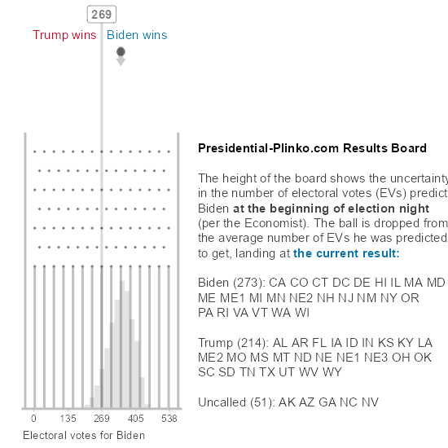
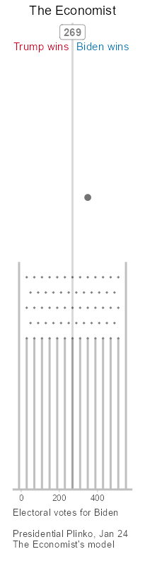
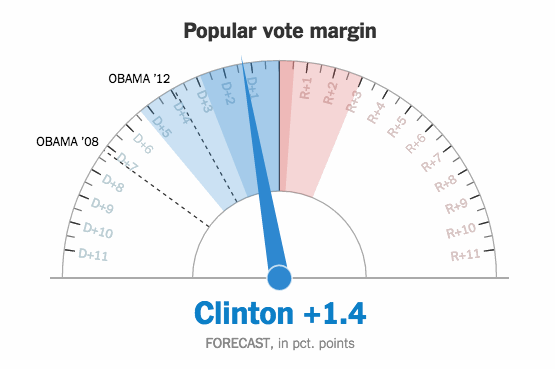

```{r setup, include=FALSE}
knitr::opts_chunk$set(echo = FALSE)
library(metathis)
meta() %>%
  meta_description("Plinko boards for forecasts of the 2020 US presidential election") %>%
  meta_social(image = "https://presidential-plinko.com/preview.png")
```

<script async src="https://www.googletagmanager.com/gtag/js?id=UA-93322-6"></script>
<script>
  window.dataLayer = window.dataLayer || [];
  function gtag(){dataLayer.push(arguments);}
  gtag('js', new Date());

  gtag('config', 'UA-93322-6');
</script>
<script type="text/javascript">
function make_single_ball_image_cache(model) {
  cache = []
  for (ball = 0; ball < 50; ball++) {
    image_name = "boards/galton_board-" + model + "-" + (ball + 1) + ".gif"
    console.log(image_name)
    cache[ball] = new Image()
    cache[ball].src = image_name
  }
  return cache
}
single_ball_images = {
  "538": make_single_ball_image_cache("538"),
  "econ": make_single_ball_image_cache("the_economist")
}

function random_int(max) {
  return Math.floor(Math.random() * Math.floor(max));
}

function drop_ball() {
  document.getElementById("board_538").src = "boards/galton_board-538-blank.png";
  document.getElementById("board_538").src = single_ball_images["538"][random_int(50)].src;
  document.getElementById("board_econ").src = "boards/galton_board-the_economist-blank.png";
  document.getElementById("board_econ").src = single_ball_images["econ"][random_int(50)].src;
}
function drop_all_balls() {
  document.getElementById("board_538").src = window.src_538;
  document.getElementById("board_econ").src = window.src_econ;
}
</script>
<style type="text/css">
d-footnote {
  margin-left: -0.5ex;
}
.plinko {
  width: 50%;
  max-width: 205px;
}
#board_live {
  .width: 100%;
  max-width: 550px;
}
</style>



<script type="text/javascript">
window.live_count = 0
setInterval(function() {
  window.live_count += 1;
  document.getElementById("board_live").src = "boards/live_galton_board.gif?" + window.live_count
}, 300000); // 5 minutes
</script>

## Pre-election predictions



<script type="text/javascript">
window.src_538 = document.getElementById("board_538").src;
window.src_econ = document.getElementById("board_econ").src;
</script>

<a href="javascript:drop_ball();">**Drop one ball**</a> | <a href="javascript:drop_all_balls();">**Drop all balls**</a>

What will the outcome of the 2020 US Presidential Election be? Forecasters
build models on top of polling data and historical voting patterns to
produce *probabilistic* predictions: predictions with uncertainty. But
really internalizing that uncertainty is hard. *Presidential Plinko* takes that
uncertainty and translates it into Plinko boards with similar uncertainty,
so that you can experience just how uncertain predictors' forecasts are.

How certain would you be in the outcome if you dropped a ball from a Plinko board
the height of the one for the Economist's prediction? How about 538's? Try 
<a href="javascript:drop_ball();">**dropping one ball**</a> a few 
times and see how you feel about the uncertainty.

<style type="text/css">
.videoWrapper {
  position: relative;
  padding-bottom: 60%;
  height: 0;
}
.videoWrapper video {
  position: absolute;
  top: 0;
  left: 0;
  width: 100%;
  height: 100%;
}
</style>
<div class="videoWrapper">
<video autoplay loop muted playsinline class="video" style="object-position: left">
<source src="price-is-right.webm" type="video/webm">
<source src="price-is-right.mp4" type="video/mp4">
</video>
</div>

## How does this work?

The short version is, I determine the height of each board based on how uncertain
each forecaster is about how many electoral votes Biden will get.
I then drop a number of balls through the board
to illustrate that uncertainty:


The slightly longer (more technical) version is, I approximate each
forecaster's predictive distribution
with a scaled-and-shifted binomial distribution, which determines
the height of each board. I then determine plausible paths through the board
that could have led to the final predictive distribution, which is shown as
a [quantile dotplot](https://mucollective.northwestern.edu/project/when-ish-is-my-bus).
Thus, while the output looks random, the final distribution is exactly the
forecaster's published distribution, down to the resolution of the dotplot.
Full details of the methodology and source code are 
[on Github](https://github.com/mjskay/election-galton-board).

## Why did you make this?

I seem to be one of the few people that *liked* the infamous [New York Times
election needle](https://www.vis4.net/blog/2016/11/jittery-gauges-election-forecast/).^[I talk more about the Needle in my [Tapestry talk](https://www.youtube.com/watch?v=E1kSnWvqCw0).]



The Needle was a valiant attempt to show uncertainty in the final vote margin
in the 2016 presidential election *in real time as votes came in*. The needle
itself moves randomly within the central 50% most likely outcomes (according to
the prediction at that time). 

I think the Needle got one thing right and another thing wrong. What it got
right was that this kind of animation can help people *experience* uncertainty.^[Jessica Hullman (a frequent collaborator of mine) dubs such animated uncertainty
visualizations [hypothetical outcome plots (HOPs)](https://mucollective.northwestern.edu/project/hops).]
This makes the visualization more powerful, and the uncertainty harder to ignore.
The visualization made people anxious, because they were uncertain about
something they cared about. But if you're uncertain about something
you care about, *you should be anxious*.

However, I think the Needle also fell victim to a *deterministic construal error*:^[See [Susan Joslyn's work](https://doi.org/10.1177%2F0963721413481473) on deterministic construal errors.]
many people more readily associate the mechanism of a needle with some deterministic
measurement, not an uncertain quantity.^[To the consternation of statisticians everywhere,
the act of measuring something evokes certainty, not error, for many people.] Those
people understandably thought the rapid movement of the needle reflected that the forecast
itself was changing just as rapidly.

During [OpenVisConf 2018](http://www.openvisconf.com/), where
Amanda Cox and Kevin Quealy gave a talk on NYT visualizations and I gave a talk
on uncertainty visualization, I starting thinking about alternatives to the
Needle that *do* evoke randomness in the way they work. That's when I 
started thinking about [Galton boards](https://en.wikipedia.org/wiki/Bean_machine):


A Galton board whose height changes according to the variance of a predictive
distribution could display a distribution *and* a plausible, uncertain mechanism
that could give rise to it. Michael Corey on Twitter 
[later made the connection to Plinko](https://twitter.com/mikejcorey/status/1303398043862159360),
and I decided *Presidential Plinko* would be a good name for this site.^[Besides
which, Sir Francis Galton was a noted eugenicist, so naming fewer things after him seems
reasonable to me.]

## Are you affiliated with 538 or the Economist?

No. I am faculty at Northwestern University, where I study uncertainty visualization, 
amongst other things. You can learn more about me [here](http://www.mjskay.com/) or check out the 
[Midwest Uncertainty Collective](https://mucollective.northwestern.edu/), a lab 
I co-direct with Jessica Hullman.

I am fortunate to be able to take advantage of the fact that both forecasters release
their model outputs publicly. For more details on each forecaster's model and
predictions, see [538's forecast](https://projects.fivethirtyeight.com/2020-election-forecast/)
or [the Economist's forecast](https://projects.economist.com/us-2020-forecast/president).

These forecasters have put an immense amount of work into their models and
visualizations. Both have done an excellent job this year in their uncertainty
communication. I recommend checking out other posts and discussions about 
[their visualizations](https://fivethirtyeight.com/features/how-we-designed-the-look-of-our-2020-forecast/)
or [their models](https://statmodeling.stat.columbia.edu/2020/08/27/florida-comparing-economist-and-fivethirtyeight-forecasts/). 
I am merely experimenting with one less-used visualization approach here.

## Author {.appendix}

[Matthew Kay](http://www.mjskay.com), Assistant Professor, Computer Science and Communication Studies, Northwestern University
